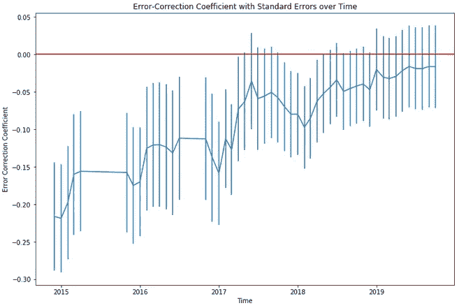

# 协整时间序列的误差修正模型(及参数稳定性检验)

> 原文：<https://towardsdatascience.com/the-error-correction-model-for-co-integrated-time-series-and-checking-parameter-stability-a60bbdafb9e4?source=collection_archive---------2----------------------->

L is the number of lags in the model, rho hat is our estimated long-run relationship coefficient, and eta hat is the deviation of from our long-run relationship in the previous period.

## 将股票与市场的关系纳入预测模型

仅仅根据过去的价格来预测一只股票的未来价格是非常困难的。您需要将其他数据合并到您的模型中，通过考虑股票价格的冲击来获得更好的预测准确性。一个显而易见的数据是市场走势。如果市场下跌，你的股票也有下跌的风险。您可以包括市场价格数据的滞后，以捕捉市场和您感兴趣的证券之间的短期关系。但是他们的长期关系呢？这就是[误差修正模型(ECM)](https://en.wikipedia.org/wiki/Error_correction_model#Engle_and_Granger_2-step_approach) 有用的地方。它包括一个偏离长期关系的术语，用于估计在下一个预测期有多少不平衡会消失。

注意:我建议在阅读[这篇](/predicting-fang-stock-prices-ecac4ddd27c1)和[这篇](/long-run-relationships-between-fang-stocks-82baf183840c)之前先阅读这篇文章，这两篇文章将纠错范例应用于联立方程建模(预测更成功)。这些文章旨在作为独立的部分，但都是处理协整的时间序列，并相互补充。

# 调查时间序列属性

我不想让反复讨论确定整合度和格兰杰因果关系的读者感到厌烦，所以请在此处阅读的**平稳性测试**和**格兰杰因果关系** [部分。](/predicting-fang-stock-prices-ecac4ddd27c1)

# 用恩格尔-格兰杰方法建立协整关系

在估计 ECM 之前建立协整是很重要的。协整本质上意味着两个时间序列具有长期的关系。如果没有长期关系，ECM 是不合适的。为了检验协整性，我们对自变量执行目标变量的线性回归，并检验残差的[平稳性](https://en.wikipedia.org/wiki/Stationary_process)。在我们的例子中，我们的模型是:

在对我们的样本周期估计这个模型之后，我们必须使用[增强的 Dickey-Fuller 测试](https://en.wikipedia.org/wiki/Augmented_Dickey%E2%80%93Fuller_test)来测试残差的平稳性。如果我们有协整，我们就可以继续了。如果不是，我们要问自己一个棘手的问题。 ***长期关系的存在是否有强有力的理论依据。*** 如果不是，ECM 就不是一个适合我们的问题。如果有，测试断点。也许我们的样本有一段时间，在此之前，我们的长期关系可能是不同的或不存在的，但之后的话会像我们预期的那样。使用[周波测试](/the-time-series-they-are-a-changing-why-all-good-models-eventually-fail-24a96a5f48d3)，查看是否有差异，并重复测试进行协整。如果你不确定这种关系何时会改变，使用[累计图](https://en.wikipedia.org/wiki/CUSUM)进行调查。如果我们发现了协整，我们就为下一步做好了准备。

# 估计误差修正模型

现在我们有了残差，并对数据进行了差分(假设它是积分 I(1))，我们可以将残差附加到我们的数据集，并使它们滞后一个周期，以估计我们的 ECM 为:

L is the number of lags in the model, rho hat is our estimated long-run relationship coefficient, and eta hat is the deviation of from our long-run relationship in the previous period.

**务必注意，如果 ECM 合适，rho hat 为负值。线性回归的滞后残差代表与前期长期关系的偏差。**直觉告诉我们，如果我们的股价高于其与市场的长期均衡水平，负系数会将其拉回来。如果它低于长期均衡，负面因素将抵消，成为正面因素，将股价拉回来。这就是 ECM 的魔力。这个系数可以被解释为不平衡的比例，这个比例在下一个周期消失。

# 链接到 Python 中的 ECM 实现

我将 ECM 技术应用于 JP 摩根过去 15 年的月度股价和标准普尔 500 指数，保留了最近 50 个月作为测试数据集。我选择了摩根大通，因为在我过去 15 年来尝试的十几只股票中，它是第一只通过恩格尔-格兰杰协整检验的。你可以在这里看到那个[的笔记本。TL；该项目的 DR 是误差校正方法似乎很适合我的训练数据，但在我的测试数据集上的表现与简单的 3 滞后自回归模型大致相同。我通过检查我的误差修正系数的参数稳定性来研究为什么会这样。这表明，在过去 15 年的某个时候，摩根大通的股价和标准普尔 500 指数之间出现了结构性断裂。](https://github.com/jkclem/ECM-in-python/blob/master/ECMs.ipynb)

Plot of my unstable error-correction coefficient on the models estimated during the testing period

虽然 ECM 在这种情况下表现不佳，但当有协整的证据时，应该包括误差修正项。只是要小心观察协整关系正在破裂的证据。这是时间序列建模有趣又令人恼火的部分。一个好的模型最终会随着底层系统的改变而崩溃。