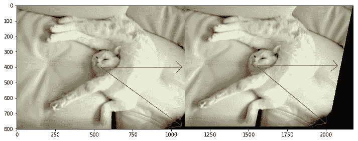
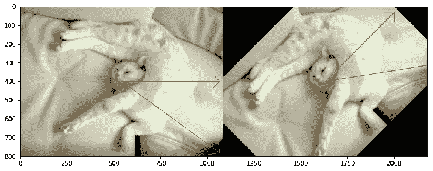
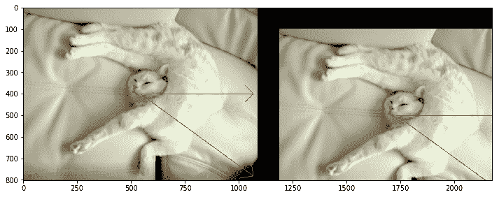
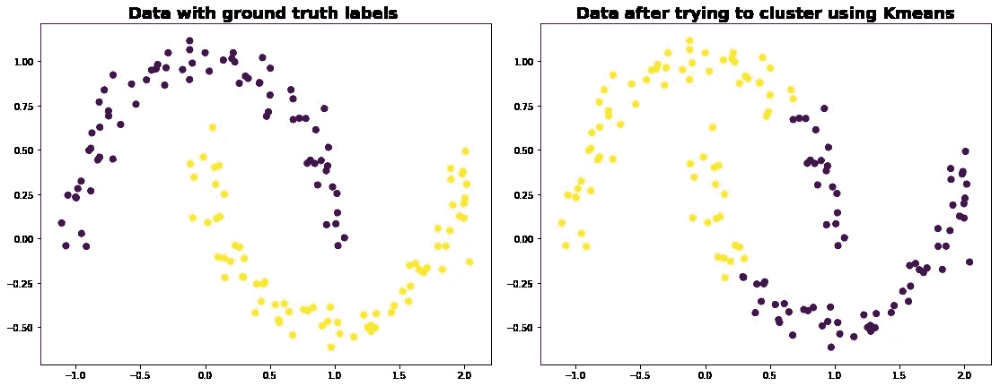
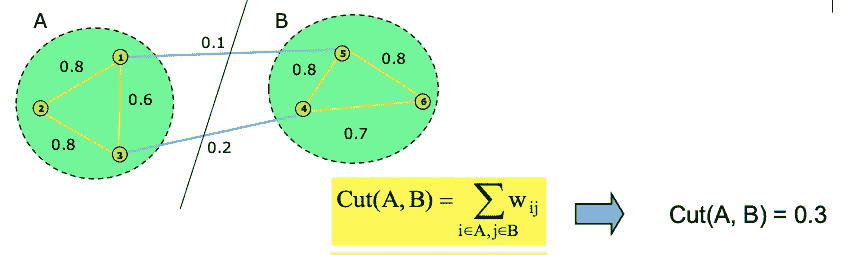
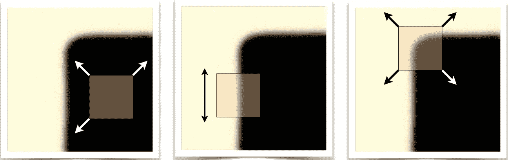

# 机器学习中特征值和特征向量的本质

> 原文：<https://towardsdatascience.com/the-essence-of-eigenvalues-and-eigenvectors-in-machine-learning-f28c4727f56f?source=collection_archive---------7----------------------->

## 了解实际应用

单词 **Eigen** 可能最有用的翻译是德语，意思是**特性。**所以当我们谈论矩阵的特征值和特征向量时，我们谈论的是寻找矩阵的特征。

在深入研究特征向量之前，让我们先了解什么是矩阵除了是一个数字的矩形阵列，它还代表什么？

所以矩阵只是应用于向量的线性变换。可以有不同类型的变换应用于向量，例如-

让我们来看一些矩阵变换

```
img = cv2.imread(path_to_image,flags=cv2.IMREAD_UNCHANGED)
img = cv2.cvtColor(img,cv2.COLOR_BGR2RGB)
rows,cols,_ = img.shape
M = np.float32([[1, -np.sin(.1), 0],[0,  np.cos(.1), 0]])
out = cv2.warpAffine(img,M,(cols,rows))
```



这个矩阵 M 和图像有什么关系？它给图像中的每个矢量引入了水平剪切。

```
#Let's try this one
M = cv2.getRotationMatrix2D((cols/2,rows/2),45,1)
out = cv2.warpAffine(img,M,(cols,rows))
print(M)
=> [[   0.70710678    0.70710678 -124.36235483]
 [  -0.70710678    0.70710678  501.76271632]]
```



那么矩阵 M 对图像做了什么？所以这个线性变换 M 将图像中的每个向量旋转了 45 度。

```
M = [[  1\.   0\. 100.]
 [  0\.   1\. 100.]]
out = cv2.warpAffine(img,M,(cols,rows))
```



它在水平和垂直方向上平移图像。

旋转没有本征矢[180 度旋转的情况除外]。对于纯剪切，水平向量是一个特征向量。向量长度改变的因子叫做特征值。

# 应用程序

**特征值**和**特征向量**的概念在很多实际应用中使用。我将只讨论其中的几个。

## 主成分分析

PCA 是一种非常流行的经典降维技术，它使用这一概念通过降低数据的维数来压缩数据，因为维数灾难一直是经典计算机视觉处理图像甚至机器学习中非常关键的问题，具有高维数的特征增加了模型容量，这反过来需要大量的数据来训练。

这是一种使用简单的矩阵运算和统计来计算原始数据在相同或更少维度上的投影的方法。

设数据矩阵 **𝐗** 为𝑛×𝑝大小，其中 n 为样本数，p 为每个样本的维数。在 PCA 中，本质上我们通过**特征值**分解对角化 X 的协方差矩阵，因为协方差矩阵是对称的

```
***C = VLVᵀ******In Python-***from numpy import cov
from numpy.linalg import eigX = array([[-2, -2], [0, 0], [2, 2]])
C = cov(X)
#To do eigendecomposition of C
values, vectors = eig(C)
#Project data into pricipal directions
P = vectors.T.dot(X.T)
print(P.T)Output-
[[-2.82842712  0\.        ]
 [ 0\.          0\.        ]
 [ 2.82842712  0\.        ]]
```

其中 **𝐕** 是一个由**个特征向量**组成的矩阵(每一列都是一个特征向量)，而 **𝐋** 是一个对角矩阵，其中**个特征值** 𝜆𝑖在对角线上按降序排列。

> 对称矩阵的特征向量，这里是协方差矩阵，是实的和正交的。

数据的**特征向量**称为*主轴*或*主方向*。数据在主轴上的投影称为*主分量。*

我们通过在比原始维度更少的主方向上投影来降低数据的维度。

## 谱聚类

K-Means 是最流行的聚类算法，但它有几个相关的问题，如依赖于聚类初始化和特征的维数。同样，如果你的星团不是球形的，它也会面临问题，如下图所示

```
from sklearn.datasets import make_moons
X_mn, y_mn = make_moons(150, noise=.07, random_state=21)
fig, ax = plt.subplots(figsize=(9,7))
ax.set_title('Data with ground truth labels ', fontsize=18, fontweight='demi')
ax.scatter(X_mn[:, 0], X_mn[:, 1],c=y_mn,s=50, cmap='viridis')
```



谱聚类是使用矩阵的**特征向量**来寻找 K 个聚类的一系列方法。它可以处理这些问题，并轻松胜过其他聚类算法。

这里数据以图表的形式表示。现在，聚类可以被认为是生成图割，其中两个聚类 A 和 B 之间的割(A，B)被定义为两个聚类之间的权重连接的总和。比如说-



为了找到最佳聚类，我们需要最小割，最小割方法的目标是找到具有最小权重和连接的两个聚类 A 和 B。

在谱聚类中，使用从图的邻接矩阵和度矩阵计算的图拉普拉斯矩阵来近似这个最小割目标。证据见[本](https://sites.cs.ucsb.edu/~veronika/SpectralClustering.pdf)

## 算法

给定:一个有𝑛顶点和边权重𝑊𝑖𝑗的图，期望聚类数𝑘

*   构建(标准化)图拉普拉斯𝐿 𝐺 𝑉，𝐸=𝐷𝑊
*   求𝐿的𝑘最小特征值对应的𝑘特征向量
*   设 u 是特征向量的 n × 𝑘矩阵
*   用𝑘-means 找出𝑘簇𝐶′让𝑥𝑖’是 U 5 的行。如果𝑥𝑖’被分配到聚类 j，则将数据点𝑥𝑖分配到𝑗'th 聚类

```
from sklearn.neighbors import radius_neighbors_graph
from scipy.sparse import csgraph
from sklearn.cluster import KMeans#Create adjacency matrix from the dataset
A = radius_neighbors_graph(X_mn,0.4,mode='distance', metric='minkowski', p=2, metric_params=**None**, include_self=**False**)
A = A.toarray()'''Next find out graph Laplacian matrix, which is defined as the L=D-A where A is our adjecency matrix we just saw and D is a diagonal degree matrix, every cell in the diagonal is the sum of the weights for that point'''L = csgraph.laplacian(A, normed=**False**)
eigval, eigvec = np.linalg.eig(L)
```

> 现在，使用𝑘-means 找到𝑘群集𝐶让𝑥𝑖是 eigvec 的行。最后，为了将数据点分配到聚类中，如果𝑥𝑖被分配到聚类 j，则将𝑥𝑖分配到𝑗'th 聚类
> 
> 第二小特征向量，也称为 Fiedler 向量，用于通过寻找最佳分裂点来递归地二分图。

*参见完整示例代码* [*此处*](https://github.com/ranjeetthakur/ml_codebase/blob/master/Spectral_clustering.ipynb)

[谱聚类的变体](https://repository.upenn.edu/cgi/viewcontent.cgi?article=1101&context=cis_papers)用于计算机视觉中基于区域提议的对象检测和语义分割。

## 计算机视觉中的兴趣点检测

最后我来讨论一下 AI 下我最喜欢的领域，就是计算机视觉。在计算机视觉中，图像中的兴趣点是在其邻域中唯一的点。这些点在经典的计算机视觉中起着重要的作用，它们被用作特征。

角点是有用的兴趣点，以及其他更复杂的图像特征，如 SIFT、SURF 和 HOG 等。我将讨论一种这样的角点检测方法。



[http://www.cs.cmu.edu/~16385/s17/Slides/6.2_Harris_Corner_Detector.pdf](http://www.cs.cmu.edu/~16385/s17/Slides/6.2_Harris_Corner_Detector.pdf)

透过一个小窗口很容易认出角落。


如果窗口内部有一个角，移动窗口应该会在强度 E 上产生很大的变化。

## 哈里斯角探测器

这个算法-

*   计算小区域上的图像梯度

```
imggray = cv2.imread('checkerboard.png',0)
i_x = cv2.Sobel(imggray,cv2.CV_64F,1,0,ksize=5)
i_y = cv2.Sobel(imggray,cv2.CV_64F,0,1,ksize=5)
```

*   计算协方差矩阵

```
# Calculate the product of derivates in each direction
i_xx, i_xy, i_yy = multiply(i_x, i_x), multiply(i_x, i_y), multiply(i_y, i_y)# Calculate the sum of product of derivates
s_xx, s_xy, s_yy = cv2.GaussianBlur(i_xx, (5,5), 0), cv2.GaussianBlur(i_xy, (5,5), 0), cv2.GaussianBlur(i_yy, (5,5), 0)
```

*   计算**特征向量**和**特征值。**

Harris 描述了一种更快的近似方法**——避免计算特征值，只需计算迹和行列式。结合这两个属性，我们计算出一个度量值*角度* -R**

> **矩阵的行列式=特征值的乘积**
> 
> **矩阵的迹=特征值之和**

```
# Compute the response of the detector at each point
k = .04 # Recommended value between .04 and .06
det_h = multiply(s_xx, s_yy) - multiply(s_xy, s_xy)
trace_h = s_xx + s_yy
R = det_h - k*multiply(trace_h, trace_h)
```

*   **使用**特征值**上的阈值来检测角点**

```
ratio = .2 # Number to tweak
thresh = abs(R) > ratio * abs(R).max()
```

> **如果任一个**特征值**接近 0，那么这不是一个角点，所以寻找两者都大的位置。e 在所有方向上几乎都是常数。**
> 
> **λ2 >> λ1 或λ1 >> λ2 描绘了一条边**
> 
> **λ1 和λ2 较大，λ1 ~ λ2 E 在各个方向都增大**

***参见完整示例代码* [*此处*](https://github.com/ranjeetthakur/ml_codebase/blob/master/Harris%20%26%20Stephens%20Corner%20Detector.ipynb)**

# **参考**

> **归一化切割和图像分割。史和马利克，2000 年**
> 
> **一个组合的组合和边缘检测器，克里斯哈里斯和迈克斯蒂芬斯，1988 年**
> 
> **图的代数连通性 M. Fiedler，1973**