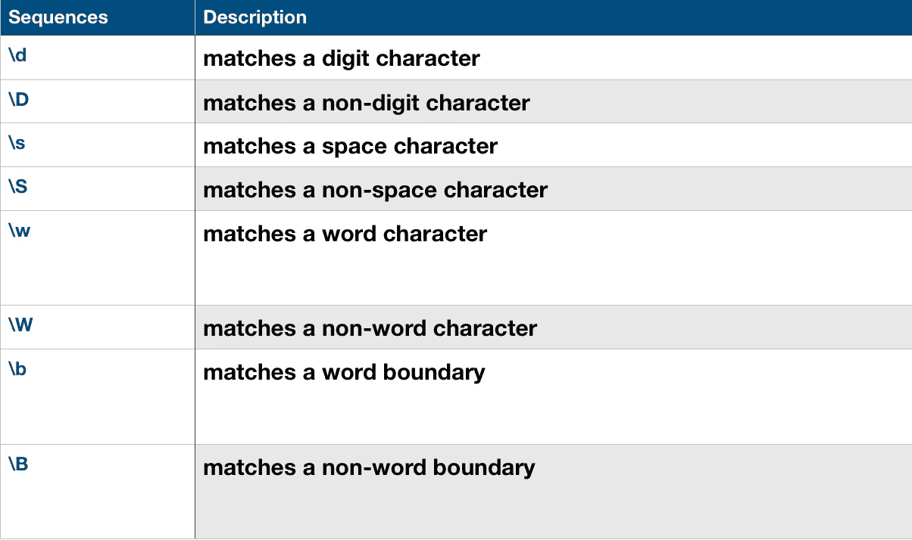

# 正则表达式的基础

> 原文：<https://towardsdatascience.com/the-essence-of-regular-expression-8c2e0ccf6a25?source=collection_archive---------12----------------------->


## 这就是你所需要学习的从任何事情中刮出地狱

**什么是正则表达式？**

正则表达式是一种特殊的文本字符串命令，用于从大量数据中匹配特定的字符串序列，如果由人工完成，可能会花费大量时间。您可以使用正则表达式来匹配各种字符串模式，如:-

*   提取所有的电子邮件地址
*   只提取 Gmail 电子邮件地址
*   提取以特定字母开头并以特定字母结尾的所有姓名
*   提取所有第一个字母是大写的名字
*   提取所有有小数点的数字
*   提取特定范围内的数字

这个列表是无止境的，上面提到的情况是我在写这篇文章时想到的前六种情况，但是老实说，你可以使用正则表达式从数据中提取任何类型的字符串模式，不管它有多大，只需几秒钟，这就是正则表达式的妙处。近来，正则表达式的重要性增加了，因为许多公司正在使用自然语言处理技术，其中正则表达式使用得非常频繁。

正则表达式最好的一点是它被大多数流行的编程语言所支持，因此一旦你理解了正则表达式的语法和概念，你就可以在各种语言中使用它。

让我们从正则表达式开始，我在 python 中使用正则表达式，但是你们可以使用任何你们选择的语言，但是它应该支持正则表达式。

## 使用正则表达式时，您有两种选择:-

第一种是只匹配特定字符串模式的第一次出现，第二种是匹配特定字符串模式的所有出现。

现在，您是希望只匹配第一个匹配项还是匹配所有匹配项取决于您的需求。根据我的经验，无论我在哪里使用正则表达式，大多数问题都需要匹配所有的事件，因此在这篇博客的所有例子中，我有意地编写了正则表达式来匹配所有的事件。

## 文字字符

让我们从最基本的正则表达式开始，它是文字字符，您基本上是在从数据中搜索特定的字母或单词，这与您使用 Ctrl+F 在网页或 pdf 上搜索时得到的结果类似。让我们尝试一个示例

因为我是一个超级漫威迷，所以我将在我的例子中使用漫威作为参考

```
Input = “Avatar did a business of 2.788 billion dollars($) where as Endgame has grossed 2.79 billions dollars($) till date”Regular Expression => “a”It will match with every single alphabet — “a”“**A**v**a**t**a**r did **a** business of 2.788 billion doll**a**rs($) where **a**s Endg**a**me h**a**s grossed 2.79 billions doll**a**rs($) till d**a**te”Output => a a a a a a a a a a
```

在输出中,“a”重复了 10 次，因为字母“a”
正好出现了 10 次。现在让我们在下一个例子中尝试字母组合

```
Regular Expression => “as”Avatar did a business of 2.788 billion dollars($) where **as** Endgame h**as** grossed 2.79 billion dollars($) till dateOutput => as as
```

注意:字母的顺序非常重要，在上面的例子中，只有字母“a”后面跟着字母“s”的字符串才会被匹配。

# 速记字符类别



# **1) \w**

“w”代表单词字符，基本上是[a-zA-Z0–9 _]的简写，这意味着它匹配所有大写字母、小写字母和所有数字。让我们在 marvel 文本中尝试使用这个正则表达式来分析哪些字符与“\w”不匹配

```
Text=”Avatar did a business of 2.788 billion dollars($) where as Endgame has grossed 2.79 billions dollars($) till date”Regular Expression => “\w”Output => “A v a t a r d i d a b u s i n e s s o f 2 7 8 8 b i l l i o n d o l l a r s w h e r e a s E n d g a m e h a s g r o s s e d 2 7 9 b i l l i o n s d o l l a r s t i l l d a t e”
```

如您所见，表达式“\w”与句子中的所有字符都匹配，除了["$ "、"("、")"、"."]

尽管“\w”与[a-zA-Z0–9 _]中的所有字符都匹配，但它一次只匹配一个字符，因此输出将显示一个又一个字母，因此我在 python 中使用 for 循环来一起显示它们，因为每个匹配的字符之间都有空格。

现在让我们来看第二个例子，我们要搜索两个连续的字符

```
Regular Expression => “\w\w”Text=”Avatar did a business of 2.788 billion dollars($) where as Endgame has grossed 2.79 billions dollars($) till date”Note:It will match with two consecutive alphabet one at a timeOutput =>Av at ar di bu si ne ss of 78 bi ll io do ll
```

我没有复制整个输出，只是复制了一部分，只是为了让你有个概念

**注意**:具有偶数个字符的单词以两个字符为一组完整打印，但是具有奇数个字符的单词的最后一个字母在输出中会丢失(提示:当您将奇数除以 2 时，输出为 1)，因为最后一个字母无法与另一个字母配对。

同样，我们可以一次搜索三个连续的字符

```
Regular Expression => “\w\w\w”Text=”Avatar did a business of 2.788 billion dollar where as Endgame has grossed 2.79 billions dollars till date”Output => Ava tar did bus ine 788 bil lio dol lar
```

我们可以使用大括号({})直接提及我们正在搜索的连续字母的数量，而不是重复使用“\w”，我们将在后面讨论这个问题

# 2) \W

这个速记字符**“W”是大写字母**将匹配除了这些字符之外的所有字符【a-zA-Z0–9 _】。因此，在这种情况下，只有那些在我们之前使用速记字符类“\ w”(w 很小)的例子中不匹配的字符才会匹配。

```
Text=”Avatar did a business of 2.788 billion dollar where as Endgame has grossed 2.79 billions dollars till date”Regular Expression => “\W”Output =>. ( $ ) . ( $ )
```

# 3) \d

这个速记字符匹配源字符串中的所有数字([0–9])。

```
**Regular Expression => “\d”**It will match with every single alphabet one at a time,unlike “\w” which matches with alphabets as well as digits,”\d” matches only with digitsText=”Avatar did a business of 2.788 billion dollars($) where as Endgame has grossed 2.79 billions dollars($) till date”Output =>2 7 8 8 2 7 9
```

现在让我们在源字符串中搜索两个连续的数字。

```
Regular Expression =>” \d\d”It will match with two consecutive digits one at a timeAvatar did a business of 2.788 billion dollars($) \n where as Endgame has grossed 2.79 billions dollars($) till dateOutput =>78 79
```

# 4)\D

类似于“\ W”(W 是大写)，这个正则表达式也是它的对应物“\d”的完全相反，即它将只匹配那些速记字符“d”不匹配的字符。

# **元字符**

```
**.**     -> Matches any single character except a line break**[ ]**   -> Matches any character contained between the square brackets**[^ ] ** -> Matches any character that is not contained between the square brackets*****     -> Matches 0 or more repetitions of the preceding symbol**+ **    -> Matches 1 or more repetitions of the preceding symbol**?**     -> Makes the preceding symbol optional.**{n,m}** -> Matches at least "n" but not more than "m" repetitions of the preceding symbol**|**     -> Matches either the characters before or the characters after the symbol**\**     -> Escapes the next character. This allows you to match     reserved characters { } . * + ? ^ $ \ |**^**     -> Matches the beginning of the input**$**     -> Matches the end of the input
```

## 重复

跟随元字符+、*或？用于指定子模式可以出现的次数。这些元角色在不同的情况下表现不同。

# 1) “+”

元字符“+”用于匹配前面符号的一次或多次出现。

例如:-

*   “\w+”匹配包含一个或多个[a-zA-Z0–9 _]字符的字符串
*   “\d+”匹配一位数或多位数的数字
*   a+匹配出现一次或多次的字母“a”。我们可以用任何字母代替“a”。

现在让我们在原始文本上尝试这些例子

```
Regular Expression=”\w+”Text = “Avatar did a business of 2.788 billion dollars($) where as Endgame has grossed 2.79 billions dollars($) till date”Output =>Avatar did a business of 2 788 billion dollars where as Endgame has grossed 2 79 billions dollars till date
```

现在让我们用“\d”尝试“+”操作符

```
Regular Expression =”\d+”Text=”Avatar did a business of 2.788 billion dollar where as Endgame has grossed 2.79 billions dollars till date”Output => 2 788 2 79
```

注意:在输出中“2”和“788”不匹配，因为这两个数字用“.”隔开

现在，如果想要匹配数字“2.788”，我们可以使用下面的正则表达式

```
Regular Expression => "\d+.\d+"Text=”Avatar did a business of 2.788 billion dollar where as Endgame has grossed 2.79 billions dollars till date”Output=> 2.788 2.79**Regular Expression Breakdown=>****Match one or more digit(\d+) + Match a full stop(.) + Match one or more digit(\d+)**
```

注意:在上面提到的复杂正则表达式中，我们搜索具有多个条件的字符串，条件应该按照正则表达式中提到的相同顺序连续匹配，例如，在上面提到的示例中，我们搜索具有一个或多个数字的数字，后跟一个句号，再后跟一个或多个数字。如果这三个条件不连续匹配，那么就不会有任何匹配。

```
**Exercise:****Question 1) Find all gmail email id’s from given below data.**Text =“abc@yahoo.com saurabh@outlook.com abc@gmail.com saurabh88@gmail.com saurabh11@outlook.com xyz@gmail.com”Solution:Regular Expression=”\w+@gmail.com”Output =>”abc@gmail.com saurabh88@gmail.com xyz@gmail.com”**Question 2) Find all words in the text which are ending with “ing”**Text=”dancing trek swimming sleeping jump running studying”Solution:Regular Expression=”\w+ing”Output => dancing swimming sleeping running studying
```

# **2)“*”**

与用于匹配前面符号的一次或多次重复的“+”运算符不同，“*”用于匹配前面符号的 0 次或多次重复。

例如:-

假设我们被要求在下面提到的所有用户 id 中只找出那些包含字符串“saurabh”的 id，那么在这种情况下，我们将不得不使用“*”

```
Text =”saurabh13 kartik95 shreyashsingh ranasaurabh15 kumararindam yash_paryani saurabh_rana_22"Regular Expression = “\w*saurabh\w*”Output => saurabh13 ranasaurabh15 saurabh_rana_22
```

# **3) []方括号**

方括号(`[]`)中的字符串匹配该字符串中的任何一个字符。让我们借助一个例子来理解它:-

```
Text=”ring king ping ding running”Regular Expression => “[rk]ing”**Regular Expression Breakdown => Match with alphabet “r” or “k” + Match with “ing”**Output => ring king
```

注意:正如我之前提到的，在正则表达式中，条件应该按照正则表达式中提到的顺序连续匹配。在上面的例子中,“running”不匹配，即使它以“r”开始，以“ing”结束，因为这些条件不是连续匹配的，因为在 running 中“r”和“ing”之间还有其他字母。

当我们想要匹配除方括号中提到的字符之外的所有字符时，在方括号中使用特殊字符“^”

```
Text=”ring king ping ding running”Regular Expression =>“‘[^rk]ing”Output => ping ding ning
```

我们可以在两个字符集之间使用连字符("-")来指定字符范围

```
Text=”ring king ping ding running”Regular Expression => “[a-z]ing”Output => ring king ping ding ning
```

# **4)”. "完全停止**

元字符“.”匹配除回车或换行符以外的任何单个字符

```
Input=”1_3@a!b+c de”Regular Expression => “.”Output =>1 _ 3  @ a !  b + c   d e
```

这里正则表达式匹配每种类型的字符，包括字母“d”和“e”之间的空格

# **5)“{ }”花括号**

当我们对一个操作符或子表达式在源字符串中必须匹配的出现次数非常明确时，我们使用花括号({})。在下面提到的例子中，我们试图获得与前面例子中相同的输出，在前面的例子中，我们希望匹配 3 个连续的数字，我们使用正则表达式“\d\d\d”，现在我们可以在花括号中提到我们希望的具体出现次数，而不是重复表达式。

```
Text=”123 4643 6642 5 6545 8974 45 17 8659 1 34 88 654 564 786 4536 4 76 89 684568 "regular expression = “\d{3}”*Output=>*123 464 664 654 897 865 654 564 786 453
```

# 6) “?”

***“？”regex 中的*** 用于使之前的*组/角色*可选。

让我用一个例子来解释这个表达的重要性= >

假设我们被要求从下面给出的文本中提取所有的数字，现在在给定的文本中有三种类型的数字:-

*   有些数字是整数(不带分数)
*   一些大于 1 且有小数值的数字
*   有些小于“1 ”,具有十进制值

现在我们想提取所有三种类型的数字，让我们来试试吧

```
text=”2.55 300 153.54 .45 1234.1234 435 5.2435 .345"Regular expression = “\d*\.?\d*”Output = 2.55 300 153.54 .45 1234.1234 435 5.2435 .345**Regular expression breakdown = Match 0 or more digits(\d*) + Match a decimal point on not(.?) + Match 0 or more digits(\d*)**
```

# 7)锚

脱字符号^和美元$字符被称为“锚”,其中脱字符号^匹配文本的开头，美元$匹配文本的结尾。它们根本不匹配任何字符。相反，它们匹配字符之前、之后或之间的位置

假设在一个数据集中，我们想要提取移动电话号码，但是在数据集中有许多错误，因此可能存在移动电话号码无效的情况(有效的移动电话号码由 10 个数字组成)。在这种情况下，锚非常有用。让我们通过各种案例来理解这一点

```
**Case-1**Text=”9851245245s"Regular Expression=”^\d\d{8}\d$”**Regular expression breakdown = First character of string should be a digit + match 8 digits + Last character of the string should be a digits**Output= Null
```

输出为空，因为该号码不是以数字结尾，这使其成为无效的手机号码。

```
**Case-2**Text=”98512f45245”Regular Expression=”^\d\d{8}\d$”Output= Null
```

输出再次为空，因为数字之间有一个字母表

```
**Case-3**Text=”985125245”Regular Expression=”^\d\d{8}\d$”Output= Null
```

这一次，源字符串中没有字母字符串，但我们仍然得到空输出，因为源字符串的长度不等于 10。

```
**Case-4**Text=”9851425245”Regular Expression=”^\d\d{8}\d$”Output= 9851425245
```

在这种情况下，我们得到输出，因为源字符串 full 满足了我们在正则表达式中提到的有效手机号码的所有条件。

# **结论**

这些是正则表达式的最基本和最重要的概念，我尝试用一些有趣的例子来解释，其中一些是虚构的，但大多数是我在清理数据时遇到的实际问题，所以将来如果你遇到问题，只需再次浏览这些例子，你可能会在其中一个例子中找到准确的答案。

除了基本的正则表达式之外，你可能会遇到像这样的正则表达式“/^[a-z0–9_-]{6,18}$/".当人们看到如此长的正则表达式时，他们只是忽略它们，就像他们在英语句子中看到一个俄语单词一样。理解这种正则表达式的含义的诀窍是把它们分解开来，分别求解。

如果你仍然没有足够的信心去理解这样的正则表达式，那么请在评论部分提到，我可能会上传第二篇关于正则表达式的文章来解释如何解决这样的正则表达式。

## 如果你喜欢这篇文章，你可能会发现其他文章很有见地-

[](/decision-tree-behind-the-scenes-e2800f26cba7) [## 机器学习:决策树-幕后

### 不要用机器学习做黑盒模型。尝试深入了解幕后发生的事情！！

towardsdatascience.com](/decision-tree-behind-the-scenes-e2800f26cba7) 

## 与我联系-

## [领英](http://www.linkedin.com/in/saurabh-rana-150496)