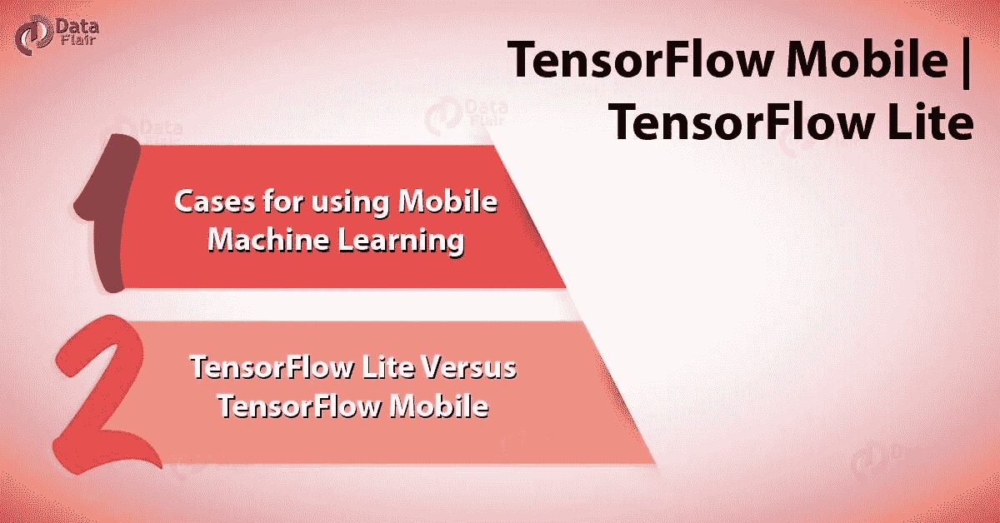
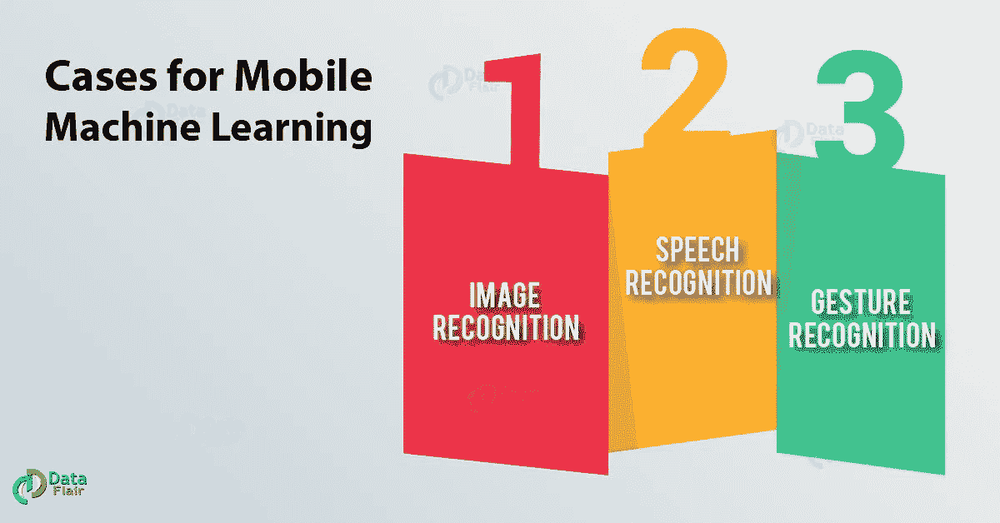
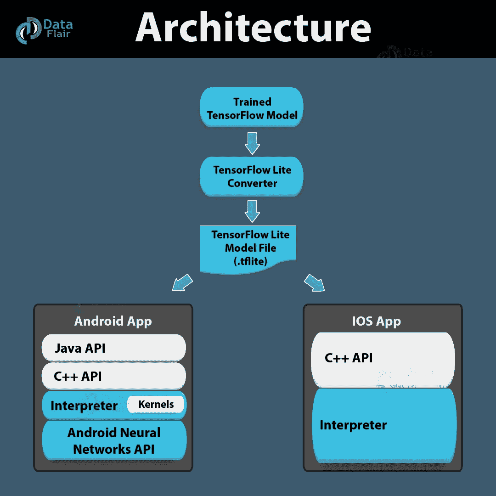

# 学习 TensorFlow Mobile 和 Tensorflow Lite 的基本指南

> 原文：<https://towardsdatascience.com/the-essential-guide-to-learn-tensorflow-mobile-and-tensorflow-lite-a70591687800?source=collection_archive---------8----------------------->

# 什么是 TensorFlow Mobile？

TensorFlow Mobile 用于 iOS 和 Android 等移动平台。这是为那些拥有成功的 TensorFlow 模型并希望将其模型集成到移动环境中的开发人员准备的。这也是为那些不能使用 TensorFlow Lite 的人准备的。在将桌面环境模型集成到移动环境中时，您会发现以下基本挑战:

*   了解如何使用 TensorFlow mobile。
*   为移动平台构建他们的模型。
*   将 *TensorFlow 库*添加到他们的移动应用中。
*   准备模型文件。
*   优化二进制大小，文件大小，内存使用等。

# 使用移动机器学习的案例

一般来说，TensorFlow 的开发者会在高性能的[GPU](https://data-flair.training/blogs/tensorflow-performance-optimization/)上使用它。但是通过网络连接发送所有设备数据非常耗时且成本高昂，在手机上运行它可能是一种简单的方法。

设备上深度学习常用案例:

# a.张量流中的图像识别

这是一种检测或感受手机拍摄图像的有效方式。如果用户正在拍照，了解里面有什么，可以有一种方法来应用适当的过滤器或标记它们，以便在必要时找到它们。 [TensorFlow 图像识别](https://data-flair.training/blogs/tensorflow-image-recognition/)提供了一系列检测图像中物体类型的例子。它还包括各种预训练的模型，可用于在移动设备上运行。

# b.张量流语音识别

有各种各样的应用程序可以构建语音驱动的界面。很多时候，用户不会给出指令，因此将指令连续传输到服务器会产生很多问题。为了解决这个问题，最好有一个[神经网络](https://data-flair.training/blogs/neural-network-algorithms/)在一个设备上运行，用于特定的单词，而不是听整个对话。

# c.TensorFlow 中的手势识别

通过分析传感器数据，在手或其他手势的帮助下控制应用程序是有用的。在 TensorFlow 的帮助下可以做到这一点。
其他例子有光学字符识别(OCR)、翻译、文本分类、语音识别等。

# 什么是 TensorFlow Lite？

TensorFlow Lite 是专为移动平台和嵌入式设备设计的轻量级版本。它为手机提供了低延迟、小二进制的机器学习解决方案。
TensorFlow 支持一系列已针对移动平台进行调整的核心运营商。它还支持模型中的自定义操作。
TensorFlow Lite 教程基于开源平台序列化库 FlatBuffers 定义了一种新的文件格式。它包括一个新的移动解释器，用于保持应用程序小而快。它使用定制的内存分配器来最小化负载和执行延迟。

# a.TensorFlow Lite 架构

你看到的上图是 TensorFlow Lite 架构。磁盘上训练好的 TensorFlow 模型会转换成 TensorFlow Lite 文件格式(。tflite)使用 TensorFlow Lite 转换器。然后，我们可以在移动应用程序中使用转换后的文件。
对于部署 Lite 模型文件:

*   Java API:Android 上 C++ API 的包装器。
*   C++ API:它加载 Lite 模型并调用解释器。
*   解释器:它执行模型。它使用选择性内核加载，这是 Tensorflow 中 Lite 的独特功能。

您还可以使用 C++ API 实现定制内核。
tensor flow Lite 的一些亮点如下:

*   它支持一组针对移动平台进行了调整的核心运营商。TensorFlow 还支持模型中的自定义操作。
*   一种新的基于 FlatBuffers 的文件格式。
*   使用选择性加载技术的设备解释器。
*   当所有支持的运算符都链接在一起时，TensorFlow Lite 小于 300kb。
*   [Java](https://data-flair.training/blogs/java-tutorial/) 和 C++ API 支持。

# TensorFlow Lite 与 TensorFlow Mobile

当您看到什么是 TensorFlow Lite 和 TensorFlow Mobile，以及它们如何在移动环境和嵌入式系统中支持 TensorFlow 时，您就会知道它们之间的区别。TensorFlow Lite 和 TensorFlow Mobile 的区别如下:

*   它是 TensorFlow mobile 的下一个版本。通常，在 TensorFlow Lite 上开发的应用程序比 TensorFlow mobile 具有更好的性能和更小的二进制文件大小。
*   它仍处于早期阶段，因此并非所有案例都涵盖在内，TensorFlow mobile 的情况并非如此。
*   TensorFlow Lite 支持选择性运算符集，因此默认情况下，并非所有模型都适用于 TensorFlow Lite。然而，TensorFlow mobile 拥有全面的功能。

这就是 TensorFlow Mobile 和 TensorFlow Lite。希望你喜欢我们的解释。

# 结论

因此，在这篇 TensorFlow mobile 和 Lite 文章中，TensorFlow 中的 Lite 比其前身 TensorFlow Mobile 具有更好的性能比和更小的二进制文件大小。此外，如果你有任何疑问，欢迎在评论区提问。