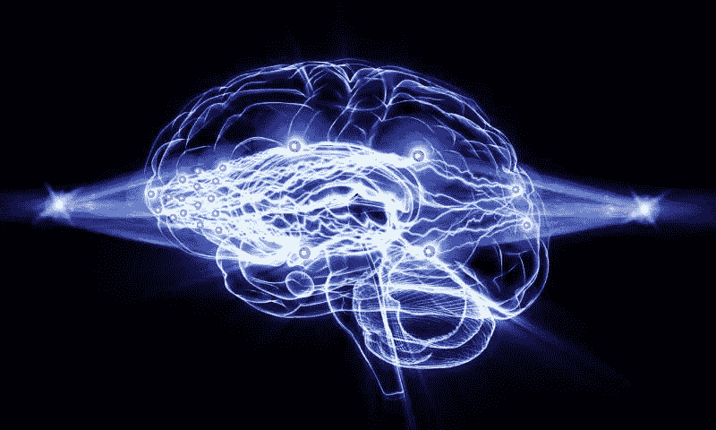

# 数据科学的基本 Python 库

> 原文：<https://towardsdatascience.com/the-essential-python-libraries-for-data-science-ce55c53dfd6b?source=collection_archive---------16----------------------->

## 来帮助你现在进行惊人的科学研究

Photo by [Johnson Wang](https://unsplash.com/@jdubs?utm_source=medium&utm_medium=referral) on [Unsplash](https://unsplash.com?utm_source=medium&utm_medium=referral)

你一直在学习数据科学，并想立即着手解决一些问题。所以，当然，你转向了 Python

Source: [https://xkcd.com/353/](https://xkcd.com/353/)

本文将向您介绍基本的数据科学库**，以便您今天就可以开始飞行**。

# 核心

Python 有三个核心数据科学库，在此基础上构建了许多其他库。

*   Numpy
*   Scipy
*   Matplotlib

为简单起见，您可以将 [**Numpy**](https://numpy.org) 视为数组的首选。Numpy 数组在很多方面都不同于标准的 Python 列表，但是需要记住的是它们速度更快，占用空间更少，功能更多。不过，需要注意的是，这些数组的大小和类型是固定的，这是在创建时定义的。不要像列表那样无限追加新值。

[**Scipy**](https://www.scipy.org/scipylib/index.html) 构建在 Numpy 之上，提供了许多您需要的优化、统计和线性代数函数。虽然 Numpy 有时也有类似的功能，但我倾向于选择 Scipy 的功能。想计算一个相关系数或者创建一些正态分布的数据？Scipy 是你的图书馆。

[**Matplotlib**](https://matplotlib.org/) 大概是拿不到什么美人奖，但却是 Python 中绘图的核心库。它有大量的功能，并允许您在需要时进行有效的控制。

# 第二代

核心库非常棒，你会发现自己经常使用它们。不过，有三个第二代库，它们都是在内核的基础上构建的，以更少的代码提供更多的功能。

如果你一直在学习数据科学，没有听说过 [**Scikit-learn**](https://scikit-learn.org/stable/) ，那么我不确定该说什么。它就是*Python 中用于机器学习的*库。它有令人难以置信的社区支持，惊人的文档，以及非常容易使用和一致的 API。该库专注于“核心”机器学习——结构化数据的回归、分类和聚类。它是*而不是*你想要的用于深度学习或贝叶斯机器学习等其他事情的库。

[**熊猫**](https://pandas.pydata.org/) 是为了让 Python 中的数据分析更容易而创建的。Pandas 使得加载结构化数据、计算统计数据以及以任何方式分割数据变得非常容易。它是数据探索和分析阶段不可或缺的工具，但我不建议在生产中使用它，因为它通常不能很好地适应大型数据集。通过将您的熊猫代码转换为原始 Numpy，您可以在生产中获得显著的速度提升。

虽然 Matplotlib 不是最漂亮的现成产品，但是 [**Seaborn**](https://seaborn.pydata.org/) 可以轻松创建漂亮的可视化效果。它是基于 Matplotlib 构建的，所以您仍然可以使用 Matplotlib 功能来增加或编辑 Seaborn 图表。这也使得创建更复杂的图表类型变得更加容易。去画廊找找灵感吧:

 [## 示例库- seaborn 0.9.0 文档

### 编辑描述

seaborn.pydata.org](https://seaborn.pydata.org/examples/index.html) 

Source: [https://phys.org/news/2019-08-all-optical-neural-network-deep.html](https://phys.org/news/2019-08-all-optical-neural-network-deep.html)

# 深度学习

随着深度学习的不可思议的崛起，不突出这个领域最好的 Python 包是错误的。

我是 py torch**的超级粉丝。如果你想在学习一个使实现最先进的深度学习算法相对容易的库的同时开始深度学习，那么看看 Pytorch 就行了。它正在成为标准的深度学习库，用于研究和实现许多功能，使其对生产用例更加健壮。他们也提供了很多很棒的教程来帮助你入门。**

**在我看来， [**Keras**](https://keras.io/) 是第一个让深度学习真正可及的库。你可以用几十行代码实现和训练一个深度学习模型，这些代码非常容易阅读和理解。Keras 的缺点是，高层次的抽象使得实现目前不支持的新研究变得困难(尽管他们在这一领域正在改进)。它还支持多个后端。即 Tensorflow 和 CNTK。**

**[**Tensorflow**](https://www.tensorflow.org/) 由谷歌打造，最支持将深度学习投入生产。在我看来，最初的 Tensorflow 相当笨拙，但他们已经学到了很多，TensorFlow 2.0 使它变得更加容易使用。Pytorch 在走向更多的生产支持的同时，Tensorflow 似乎也在走向更多的可用性。**

# **统计数字**

**我想以 Python 中的两个伟大的统计建模库来结束我的演讲。**

**如果您是从 R 过来的，您可能会感到困惑，为什么 scikit-learn 不为您的回归系数提供 p 值。如果是，就需要看 [**statsmodels**](https://www.statsmodels.org/stable/index.html) 。这个库，在我看来，对统计模型和测试有最好的支持，甚至支持很多来自 r。**

**概率编程和建模非常有趣。如果你不熟悉这个领域，我会看看[黑客的贝叶斯方法](http://camdavidsonpilon.github.io/Probabilistic-Programming-and-Bayesian-Methods-for-Hackers/)。而你将要使用的库是 [**PyMC3**](https://docs.pymc.io/) 。它可以非常直观地定义您的概率模型，并且对最先进的方法有很多支持。**

# **去飞翔吧**

**我将是第一个承认 Python 中有许多其他令人惊叹的数据科学库的人。然而，这篇文章的目标是关注本质。用 Python 和这些神奇的库武装起来，你会惊讶于你能取得的成就。我希望这篇文章能够成为您涉足数据科学的一个很好的起点，并且仅仅是您将发现的所有令人惊奇的库的开始。**

**这篇文章也可以在[这里](https://learningwithdata.com/posts/tylerfolkman/the-essential-python-libraries-for-data-science-ce55c53dfd6b/)找到。**