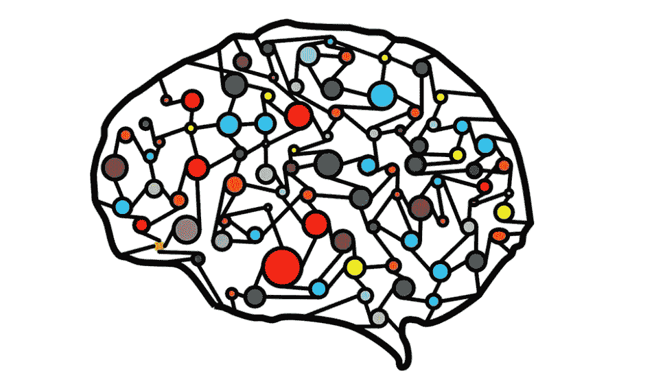

# 人类和计算机力量结合的关键一步

> 原文：<https://towardsdatascience.com/the-essential-step-towards-joined-human-and-computational-forces-bf1e44899434?source=collection_archive---------45----------------------->

我们人类一直在从数据中学习。然而，知识的可用性发生了变化。此时此刻，知识作为我们日常生活的一部分无处不在。我们接触到大量的信息，从人们的生活(亲密的或未知的)到世界各地的新闻，再到深刻的学术内容。使用匹配算法可以确保你的 feed 中充满了你喜欢的内容。这些丰富的信息启发我回顾我们如何在大脑中储存和构建信息。

> M 埃默里巩固在大脑中

我们通过强化大脑中的神经通路来学习。我们阅读/看到/听到新信息，并将其储存在我们的短期记忆中。记忆巩固是将信息从短期记忆转移到长期记忆的重要过程。为了提高我们对主题的理解，我们将它与大脑中现有的知识联系起来。我们建立的联系越多，我们在大脑中强化的知识就越深，我们就越容易将它与未来的新概念联系起来。

> 人类与计算机的专注时间跨度

我们大脑中信息过载和信息处理的一个问题是注意力持续时间有限。我们可以只花很少的时间专注于解释数据。然而，计算机可以整天处理数字和运行算法。因此，人类解释和计算方法之间的联系在我们日常接触信息时至关重要。首先，我们需要计算能力来将大量信息从杂乱、令人生畏转变为清晰、可解释。接下来，我们可以看看相关性和模型，以理解底层的数据生成过程。这可能导致对日常过程的有价值的见解。

> 摘要作为基础:数据整合

当我们开始一个数据科学项目时，重要的第一步是熟悉手头的数据。我们有什么？它的质量如何？我们错过了什么吗？还有很多问题要问。为了帮助这个初始过程，我们利用了数据汇总技术。他们的目的是巩固手头的数据，使人类的解释。为了解释这些方法的输出，我们需要习惯这些术语。问题不在于技术方面，因为可以创建软件来处理统计细节。然而，如果我们想要**平等的**参与，我们就不能回避社会理解术语的需要。为了参与塑造我们社会的创新，我们需要培训人们熟练掌握数据科学语言。

> 我们需要从人类身上得到什么

计算统计学有潜力带领我们增强知识，但我们需要学习如何解释它的输出。为了从中受益，我们需要将人工解释与分析的综合输出结合起来。增强基础数据生成过程的知识，提高个人和组织的决策能力。我们需要社会抛开他们对未来的恐惧和不确定性，开始拥抱未来。虽然网上的信息可能令人望而生畏，但任何人都可以从自己的水平开始。例如，解释平均值是我们已经习惯的事情。把这个扩展到集群怎么样？

> 人类洞察力+计算能力=增强的知识

总之，我认为我们需要训练人类更加适应数据科学。特别是，在优化模型拟合或应用无监督学习后，人类应该能够“阅读”这种新的知识表示方式。这优化了数据分析的发现能力的潜力。