# 道德自动化工具包

> 原文：<https://towardsdatascience.com/the-ethical-automation-toolkit-f1fd4281534e?source=collection_archive---------20----------------------->

## 自动化、人工智能、机器学习的正确做法是什么？—让它为每个人服务。

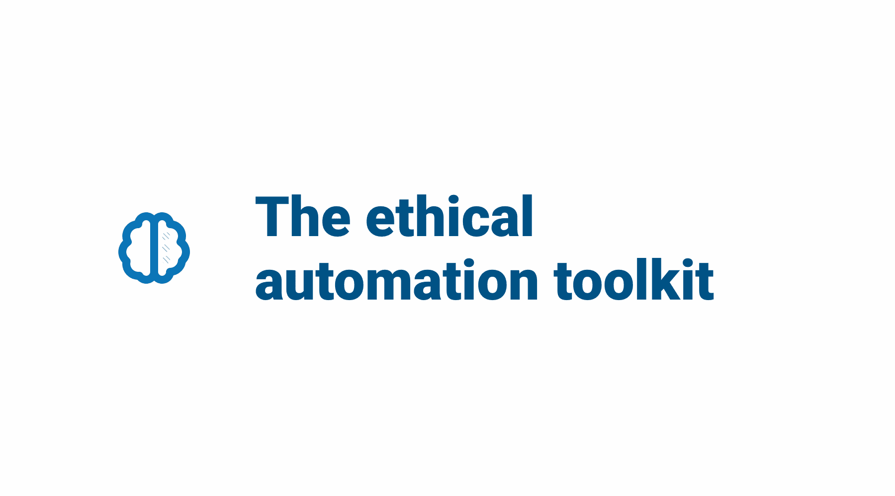

# 自动化简史。

The transcontinental railroad from the east to west United States.

1850 年至 1920 年。蒸汽机提高了生产率和制造业，从而更快地运送货物、服务和乘客。自动化蒸汽生产帮助人类劳动力。修建铁路往往需要使用奴隶劳动力，并给工人带来长时间和危险的工作条件。[1]

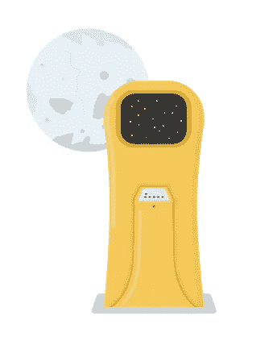

Computer Space (1970).

**1970 年**。第一款街机游戏:《计算机空间》使用基础人工智能(AI)；本质上是随机选择玩家的敌人，使他们看起来很聪明——将人工智能引入娱乐和公共领域——鼓励玩家返回，输入更多硬币继续游戏。[2]

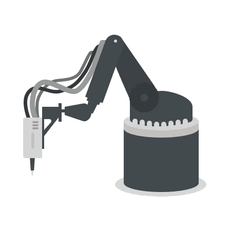

Robotic arm, iconic imagery of modern car assembly factories.

**1993 年至 2007 年。**早期的机器人技术革新了制造流程——在相当大的规模上实现了工厂手工劳动的自动化。[3]

From early home computing to modern.

1995 年至 2005 年。信息技术使得自动化任务在办公室和家庭中普遍存在。[4]

**2015–2065 年。自动化、人工智能和机器学习(ML)将被使用，至少部分地用于人类活动的每个部分。**

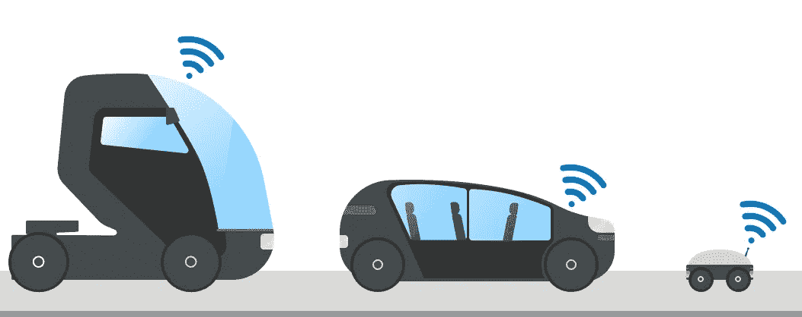

Automated vehicles and pavement drones — represent our automated future.

**2020+。**自动化车辆和送货无人机只是自主未来的一个小代表。

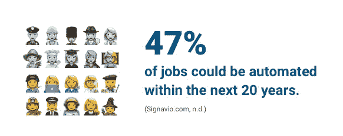

**47%** of jobs could be automated within the next 20 years (Signavio.com, n.d.).

# 自动化一切的伦理。

仅举几个例子，最近在金融、零售、法律、医疗保健和人力资源领域的许多自动化都是通过机器人流程自动化(RPA)实现的——永久地从人类那里移除重复性任务，并允许员工专注于他们的“人类优势”，包括情商、推理、判断和创造力(Lhuer，2016)。重复性任务可以被编码，并且不需要更高级的认知功能来完成。在金融服务领域，RPA 任务主要取代运营、信息技术、财务、风险管理和人力资源领域的中台和后台职能。RPA 实施的投资回报率很高，第一年的回报率从 30%到 200%不等(Lhuer，2016)。

与自动驾驶汽车不同，未来四十年的大多数自动化将主要是“不可见的”——这是我们每小时每纳秒都在生产的数据的自动化。很像哈罗韦对电子人的定义；一种既有动物又有机器的生物，它们居住在模糊的自然和组合的世界中——有机体和技术的结合，带有《性编年史》中没有的命令(哈拉威，1985)。人类已经与自动化共生共存，并严重依赖它。例子包括:我们数据的自动化为超市提供了库存信息；金融机构自动转账、抵押贷款等；处理我们的医疗数据，提供和发现潜在的疾病；从犯罪现场提取数据；交通信号自动化；处理和制作官方文件，如护照和驾驶执照。

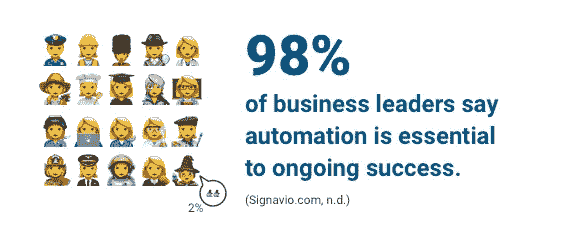

**90%** of business leaders say automation is essential to ongoing success (Signavio.com, n.d.).

## 例子；自动化招聘。

招聘系统的自动化受到了媒体的批评，并突出了向公众展示的一些不同的表现形式。例如，一些机器学习程序学习如何基于选定的数据完成任务。该程序扫描简历文本，而其他程序则分析视频面试或任务表现。对来自潜在候选人的数据进行分级和处理——通常针对一组当前员工——由具有类似角色和职责的人指定为合格或合适的。

这些工具往往不能消除预先存在的人为偏见(Goodman，2018)。在亚马逊的自动招聘项目中；该工具对遵循特定教育途径的候选人不利——许多现有亚马逊员工可能没有参加(Goodman，2018)。该工具同样降低了简历的接受度，简历中包含了男性主导文化中女性被贬低的地位关键词，如限定词(“差不多”、“差不多”)、强化词(“真的”、“非常”)、自我提问(“经常在规定时间内完成任务吗？”)和极端礼貌(鲁宾和格林，1992)。该工具在识别以男性为中心的措辞时提高了接受标准，例如，推理连接词(“因此”、“所以”)、强化词(“很多”、“相当”、“真的”)和控制词(“执行”、“捕获”)(Rubin 和 Greene，1992)。

古德曼的文章“为什么亚马逊的自动化招聘工具歧视女性”偏向于她的公司，并作为其服务的推广机制。声称算法“复制甚至放大了普遍存在于社会中的偏见”在某种程度上可能是正确的。然而，没有考虑到自动化招聘相对于“人工”招聘比自动化更有偏见。招聘人员可能缺乏经验，更多地根据自己的经验或缺乏经验来判断候选人。

自动化招聘是一个特别有用的例子，可以用来思考在全球文化中达成共同道德标准的挑战(和重要性)。全球道德政策中的标准和自动化的发展仍然不确定，因为定义的标准是在微流程级别执行的，如果有的话，其中自动化是为各个公司和个人的地理位置定制的。

随着这种“看不见的”自动化对于任何开发自动化过程的人来说变得更加容易，谁拥有它，谁决定自动化将决定什么。以按揭贷款为例；当自动化流程的主要任务是为自动化所有者省钱时，它如何不歧视申请者？

一个负责任的自动化策略包含了对从现有过程到后自动化的每一步发展的影响的询问。由于自动化对于希望为客户、同事和利益相关者提供始终按需服务的组织至关重要，因此应负责任地创建自动化，包括咨询受影响的社区；提供透明度；帮助人类并赋予他们权力；由人类管理和监控；包容和不偏不倚；考虑长期影响。负责任的自动化应该在整个过程生命周期中被质疑和实现。

自动化在自动化所有者和科幻解读的媒体注视之间有不同的解释。《终结者》(1984)等电影将自动化妖魔化到了人类濒临灭绝的程度。每个媒体和自动化所有者的议程是不同的，这影响了不充分的报道和失实陈述(Miah，2005)。

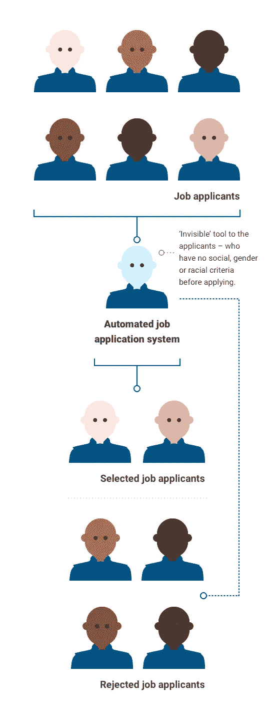

Example of automated recruitment and the invisible tool of candidate selection.

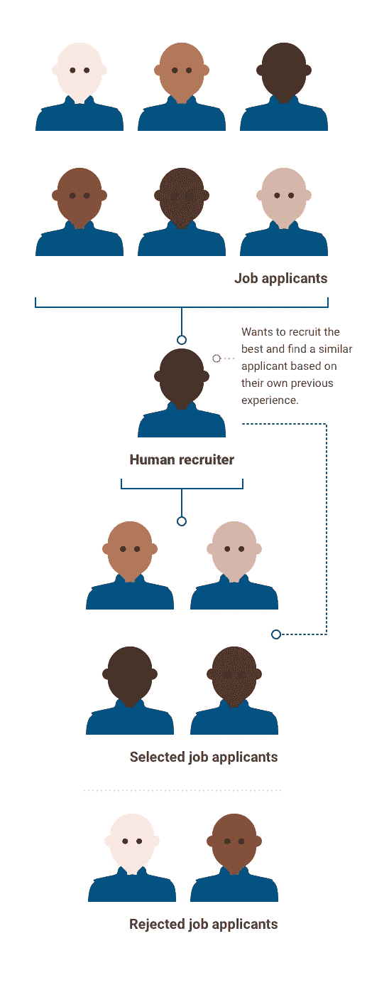

Example of a manual recruitment process.

## 谁是对的？

在两张图中，自动化流程似乎是根据种族背景来选择申请人的。招聘人员选择了更多的申请人，拒绝了看似随机的候选人。我们没有考虑这些选择背后的过程，因为我们不知道为什么候选人被拒绝。不了解这两种方法，很难做出假设，然而公众话语经常会批评自动化超越人性。

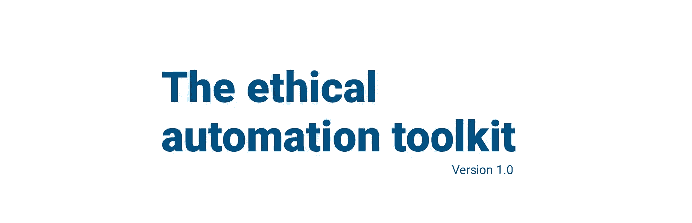

[https://www.paulwilshaw.co.uk/research/](https://www.paulwilshaw.co.uk/research/)

# 道德自动化工具包。

在过去十年中，自动化和技术的兴起一直是一个新兴的文化讨论。在某种程度上，自动化的兴趣是公众理解中的一个重要问题，这一直是数字化转型政策讨论中的一个优先事项。该工具包利用了社区如何应对发展中的自动化景观的挑战的伦理含义，考虑了替代工作和有意识和无意识偏见的情况。它批判性地评估了自动化的前景，并提出了商业和公众参与的可能的最佳实践。这个工具包试图向非专家传达伦理自动化的考虑。[5]

## 道德自动化过程的要素

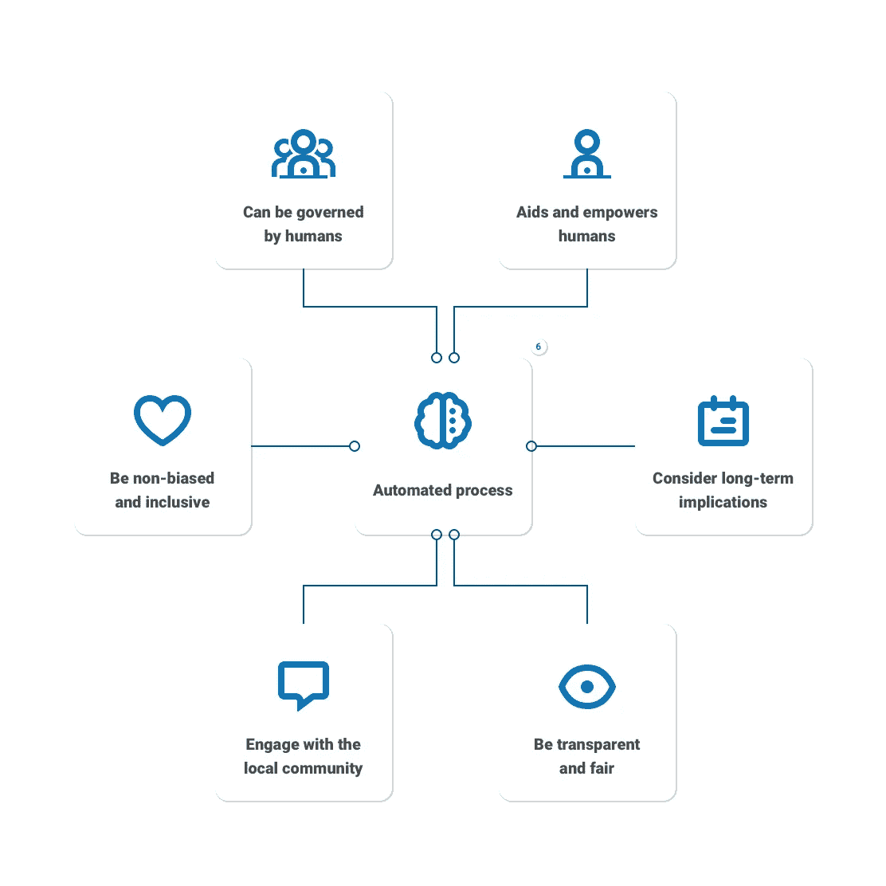

The elements of an ethical automated process that should be included and question before implementation. [6]

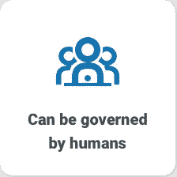

## 可以由人类来管理:

为什么自动化系统要由人类来治理？

就像政府、组织、执法部门、医院受法律、规则和选举机构的管理一样，自动化也应该如此。

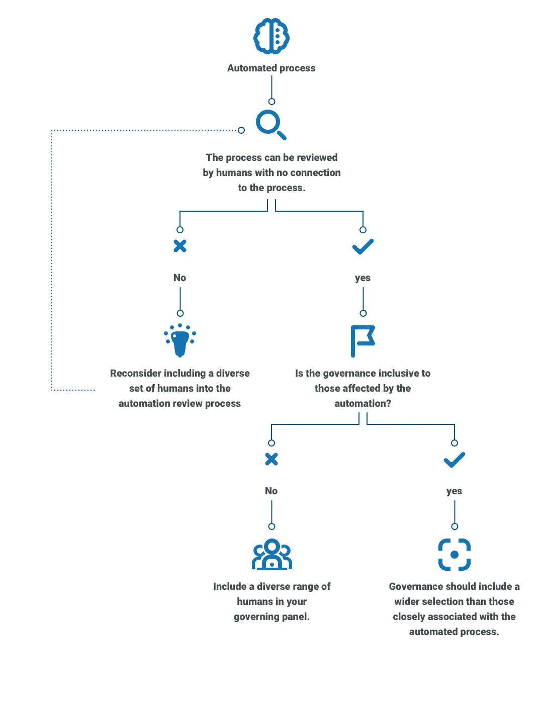

The questions that should be considered for automated processes to be governed by humans.

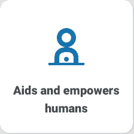

## 艾滋病和赋予人类权力:

为什么要帮助和授权人类？他们很慢，需要休息，而且有不准确的倾向。

在归纳、发现错误和识别异常方面，人类也比自动任务做得更好。大多数情况下，人类是移情的。

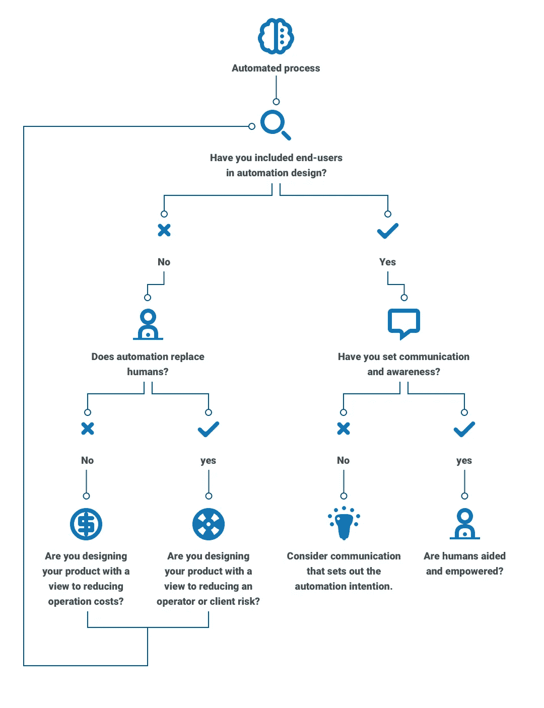

The questions that should be considered for automated processes to aid and empowerhumans.

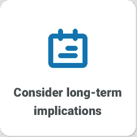

## 考虑长期影响:

为什么要考虑长期影响？

毫无疑问，同时自动化所有的事情会带来问题。人类是群居动物，因此需要其他的人际交往，尤其是在困难的情况下。

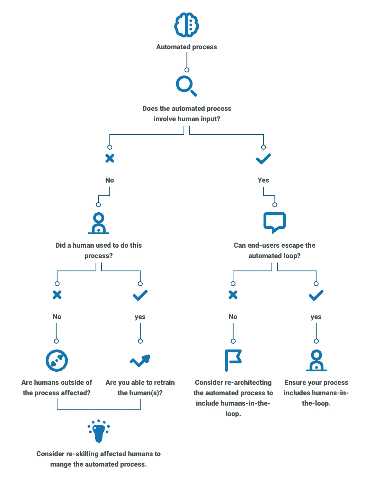

The questions that should be considered for automated processes to be reflected upon for their long-term impacts.

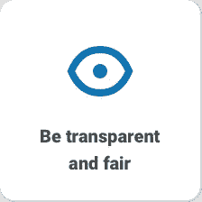

## 保持透明和公平:

为什么要透明公正？

自动化应该和人类一样负责，如果不是更负责的话。拥有清晰、公平和可访问的自动化流程指南
可以消除问题和重新评估。

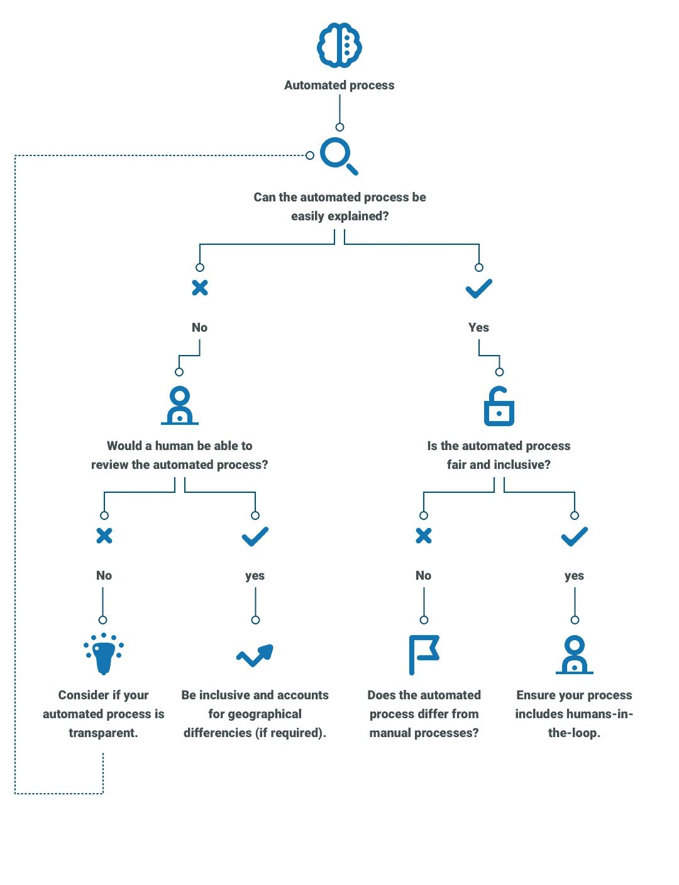

The questions that should be considered for automated processes to transparent.

## 与当地社区合作:

为什么要与当地社区接触？

与当地社区一起检查原型和理论经常会发现意想不到的结果。参与社区鼓励过程的拥护者，并消除错误和产生新的问题。

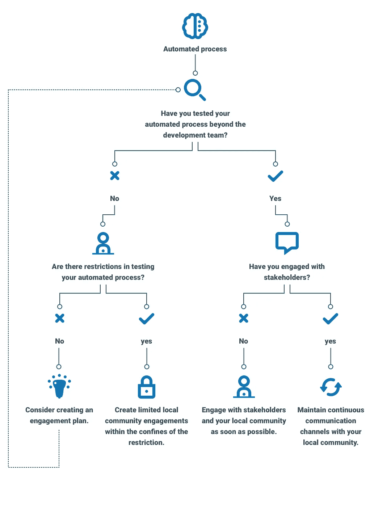

The questions that should be considered for automated processes that should engage with their communities.

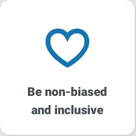

## 不偏不倚，包容各方:

为什么要做到不偏不倚，兼容并蓄？

支持包容性意味着想法得到平等的评价，不管个人特征、背景和无意识的偏见。多样化的视角最大限度地为社会和自动化流程带来创新。

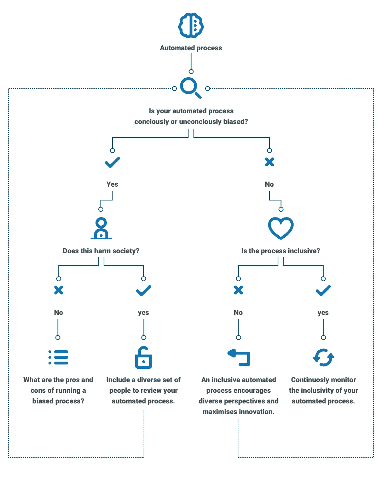

The questions that should be considered for automated processes to be non-biases (conscious or unconscious) and inclusive.

# 伦理自动化工具包注释。

**1。**社会技术进步的历史很少有伦理的过去。即使在今天，苹果 AirPods，一种具有 450 年半衰期的一次性技术的身份象征，也是在令人恐惧的环境中建造的。塑料 AirPods 是碳、氢、氧、氮、氯和硫与钨、锡、钽、锂和钴的组合。这些元素被人类提取、加热和提炼，人类吸入沉积在肺部的空气微粒。这些材料从世界上一些最贫穷的国家，如越南、南非、哈萨克斯坦、墨西哥和印度尼西亚运往中国的工厂(哈斯金斯，2019 年)——呼应了从美国东部到西部的横贯大陆铁路的建设。

在建设过程中，中太平洋开始雇佣中国劳工，由于普遍的西方种族主义，当时中国劳工被认为是劣等劳工。64，000 名中国劳工在内华达山脉沙漠残酷的工作条件下辛苦劳作，工资微薄，与他们的内战老兵和爱尔兰移民形成鲜明对比(HISTORY，2018)。

这个自动化工具包旨在阻止历史和当前实践中这些事件的重复。

**2。**面向大众、面向付费消费者的人工智能(AI)的首批例子之一；电子街机游戏《计算机空间》鼓励可重复和令人上瘾的游戏——用户控制一艘太空火箭去轰炸小行星和不可玩的角色(NPC)飞碟。20 世纪 70 年代，人们对未来黄色塑料的看法占据了计算机空间，创造了一个视频游戏市场——随后是《乒乓》(1972)、《太空入侵者》(1978)和《大金刚》(1981)。

电子游戏成瘾源于电脑空间，此后一直是家长和教师持续关注的问题(Feeley 和 Palmeri，2018)。像堡垒之夜这样拥有超过 2 亿注册玩家和 10 亿美元业务的游戏，有许多批评者宣称，“这个游戏就像海洛因。”(Feeley 和 Palmeri，2018 年)以及受影响者的其他成瘾主张。Fornite 是免费的，可以在大多数带屏幕的设备上使用。虽然可以免费玩堡垒之夜的创造者，但 Epic Games 通过出售游戏中的数字物品来赚钱，例如可以使用信用卡或借记卡购买的稀有武器和“皮肤”。还有“战利品箱”，玩家在不知道里面有什么的情况下购买游戏中的物品。荷兰博彩监管机构发布了一项研究，称这种“盲目”购买相当于赌博(Feeley 和 Palmeri，2018)。虽然可以免费玩堡垒之夜的创造者，但 Epic Games 通过出售游戏中的数字物品来赚钱，例如可以使用信用卡或借记卡购买的稀有武器和“皮肤”。还有“战利品箱”，玩家在不知道里面有什么的情况下购买游戏中的物品。荷兰博彩监管机构发布了一项研究，称这种“盲目”购买相当于赌博(Feeley 和 Palmeri，2018)。

**3。**公众对机器人和自动化理解的一个例证——这个工厂机械臂一眼就能认出来。这些先入为主的观念往往是扭曲的，因为人们倾向于记住关于某个主题的不利信息，而不是有利信息(Gilovich，2007)。这种信息排序被描述为“反应顺序效应”(Schuman and Presser，2000)——“一个可接受的答案越早，它就越受欢迎”(Tourangeau，Rips and Rasinski，2008)。

**4。**随着计算硬件变得经济实惠，获得软件和数字服务的渠道也拓宽了。最初，随着“胖客户端”(安装在最终用户机器上的软件)软件和最近渗透到“云”中的“瘦客户端”软件，例如 Google Docs、Spotify 和网飞，这些服务可能需要下载应用程序或软件，然而，内容主要存储在远程未公开位置的大型数据中心。

内容访问方式的数据访问模式的转变在很大程度上保持不变。安全性和内容所有权变得更加抽象和复杂，不同的法律适用于不同的全球公民。最近的一个例子是谷歌暂停中国电信巨头华为获得其 Android 操作系统的更新(Badshah 和 Kuo，2019)。美国政府将华为列入贸易黑名单，这对世界各地的用户产生了影响，他们将无法更新 Android 软件或在新版本上访问 Google Play、Google Maps 和 Google Mail 等应用程序(Badshah 和 Kuo，2019 年)。

**5。**道德自动化工具包是一个初步版本，鼓励协作，需要公众、自动化开发人员、最终用户、利益相关者和软件开发人员的进一步参与。

作为这个过程的一部分，Paul Wilshaw 咨询了几个组织、自动化开发人员、最终用户和软件开发人员，以鼓励对“自动化过程”的不同理解。对于这个工具包,“自动化过程”是以另一种形式存在的组织过程，其中脱节的系统和软件主要是手动过程。“自动化流程”的创建旨在取代现有流程的一部分或全部。

**6。**道德自动化流程的要素；人类倾向于依赖“习惯化图式”(卡恰托雷、科利和舍弗勒，2011 年)来解释他们的周围环境，并更好地理解和评价这种体验。在一项研究中，Burri (2009)发现，公民转向类比和个人经历，以理解不确定性(卡恰托雷，科利和 Scheufele，2011)。Felt 等人(2008 年)认为，特定的技术以及公众如何看待该技术可以在形成公共理解方面发挥重要作用(卡恰托雷、科利和舍弗勒，2011 年)。Slovic 等人(2004 年)解释说，通过经验和情感反应获得的联系是一个“经验系统”。

当一个自动化的过程取代了一个现有的过程时，要分离与之相关的情感反应是一个挑战。

该工具包旨在质疑自动化的道德立场，并包括不同的经验原则，以便学习和获得对未来创新的更好理解。

## 参考资料:

Badshah，n .和 Kuo，L. (2019)。谷歌黑名单后阻止华为访问安卓更新。[在线]卫报。可在:[https://www . the guardian . com/technology/2019/May/19/Google-Huawei-trump-black list-report](https://www.theguardian.com/technology/2019/may/19/google-huawei-trump-blacklist-report)【2019 年 5 月 21 日获取】。

m .卡恰托雷、e .科利和 d .舍费勒(2011 年)。从使能技术到应用。Sage 出版公司。

儿童和父母:2018 年媒体使用和态度报告。(2019).第一版。[电子书] Ofcom。可在:[https://www . ofcom . org . uk/_ _ data/assets/pdf _ file/0024/134907/Children-and-Parents-Media-Use-and-Attitudes-2018 . pdf](https://www.ofcom.org.uk/__data/assets/pdf_file/0024/134907/Children-and-Parents-Media-Use-and-Attitudes-2018.pdf)【2019 年 5 月 9 日访问】。

Feeley，j .和 Palmeri，C. (2018 年)。堡垒之夜成瘾迫使儿童进入电子游戏康复中心。[在线]独立报。可在:[https://www . independent . co . uk/life-style/gadgets-and-tech/news/fort nite-addiction-video-games-rehab-children-battle-royale-parents-a 8665071 . html](https://www.independent.co.uk/life-style/gadgets-and-tech/news/fortnite-addiction-video-games-rehab-children-battle-royale-parents-a8665071.html)【2019 年 5 月 21 日访问】。

t . gilovich(2007 年)。我们如何知道什么不是这样。温哥华:兰加拉学院。

古德曼河(2018)。为什么亚马逊的自动化招聘工具歧视女性。[在线]美国公民自由联盟。可在:[https://www . aclu . org/blog/women-rights/women-rights-workplace/why-amazons-automated-hiring-tool-discribed-against](https://www.aclu.org/blog/womens-rights/womens-rights-workplace/why-amazons-automated-hiring-tool-discriminated-against)【2019 年 5 月 21 日访问】。

哈拉威博士(1985 年)。电子人宣言:二十世纪后期的科学、技术和社会主义-女权主义。[http://users.uoa.gr/~cdokou/HarawayCyborgManifesto.pdf](http://users.uoa.gr/~cdokou/HarawayCyborgManifesto.pdf)

哈斯金斯，C. (2019)。AirPods 是个悲剧。[在线]恶习。可在:[https://www . vice . com/en _ us/article/neaz 3d/ai rpods-are-a-quartery](https://www.vice.com/en_us/article/neaz3d/airpods-are-a-tragedy)【2019 年 5 月 21 日访问】。

历史。(2018).横贯大陆的铁路。[在线]见:[https://www . history . com/topics/inventions/trans-continental-railway](https://www.history.com/topics/inventions/transcontinental-railroad)【2019 年 5 月 21 日访问】。

Investmentbank.barclays.com(2018)。延迟的预期|巴克莱投资银行。[在线]见:[https://www . investment bank . Barclays . com/our-insights/robots-at-the-gate/delayed-expectations-automation-productivity-and-wages . html](https://www.investmentbank.barclays.com/our-insights/robots-at-the-gate/delayed-expectations-automation-productivity-and-wages.html)【2019 年 5 月 21 日进入】。

Lhuer，X. (2016)。下一个你需要知道的缩写:RPA(机器人流程自动化)。[在线]麦肯锡公司。可从以下网址获取:[https://www . McKinsey . com/business-functions/digital-McKinsey/our-insights/the-next-acronym-you-need-to-know-about-RPA](https://www.mckinsey.com/business-functions/digital-mckinsey/our-insights/the-next-acronym-you-need-to-know-about-rpa)【2019 年 5 月 20 日获取】。

Manyika，j .，Chui，m .，Miremadi，m .，Bughin，j .，George，k .，Willmott，p .，和杜赫斯特，M. (2019)。利用自动化创造一个可行的未来。[在线]麦肯锡公司。可在:[https://www . McKinsey . com/featured-insights/digital-disruption/harling-automation-for-a-future-the-works](https://www.mckinsey.com/featured-insights/digital-disruption/harnessing-automation-for-a-future-that-works)【2019 年 5 月 20 日获取】。

Miah，A. (2005)。遗传学、网络空间和生物伦理:为什么不公开伦理？。公众对科学的理解，14 卷 4 期，第 409-421 页。

鲁宾博士和格林博士(1992 年)。书面语言中的性别典型风格。英语教学研究，[在线] 26(1)，第 7-40 页。地点:【http://www.jstor.org/stable/40171293】T4。[访问日期:2019 年 5 月 21 日]。

舒曼和普雷斯(2000 年)。态度调查中的问题和答案。加利福尼亚州千橡市:塞奇出版社。

Signavio.com(未标明)。机器人流程自动化——释放您的数字劳动力。[在线]可在:[https://www.signavio.com/rpa/](https://www.signavio.com/rpa/)[2019 年 5 月 20 日访问]。

Tourangeau，r .，Rips，l .和 Rasinski，K. (2008 年)。调查反应心理学。剑桥:剑桥大学出版社。

徐(未注明)。电子游戏中人工智能设计的历史及其在 RTS 游戏中的发展-最后一步。[在线]Sites.google.com。可在:[https://sites . Google . com/site/my angel cafe/articles/history _ ai](https://sites.google.com/site/myangelcafe/articles/history_ai)【2019 年 5 月 20 日访问】。