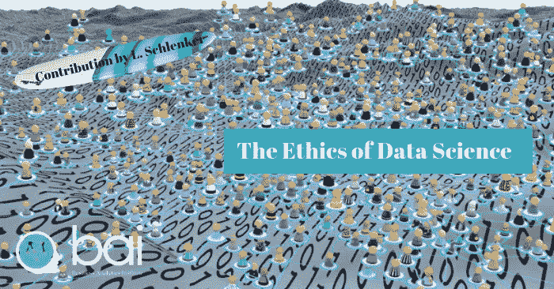

# 数据科学的伦理*

> 原文：<https://towardsdatascience.com/the-ethics-of-data-science-e3b1828affa2?source=collection_archive---------8----------------------->

Image credit : Quantitative Scientific Solutions

数据和信息技术的双引擎正在推动人类企业几乎每一个方面的创新。同样，今天的数据科学深刻影响着生命科学、智能城市和交通运输等领域的商业运作方式。尽管这些方向已经变得令人信服，但没有道德考虑的数据科学的危险同样显而易见——无论是对个人身份数据的保护、自动化决策中的隐性偏见、心理测量学中自由选择的幻觉、自动化的社会影响，还是虚拟交流中真理和信任的明显分离。证明关注数据科学伦理的必要性超出了这些机遇和挑战的平衡表，因为数据科学的实践挑战了我们对人类意义的认知。

如果道德被定义为帮助人类区分对错的共同价值观，那么人类活动的日益数字化就决定了我们如何评价周围的世界。

Margo Boenig-Liptsin 指出，我们对信息技术的日益依赖从根本上改变了“隐私”、“公平”和“代表”的传统概念，更不用说“自由选择”、“真相”和“信任”了。[【我】](http://file///C:/Users/Lee/Dropbox/Newletters/Ethics%20of%20Data%20Science.docx#_edn1)这些突变凸显了数据科学日益增长的足迹和责任——除了字节和比特，数据科学动摇了价值、社区和公平的感知基础。如果学术界围绕统计、计算和软件工程迅速建立了数据科学项目，那么很少有项目解决数据科学更大的社会问题，更少项目分析如何限制甚至鼓励负责任的数据实践。[【ii】](http://file///C:/Users/Lee/Dropbox/Newletters/Ethics%20of%20Data%20Science.docx#_edn2)让我们勾勒出这次挑战的轮廓。

数据公民

也许在数据科学中，没有哪个领域的伦理比保护个人数据更受关注。*我们与社会和经济团体互动的数字化转变揭示了我们是谁，我们想什么，我们做什么*。欧洲(GDPR)、印度(2018 年《个人数据保护法》)最近出台的立法。和加州(2018 年加州消费者隐私法案)明确承认数字公民的权利，并含蓄地解决了个人和个人身份数据的商业使用的危险。这些法律框架试图重新平衡组织和个人之间不平等的权力和影响关系，编纂道德基准，包括知情权、反对权、接触权、纠正权和被遗忘权。

对这项立法的关注远远超出了对数据保护的关注。这些界定正当和非法数据行为的尝试回应了许多伦理问题。随着数据成为世界经济的新货币，公共和私人、个人和社会以及资源丰富者和资源贫乏者之间的界限正在被重新划分。谁拥有个人数据，哪些权利可以在明示或暗示的同意下进行分配？公共和私人组织应该在多大程度上能够收集和控制我们人类交往的大量记录？这些数据控制者和数据处理者应该在多大程度上对我们数据的丢失或滥用负责？

自动化决策

*在各种可能性中自觉做出决定的能力长期以来一直被视为将人(或至少是活人)与机器区分开来的条件。随着算法交易、自动驾驶汽车和机器人技术等数据科学创新的进步，人类和人工智能之间的区别变得越来越难以区分。机器学习的当前应用跨越了决策支持系统的门槛，进入了人工智能领域，其中复杂的算法被设计来代替人类决策。*

跨过这个门槛会带来一些伦理上的考虑。经济和/或社会组织能够依赖日益复杂的方法吗？在这些方法中，许多人既不理解基本模型的假设，也不理解其局限性。我们是否愿意接受这些本质上从我们的经验中学习的应用——让我们成为过去的囚徒，限制了我们增长和多样化的潜力？我们是否理解这些平台的内在逻辑是可以被游戏化的——这创造了“欺骗”系统的机会？最后但同样重要的是，谁在法律上对自动化决策中固有的隐性偏见负责？

微观定位

约翰·巴特利几年前就提出，我们的数字足迹通过我们的意图数据库提供了不可磨灭的路线图。[【iii】](http://file///C:/Users/Lee/Dropbox/Newletters/Ethics%20of%20Data%20Science.docx#_edn3)数据科学的主旨是帮助组织了解个人和社区的目标、动机和行动。Michal Kosinski 和 David Stillwell 的工作承诺了更多，他们提出，通过关注行为模式(个性特征、信仰、价值观、态度、兴趣或生活方式)而不是人口统计数据的聚类，可以大大增强说明性分析的相关性。[【第四季】](http://file///C:/Users/Lee/Dropbox/Newletters/Ethics%20of%20Data%20Science.docx#_edn4)

从那以后，微观定位的应用被认为是在市场营销、政治和经济领域施加影响的有力工具。即使个人行使“自由选择”的能力长期以来一直是一个争论的话题，但只向消费者提供他们会同意的信息的做法会进一步束缚理性。此外，微定位技术允许研究人员推断个人的敏感信息和个人偏好，即使这些数据不是专门捕获的。最后，随着“客户成为产品”，一个真正的危险是，数据科学与其说是用来改善一个组织的产品或服务，不如说是把消费者变成操纵的对象。

分布式分类帐

信息技术的目标一直是提供单一版本的事实，以促进产品、服务和思想的交流。由于与全球经济和国内市场发展相关的诸多原因，*在这一“基本事实”和消费者对捕捉、收集和货币化这些数据的中介机构(如国家、银行和企业)的信任之间，出现了一条感知鸿沟。万维网的社会机制进一步扭曲了这种关系，把事实和虚构放在同等的地位上，有利于极端到平凡的常态。*

一般来说，分布式账本技术，尤其是区块链技术，为更加透明和可追踪的信息来源提供了希望。然而，这种价值互联网的愿景部分被相对未经测试的技术的潜在社会挑战所掩盖。技术本身能成为真理和信任的标准吗？人们和组织会在多大程度上接受透明度的首要地位？像*被遗忘的权利*这样的社会价值观在什么基础上可以与公共账簿的技术要求相调和？摆脱了传统和金融资本主义的逻辑，人性能接受一个完全不同的财富分配基础吗？

人类和机器智能

虽然在过去的四十年里，人们就信息技术对私营和公共企业组织的影响进行了广泛的辩论，但数据科学对管理职能的影响却很少受到关注。在行业媒体中，技术通常被视为道德中立的，证明了在任何时间点占主导地位的管理范式的数字镜像。在学术界，这种关系受到更密切的审查，拉图、卡隆和劳等作者已经证明了不同形式的技术如何影响经理、员工和客户对社会和经济交流、市场和行业现实的看法。

当专注于数据科学时，这些对上下文的关注揭示了他们自己的许多伦理考虑。如果数据从来都不是客观的，那么管理层必须在多大程度上理解数据是如何收集、分析和传输的？同样，随着算法变得越来越普遍和复杂，管理者需要在多大程度上理解他们的假设和限制？随着应用程序在关键业务流程中承担越来越大的角色，应该在多大程度上围绕人员和软件代理的协调来定义管理？从另一个角度来看，*随着人工智能的成熟，哪些管理职能应该委托给机器人，哪些应该留给人类？*

李·施伦克

*本文原载于远见营销的[营销&创新博客](https://visionarymarketing.com/en/blog/)

Lee Schlenker 是商业分析和社区管理教授，也是 http://baieurope.com 商业分析研究所的负责人。他的 LinkedIn 个人资料可以在[查看](http://www.linkedin.com/in/leeschlenker.)你可以在[的 Twitter 上关注白](https://twitter.com/DSign4Analytics)

[【I】](http://file///C:/Users/Lee/Dropbox/Newletters/Ethics%20of%20Data%20Science.docx#_ednref1)Ericson，Lucy (2018)，[是时候在餐桌上进行数据伦理对话了](https://data.berkeley.edu/news/it%E2%80%99s-time-data-ethics-conversations-your-dinner-table)

[【ii】](http://file///C:/Users/Lee/Dropbox/Newletters/Ethics%20of%20Data%20Science.docx#_ednref2)Fiesler，Casey (2017)，[50 多门技术伦理课程，并附有教学大纲链接](https://boingboing.net/2017/11/20/robo-socrates-what-is-virtue.html)

[【iii】](http://file///C:/Users/Lee/Dropbox/Newletters/Ethics%20of%20Data%20Science.docx#_ednref3)巴特尔，约翰(2013)[意向数据库](https://battellemedia.com/archives/2003/11/the_database_of_intentions)

[【iv】](http://file///C:/Users/Lee/Dropbox/Newletters/Ethics%20of%20Data%20Science.docx#_ednref4)科辛斯基，米卡勒等人(2013)，[私人特质和属性可以从人类行为的数字记录中预测](https://www.pnas.org/content/110/15/5802)