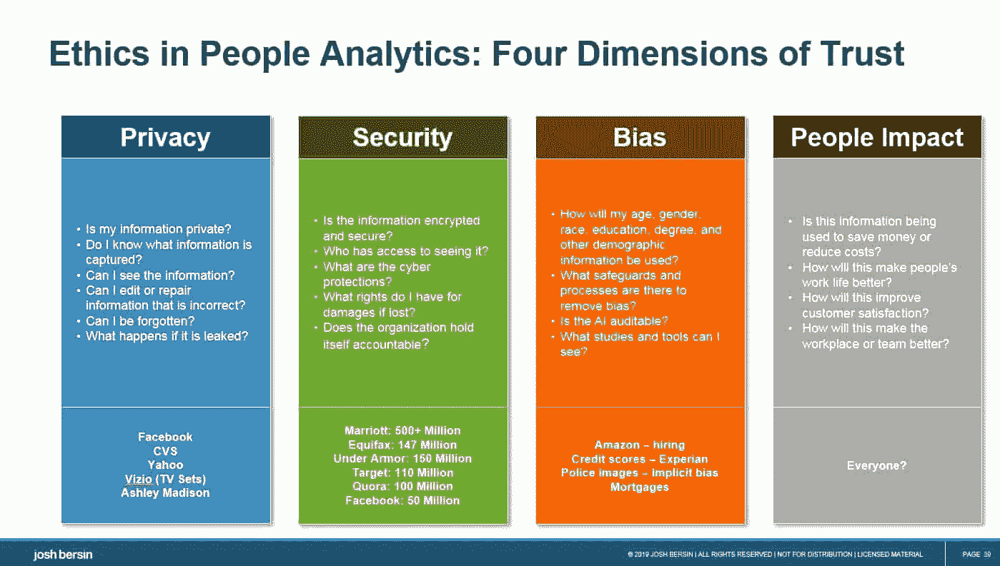

# 工作场所中人员分析和人工智能的伦理:信任的四个维度

> 原文：<https://towardsdatascience.com/the-ethics-of-people-analytics-and-ai-in-the-workplace-four-dimensions-of-trust-21fb1c400cb2?source=collection_archive---------15----------------------->

[http://www.joshbersin.com](http://www.joshbersin.com)

人工智能和人员分析已经起飞。正如我在过去的文章中所写的那样，工作场所已经变成了一个高度仪器化的地方。公司使用调查和反馈工具来获取我们的意见，新工具监控电子邮件和我们的通信网络(ONA)，我们捕获关于旅行、位置和移动性的数据，组织现在拥有关于我们福祉、健身和健康的数据。

除此之外，还有一种新的数据流，包括视频(每次视频会议都可以录制，超过 40%的工作面试都可以录制)、音频(记录会议的工具可以感知情绪)，以及无论我们在哪里都可以识别人脸的图像识别。

在人力资源分析的早期，公司获取员工数据来衡量控制范围、绩效评级分布、继任渠道和其他人才相关主题。今天，随着所有这些新信息进入工作场所(几乎你在工作中点击的任何地方都存储在某个地方)，人员分析的领域变得非常个人化。

虽然我知道人力资源专业人员非常重视职业道德和安全，但我想指出一些我们需要考虑的道德问题。

**数据滥用的风险**

首先，让我给你一点动力。虽然你可能走出去，从你的人力资源软件公司购买了一个伟大的新员工参与工具或“保留风险预测”，这些新系统带来了风险。当您购买系统时，您真的不知道它是如何工作的，因此它做出的每一个决定、推荐或建议都会成为您的组织的问题。

例如，假设您使用 Pymetrics、HireVue 或其他高级评估技术来评估求职者。虽然这些供应商努力从他们的工具中消除种族、性别和代际偏见，但如果你实施了这些工具，而一名求职者起诉了你，你的公司就要负责任。这种情况经常发生。([阅读亚马逊如何无意中创建了](https://www.reuters.com/article/us-amazon-com-jobs-automation-insight/amazon-scraps-secret-ai-recruiting-tool-that-showed-bias-against-women-idUSKCN1MK08G)自己的性别偏见招聘系统。)

我经历过这种事。很多年前，我们面试一个秘书职位的候选人，面试那天我不得不出城。候选人来到办公室，我们的办公室经理告诉她，我们必须重新安排会议。她立即起诉我们歧视，因为她是一个受保护阶层的成员。我感觉很糟糕，我们付给她时间，但我能理解她的感受。

我想指出的另一个例子。一家从他们的 HCM 系统打开“保留预测器”的公司告诉我，他们的经理看着这些评级，当他们看到逃跑风险时会做各种奇怪的事情。一些经理实际上不再和这些人说话，减少了他们在工作中得到的支持，因为我猜他们认为“他们无论如何都在考虑离开。”显然，这不是好的管理，但如果我们不好好利用这些数据，人们就可能错误地使用它。

当然，还有其他可能出错的事情。如果你能接触到员工的健康数据，并利用它来评估或讨论员工的表现，我敢肯定你正处于法律危险之中。(我不是就业律师。)如果您泄露或无意中发布员工健康数据，您就违反了 HIPAA 规则。

有很多很多地方会惹上麻烦。只要看看脸书、Equifax、Marriott 和其他所有自认为在保护数据的大公司都发生了什么就知道了。人都会犯错；员工做坏事；我们必须保护数据、算法和管理行为。

随着人工智能变得越来越普遍，我们不再看到数据，而是看到“推动”或“建议”。如果这种“轻推”在某种程度上有偏见，员工变得不高兴了怎么办？你知道这个软件是如何工作的吗？你能回去确保它没有基于一些不正确的标准进行歧视吗？

最后，如果你是一名分析师，你做了自己的分析(阅读我关于 ONA 和电子邮件流量如何预测性能的文章)，你准备好在受到攻击时捍卫你的发现和建议了吗？如果有人质疑你的发现，并想通过年龄、性别、种族，甚至是地点或季节来了解数据——你准备好确保它是有效和可靠的了吗？我知道我们可以用统计工具做这些事情，但是我们必须小心。

请记住，信任是当今商业中最重要的东西之一。如果发生不好的事情，你不仅可能丢掉工作，而且对公司声誉的损害也是巨大的。

我们应该怎么做？

我在这个领域做了很多工作，包括花了相当多的时间与 IBM、O'Reilly 的人在一起，当然也与许多人力资源负责人、人员分析负责人和供应商进行了交谈。为了帮助您理解人员分析的道德问题，让我展示以下框架。

正如你从这个框架中看到的，道德有两个维度。

*   首先，你使用的数据和算法公平吗？它是否准确地反映了您想要的绩效或生产率数据，而没有排除、区别或无意中偏向结果？这很棘手，我将在下面讨论。
*   第二，数据系统和算法安全吗？我们是否在保护隐私、机密性和安全性？谁有权访问，我们如何在公司内部审计其使用和路径？这在 IT 界是一个众所周知的问题，但现在我们不得不在人力资源部处理这个问题。

当你观察这两个维度时，你会发现有四个维度是可以信任的。

**1。隐私**

首先要考虑的伦理问题是隐私。如上图所示，像脸书、CVS、雅虎和许多其他公司在这里陷入了困境。当一名员工加入你的公司时，他们给了你收集大量数据的权利，但我们作为雇主没有权利披露这些数据，分享这些数据，或将这些数据与个人身份信息联系起来。

根据 GDPR 规则，如果员工提出要求，组织也必须“忘记”这些数据，因此需要考虑一些重要的业务实践。如果你看看上面的几个问题，它们都涉及到披露和保护的问题。谁可以访问这些数据，这些人是否接受过隐私规则和程序方面的培训？

在德勤，所有的咨询师每年都要参加一门关于隐私的必修课，我们的电脑会被扫描，我们被训练不要以可能被泄露的形式存储任何客户信息。就人力资源而言，我们需要告诉员工我们正在收集哪些数据，并确保他们理解这些数据正被用于积极的目的。

虽然我们中的许多人可能觉得在社交媒体和其他地方分享我们的个人故事很舒服(我个人不这么做)，但其他人则更加隐私——所以即使是内部员工名录也可能有问题。一家大型科技公司最近告诉我一个故事，一名工程师创建了一个内部社交网络，向员工展示他们过去在什么办公室工作以及从事什么工作。员工们对“发现”这个网站感到非常不安，因为他们事先没有被咨询，所以抗议使用这个网站。这名员工只是一名试图让公司变得更好的工程师，他不得不关闭系统。

捕获的数据量也在不断增加。例如，L&D 发展最快的领域之一是[虚拟现实](https://joshbersin.com/2019/01/vr-enters-corporate-learning-with-a-vengeance-and-the-results-are-amazing/)(现在称为沉浸式学习)。虚拟现实程序捕捉所有类型的个人表现数据——你的注意力范围、眼球运动以及你应对压力的能力。Pymetrics 评估测量你的冒险能力和认知过程。这种类型的数据可能对目标有用(培训、职位匹配)，但如果不保密，也可能被滥用。

告诉人们你在做什么，解释你的“选择加入”政策，并确保你对所有员工数据都有良好的隐私政策。( [GDPR 规则要求](https://eugdpr.org/the-regulation/)你必须获得这样的同意，并且让员工看到你收集的数据。)

**2。安全性**

隐私的姐妹是安全。数据是否存储和保护在其他人找不到的地方？您是否制定了密码策略、加密和其他数据保护措施，以防止员工将数据带回家、发送给第三方或意外发布到互联网上？这些都是所有公司都必须处理的 IT 问题，当我们拥有薪酬、工作经历、医疗保健数据和其他个人信息等敏感信息时，我们必须保护好这些信息。

在欧盟，这已经成为一项法律。GDPR 规则之一是需要创建一个[数据保护官](https://eugdpr.org/the-regulation/)，并为数据保护设计您的系统。如果你的公司被发现在这些方面失职，你可能会被[处以高达收入 2%的罚款](https://www.gdpreu.org/compliance/fines-and-penalties/)，这是一个巨大的风险。

**3。偏置**

第三个也是最困难的(也是最新的)问题是偏见。无论你是自己分析数据，还是从供应商那里购买 AI 工具，我们都必须记住，所有的算法系统都是基于现有数据的。而如果现有的数据有偏差，那么预测和推荐也会有偏差。

这是一个很难解决的问题，许多组织都在致力于此。( [IBM Research 有一个关于这个话题的优秀视频](https://www.research.ibm.com/5-in-5/ai-and-bias/)。).例如:

*   试图评估公平薪酬的系统会将员工与同事进行比较，但可能不理解种族、地点和年龄等问题
*   预测留任的系统可能会歧视少数族裔或其他因文化原因离开公司的人
*   评估是否适合某项工作的系统可能会将陈旧的、根深蒂固于雇佣历史中的歧视性雇佣行为制度化
*   使用组织网络分析来识别绩效的系统可能没有意识到性别或年龄在信任和关系中起着巨大的作用
*   预测高绩效者的系统将偏向于现有的高评级个人(可能是白人)。

你购买或构建的每一个预测分析系统都将内置偏见。(“偏见”这个词的意思是“基于过去的影响”，这确实是 AI 试图做的事情。)

要减少偏见，你能做的最好的事情就是监控和训练你的分析系统。换句话说，看看它正在做出的预测和建议，并检查结果是否有偏差。亚马逊发现它的招聘机器人对女性有偏见。IBM 通过“机器人教练”持续监控其内部薪酬推荐引擎和在线管理教练(均由沃森提供支持)，这些“机器人教练”不断调整系统以应对新情况。

我记得几年前有一家公司告诉我，它的薪酬政策在中国效果不佳，中国的薪资增幅是美国的两倍。你的系统可能不知道这一点，所以它可能对中国的加薪有偏见，或者对美国的加薪有过度的偏见。这些不一定是不道德的决定，但这种偏见会伤害你的公司。

厂商对此相当关注。Pymetrics 非常重视这一点，该公司现在开源其算法以减少偏差。其他供应商也应该这样做。

> 当我们愉快地根据历史数据训练算法时，在很大程度上，我们只是在重复过去。…我们需要做更多的工作，这意味着检查数据中隐含的偏见*。—凯茜·奥尼尔《数学毁灭的武器》*

你能做什么？监控、评估和培训您的数据驱动系统。例如，IBM 率先使用人工智能来帮助改善职业发展、管理实践和薪酬。该公司定期审查其基于沃森的人力资源预测器，并训练它们变得更聪明，更少偏见。(IBM 告诉我，他们基于人工智能的人力资源聊天机器人现在在回答问题时的员工满意度超过 96%。)

**可解释、透明或可信的人工智能**

在人工智能社区中有一个重要的运动，那就是让系统变得“可解释”例如，系统为什么建议这次薪资变动？如果你明白为什么要做一个预测，你就能更明智地采取行动。

很多厂商都在构建检测 AI 偏见的工具，包括 [IBM 的偏见检测云服务](https://venturebeat.com/2018/09/19/ibm-announces-cloud-service-to-help-businesses-detect-and-mitigate-ai-bias/)，[来自 Pymetrics 的 Audit AI](https://venturebeat.com/2018/05/31/pymetrics-open-sources-audit-ai-an-algorithm-bias-detection-tool/)。麻省理工学院的研究人员现在发布了[自动偏差检测](https://venturebeat.com/2019/01/26/mit-csail-researchers-propose-automated-method-for-debiasing-ai-algorithms/)以及[消除人工智能偏差而不损失准确性的方法](https://venturebeat.com/2018/11/16/mit-researchers-show-how-to-detect-and-address-ai-bias-without-loss-in-accuracy/)。作为人力资源系统的购买者，你应该询问这些功能。

**4。人员影响**

信任的第四个维度也许是最重要的。您获取这些数据的目的是什么？

正如 [GDPR 规则](https://eugdpr.org/)明确指出的，捕捉数据来“看看它能告诉我们什么”是不可以的如果员工认为他们被监控的原因是错误的，那么影响将是负面的。所以我认为你应该坐下来记录你为什么要捕获一个给定的数据流，并清楚地为这个项目设定一个目标。脸书显然没有在他们的业务中这样做，他们仍在从声誉受损中恢复。

要问的大问题是:你为什么要实现这种特定的分析或人工智能工具？会对人有帮助吗？还是用于监控或[暗中绩效评估](https://joshbersin.com/2018/11/we-wasted-ten-years-talking-about-performance-ratings-the-seven-things-weve-learned/)？

大多数供应商都是出于好意。

*   [飞鸿人新的人才体验平台](https://www.phenompeople.com/)利用 AI 帮助求职者找到合适的空缺，帮助内部求职者找到合适的工作，帮助聊天机器人向你提出智能问题，了解你的工作需求。
*   [Glint 的新经理礼宾](https://joshbersin.com/2019/04/employee-engagement-3-0-from-feedback-to-action/)使用人工智能来推荐行为改变和课程，以帮助你成为更好的领导者。 [ADP 的指南针](https://compass.adp.com/solution.html)工具和[culture amp](https://joshbersin.com/2019/01/culture-amp-acquires-zugata-employee-feedback-market-gets-hotter/)的 Zugata 也是如此。 [Humu](https://humu.com/) 这么做是为了团队和运营业绩。
*   IBM 的 Watson 候选人助理使用你的简历来确定你作为求职者的技能，并为你找到最好的工作，极大地提高招聘质量和招聘时间。
*   [EdCast](http://www.edcast.com) 、 [Valamis](https://valamis.com/solutions/valamis) 、 [Fuse](https://fuse.fuseuniversal.com/users/sign_in) 、[凌空](https://volley.com/)都在用 AI 推荐学习内容， [BetterUp](https://www.betterup.co/) 用 AI 给你找最好的教练。
*   Oracle、Workday 和 SuccessFactors 在许多功能中都使用了人工智能。甲骨文 HCM 根据你自己的角色和行为推荐工资调整，甚至定制你看到的屏幕，简化系统本身。
*   像 [Spring Health](https://www.springhealth.com/) 这样的供应商现在使用人工智能来诊断你的心理健康，并推荐正确的提示、顾问或医生。

事实上，对我来说很明显，所有人力资源技术供应商都在推动人工智能对人产生积极影响。然而，作为买家，我们只需要确保我们用好它。

例如，以下是一些需要避免的事情:

*   不要使用监控数据偷偷告知绩效评估。例如，一家金融服务公司使用一种热量和运动探测器来确定谁正在进入办公室。众所周知，雅虎会查看 VPN 日志，看看人们什么时候在家工作，什么时候不在家。这类活动会损害员工的信任感，几乎总是会导致糟糕的决策。
*   不要将任何形式的健康数据用于法律允许之外的任何其他目的。将某些健康数据用于保险定价是合法的:将其用于继任计划、绩效评估或任何其他形式的员工培训是不合法的。
*   不要使用培训数据(项目绩效)进行绩效评估。这不仅会降低信任度，还会让你陷入法律危机。
*   不要跨越个人数据和职业数据的界限。如果你在追踪员工手机上的数据，确保你没有让别人接触到你的个人信息。虽然该设备可能归公司所有，但侵犯隐私会给你带来麻烦。

事实上，在大多数大公司，在你开始获取数据之前，应该有一个法律审查。您的项目遵守 GDPR 准则、HIPAA 规则和其他保密保护吗？

我能给出的简单建议是:将你的分析程序集中在对人们产生积极影响的策略上。如果你跟踪人们来衡量工作效率，并且数据将被用来使工作更好，那么你正朝着正确的方向前进。如果你用这些数据来淘汰表现不佳的员工，你可能违反了公司的管理原则。

**底线:运用良好的判断力**

越来越多的公司雇佣了“首席道德官”和其他员工来帮助这些项目。每当你开始一个新的分析程序时，问问自己“如果这个程序出现在纽约时报的头版会是什么样子？”这会损害公司的声誉吗？

如果这个问题的答案是肯定的，你需要做更多的功课。

https://bersinacademy.com

最后，让我们用数据来指导消费者的体验。暴露大量消费者数据的公司遭受了可怕的损失。今天，信任是我们最重要的商业资产之一。认真对待它，并确保您使管理数据驱动的努力朝着正确的方向前进。你会很高兴你做了。

PS。我们将在今年夏天晚些时候在[乔希·伯辛学院](https://bersinacademy.com/)推出的人才分析卓越课程中，关注关于这个主题的更多信息。

*Josh Bersin 是一名全球行业分析师，研究工作、领导力、人力资源和人力资源技术的方方面面。原载于 2019 年 5 月 4 日***。**