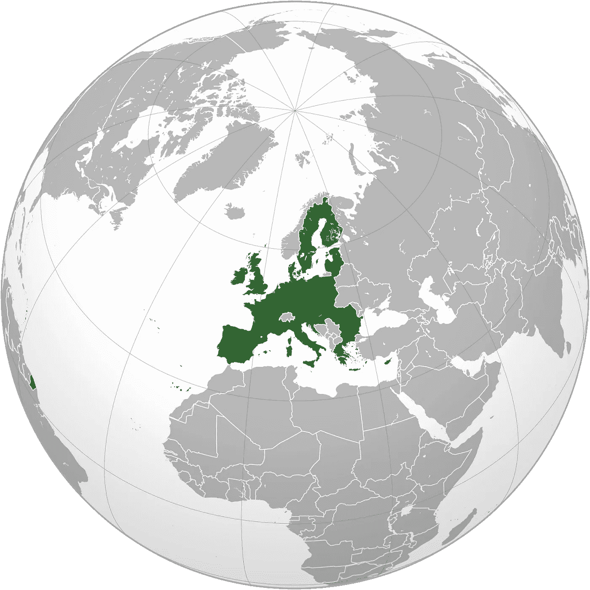

# 2018 年欧盟人工智能战略

> 原文：<https://towardsdatascience.com/the-eu-strategy-on-artificial-intelligence-ab51ce5ce5bd?source=collection_archive---------31----------------------->

Brussels, Belgium –Photo by [@todoranb_26](https://unsplash.com/@todoranb_26)

## 对欧盟战略的进一步审视

大多数人在撰写本文时可能会将欧盟与英国退出欧盟联系起来，因为英国正在退出欧盟。欧盟及其成员国的总人口约为 5 亿，国内生产总值约为 22.0 万亿美元，这使欧盟成为世界上第二大经济力量。因此，从某些方面来看，这是一个需要跟踪的重要领域，欧盟与人工智能相关的国际战略可能会引起人们的兴趣。通过以务实的方式总结其中一些政策，我希望作为读者的您能够理解，这并不能代替阅读这些文件，而是试图将几个要点汇集在一起。我所提供的当然不是一幅完整的图画，而是正在进行的讨论中的一些小片段。

The current EU countries (UK has decided to leave) retrieved the 23rd of December 2019

看看欧盟的战略，可能很难理解从哪里开始。人们可以看几个不同的文件，并且在与人工智能相关的政策中经常有新的发展。

你可能会认为这是不可能的，然而欧盟已经尝试在他们的[数字单一市场](https://ec.europa.eu/digital-single-market/en/artificial-intelligence)页面上整合一些与这个主题相关的线索。当然，还有更多与人工智能相关的立法和战略，但我担心我们会局限在这个狭窄的框架内:

1.  [**人工智能合作宣言**](https://ec.europa.eu/digital-single-market/en/news/eu-member-states-sign-cooperate-artificial-intelligence) **(2018 年 4 月)**
2.  [**欧洲人工智能**](https://ec.europa.eu/digital-single-market/en/news/communication-artificial-intelligence-europe) **(2018 年 4 月)**
3.  [可信人工智能道德准则](https://ec.europa.eu/digital-single-market/en/news/ethics-guidelines-trustworthy-ai) (2019 年 4 月)
4.  [可信人工智能的政策与投资建议](https://ec.europa.eu/digital-single-market/en/news/policy-and-investment-recommendations-trustworthy-artificial-intelligence)(2019 . 4)
5.  [欧洲联盟大会](https://ec.europa.eu/digital-single-market/en/news/first-european-ai-alliance-assembly) (2019 年 6 月)
6.  [人工智能责任](https://ec.europa.eu/newsroom/dae/document.cfm?doc_id=63199)(2019 . 11)

**我将从用粗体字**列出的两份文件开始，如果我认为有必要，我也可能在未来几天增加新的文件。

## 1.人工智能合作宣言

2018 年 4 月 10 日，25 个欧洲国家签署了一份关于人工智能合作的[宣言](https://ec.europa.eu/digital-single-market/en/news/eu-member-states-sign-cooperate-artificial-intelligence)。挪威是其中的一员，尽管他们不是欧盟成员(而是欧洲经济区的一部分)。据说这是建立在欧洲已有的投资和社区基础上的。

它提出通过获取公共部门数据来提高技术和工业能力。应对社会经济变化，特别是劳动力市场的变化。确保在基本权利和价值观以及透明度和问责制的基础上建立适当的法律和道德框架。

“成员国同意”的承诺*(我有时会简化)*:

1.  致力于在人工智能方面实现全面和综合的欧洲方法，以提高欧盟在 R&D 人工智能方面的竞争力、吸引力和卓越性(如有必要，使国家政策现代化)。
2.  鼓励与利益相关方就人工智能进行讨论，并支持在欧洲人工智能联盟中发展广泛而多样的利益相关方群体，以建立意识并促进人工智能的发展，从而最大限度地提高经济和社会效益。
3.  作为优先事项，考虑将 R&D&I 资金分配给人工智能的进一步开发和部署，包括破坏性创新和应用。
4.  加强人工智能研究中心并支持其泛欧洲层面。
5.  在欧洲层面建立数字创新中心。
6.  让人工智能在公共部门可用。交流政府采购和使用人工智能的最佳实践。
7.  帮助中小企业和非技术部门的公司获得人工智能。
8.  就人工智能相关的伦理和法律框架交换意见。
9.  确保人工智能的开发、部署和决策以人为中心，防止人工智能应用程序的有害创建和使用。
10.  提高公众对人工智能的理解。
11.  就人工智能问题与委员会进行持续对话。

## 2.欧洲的人工智能

这种交流在人工智能可以解决什么方面有更积极的倾向，并介绍了人工智能是什么。信息是人工智能正在像蒸汽机或电力一样改变社会。它表示，需要一个坚实的欧洲框架。

这份报告说，欧盟应该有一个“协调一致的方法”来对待人工智能。它建议通过以下方式做到这一点:

1.  世界级的研究人员、实验室和创业公司
2.  数字单一市场——数据保护、网络安全和连通性的共同规则
3.  解锁数据(被报告称为“人工智能的原材料”)

它提到了《宣言》中的承诺。几乎在同一时间，它特别强调竞争，不让任何人落后和欧盟的可持续发展的技术方法。一种有益于人类和整个社会的方法。

这可以追溯到 2017 年对数字单一市场战略的审查，其中探索欧盟人工智能方法的邀请部分源于(例如，对机器人的民法规则)。有三个要点:(1)提高技术能力，(2)为社会经济变革做准备，(3)确保道德和法律框架。

关于欧盟在竞争激烈的国际格局中的地位的沟通的不同部分概述了美国和中国在非机密人工智能研究方面增加的投资，从而清楚地表明欧盟“在私人投资方面落后”。人们明确表示希望创造一个刺激投资的环境。欧盟显然生产了四分之一的专业服务机器人。“欧洲不能错过火车”，采用人工智能的好处得到了广泛认可——提到了几个由欧盟资助的项目(农业、医疗保健、基础设施和制造业)。

> 在概述前进方向时，他们表示，到 2020 年及以后，需要私人和公共部门的共同努力。它概述了未来十年投资将从大约 40-50 亿欧元增加到 200 亿欧元。

这种方式加大了投资力度。他们预计到 2020 年底，这一数字将会增长。该报告还提到支持卓越中心(和数字创新中心)。这里提到了“人工智能按需平台”，它可以帮助促进 400 多个数字创新中心之间的合作。它提到将创建专注于人工智能的中心。

到 2020 年，他们将在研究和创新方面投资 15 亿英镑；加强英才中心；和潜在用户的工具箱。他们谈到了按需人工智能平台和工业数据平台，这些平台提供了访问高质量数据集的途径。2020 年后，他们将升级和支持公共利益应用程序，以及一个数据共享支持中心，同时对现有政策进行各种升级。

目的是提供更多的数据，欧盟在过去 15 年中一直在这样做，一个例子是欧盟的空间计划。它谈到了老龄化社会和增强人们的能力，在“不让一个人掉队”中，他们谈到了新技能。这在很大程度上是针对 STEM 的，而在另一部分，他们谈到了多样性以及跨学科的方法。

*   更多的妇女和不同背景的人，包括残疾人。
*   跨学科的方式结合联合学位，例如法律或心理学和人工智能。这里提到了伦理道德的重要性，同时考虑创造一个有吸引力的环境让人才留在欧洲。

该报告为 2018 年的教育政策制定了计划，包括(再)培训计划、劳动力市场分析、高级数字技能的数字培训、商业-教育-伙伴关系和社会伙伴，以将人工智能纳入影响研究。

> “下一个欧盟多年期财政框架(2021-2027)下的提案将包括加强对获取高级数字技能(包括人工智能专业知识)的支持。”

在确保道德框架方面，提到了基本权利、GDPR、数字单一市场和可解释的人工智能系统。在最后一段，还有一个知识产权的问题。道德准则草案将在年底制定。提到了安全和责任，根据 2019 年中期的技术发展，通过关于产品责任指令的指导文件赋予个人权力。还提到了一个建立算法意识的试点项目，以及对消费者组织数据保护的支持。

让成员国参与这项工作非常重要，本节提到了芬兰的国家战略。它说:*“鼓励每个成员国制定人工智能战略，包括投资战略。”*这里提到了多利益主体欧洲人工智能联盟以及国际外展。

> “随着人工智能很容易跨境交易，只有全球性的解决方案才能在这一领域持续发展。”

欧盟的贡献与其价值观和基本权利一起被提及，这也在结论中被提及。以希望人工智能的力量为人类进步服务而结束。

*这里是#500daysofAI，您正在阅读的是第 202 条。500 天来，我每天都在写一篇关于或与人工智能相关的新文章。我目前 100 天 200-300 的重点是人工智能的国家和国际战略。*