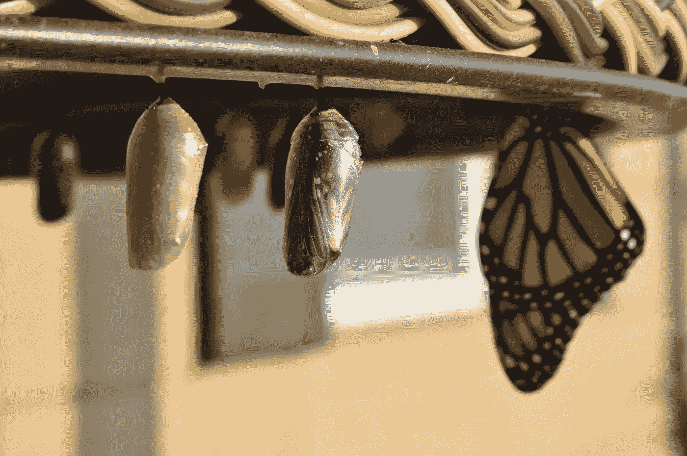
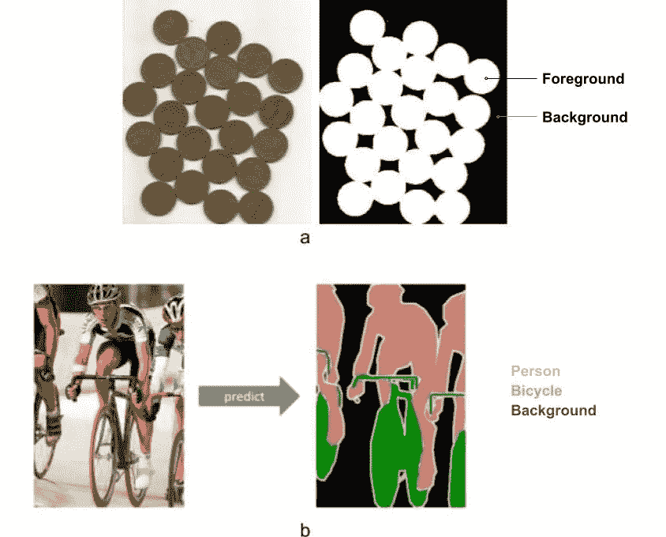
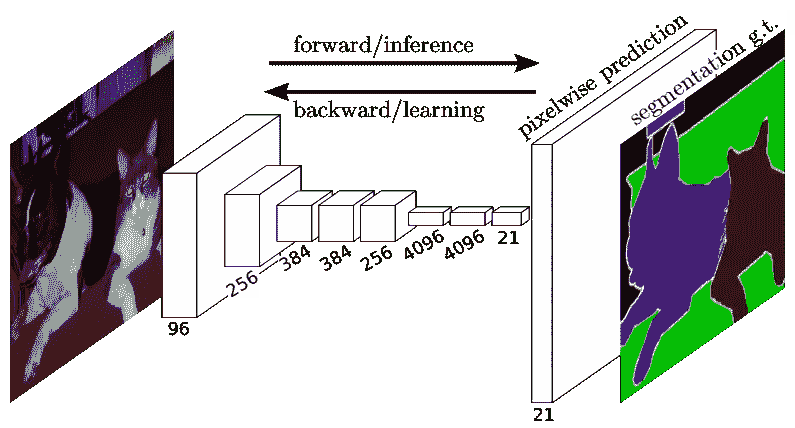
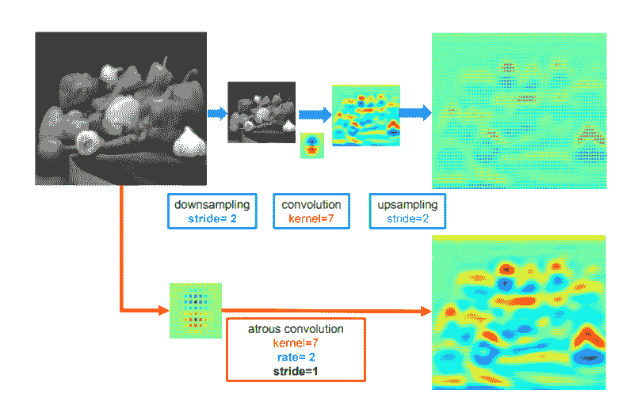
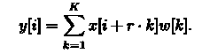
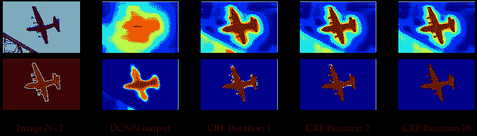
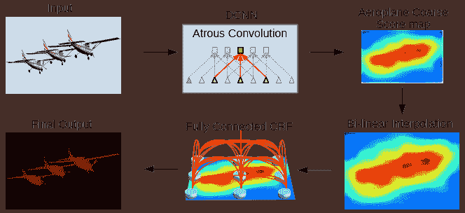
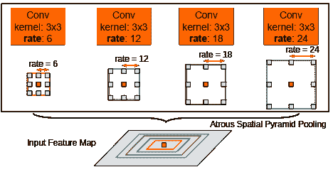
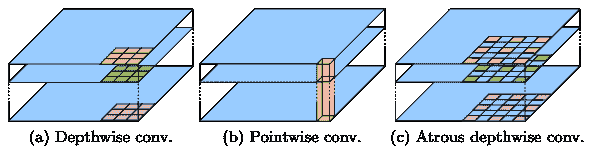
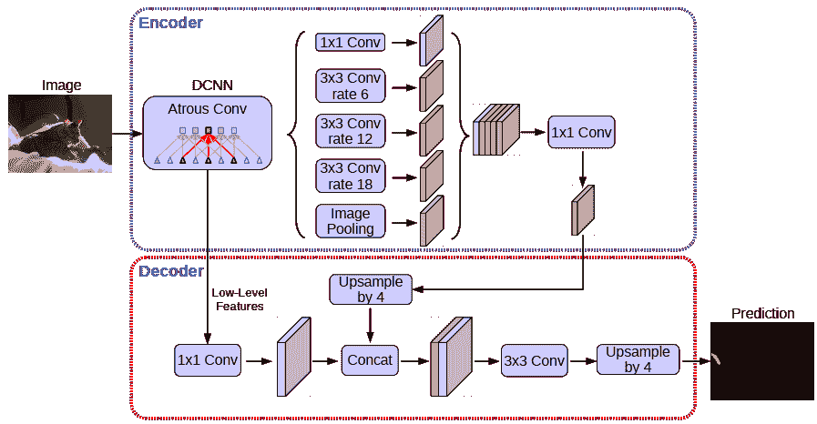

# 面向语义分割的 Deeplab 的发展

> 原文：<https://towardsdatascience.com/the-evolution-of-deeplab-for-semantic-segmentation-95082b025571?source=collection_archive---------1----------------------->

## 从经典的图像分割方法，通过基于深度学习的语义分割，到 Deeplab 及其变体。

在计算机视觉中，简单的图像分割是将数字图像分割成多个片段(像素组)的过程。图像分割是一个长期存在的计算机视觉问题。然而，语义分割是在像素级“理解”图像的情况下分割图像的技术。换句话说，语义分割是将每个像素分析和分类成多个类别(标签)。

Figure 1: a) Image segmentation using Thesholding b) Semantic Segmantation

语义分割有许多应用，包括自动驾驶、人机交互、计算摄影、图像搜索引擎和增强现实等。

# 语义分割简史

已经设计了相当多的算法来解决这个任务，例如分水岭算法、图像阈值化、K-均值聚类、图划分方法等。最简单的方法是阈值法。在该方法中，基于阈值将灰度图像转换成二值图像。尽管有许多传统的图像处理技术，但是深度学习方法已经成为游戏改变者。

为了正确理解现代深度学习架构如何处理语义分割，重要的是要知道它不是一个孤立的领域。相反，这是从粗到细推理过程中的一个自然步骤。

Figure: Coarse to fine inference

可以在分类时定位原点，分类包括对整个输入进行预测，即预测图像中的对象。细粒度推理的下一步是定位或检测，不仅提供类，还提供关于这些类的空间位置的附加信息。一个语义分割可以看作是一个*的密集预测任务。在密集预测中，目标是生成与输入图像大小相同的输出地图。现在，很明显，语义分割是实现细粒度推理的自然步骤。它的目标是进行密集预测，推断每个像素的标签。这样，每个像素都用其包围对象或区域的类别来标记。还可以做进一步的改进，比如**实例分割**(同一类的不同实例分别标注)。*

*一般的语义分割体系结构可以广义地认为是一个**编码器**网络，后面跟着一个**解码器**网络:*

*   ***编码器**通常是一个预训练的分类网络，如 VGG/雷斯网，后跟一个解码器网络。*
*   ***解码器**的任务是将编码器学习到的区别特征(较低分辨率)在语义上投影到像素空间(较高分辨率)上，以获得密集分类。*

*用于语义分割的非常早期的深度卷积神经网络(DCNNs)之一是全卷积网络(FCN)。FCN 网络管道是经典 CNN 的延伸。主要思想是使经典的 CNN 接受任意大小的图像作为输入。CNN 仅接受和产生特定大小输入的标签的限制来自于固定的全连接层。与它们相反，fcn 只有卷积层和池层，这使它们能够对任意大小的输入进行预测。*

**

*Figure: FCN Architecture [ref: [https://arxiv.org/abs/1411.4038](https://arxiv.org/abs/1411.4038)]*

*此特定 FCN 的一个问题是，通过几个交替的卷积层和汇集层进行传播，输出要素地图的分辨率会被向下采样。因此，FCN 的直接预测通常是低分辨率的，导致相对模糊的物体边界。已经提出了各种更先进的基于 FCN 的方法来解决这个问题，包括 [SegNet](https://arxiv.org/pdf/1511.00561.pdf) 、 [UNet](https://arxiv.org/abs/1505.04597) 、 [DeepLab](https://arxiv.org/pdf/1412.7062.pdf) 和扩张卷积。*

*在接下来的部分，我们将讨论语义分割的 Deeplab 及其发展。*

# *Deeplab 的演变*

*DeepLab 是由 Google 设计并开源的最先进的语义分割模型。密集预测是通过简单地对最后一个卷积层的输出进行上采样并计算逐像素损失来实现的。Deeplab 应用 **atrous 卷积**进行上采样。*

****阿特鲁卷积****

*在 DCCN，最大池化和跨连续图层的重复组合会显著降低生成的要素地图的空间分辨率。一种解决方案是使用反卷积图层对生成的地图进行上采样。但是，它需要额外的内存和时间。阿特鲁卷积为使用反卷积提供了一个简单而强大的替代方法。阿特鲁卷积允许在不增加参数数量或计算量的情况下有效地扩大滤光器的视野。*

*阿特鲁卷积是上采样滤波器卷积的简写。滤波器上采样相当于在非零滤波器抽头之间插入孔(法语中为“trous”)。*

**

*Figure: (Top) regular convolution followed by up-sampling, (Bottom) atrous convolution resulting denser feature map. [ref: [https://arxiv.org/abs/1606.00915](https://arxiv.org/abs/1606.00915)]*

*在数学上，对于具有长度 *K* 和步幅率 *r* 的滤波器*w【K】*的一维信号*x【I】*的 atrous 卷积*y【I】*被定义为:*

**

## *深度实验室(Deeplabv1)*

*Deeplabv1 在语义分割任务中的成功是由于对先前的最先进模型，特别是对 FCN 模型的一些改进。这些进步解决了以下两个挑战。*

****挑战 1:降低特征分辨率****

*由于 DCNN 中的多重池化和下采样(“步长”)，空间分辨率显著降低。它们从 DCNNs 的最后几个最大池层中移除了下采样算子，而是在后续卷积层中对滤波器(atrous)进行上采样，从而以更高的采样率计算特征图。*

****挑战 2:由于 DCNN 不变性*** 降低定位精度*

*以便通过采用全连通条件随机场(CRF)来捕捉精细细节。CRF 势结合了平滑项，使相似像素之间的标签一致性最大化，并且可以集成更精细的项来模拟对象类之间的上下文关系。下图说明了在 CRF 的几次迭代后分割图的改进。*

**

*Figure: [Top] Score map (input before softmax function), [Bottom] belief map (output map after mean field iterations) [ref: [https://arxiv.org/abs/1606.00915](https://arxiv.org/abs/1606.00915)]*

*Deeplabv1 模型将图像作为输入，并通过通常的 DCCN 层，然后是一个或两个 atrous 层，并产生一个粗略的得分图。然后，使用双线性插值将该图上采样到图像的原始大小。最后，为了改善分割结果，应用全连通条件随机场。*

**

*Figure: Deeplabv1 flowchart [ref: [https://arxiv.org/abs/1606.00915](https://arxiv.org/abs/1606.00915)]*

## *Deeplabv2*

*为了进一步提高 Deeplabv1 架构的性能，下一个挑战是多尺度的对象存在。*

****挑战:多尺度下物体的存在****

*为了以多种比例表示对象，处理这种情况的标准方式是向 DCNN 呈现同一图像的重新缩放版本，然后聚集特征或得分图。*

**解决方案*:使用**阿特鲁空间金字塔池(ASPP)** 。其思想是将具有不同采样率的多个 atrous 卷积应用于输入特征图，并融合在一起。由于同一类别的对象在图像中可能具有不同的比例，ASPP 有助于考虑不同的对象比例，这可以提高准确性。*

**

*Figure: Atrous Spatial Pyramid Pooling (ASPP). [ref: [https://arxiv.org/abs/1606.00915](https://arxiv.org/abs/1606.00915)]*

## *Deeplabv3*

*前一种网络能够通过以多种速率和多种有效视野(ASPP)用过滤器或汇集操作(atrous 卷积)探测输入特征来编码多尺度上下文信息。下一个挑战是通过逐渐恢复空间信息来捕捉更清晰的对象边界。*

***挑战:捕捉更清晰的物体边界***

*Deeplabv3 架构采用了一种新颖的可分离卷积编解码器来解决上述问题。编码器-解码器模型能够获得清晰的对象边界。通用编码器-解码器网络已经成功地应用于许多计算机视觉任务，包括对象检测、人体姿态估计以及语义分割。*

*典型地，编码器-解码器网络包含:*

*   *编码器模块，逐渐减少特征映射并捕获更高的语义信息。*
*   *逐渐恢复空间信息的解码器模块。*

*除了上述编码器-解码器网络，它还应用**深度方向可分离卷积**来提高计算效率。这是通过将标准卷积分解为深度卷积，然后是点卷积(即 1 × 1 卷积)来实现的。具体来说，深度方向卷积为每个输入通道独立地执行空间卷积，而点方向卷积用于组合深度方向卷积的输出。*

**

*Figure: 3×3 Depth-wise separable convolution for atrous convolution. [ref: [https://arxiv.org/abs/1802.02611](https://arxiv.org/abs/1802.02611)]*

## *Deeplabv3+*

*这扩展了 DeepLabv3，增加了一个简单而有效的解码器模块，以进一步细化分割结果，尤其是沿对象边界的分割结果。*

*编码器:与 Deeplabv3 相比，它使用[对齐异常](https://arxiv.org/abs/1703.06211)而不是 [ResNet-101](http://www.arxiv.org/abs/1512.03385) 作为其主要特征提取器(编码器)，但有重大修改。所有最大池操作都被深度方向可分离卷积所取代。*

*解码器:编码器基于 16 的**输出步幅**，即输入图像以 16 的因子进行下采样。因此，代替使用因子为 16 的双线性上采样，编码特征首先被上采样因子为 4，并且与来自具有相同空间维度的编码器模块的相应低级特征连接。在连接之前，在低级特征上应用 1×1 卷积，以减少通道的数量。在连接之后，应用一些 3×3 卷积，并且特征以因子 4 被上采样。这给出了与输入图像相同大小的输出。*

**

*Figure: Deeplabv3+ model. [ref: [https://arxiv.org/abs/1802.02611](https://arxiv.org/abs/1802.02611)]*

*希望你喜欢阅读！！！*

**封面照片由* [*苏珊娜·d·威廉姆斯*](https://unsplash.com/@scw1217?utm_source=unsplash&utm_medium=referral&utm_content=creditCopyText) *上* [*下*](https://unsplash.com/search/photos/evolution?utm_source=unsplash&utm_medium=referral&utm_content=creditCopyText)*