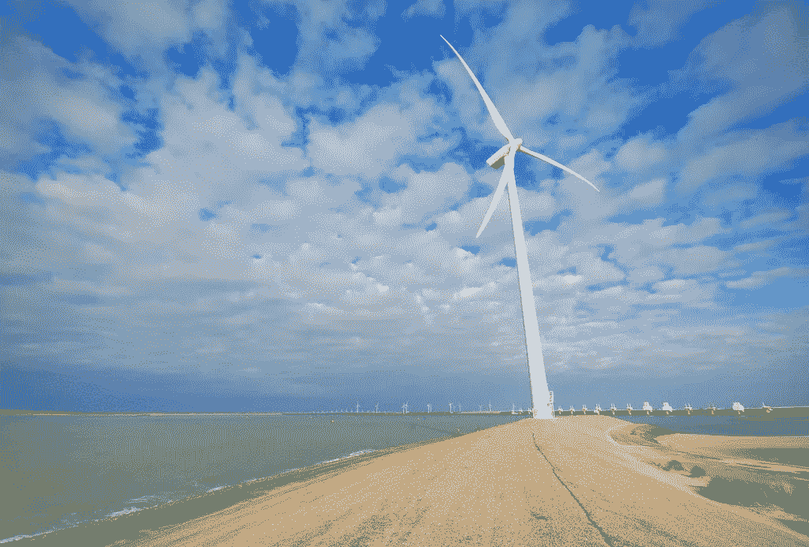

# 美国电网的演变

> 原文：<https://towardsdatascience.com/the-evolution-of-the-us-electric-grid-f18bce6473d5?source=collection_archive---------17----------------------->

Image by [Random_fotos](https://www.flickr.com/photos/mistyanddavid/) on [flickr](https://www.flickr.com/photos/mistyanddavid/2958163086)

在过去的 15 年里，美国电网经历了一些巨大的转变(大多是朝着好的方向)。可再生能源和天然气价格上涨，而煤炭和 GHG 排放量下降。

这里我们可以看到美国电网近年来是如何发展的:

Source: Energy Information Administration. 2018 figures are YTD to October.

为了便于访问，我们也将它放在表格中:

所以在这段时间里，除了天然气和非水电可再生能源，所有能源都在减少。这对环境来说是个好消息，因为[我们电力行业的排放强度](https://emissionsindex.org/)已经降至新低:

Source: Scott Institute for Energy Innovation, Carnegie Mellon University

这张图表显示了美国电力行业的排放强度。这意味着，与 2003 年相比，Q2 2018 年 1 兆瓦时的发电量将减少 35%以上的排放(这是可获得的最新数据)。

这些收益中的一部分被电力生产的增加所抵消，但是美国电力部门的总排放量仍然大大低于 2003 年:

Source: Scott Institute for Energy Innovation, Carnegie Mellon University

在此期间，电力行业的总排放量仍然减少了 26%。因此，[电力部门可能最终会将美国最大排放部门的头衔](https://www.scientificamerican.com/article/transportation-now-rivals-power-generation-as-co2-source/)拱手让给交通部门。

# 天然气和煤

自 2003 年以来，最深刻的转变发生在煤炭和天然气之间。虽然天然气价格一直在稳步上升，但煤炭价格却在持续下跌，而且不太可能很快停止。

Source: Energy Information Administration

由于可再生能源和天然气仍在快速扩张，煤炭的前景越来越黯淡。通过观察煤炭容量的变化，我们可以预测煤炭在电网中的未来:

Source: Energy Information Administration

[初步估计](http://ieefa.org/ieefa-report-u-s-likely-to-end-2018-with-record-decline-in-coal-fired-capacity/)显示，2018 年将延续煤炭大量报废的趋势——甚至可能打破纪录。随着煤炭产量的增长完全停止，煤炭产量的下降看起来已经到了尽头。

# 可再生能源

从可再生能源，我们可以进一步分解它，看看什么能源正在产生收益。

Source: Energy Information Administration

风能和太阳能的增长非常明显。2003 年，水力发电占可再生能源生产的 78%。到 2018 年，这一比例降至 39.7%。36%的可再生能源是风能，13.6%是太阳能。风能有可能在不久的将来战胜水能。

根据 [EIA](https://www.eia.gov/tools/faqs/faq.php?id=427&t=3) 的数据，2017 年风能发电量占总发电量的 6.3%，而太阳能发电量占总发电量的 1.3%。一旦全年数据可用，这两个数字在 2018 年可能会更高。虽然迄今为止天然气的增长超过了可再生能源的增长，但是 [EIA 预测](https://www.eia.gov/todayinenergy/detail.php?id=38053)从现在开始他们将会引领潮流。与此同时，煤炭在发电中所占的份额预计将在未来几年继续下降。

# 原因

过去 15 年的巨大转变是经济转型的结果。

Source: Energy Information Administration. Coal estimates ceased in 2015.

近年来，天然气、太阳能和风能的成本都大幅下降。