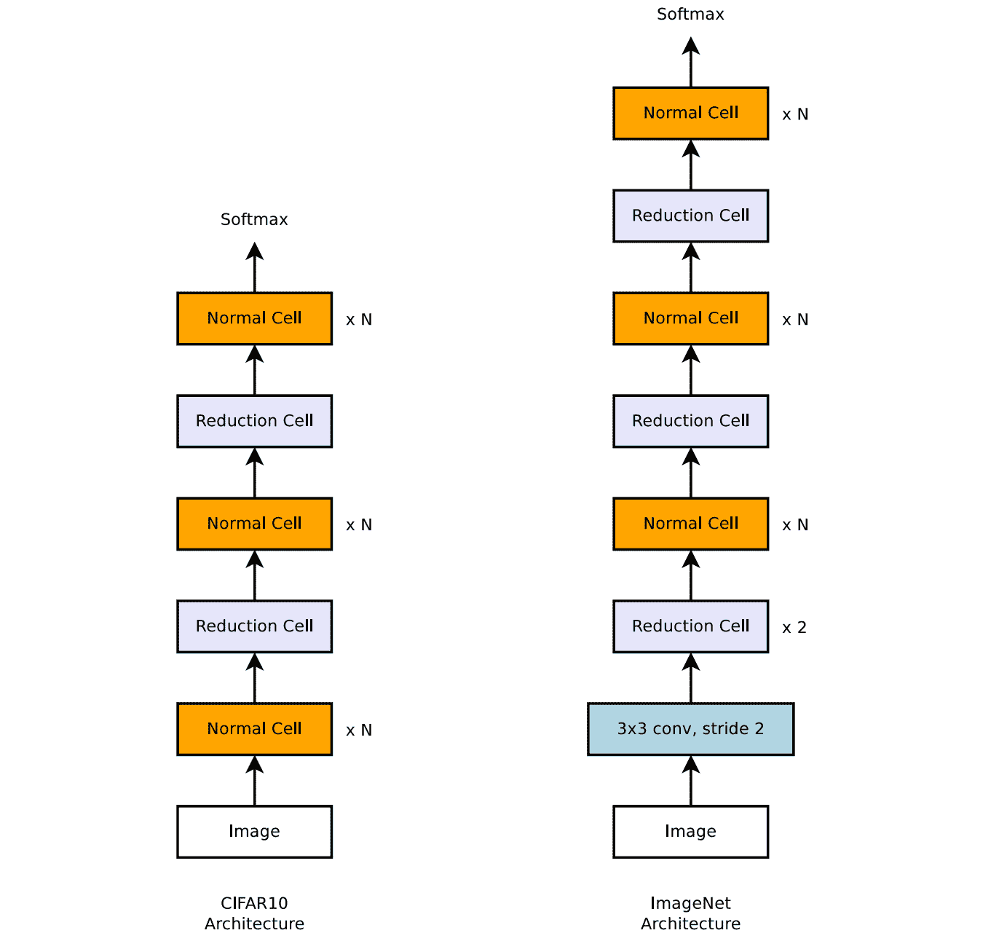
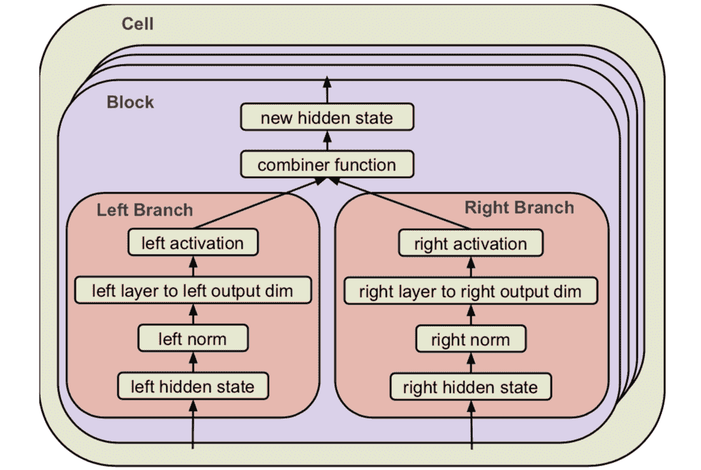
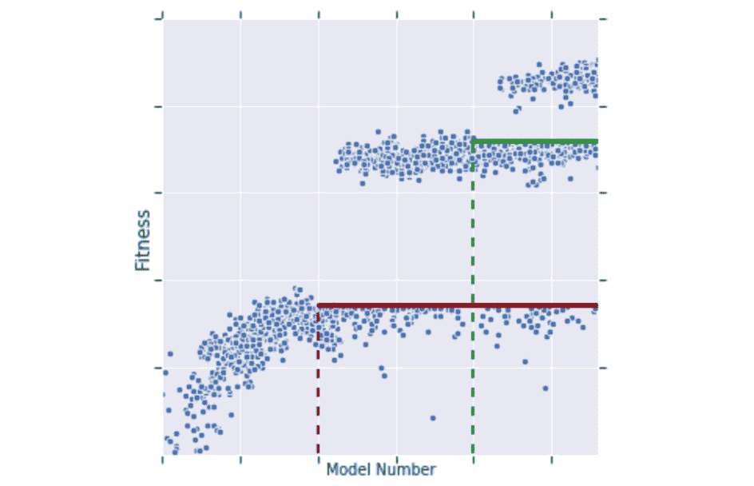
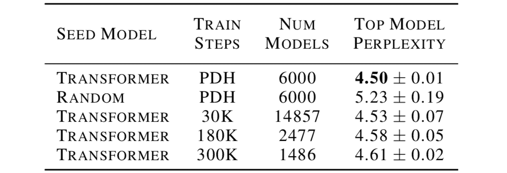
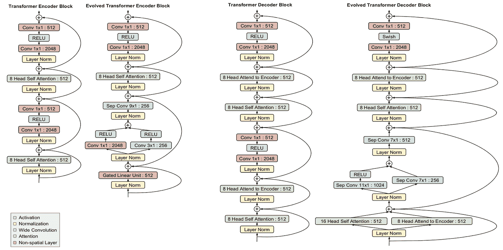
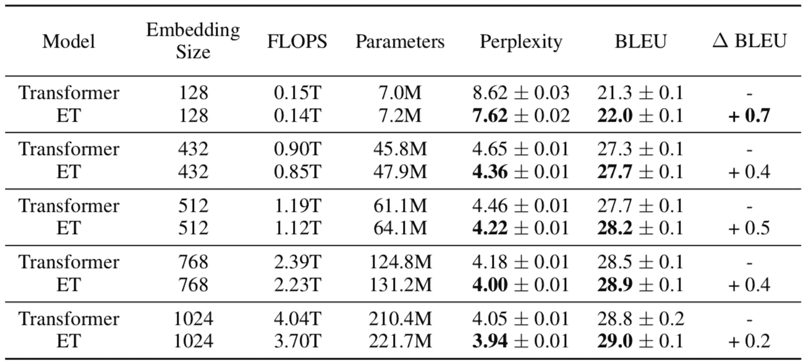
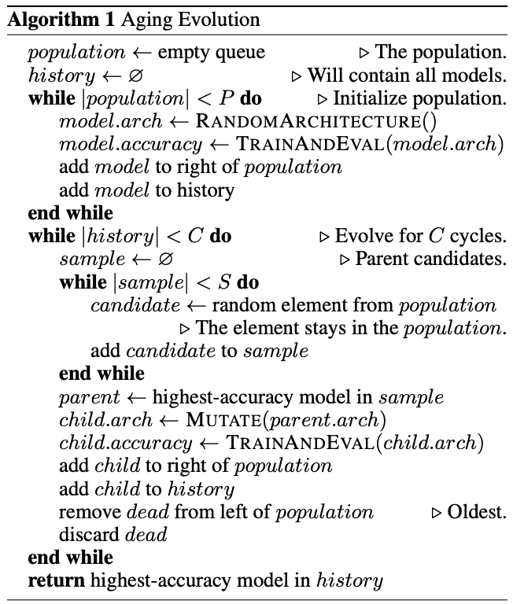

# 具有神经结构搜索的进化变压器-增强变压器

> 原文：<https://towardsdatascience.com/the-evolved-transformer-enhancing-transformer-with-neural-architecture-search-f0073a915aca?source=collection_archive---------13----------------------->

神经结构搜索(NAS)是通过算法搜索神经网络新设计的过程。虽然研究人员多年来开发了复杂的体系结构，但找到最有效的体系结构的能力是有限的，最近 NAS 已经达到了可以超越人类设计的模型的地步。

Google Brain 的一篇新[论文](https://arxiv.org/abs/1901.11117v2)展示了第一个改进 Transformer 的 NAS，Transformer 是许多自然语言处理任务的领先架构之一。本文采用一种基于进化的算法，用一种新颖的方法来加速搜索过程，对变压器结构进行变异，以发现一个更好的变压器——进化变压器(ET)。新的架构比原来的 Transformer 性能更好，尤其是在比较适合移动设备的小型模型时，并且需要的训练时间更少。论文中提出的概念，例如使用 NAS 来进化人类设计的模型，有可能帮助研究人员在许多其他领域改进他们的架构。

# **背景**

[变形金刚](https://arxiv.org/abs/1706.03762)，2017 年首次提出，引入了一种注意力机制，可以同时处理整个文本输入，以学习单词之间的上下文关系。转换器包括两个部分——编码器，用于读取文本输入并生成其横向表示(例如，每个单词的向量),以及解码器，用于根据该表示生成翻译后的文本。该设计已被证明是非常有效的，许多当今最先进的模型(如伯特，GPT-2)是基于变压器。对变形金刚的深入回顾可以在[这里](https://jalammar.github.io/illustrated-transformer/)找到。

虽然变压器的架构是由才华横溢的研究人员手工制作的，但另一种方法是使用搜索算法。他们的目标是在给定的搜索空间中找到最佳的架构，该空间定义了其中任何模型的约束，如层数、最大参数数等。一种已知的搜索算法是基于进化的算法[锦标赛选择](https://en.wikipedia.org/wiki/Tournament_selection)，其中最适合的架构存活并变异，而最弱的架构死亡。这种算法的优点是既简单又高效。本文依赖于 [Real 等人](https://arxiv.org/abs/1802.01548)中提出的版本(参见附录 A 中的伪代码):

1.  通过对搜索空间随机取样或通过使用已知模型作为种子来初始化第一模型池。
2.  这些模型针对给定的任务进行训练，并随机取样以创建子群体。
3.  最好的模型是通过随机改变其架构的一小部分而变异的，比如替换一层或者改变两层之间的连接。
4.  变异模型(子模型)被添加到池中，而子群体中最弱的模型被从池中移除。

在解决搜索问题时，定义搜索空间是一个额外的挑战。如果空间太宽且未定义，算法可能无法在合理的时间内收敛并找到更好的模型。另一方面，过于狭窄的空间降低了找到优于手工制作模型的创新模型的概率。NASNet 搜索架构通过定义“可堆叠单元”来应对这一挑战。单元可以包含来自预定义词汇表的对其输入的一组操作(例如卷积),并且通过多次堆叠相同的单元架构来构建模型。搜索算法的目标仅仅是找到单元的最佳架构。

An example of the NASNet search architecture for image classification task that contains two types of stackable cells (Normal and Reduction Cell). Source: [Zoph et al.](https://arxiv.org/abs/1707.07012)

# **进化变压器(ET)如何工作**

由于 Transformer 架构已经无数次地证明了自己，所以作者的目标是使用一种搜索算法将它发展成一个更好的模型。因此，模型框架和搜索空间被设计成以如下方式适合原始的变压器架构:

1.  该算法搜索两种类型的单元，一种用于具有六个副本(块)的编码器，另一种用于具有八个副本的解码器。
2.  每个块包括两个操作分支，如下图所示。例如，输入是前面层(块)的任意两个输出，一个层可以是标准卷积、注意力头(见[变压器](https://jalammar.github.io/illustrated-transformer/))等，激活可以是 ReLU 和 Leaky ReLU。一些元素也可以是一个身份操作或一个死胡同。
3.  每个单元格最多可以重复六次。

总的来说，搜索空间加起来约为 7.3 * 10115 个可选型号。空间的详细描述可以在[论文](https://arxiv.org/pdf/1901.11117v2.pdf)的附录中找到。

ET Stackable Cell format. Source: [ET](https://arxiv.org/abs/1901.11117v2)

## **渐进式动态跨栏(PDH)**

如果每个模型的训练和评估被延长，搜索整个空间可能花费太长时间。在图像分类领域，可以通过在代理任务上执行搜索来克服这个问题，例如在对 ImageNet 等较大数据集进行测试之前，先训练较小的数据集(例如 CIFAR-10)。然而，作者找不到翻译模型的等效解决方案，因此引入了锦标赛选择算法的升级版本。

不是在整个数据集上训练池中的每个模型，这一过程在单个 TPU 上需要大约 10 个小时，而是逐步进行训练，并且只针对池中的最佳模型。池中的模型根据给定数量的样本进行训练，并且根据原始锦标赛选择算法创建更多的模型。一旦池中有足够多的模型，就计算“适合度”阈值，并且只有具有更好结果(适合度)的模型继续下一步。这些模型将在另一批样本上进行训练，下一批模型将基于它们被创建和变异。因此，PDH 显著减少了花费在失败模型上的训练时间，并提高了搜索效率。不利的一面是“慢启动者”，即需要更多样本才能获得好结果的模型，可能会被遗漏。

An example of the tournament selection training process. The models above the fitness threshold are trained on more sample and therefore reach better fitness. The fitness threshold increases in steps as new models are created. Source: [ET](https://arxiv.org/abs/1901.11117v2)

为了“帮助”搜索获得高质量的结果，作者用 Transformer 模型而不是完全随机的模型来初始化搜索。由于计算资源的限制，这一步是必要的。下表比较了不同搜索技术的最佳模型(使用[困惑度](http://www1.icsi.berkeley.edu/Speech/docs/HTKBook3.2/node188_mn.html)度量，越低越好)的性能——Transformer 与随机初始化，PDH 与常规锦标赛选择(每个模型有给定数量的训练步骤)。

Comparison of different search techniques. Source: [ET](https://arxiv.org/abs/1901.11117v2)

作者保持每种技术的总训练时间固定，因此模型的数量不同:每个模型的训练步骤越多->可以搜索的模型总数越少，反之亦然。PDH 技术平均达到最好的结果，同时更稳定(低方差)。当减少训练步数(30K)时，常规技术的平均表现几乎与 PDH 一样好。然而，它的方差更大，因为在搜索过程中更容易出错。

# **结果**

本文使用所描述的搜索空间和 PDH 来找到一个在已知数据集上表现良好的翻译模型，如[WMT](http://www.statmt.org/wmt18/translation-task.html)18。该搜索算法使用 270 个 TPU 在 15，000 个模型上运行，总共近 10 亿个步骤，而如果没有 PDH，所需的总步骤将为 36 亿个。找到的最佳模型被命名为进化变压器(ET ),与原始变压器相比取得了更好的结果(困惑度为 3.95 比 4.05)，并且需要更少的训练时间。其编码器和解码器模块架构如下图所示(与原始架构相比)。

Transformer and ET encoder and decoder architectures. Source: [ET](https://arxiv.org/abs/1901.11117v2)

虽然一些 ET 组件与原始组件相似，但其他组件则不太传统，如[深度方向可分离卷积](/a-basic-introduction-to-separable-convolutions-b99ec3102728)，与普通卷积相比，它的参数效率更高，但功能较弱。另一个有趣的例子是在解码器和编码器中使用并行分支(例如，相同输入的两个卷积和 RELU 层)。作者还在消融研究中发现，与变压器相比，卓越的性能不能归因于 ET 的任何单一突变。

ET 和 Transformer 都是重型模型，参数超过 2 亿。它们的大小可以通过改变输入嵌入(即一个字向量)的大小和相应的层的其余部分来减小。有趣的是，模型越小，ET 相对于 Transformer 的优势就越大。例如，对于只有 700 万参数的最小模型，ET 比 Transformer 强 1 个困惑点(7.62 vs 8.62)。

Comparison of Transformer and ET for different model sizes (according to embedding size). FLOPS represents the training duration of the model. Source: [ET](https://arxiv.org/abs/1901.11117v2)

# **实施细则**

如上所述，为了在合理的时间内训练数千个模型，搜索算法需要使用 200 多个谷歌的 TPU。最终 ET 模型本身的训练比原始 Transformer 更快，但在 WMT 的 14 En-De 数据集上使用单个 TPU 仍然需要几个小时。

代码是开源的，可以在 Tensorflow [这里](https://github.com/tensorflow/tensor2tensor/blob/master/tensor2tensor/models/evolved_transformer.py)获得。

**结论**

Evolved Transformer 展示了将手工制作与神经搜索算法相结合来创建架构的潜力，这种架构可以持续更好、更快地进行训练。由于计算资源仍然有限(即使对于谷歌来说)，研究人员仍然需要仔细设计搜索空间，并改进搜索算法，以胜过人类设计的模型。然而，随着时间的推移，这种趋势无疑会变得更强。

*要了解最新的深度学习研究，请订阅我在* [*LyrnAI*](https://www.lyrn.ai) 上的简讯

# **附录 A -锦标赛选择算法**

本文基于来自 [Real 等人](https://arxiv.org/abs/1802.01548)的锦标赛选择算法，除了从群体中丢弃最老模型的老化过程:

