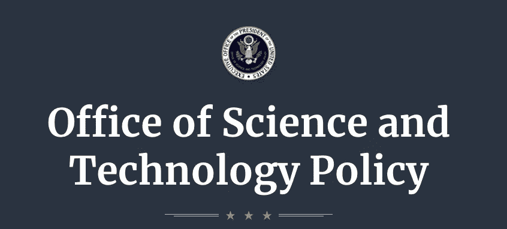

# 关于人工智能的行政命令

> 原文：<https://towardsdatascience.com/the-executive-order-on-artificial-intelligence-did-you-miss-it-3a32a934f333?source=collection_archive---------24----------------------->

Office of Science and Technology Policy Logo, US Government Work (public domain)

# 它发生了。你错过了吗？

2019 年 2 月 11 日，政府发布了一项关于保持美国在人工智能领域领导地位的[行政命令](https://www.whitehouse.gov/presidential-actions/executive-order-maintaining-american-leadership-artificial-intelligence/)。它的目标是确保美国为人工智能的发展提供最肥沃的土壤，保护其技术优势，并保护其人民的权利。在这篇文章中，我们来看看它所展示的愿景，以及我们可以期待看到的一些具体成果。

行政命令首先阐明了一个总体愿景，即人工智能的发展对经济发展和国家安全至关重要，必须以保护公民自由、隐私和美国价值观的方式促进这一发展，同时加强与外国伙伴和盟友的合作。

然后，它列出了五个重要目标:

*   通过研究投资推动人工智能突破
*   制定有效的监管和技术标准，以促进人工智能研究，同时保护公共安全
*   在人工智能相关技能方面培训美国工人
*   在人工智能监管中保护公民自由、隐私和美国价值观
*   保护美国在人工智能方面的技术优势，同时与友好国家和行业合作

最后，它提出了一个政策指导框架，以促进联邦政府政策中的这些目标。

美国联邦政府分配研究资金，执行消费者保护立法，制定技术标准，发放教育补助金，并监管与国防相关的技术转让。行政命令在很大程度上决定了这些领域的优先顺序，影响了哪些计划获得预算和关注。根据订单及其支持材料(如下所列)，以下是我们有理由期待看到的一些结果:

*   联邦研究基金将优先支持人工智能相关项目
*   学生补助金、政府支持的实习和培训项目以及军事教育项目将促进 STEM 项目和计算机科学招生
*   上述教育计划将侧重于提高妇女和女孩在计算机科学和人工智能领域的参与度(与其他 STEM 领域相比，这一比例特别低)
*   联邦部门内的开放数据倡议将优先考虑他们预计对人工智能数据挖掘最有吸引力的开放数据
*   国家科学技术研究所将开发和支持开放数据和人工智能安全测试的标准
*   联邦监管机构将在信用评估和自动驾驶汽车等领域为人工智能的使用制定有效而明确的监管指南，甚至可能针对系统的在线审查提供保护
*   执法官员和商业监管机构将针对黑客等知识产权盗窃，以及向可能损害美国利益的国家转移人工智能技术和实践

这项政策指令对那些在美国(以及一些国外)从事任何人工智能领域工作的人来说都是好消息。希望在数据科学训练营接受培训的入门级求职者、大学研究人员、数据科学家和企业家寻求开放数据源来构建产品，以及部署人工智能的企业(特别是在金融服务等监管领域)都将受益于联邦政府对人工智能的日益关注。消费者也将受益于监管机构对人工智能如何用于挖掘和过滤他们的数据的明确关注，包括加强隐私保护。

要了解更多信息，您可以查看与此订单相关的科学技术政策办公室的[文章](https://www.whitehouse.gov/articles/accelerating-americas-leadership-in-artificial-intelligence/)和[简报](https://www.whitehouse.gov/briefings-statements/president-donald-j-trump-is-accelerating-americas-leadership-in-artificial-intelligence/)，以及与 2018 年 5 月早些时候由白宫主办的关于美国工业人工智能的[峰会](https://www.whitehouse.gov/articles/white-house-hosts-summit-artificial-intelligence-american-industry/)相关的关于[美国人民人工智能的简报](https://www.whitehouse.gov/briefings-statements/artificial-intelligence-american-people/)。

*David Rostcheck 是一名美国技术领导者，拥有软件架构和数据科学背景。*