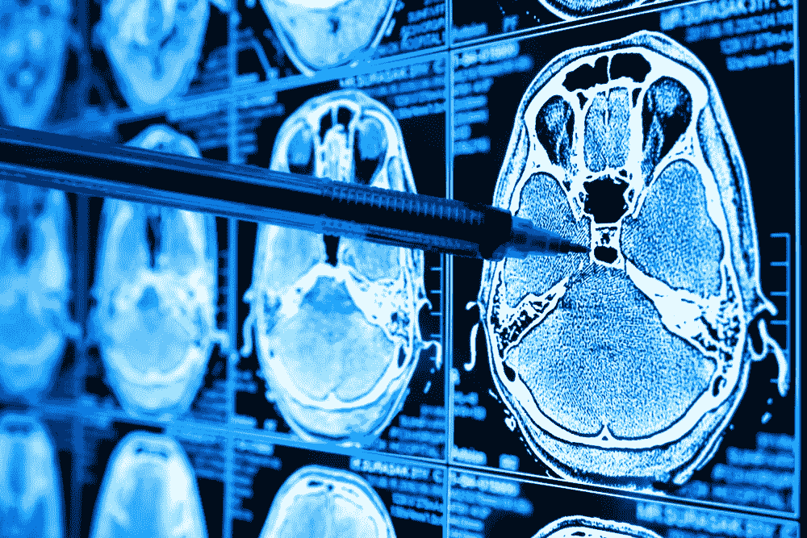
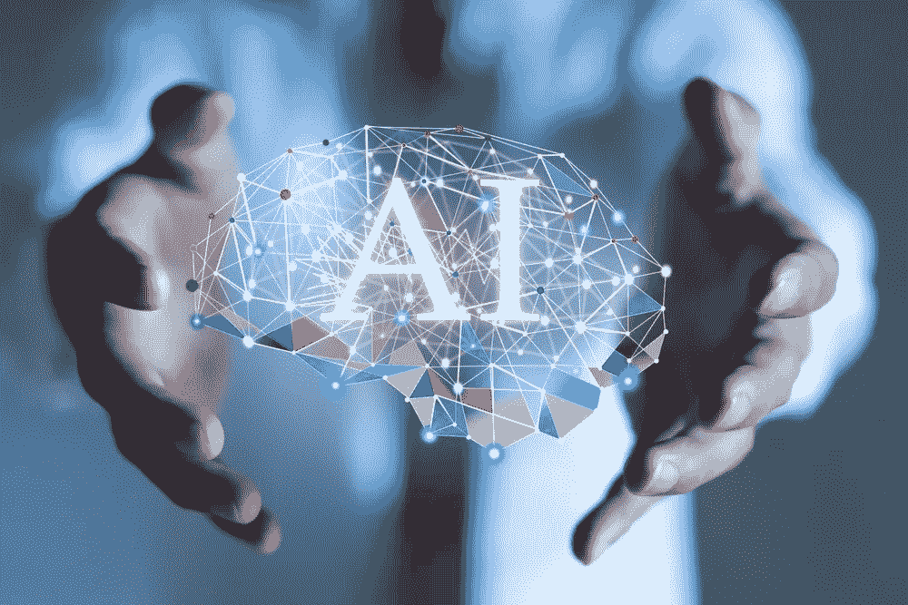
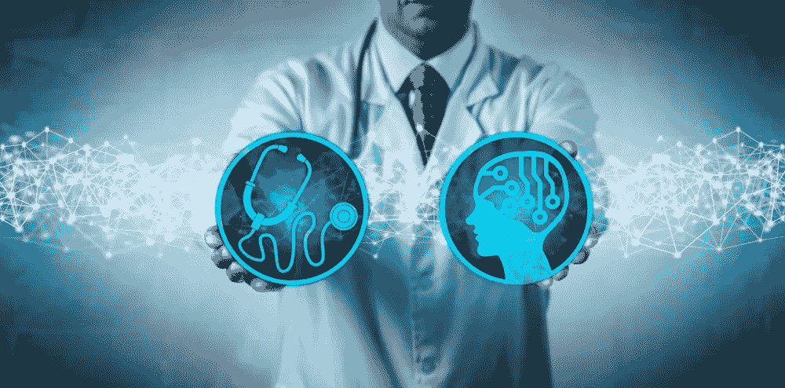

# 可解释性困境

> 原文：<https://towardsdatascience.com/the-explainability-dilemma-44b93a1ff9a8?source=collection_archive---------25----------------------->

## 医疗保健的人工智能可解释性可能是本世纪最重要的困境。这篇文章解释了为什么它将决定未来几代人的医疗结果。

如今的人工智能算法通过分析大数据来提供医疗建议，但除了检测到的模式，它们并不总能为自己的结论给出一个*理由*。尽管这些人工智能推荐的解决方案无法用人类的理解来解释，但许多这样的治疗可能会改善患者的生活质量，甚至挽救生命。本文从支持将技术进步应用于医疗保健的角度讨论了医学可解释性这一有争议的话题。

# 介绍

人工智能革命已经开始，这不是什么秘密。我不是唯一一个相信人工智能正在给我们的世界带来重大变化的人。一些最著名的科学技术领袖的名言指向同一个方向:

> *成功创造人工智能将是人类历史上最大的事件。不幸的是，这也可能是最后一次，除非我们学会如何规避风险。*
> 
> —斯蒂芬·霍金，理论物理学家

> *我们所有人必须做的是确保我们以造福人类的方式使用人工智能，而不是损害人类。–*
> 
> 苹果公司首席执行官蒂姆·库克

> 有人称之为人工智能，但事实是这项技术将会增强我们的能力。因此，我认为我们应该增强我们的智能，而不是人工智能。
> 
> IBM 首席执行官吉尼·罗梅蒂

> 人工智能是人类正在努力的最重要的事情之一。它比，我不知道，电或火更深刻。
> 
> ——谷歌首席执行官桑德尔·皮帅

正如地球上一些最聪明的头脑所说，这不仅仅是炒作。

人工智能是一场构造运动，由世界上最强大的公司支持。

即使我们没有注意到，我们每天都在使用它的应用程序。

# 医疗保健行业

看到*行业*旁边的*医疗*字样就有问题。似乎我们在谈论一项基本人权，旁边是一个表示可销售产品的词。这个*行业*严重依赖人为干预和主观意见。它使用先进的技术，如基因组解码，核磁共振成像，PET 扫描和放射疗法。，但它也强烈依赖于人类的解释，而人类会犯错误。

人工智能和机器学习应用程序可以为医疗保健服务带来极大的好处。世界上没有一个医生可以在几分之一秒内分析数百万个病例或交叉引用基因组分析的治疗反应。机器学习有这些能力，甚至更多，医学界都知道这一点。但是生态系统——从小镇医生到常春藤联盟的顶尖研究人员——对变化有很强的抵抗力。这种抵制并非基于现实。基于[职业偏见](https://blogs.scientificamerican.com/observations/why-doctors-reject-tools-that-make-their-jobs-easier/)和[恐惧](https://www.kevinmd.com/blog/2016/11/doctors-resist-change.html)。

## 破碎的美国医疗保健系统

对于我们这些出生在其他国家的人来说，美国的医疗保健系统似乎是疯狂的，在这些国家，最好的医疗保健是免费提供给每个人的。明确一点，我不是专家。但是一个著名的例子是美国前副总统乔·拜登负担不起他儿子的癌症治疗费用，巴拉克·奥巴马向他提供了贷款。那种情况让我觉得有些事情非常不对劲。当时，拜登甚至考虑卖掉自己的房子。他是美国的副总统。如果他负担不起医疗保险，那么像阿拉巴马州的中产阶级和收入更低的人又怎么负担得起呢？

简单疾病的疯狂价格，专利药物的过高价格，以及限制使用的昂贵保险系统，所有这些加在一起造成了一个困难的局面。为了应对这种情况，许多美国人求助于医疗保健旅游。他们可以在国外得到最先进的治疗，而花费只是在美国的一小部分。

## 变革阻力

我曾经听说，如果你能支付得起的话，美国拥有世界上最好的医疗体系。我相信它是最贵的，但我怀疑它是否是最好的。一个问题可能是医生。不要杀死信使，但是[医生在美国](https://www.politico.com/agenda/story/2017/10/25/doctors-salaries-pay-disparities-000557)比在大多数其他国家挣得更多，这是问题的一部分。当然，这个国家收入最高的职业之一会吸引那些受金钱利益驱使的人。在某些情况下，在决定从事医学职业时，改善他人的生活与其说是一种激励，不如说是一份高薪。

## 经济学和人工智能

自然，那些为了金钱利益而行医的人不会希望失去这些收入，即使医疗保健会因此而进步。举例来说，人工智能有潜力逐渐[增强或取代医生](https://www.ibm.com/watson-health/learn/artificial-intelligence-medicine)。如果你去参加一个医学大会，只有一小部分演示文稿展示了某种新的人工智能或机器学习技术应用。美国医学界对采用这些进步犹豫不决，即使它们可能极大地改善美国人的整体健康状况

## 另一个问题是:研究人员

这个问题与前面关于医生的部分有关。大多数医学研究都有严重缺陷。从数学和统计学的角度来看，有大量的问题。一个这样的问题是[相关性和因果关系](/correlation-is-not-causation-ae05d03c1f53)之间的混淆。一个例子是[儿童音乐课实验](https://news.usc.edu/102681/childrens-brains-develop-faster-with-music-training/)，其中发现了统计学上的简单相关性，研究人员得出结论，一件事引起了另一件事。如果医学研究人员需要得出结论以使他们的论文获得批准，从而获得持续的资助，他们可能会求助于那种草率的研究实践。

另一个巨大的话题是谁资助医学研究。在许多情况下，研究投资者是对盈利有强烈兴趣的企业，但我不会在这里深入探讨。

## 矛盾的结论

无论如何，一些最重要的[医学论文是不确定的或有缺陷的](https://www.ncbi.nlm.nih.gov/pmc/articles/PMC1182327/)，我们没有太多确定性:

*   胆固醇是好是坏？LDL 呢？
*   肉是好是坏？素食者身体更好吗？
*   乳制品对你的健康有害吗？
*   奶酪会致癌吗？
*   你应该遵循古饮食还是酮饮食？
*   你应该吃低脂肪食物吗？还是低碳水化合物？

如果你检查关于这些主题的医学研究，你可能会发现指向完全相反方向的相互矛盾的研究。当相关性被误认为因果关系时，这种情况就会发生。

## 观察证据

一个大问题是，如此多的医学研究是基于观察证据的，而且[医学界支持它作为一种有效的方法。一个例子是观察营养流行病学，它跟踪人们的营养习惯和他们的疾病。但是在那个医学领域有很多变数:利益冲突，不同的生活方式，缺乏数学和统计学基础。大多数观察研究都是主观的，从本质上来说，](https://systematicreviewsjournal.biomedcentral.com/articles/10.1186/2046-4053-3-35)[主观的结论是有偏见的](/correlation-is-not-causation-ae05d03c1f53)。你根据你个人的信仰体系来决定相信或不相信什么，但是你的决定并不是基于科学有效的证据。

## 一个可能的解决方案:身体是如何工作的

为了克服观察研究的局限性，我们可以通过研究导致不同事情发生的机制进行更深入的探索，比如这些例子:

*   肉是如何与细胞相互作用的。
*   脂肪在大脑中是如何燃烧的。
*   癌症是如何发展的。
*   动脉是如何退化的。

这种类型的研究比单纯的主观观察要复杂许多数量级。它意味着研究我们最小的生命单位之间的化学变化和相互作用的机制。我们准备好了吗？我们准备好迎接一个全新的人类化学模型了吗？可能还没有。

目前，塑造我们社会和经济体系的力量过于复杂，不允许现状发生剧烈变化。但希望我们不用等几个世纪就能体验到医疗保健的显著进步。尽管这种方法可能会导致重要的突破，并且不应该被低估，但目前它不是一个实用的解决方案。但还有其他可能的解决方案，涉及人工智能和机器学习。

# 深度学习和大数据

由于当今计算机技术的进步，我们可以用过去无法想象的方式处理数据点。我们可以分析人类基因组，找到相关性，推测因果关系，并检查数百万的医疗原因和结果。

通过深度学习或神经网络，我们可以找到每个人的最佳治疗方法，拯救生命，改善数百万人的生活质量。这种机器学习应用程序可以治疗世界偏远地区的人，并开出比最好的人类医生更好的治疗方法。用人工智能建议增强医生的能力，就像第二种意见一样，可能会成为医疗保健行业的游戏规则改变者。

## 现实生活中的应用

我最近参与了一项癌症研究，医生无法用影像学来区分癌细胞是恶性还是良性。化疗后进行侵入性手术，以确定患者是否对化疗有反应，这是一种标准治疗方法。基于对数千例癌症病例的数据分析，深度学习可以分析影像学检查，并确定特定患者是否会对化疗做出反应。这样，人工智能可以帮助病人避免不必要的化疗和手术，提高生活质量和预期寿命。

## 被禁止的治疗

尽管这种改善生活的医疗技术已经存在，但癌症患者却无法获得。那是因为 FDA 不会批准那些[无法解释的治疗。深度学习算法通常](https://currenthealth.com/response-to-fda-artificial-intelligence-proposals)[做出正确的决定](https://www.greenlight.guru/blog/ai-explainability-what-that-means-and-why-it-matters-in-med-device)，我们可以衡量这一点。人工智能被设计成像我们的大脑一样工作。但它们更像是我们的大脑。通过分析远远超出我们大脑处理能力的复杂数据，机器可以检测模式并预测行为。但是他们不能用我们可以理解的方式来解释他们的决定。

## 警告:我们对人类比对机器更能容忍错误

在我们陷入可解释性困境之前，让我们先谈谈人类所犯的错误。比起机器错误，我们更容易接受人为错误。自动驾驶汽车就是一个例子。根据该公司 2019 年第四季度的[报告，特斯拉自动驾驶汽车的无事故行驶距离是自动驾驶汽车的六倍。然而，每当自动驾驶发生事故时，即使是人类司机也无法避免的事故，人们也会迅速要求禁止自动驾驶汽车。在](https://www.thedrive.com/news/27356/frequency-of-tesla-autopilot-crashes-up-human-error-down-in-q1-2019)[最近的一个案例](https://fortune.com/2017/01/06/taxi-drivers-uber-self-driving-car-bans-new-york/)中，一名游说者代表出租车和豪华轿车司机，这些司机将从他们的缺席中获得经济利益。

## 一个比较的例子:交通死亡

大约[全世界每年有 150 万人死于交通事故](https://www.who.int/violence_injury_prevention/road_safety_status/2018/en/)。这个统计数字相当于每天有 23 架波音 737-800 坠毁，无人生还。没有人会容忍来自飞机的这种程度的危险，计算机系统可能会承担责任。但是，如果自动驾驶汽车每年的伤亡人数只有这个数字的 1%或大约 15000 人死亡，一些人就会对这项技术着迷。

# 大难题:可解释性

如果我们可以做出关于如何治疗疾病的最优决策，但我们无法解释我们是如何做出这些决策的，那该怎么办？如果我们的决定是基于对数百万个案例的分析，但我们不能说出为什么或哪些因素是最相关的，那该怎么办？这个问题就是可解释性困境。

## 可解释的人工智能

一个解决方案可能是[可解释的人工智能(XAI)](https://www.sginnovate.com/events/healthcare-ai-explainable-ai-service-community-healthcare) ，它指的是人工智能技术应用中的方法和技术，其结果可以被人类专家理解。这与机器学习中的*黑盒*的概念形成了对比，在黑盒中，即使是设计师也无法解释为什么他们的人工智能会做出特定的决定。在未来，XAI 可能是许多机器学习推荐的医疗保健疗法获得批准的途径。但不幸的是，与不可解释的人工智能相比，XAI 的决策能力非常有限。

## 让它私人化

在你生命中的某个时刻，你可能会接受某种形式的治疗。现在考虑这些问题:

*   如果你得了癌症，你想要最佳的治疗吗，即使你不明白为什么或如何一个人工智能系统提出建议？
*   或者你更喜欢次优的治疗方法，因为你能理解你的医生为什么推荐这种治疗方法？

## 可解释性和 FDA

在未来，如果 FDA 继续拒绝无法解释的治疗，很可能会有后果。在监管较少的国家，人们可能会看到其他人从人工智能推荐的治疗中受益。如果同样的治疗在美国继续得不到，这一证据可能会刺激医疗保健旅游业呈指数级增长。

## 可解释方法的限制

我们能实现一个既最优又可解释的研究过程吗？鉴于机器学习的本质，这似乎不太可能。它是由人类设计来模仿人脑功能的，但机器学习超出了人脑可以做或理解的任何事情。随着人工智能技术的进步，它变得越来越复杂，但我们的大脑无法以与我们创造的技术相同的方式进化。

## 变革阻力

从保持现状中获得经济利益的医生和投资者可能会抵制改变目前适用于人工智能的 FDA 法规。变化也可能让病人和社会团体感到害怕，他们期待医学界的专家指导。尽管我们害怕，但变化总会发生。

# 可能的未来

医学的未来会是缺乏可解释性吗？在某些方面，这是一个可怕的想法，但它可能是真的。XAI 的进步有助于弥合理解的鸿沟，但这需要投资和时间。

在某些时候，我们会让结果自己说话吗？

如果是这样的话，我们需要建立一个全新的道德框架，并为巨大的变化做好准备。

# 不可阻挡的科学

纵观人类历史，[人们一直抵制挑战他们信仰体系的新科学思想。但是尽管有阻力，科学知识和技术仍在继续发展。我们继续从中获益。](https://www.wired.com/2012/06/famous-persecuted-scientists/)

**通过人工智能推进医疗技术也将势不可挡**。

希望医生和医疗保健行业不会成为一个比解决方案更大的问题。