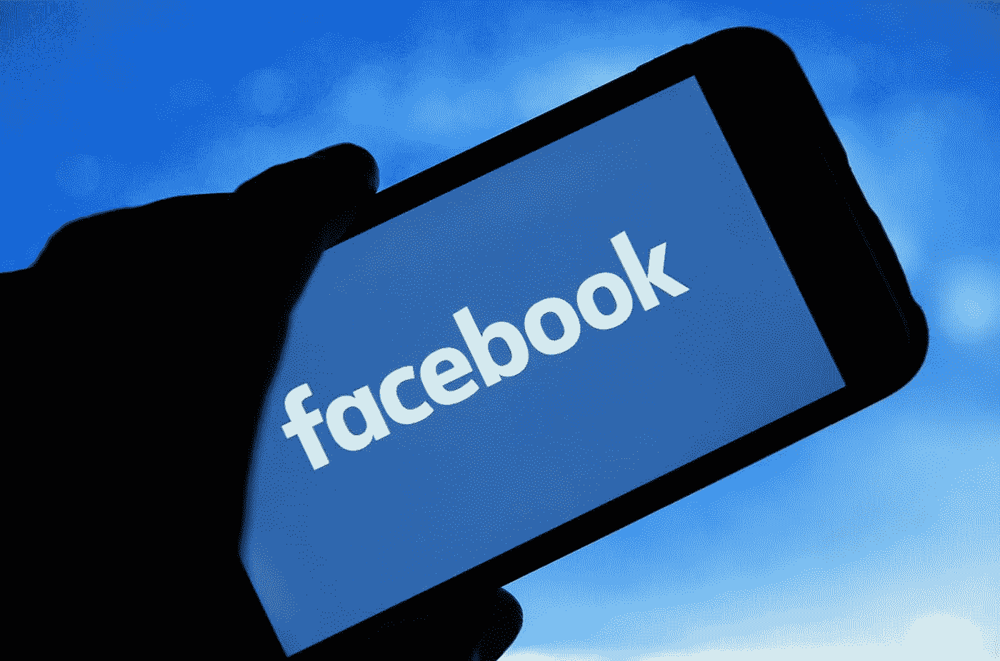
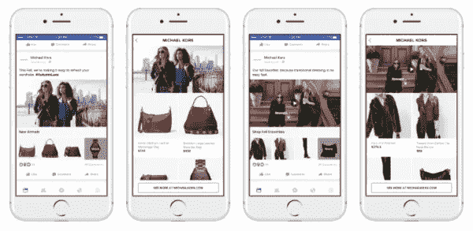

# 脸书数据科学家访谈

> 原文：<https://towardsdatascience.com/the-facebook-data-scientist-interview-38556739e872?source=collection_archive---------1----------------------->

脸书数据科学家的职位是科技界最令人垂涎的职位之一。它需要数据分析、产品直觉、SQL 编码的多种技能，以及与业务和关键利益相关者的大量沟通。通常专注于业务方面，而不是工程，脸书数据科学的角色通常更像是许多其他公司的产品分析师和分析工作。

> 下面是来自脸书的 [**数据科学面试题及例题解答**](https://www.interviewquery.com/blog-facebook-data-science-interview-questions-and-solutions/)**【s】**

**一般职责:**

*   使用量化工具发现机会，设定团队目标，并与跨职能合作伙伴一起指导产品路线图
*   探索、分析和聚合大型数据集，以提供可操作的信息，并创建直观的可视化效果，将这些结果传达给广大受众
*   设计信息丰富的实验，考虑统计显著性、偏倚来源、目标人群和阳性结果的可能性
*   在日志记录、产品健康监控和实验设计/分析方面与工程师合作

# 面试

脸书数据科学家的面试过程相对简单。它始于招聘人员通过电子邮件、Linkedin 或在网站上申请后联系你。招聘人员将安排 30 分钟的电话面试，与你谈论脸书，以了解你对公司的兴趣、你希望在哪个部门工作，以及**你的期望是否与脸书对数据科学职位的愿景**一致。

如果你的技能更适合这些角色，他们可能会把你转到另一个机器学习工程或增长型市场分析师的招聘人员那里，这是很常见的。许多候选人会意识到数据科学的角色比他们想要的更面向业务。候选人还可以参加脸书多个职位的面试，如[数据分析师](https://www.interviewquery.com/blog-facebook-data-analyst-interview-questions/)和[产品分析师](https://www.interviewquery.com/blog-the-product-analyst-interview/)职位。

一般来说，脸书的招聘人员在候选人的简历中寻找至少有几年经验的有经验的数据科学家。如果你发现自己没有被选中参加现场面试，请点击[面试查询](https://www.interviewquery.com/)查看我们的简历，帮助你解决这个问题。

[Image from Facebook Data Scientist Skills chart on Interview Query](https://www.interviewquery.com/interview-experiences/facebook/data-scientist)

# 技术屏幕

最初的技术屏幕由两部分组成(总共 30-45 分钟)。

*   产品感觉和分析(10-20 分钟)
*   技术和数据处理(10-20 分钟)

【2020 年 8 月更新。在新冠肺炎期间，该技术部分已经从产品感觉面试和技术/数据处理转换为产品感觉面试和应用数据面试！一定要和招聘人员核实一下，看看你的脸书数据科学技术屏幕上有什么。

> [阅读更多关于如何处理应用数据和建模问题的信息](https://www.interviewquery.com/blog-machine-learning-interview-questions/)

## 产品感觉和分析

技术屏幕上是脸书团队的一名数据科学家通过视频聊天。对于产品感和分析性问题，面试官将评估你如何解决商业问题，以及你在解决这些问题时的创造力和表达能力。这不是得出完美或正确的答案，而是**你如何处理这个问题**。

作为一名数据科学家，作为一名负责改进或开发产品的人，花时间**接触脸书的产品是很有帮助的。“脸书产品”可以定义为广告、手机、时间线、新闻提要、消息。此外，还有 Instagram 和 Oculus。**

Use the product to help understand

设身处地为构建产品或功能的产品团队着想，问这样的问题:

*   你认为他们为什么会对它的运作方式做出某些决定？
*   可以做些什么来改进产品？
*   在解决有关健康、增长或产品参与度的问题时，您希望考虑哪种指标？
*   你如何衡量产品不同部分的成功？
*   在尝试解决与我们产品相关的业务问题时，您会评估哪些指标？
*   你如何判断一个产品是否表现良好？
*   你会如何设置实验来评估任何新产品或改进？

为如何回答这个问题安排结构也很重要。确保把你的想法都集中在一个地方，组织你的答案，仔细解释你是如何调查每个问题的。

## 技术部分

在技术和数据处理部分，你会被问到两个问题。脸书不仅在寻找编码技能，还在寻找将高层次问题转化为执行策略的能力，以及解释结果如何相关以及哪些方面可能仍然缺乏的能力。

这些问题中的许多都可能给定一个数据集，并编写一个 SQL 查询或 Pandas 代码来分析数据集，以达到预期的结果。这一部分是使用一个名为 Coderpad 的代码编辑器完成的，它有一个控制台。然而，一般来说，面试不会让你实际运行任何真实数据的代码，所以一定要练习 SQL 语法。

**例题:**

给定两张表。一个是校区内每个学生的出勤日志，另一个是校区内每个学生的人口统计汇总表。

*出勤 _ 事件*:日期|学号|出勤

*所有学生*:学生 id |学校 id |年级|出生日期|家乡

使用这些数据，您能否回答如下问题:

*   有百分之多少的学生在生日那天上学？
*   从昨天到今天，哪个年级的出席率下降幅度最大？

一定要写真实的代码。伪代码在面试的这一部分是不可接受的，因为他们希望看到真正的 SQL 或熊猫代码被写出来。强烈建议用 SQL 编写，因为这是脸书所有分析师和数据科学家使用的语言。

> 点击 查看我们的[**2021 年 SQL 面试问题终极指南**](http://if%20you%27re%20interested%20in%20the%20ultimate%20guide%20to%20sql%20interview%20questions/)

# 现场面试结构

脸书的现场面试时间很短，为 2.5 小时，每次面试之间几乎没有休息时间。在四种不同类型的面试中，您将与四位不同的数据科学家进行 30 分钟的会面。

*   1 统计分析案例题
*   2 个产品通才问题
*   1 个技术分析问题
*   您还将在休息时间与数据科学家进行一对一的交流，了解他们在脸书的生活。这通常是一个 45 分钟的午餐面试，他们会让你休息一下，或者谈谈他们在脸书的工作。

在产品通才问题中，一个问题将更侧重于建模，而另一个问题将更侧重于产品直觉。

更符合产品直觉的是:*我们想在群组帖子中添加线程评论，你如何衡量该功能是否成功？*

> [了解解决本指南](https://www.interviewquery.com/blog-product-data-science-interview)中**产品直觉和分析面试问题**的步骤

## 一般提示:

*   不要被面试过程的形式吓到。每次面试都很短，所以每个面试官通常都急于在规定时间前完成面试的每个部分。
*   对招聘人员友好热情。在一天结束的时候，他们会在面试和薪酬委员会上为你辩护，以决定你将获得的水平和薪酬。如果你对招聘人员来说是个混蛋，他们真的没有动力帮你。
*   如果你在面试中搞砸了一部分，也不要担心。即使你面试的一部分搞砸了，而其他部分做得很好，你仍然可以通过并得到这份工作。也就是说…
*   你在面试中的表现是决定最终薪酬水平的主要因素之一。这意味着在你的所有面试中，能够以一种良好的格式和简洁的方式组织你的答案是很重要的。

# 感谢阅读！

*   阅读更多关于 facin *g* [***脸书数据科学面试问题***](https://www.interviewquery.com/blog-facebook-data-science-interview-questions-and-solutions/) *。*
*   **订阅 Youtube 上的** [**我的频道**](https://www.youtube.com/channel/UCcQx1UnmorvmSEZef4X7-6g/) 获取数据科学[模拟面试](https://www.youtube.com/watch?v=e2LJ-6NagpE)，指南，以及技巧和窍门。