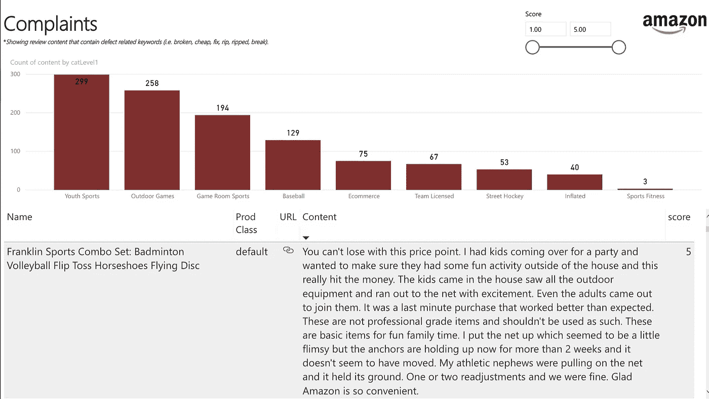

# 大数据的谬误:数据科学和“要做的工作”理论

> 原文：<https://towardsdatascience.com/the-fallacy-of-big-data-data-science-and-the-theory-of-jobs-to-be-done-da9f9c523279?source=collection_archive---------10----------------------->

虽然围绕“大数据”的狂热已经被人工智能和机器学习热潮所取代，但这两者的中心租户在很大程度上是相同的:

有了足够的数据，我们可以解决每一个问题。

曾经有一段时间，我相信这个想法是真的。这是我进入数据科学领域的原因——我曾经觉得数据可以告诉你*你需要知道的一切*。事实是，大数据有其局限性。

Companies are obsessed with Big Data, AI, and Machine Learning.

大数据应用特别薄弱的一个领域是创新。善意且才华横溢的商业领袖总是会陷入这种特定的“大数据”陷阱——他们试图通过广泛的相关性分析和客户细分，在分散的数据集中找到“宝石”。不幸的是，这是大多数组织出错的地方——相关性不会告诉你是否有任何特定的个人会真正购买你的产品。

## 了解客户的“待做工作”

哈佛商学院教授、著名商业思想家克莱顿·克里斯滕森(Clayton Christensen)的[颠覆性创新理论](http://claytonchristensen.com/key-concepts/)表明，当企业追求“持续创新”(过去对它们有效的产品和服务)时，它们会向颠覆敞开大门。通过不知不觉地(通常也是合乎逻辑地)做那些一直有效的事情，他们允许更小、更敏捷的公司创造产品，为全新的消费者群体打开市场。

创新理论有助于解释企业失败的原因，但它对解释如何成功制造消费者想要购买的新产品和服务(如何实际创新)没有太大帮助。出于这个原因，克里斯滕森博士创建了一个对破坏性创新的补充理论，称为“要做的工作”的[理论。](https://hbr.org/2016/09/know-your-customers-jobs-to-be-done)

待完成工作理论提供了一个非常有用的工具集来准确预测一个产品是否会成功。哈佛商业评论文章*了解你的客户“要做的工作”*解释了什么是“工作”:

> 我们一生中都有许多工作要做。有的很少(排队的时候打发时间)；有的很大(找个更有成就感的职业)。有些是不可预测的(在航空公司丢失了我的行李箱后，穿着去外地参加商务会议)；有些是定期的(为我的女儿打包一份健康的午餐带到学校)。当我们购买产品时，我们实际上是“雇佣”它来帮助我们完成工作。如果它做得很好，下次我们面对同样的工作时，我们会再次雇佣这个产品。如果它做得不好，我们就“解雇”它，然后寻找替代品。

克里斯滕森先生的理论帮助我们根据你雇佣他们来完成的工作，而不是他们的内在特征，将产品放入情境中。众所周知的一句话 [*“人们不想买四分之一英寸的钻头。他们想要一个四分之一英寸的洞！”*](https://hbr.org/2005/12/marketing-malpractice-the-cause-and-the-cure) 在这里完全适用。当顾客购买产品时，他们不仅仅是*购买*产品，他们是*雇佣*产品来解决他们生活中出现的工作。

客户作出“雇佣”或“解雇”决定的原因在于他们试图在自己独特的环境中取得非常具体的进展。

## 预测问题

鉴于创新对企业的重要性，令人惊讶的是它们在这方面的糟糕程度。[麦肯锡报告称，84%的全球高管表示创新是其增长战略的重要组成部分，但 94%的高管对其组织的创新表现不满意。](https://hbr.org/2016/09/know-your-customers-jobs-to-be-done)

为什么组织如此不善于创新？

创造产品和创新商业模式是一个*预测问题—* 但不是一个可以用算法解决的问题*。*企业需要高度准确地预测一种产品是否会畅销，才能茁壮成长。在大数据的世界里，预测是数据科学家的领域。在我们当前的商业环境中，人们通常认为，有了足够的数据，我们应该能够预测我们想要的任何结果——甚至是成功的创新。克里斯滕森博士解释了为什么这是一个谬论:

> 根本的问题是，公司创建的大部分客户数据都是为了显示相关性:*这个客户看起来像那个，*或 *68%的客户说他们更喜欢版本 A 而不是版本 b。*虽然在数字中发现模式令人兴奋，但这并不意味着一件事实际上引起了另一件事。尽管相关性不是因果关系并不奇怪，但我们怀疑大多数经理已经习惯于将决策建立在相关性的基础上。
> 
> 为什么这是被误导的？考虑一下这篇文章的合著者之一 Clayton Christensen 的案例。他已经 64 岁了。他身高六英尺八英寸。他的鞋码是 16。他和他的妻子已经把他们所有的孩子都送进了大学。他开一辆本田小型货车去上班。他有很多特点，但没有一个让他去买《纽约时报》。他购买这份报纸的原因要具体得多。他可能会买它，因为他需要在飞机上阅读，或者因为他是一个篮球迷，这是三月疯狂时间。收集关于他的人口统计学或心理学信息，并寻找与其他买家群体的相关性的营销人员不会抓住这些原因。

数据科学家和商业领袖有时会忘记，数据只是更复杂现实的一种表现。所有的数据都是人为的——有人在某个时间点选择了收集什么数据、如何收集、多长时间收集一次以及将数据放在哪里。定量数据，那种我们可以放入回归模型的数据，对我们很有吸引力。我们相信数字会告诉我们答案，并为我们指明正确的方向。

> 人们普遍认为，有一些理想的数据集合在一起，可以产生关于客户的完美见解。这只是弄清楚什么是正确的数据的问题。简而言之，如果我们只是以量化的形式收集正确的数据，我们就可以知道“真相”。

( [*比拼运气*](https://amzn.to/2EW5xlG) ，克里斯滕森等译，2016 年，第 189 页)

至少就目前而言，数据来源和我们收集数据的方法还不够复杂，不足以捕捉到表明创新是否可行的信号。“要做的工作”过于微妙和个人化，无法通过数据库的输入来解决。然而，这并不意味着数据科学家在清楚地理解和组织“要做的工作”方面毫无用处，相反，数据科学家可能比许多人更适合揭示客户在生活中寻求的进步。毕竟创新是一个预测问题。

## 揭露工作

数据科学家可以做些什么来帮助他们的公司和组织有效地创新？

**将有助于** **发现客户“工作”的数据付诸实施。**无论它有多“大”，公司存储在客户身上的数据都不是现实的清晰呈现。数据科学家不应该让数据变得更大或更复杂，而是应该让数据变得更小，也就是说，将您的客户数据转化为定性见解，从而帮助您的组织发现需要完成的工作。

例如，在 Franklin Sports，我们开发了一套仪表板和报告，帮助将亚马逊产品评论合成为产品团队的实用信息。使用 web 抓取工具 [Import.io](https://www.import.io/) ，我们将所有亚马逊列表的评论拉入我们的 Azure SQL 数据库，并运行 NLTK word tokenizers 将评论分割成一个和两个 token n-gram。然后，我们对过滤标准进行了分层，使用与“坏了”、“便宜了”和“被撕掉了”等缺陷相关的词来突出评论。该数据集与我们的内部产品分类相结合，使产品经理能够快速检查关于其产品类别的负面市场反馈。

有了这些数据，我们的产品经理就能够了解我们的产品正在解决(或没有解决)的工作的重要见解。我们发现，在这个数据集中有许多 5 星评价，客户表达了对产品的喜爱，但强调了没有满足他们需求的具体方面。

这个简单的应用程序为我们的产品经理节省了无数的时间，他们可以通过查看数据来了解他们的产品，从而专注于创造创新，解决我们客户的工作问题。

**衡量真正重要的东西。**您的数据产品是否围绕客户雇佣贵公司解决的工作进行组织？点击、印象、频率、花费的时间、成本、收入等。—这些都是我们大多数人很容易获得的指标，随后我们花费大量时间分析它们并利用它们(或其功能变体)来构建模型和数据产品。不幸的是，这些指标中的大多数对客户来说并不重要。如果你坐下来，真正尝试找出什么对你的客户是重要的，你会发现这可能很难衡量。不要放弃。真的要花时间在这上面——即使这意味着暂停统计和编程工作来专注于业务。如果你的技术工作与工作相一致，它会走得更远。

亚马逊掌握了这一理念。它的零售业务非常专注于三个目标领域:丰富的选择、低廉的价格和快速的交付——他们“分分秒秒”地衡量每一个目标例如，亚马逊雇佣了一个在网上爬行的购物机器人来确定产品价格。如果发现更低的价格，亚马逊的价格将自动降低，以击败竞争对手的价格。这一过程仅仅专注于解决客户雇佣亚马逊做的工作。( [*比拼运气*](https://amzn.to/2EW5xlG) ，克里斯滕森等译，2016 年，第 209 页)

从你正在进行的项目中退一步，评估你的活动是否与客户雇佣你的公司来解决的工作一致。他们意见一致吗？如果不是，放慢速度，重新调整一下。制定计划以获得所需的数据源，这样您就可以对真正重要的东西进行衡量并采取行动——即使这些数据本质上是定性的。为了“完成工作”，你可能会忍不住凑合着用现有的东西，但你最多只能获得增量收益。相反，通过积极专注于要做的工作来做出真正的改变。

**应用理论。**如果你不知道你的客户雇佣你的产品来解决什么样的“工作”,我上面概述的一切将会变得难以置信的困难。最重要的是——弄清楚这一点。如果对客户的工作没有清晰的了解，你会陷入“功能追逐”，或者更糟，你会在不知不觉中主动与客户作对。我在这篇文章中引用了详细解释“要做的工作”理论的文章和书籍——阅读并理解它们，然后在你的组织中应用它们:

[*了解客户的“待做工作”*](https://hbr.org/2016/09/know-your-customers-jobs-to-be-done)

[*营销弊端:成因与根治*](https://hbr.org/2005/12/marketing-malpractice-the-cause-and-the-cure)

[*与运气竞争:创新与客户选择的故事*](https://amzn.to/2O2fO3R)

## 解决问题

解决所有问题的数据“圣杯”并不存在——如果我们继续尝试并找到它，我们将浪费无数的时间和宝贵的时间，而这些时间本可以花在解决问题上。

不要在数据中寻找隐藏的宝石，实际上要关注你的客户。他们雇佣你的公司做什么？当你完全理解这一点时，你将成为一名更好的数据科学家和商业领袖。