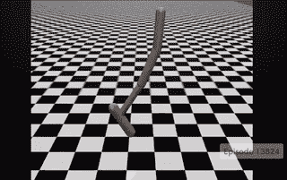
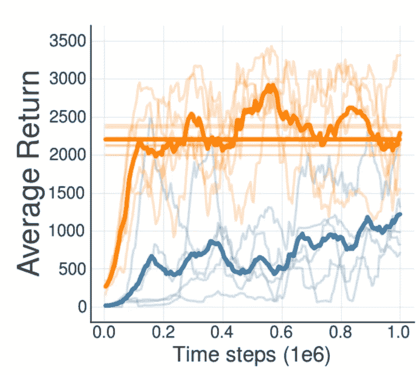
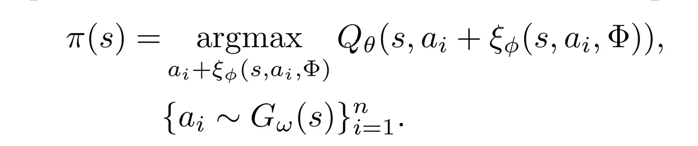
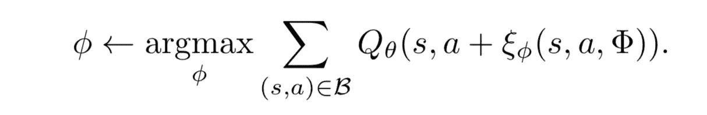
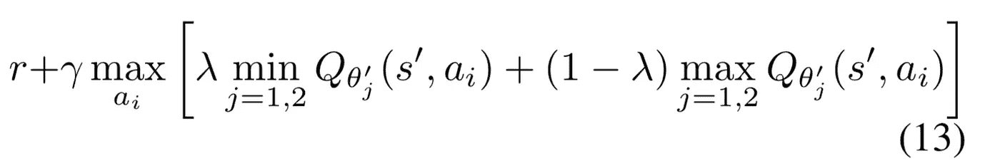

# 非策略强化学习算法的虚假承诺

> 原文：<https://towardsdatascience.com/the-false-promise-of-off-policy-reinforcement-learning-algorithms-c56db1b4c79a?source=collection_archive---------8----------------------->

## 偏离策略的强化学习算法能实现它们的承诺吗？

在过去的几年里，我们都见证了强化学习方法的快速发展。最值得注意的是，最大的注意力都放在了非策略方法上，原因很明显，与其他方法相比，它们的伸缩性非常好。非策略算法可以(原则上)在不与环境交互的情况下从数据中学习。这是一个很好的特性，这意味着我们可以通过任何我们认为合适的方式收集我们的数据，并完全离线地推断最优策略，换句话说，我们使用一个不同于我们正在优化的行为策略。不幸的是，正如我将在本文中描述的那样，这并不像大多数人认为的那样开箱即用。在我们开始讨论算法和数学之前，有一个小小的提醒:

> 要理解这篇文章，你应该了解强化学习的基本概念。

一个非政策算法的光辉例子是 DDPG(深度确定性政策梯度)——据说。为什么我说应该？DDPG 的行为政策与优化政策并不完全相关。任何熟悉 DDPG 及其变体的实现的人都认识到，探索是由于向策略选择的动作添加了某种噪声而导致的，因此我们不能称 DDPG 为纯粹的非策略算法，因为我们优化的策略实际上是用于获取数据(以进行探索)。

Q 学习或深度 Q 学习及其所有变体呢，它们是真正的非策略算法吗？不，他们不是。在 Q-learning 中，我们做一些叫做ε-贪婪探索的事情。这基本上意味着我们选择随机行动的概率很小，而不是行动的当前最优估计。所以基本上行为策略和我们优化的策略没有太大的不同。

事实证明，这些算法不是纯粹的非策略算法，这是这些算法持续工作的唯一原因。这正是[1]中显示的内容。有趣的是，这篇论文的标题是“无探索的非策略深度强化学习”这可能有点误导，因为探索肯定是强化学习中需要的东西，但我们通常不希望使用我们正在优化的策略来探索非策略方法(这是应该首先使它们成为非策略的)。

[1]的作者进行的实验之一是，他们根据从另一个 DDPG 策略收集的经验，训练一个真正脱离策略的 DDPG 策略。这意味着他们采用了两种完全不同的初始策略，一种在进行数据采集时进行迭代训练，另一种根本不用于数据采集，而是根据另一种策略采集的数据进行训练。这是在 OpenAI Gym 的 hopper 任务上评估的，它甚至没有那么难:

如果你看一看得到的平均回报图，它基本上是一集内走过的距离，结果是相当令人震惊的(如果你不知道幕后发生了什么):

[1]

可以看到，用于收集数据的实际策略(橙色线)已经提高到高回报区域，而刚刚从缓冲区更新的其他策略(蓝色线)未能实现高平均回报。对此我们应该怎么看？我们完了吗？机器人会继续是可怜的无脑生物吗？

这其实并不难理解。这种情况完全可以用传统的统计学习理论来解释。强化学习的问题在于，数据生成分布，即我们通过交互获得的来自环境的转变，也取决于我们用于交互的策略(逻辑上)。这意味着我们收集的经验或数据集中的转换分布不一定反映我们在真正偏离策略的设置中优化的策略所导致的分布。

换句话说，我们的训练集并不像我们将要遇到的实际数据那样分布。这通常会给机器学习算法带来相当大的问题。尽管如此，人们还是想出了“聪明”的办法来缓解这些问题，比如重要性抽样，它本质上是根据样本的可能性重新加权。显然,[1]的作者认为，在用于训练的批次不包含任何高可能性转换的情况下，这不足以缓解问题。

Photo by [Tim Gouw](https://unsplash.com/@punttim?utm_source=medium&utm_medium=referral) on [Unsplash](https://unsplash.com?utm_source=medium&utm_medium=referral)

为了解决数据生成分布相对于训练分布的问题，文献[1]的作者推导了批量约束 Q 学习算法(BCQ)。该算法的思想非常简单，它直接解决了行为策略的数据生成分布和当前策略诱导分布之间的差异，尽管它们的实现有点复杂。其思想是学习动作的条件生成分布，从而仅生成在经验中可能已经出现的状态-动作对，用于在 TD-误差更新中计算 TD-目标。对于那些忘记了 TD-error 更新中的引导过程是如何工作的人来说，快速回顾一下，这是 TD-error:

[1]

因此，基本上我们计算当前奖励+我们的贴现下一步估计值和当前步骤估计值之间的误差。这就是为什么这个过程被称为 bootstrapping，因为我们正在 bootstrapping 我们自己的未来估计，以更新我们的当前估计。现在注意公式中的圆周率。这就是神奇的地方，我们正在优化的策略可能会产生与数据生成分布无关的行为，而数据生成分布是以我们的行为策略为条件的。注意，范数中的 r+γ* Q 项被称为 TD 目标，目标估计的范数被称为 TD 误差。

不是直接使用策略来计算 TD 误差更新，而是训练单独的扰动策略，该策略将小扰动应用于从生成模型中采样的动作。在这种情况下，生成模型根据遇到的数据进行训练。简而言之，这意味着 BCQ 产生的政策有以下形式:

[1]

通过最大化缓冲器中状态动作对的 Q 值来训练扰动策略。这也是很明显的，因为我们想采取最大化长期回报的行动。正如我前面说过的，这些扰动很小，因为我们不想产生与体验中遇到的动作相差太多的动作:

[1]

唉，另一个技巧可以用来阻止采取不确定结果的行动。首先可以用 2 个 Q 网络，并行训练。通过在计算 TD 目标值时取 2 的最小值，我们有效地阻止了优化中的高方差区域。作者选择了由参数λ参数化的最小值和最大值之间的凸组合。通过调整 lambda，我们可以权衡不确定性的惩罚力度。

[1]

通过这种方式，我们可以相对确保我们用来适应我们的策略的转移分布与训练数据中的分布相似。虽然这对于连续的状态-动作空间来说并不容易实现，因为我们需要用一个生成模型(比如变分自动编码器)来对数据生成分布进行建模，但是我发现这个事实直到现在才得到解决，这是非常令人惊讶的。训练数据需要类似地分布到实际数据的要求是统计学习理论基础的一部分。[1]是一个很好的例子，说明如何需要对强化学习算法进行更好的理论分析。书面裁决:

Photo by [Collin Armstrong](https://unsplash.com/@brazofuerte?utm_source=medium&utm_medium=referral) on [Unsplash](https://unsplash.com?utm_source=medium&utm_medium=referral)

## 参考

藤本、斯科特、大卫·梅格和多伊娜·普雷科普。“无探索的离策深度强化学习。” *arXiv 预印本 arXiv:1812.02900* (2018) 。