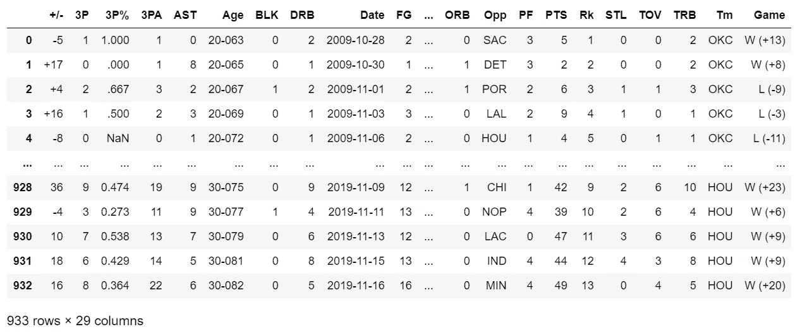
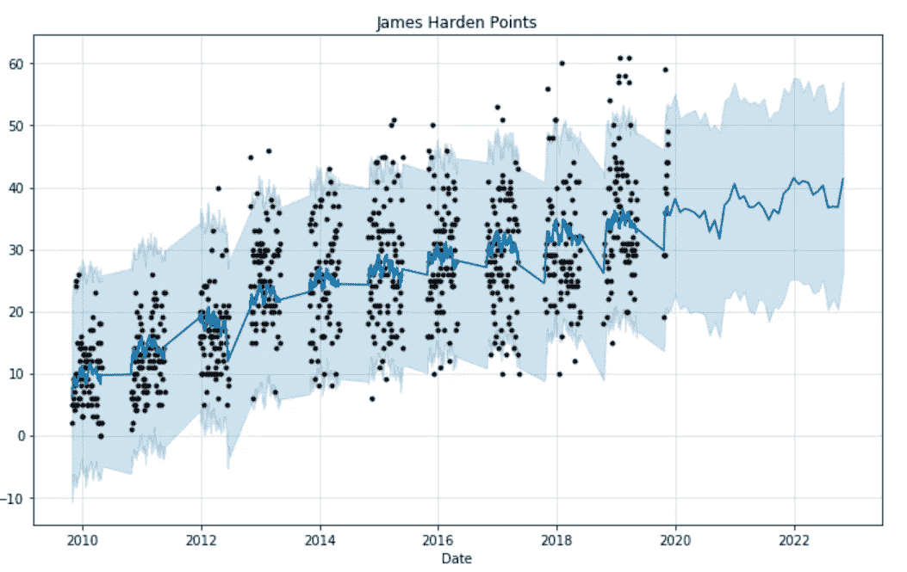
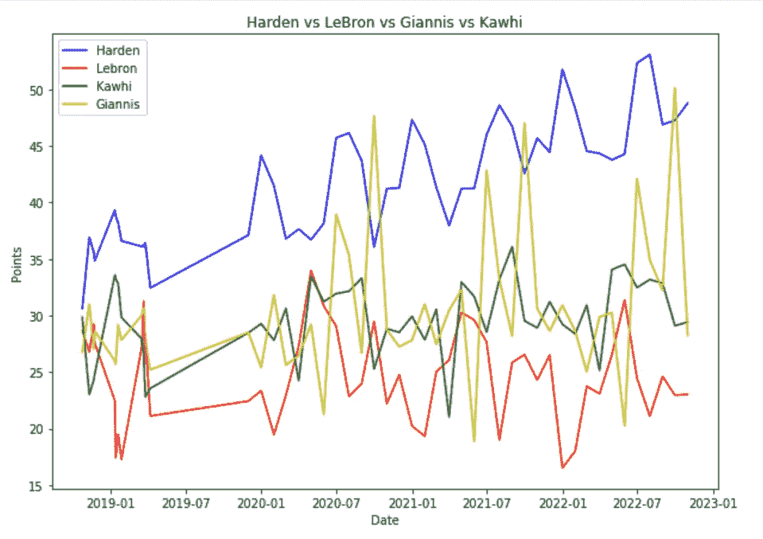

# 在 Python 上预测数据的最快最简单的方法

> 原文：<https://towardsdatascience.com/the-fastest-and-easiest-way-to-forecast-data-on-python-d7ff29f3add6?source=collection_archive---------4----------------------->


Photo by [Markus Spiske](https://unsplash.com/@markusspiske?utm_source=medium&utm_medium=referral) on [Unsplash](https://unsplash.com?utm_source=medium&utm_medium=referral)

## 超快速预测:NBA 全明星预测得分。

# ||我||简介

最近了解到**先知** ( **fbprophet)** 。如果你是一个处理时间序列数据的数据科学家，你会喜欢这个工具的。


Photo by [Alex Haney](https://unsplash.com/@alexhaney?utm_source=medium&utm_medium=referral) on [Unsplash](https://unsplash.com?utm_source=medium&utm_medium=referral)

对于那些不知道的人，Prophet 是由脸书开发的，通过其简单的 Sk-Learn 风格的 API 来帮助数据科学家自动预测时间序列数据。
Prophet 可以由数据科学家进行微调，以实现更高的特异性。这是一个附加的预测模型，并假设每年的季节性影响是相似的。因此，它不会考虑太多，但它的准确性可以通过多种反馈机制随着时间的推移而提高。它的网站上说，Prophet 最适合处理有规律的季节性成分和大量历史数据可供参考的时间序列数据。

由于它是开源的，任何人都可以下载和使用 Prophet。查看以下链接，了解有关 Prophet 的更多信息，以及为什么应该使用来预测时间序列数据:

[](https://facebook.github.io/prophet/) [## 先知

### Prophet 是一个用 R 和 Python 实现的预测程序。它速度很快，并提供完全自动化的预测…

facebook.github.io](https://facebook.github.io/prophet/) 

# || II ||安装

我不会在这里详细介绍，但由于我第一次下载 Prophet 时确实遇到了一些问题，我将解释我是如何正确安装它的:

*   首先，如果可行的话，您可以尝试一个简单的 pip 安装:
    `pip install fbprophet`
*   然而，fbprophet 有一个主要的依赖项可能会导致问题:`pystan`
*   理想情况下，你要在`fbprophet`:
    [https://pystan . readthedocs . io/en/latest/installation _ beginner . html](https://pystan.readthedocs.io/en/latest/installation_beginner.html)之前 pip 安装`pystan`
*   WINDOWS: `pystan`需要一个编译器。遵循此处的说明[。](https://pystan.readthedocs.io/en/latest/windows.html)
*   最简单的方法是在 anaconda 中安装 Prophet。使用`conda install gcc`设置 gcc。然后安装 Prophet 是通过 conda-forge:
    `conda install -c conda-forge fbprophet`

# || III ||导入和数据

在本教程中，我们将使用以下库。除 Prophet 之外的所有基本库。

```
import matplotlib.pyplot as plt
import pandas as pd
import numpy as np
import os
from fbprophet import Prophet
```


Photo by [Max Winkler](https://unsplash.com/@maxwinkler?utm_source=medium&utm_medium=referral) on [Unsplash](https://unsplash.com?utm_source=medium&utm_medium=referral)

关于数据集，我从 [**这里**](https://www.basketball-reference.com/players/h/hardeja01.html) 下载了詹姆斯·哈登近 10 年的比赛数据。基本上，我们有哈登几乎每一场比赛的数据(包括常规赛和季后赛)。)

要使用我正在使用的数据，请访问这个 [GitHub 页面](https://github.com/dataxienxe/NBAplayersdata)，下载 CSV 文件。

下面，我已经导入了每个包含詹姆斯·哈登数据的 CSV 文件。`19rs`'将是“2019-2020 年常规赛”，`18po`'将是“2018-2019 年季后赛”，让你知道每个文件是如何命名的。

```
harden19rs = pd.read_csv('Downloads/NBAML/harden19rs.csv')
harden19po = pd.read_csv('Downloads/NBAML/harden19po.csv')
harden18rs = pd.read_csv('Downloads/NBAML/harden18rs.csv')
harden18po = pd.read_csv('Downloads/NBAML/harden18po.csv')
harden17rs = pd.read_csv('Downloads/NBAML/harden17rs.csv')
harden17po = pd.read_csv('Downloads/NBAML/harden17po.csv')
harden16rs = pd.read_csv('Downloads/NBAML/harden16rs.csv')
harden16po = pd.read_csv('Downloads/NBAML/harden16po.csv')
harden15rs = pd.read_csv('Downloads/NBAML/harden15rs.csv')
harden15po = pd.read_csv('Downloads/NBAML/harden15po.csv')
harden14rs = pd.read_csv('Downloads/NBAML/harden14rs.csv')
harden14po = pd.read_csv('Downloads/NBAML/harden14po.csv')
harden13rs = pd.read_csv('Downloads/NBAML/harden13rs.csv')
harden13po = pd.read_csv('Downloads/NBAML/harden13po.csv')
harden12rs = pd.read_csv('Downloads/NBAML/harden12rs.csv')
harden12po = pd.read_csv('Downloads/NBAML/harden12po.csv')
harden11rs = pd.read_csv('Downloads/NBAML/harden11rs.csv')
harden11po = pd.read_csv('Downloads/NBAML/harden11po.csv')
harden10rs = pd.read_csv('Downloads/NBAML/harden10po.csv')
harden10po = pd.read_csv('Downloads/NBAML/harden10rs.csv')
harden09rs = pd.read_csv('Downloads/NBAML/harden09rs.csv')
```

# || IV ||清理数据

下一步非常重要，因为我们希望确保我们的数据包含所有必需的字段，否则我们将无法用它做很多事情。

让我们从追加每个 CSV 文件开始。我们可以按时间顺序排列，因为有一个日期部分。首先，我们以下列方式附加每个文件:

```
harden = harden19rs.append(harden19po, ignore_index=True, sort=True)
harden = harden.append(harden18rs, ignore_index=True, sort=True)
...
harden = harden.append(harden09rs, ignore_index=True, sort=True)
```

接下来，我将重命名一些列，以便我们可以了解它们是什么，并删除不需要的列:

```
harden = harden.rename(columns={'Unnamed: 7': 'Game', 'MP':'Mins'})
#harden['Game'] = pd.concat([harden['Unnamed: 7'].dropna(), harden['Game'].dropna()]).reindex_like(harden)
#harden = harden.drop(columns=['Unnamed: 7'])
harden = harden.drop(columns=['Unnamed: 5']) 
harden = harden.drop(columns=['▲'])
harden = harden.sort_values(by=['Date'])
harden = harden.reset_index(drop=True)
```

最终数据集看起来有点像这样:



中间有一些列我们看不到，但大部分都是游戏统计。詹姆斯·哈登每场比赛都有不同的统计数据。

# || V ||设置索引并删除空值

因为我们希望数据按时间顺序排列，所以我们将日期设置为索引值，并将数据类型更改为 pandas datetime 变量:

```
harden.set_index(‘Date’)
harden[‘Date’] = pd.to_datetime(harden[‘Date’])
```

接下来，我们希望删除数据中的任何值(即使我怀疑我们有任何值)。我们将使用 pandas dropna 函数，并删除一个所有值都为空的行。一旦我们这样做了，我们将重置索引，以确保它仍然是连贯的。

```
harden = harden.dropna(how='all')
harden = harden.reset_index(drop=True)
```


Photo by [Ramiro Pianarosa](https://unsplash.com/@rapiana?utm_source=medium&utm_medium=referral) on [Unsplash](https://unsplash.com?utm_source=medium&utm_medium=referral)

接下来，我们还有另一个重要的数据清理步骤。在一些比赛中，詹姆斯·哈登是不活跃的，被禁赛，不比赛或不穿衣服。某些列将这些值“挂起”，而不是应该在那里的数值。

这样，我们就可以去掉哈登没有上场/着装或者不活动/停赛的所有排(场)。然而，这可能会大大减少我的数据量。因此，我将使用每个相应列的*中值替换这些值。*

```
for i in harden:
    harden[i] = harden[i].replace('Inactive', 
    np.median(pd.to_numeric(harden[i], errors='coerce')))

for i in harden:
    harden[i] = harden[i].replace('Did Not Play', 
    np.median(pd.to_numeric(harden[i], errors='coerce')))

for i in harden:
    harden[i] = harden[i].replace('Did Not Dress', 
    np.median(pd.to_numeric(harden[i], errors='coerce')))

for i in harden:
    harden[i] = harden[i].replace('Player Suspended', 
    np.median(pd.to_numeric(harden[i], errors='coerce')))

harden = harden.dropna(how='any')
harden = harden.reset_index(drop=True)
harden.set_index('Date')
```

## 确保你的数据类型是正确的

包含数字数据的列应该被明确指定该数据类型，以避免将来出现错误。因此，我将为每一列分配正确的数据类型。对浮点(十进制)列使用`downcast='float'`。

```
harden['3P'] = pd.to_numeric(harden['3P'])
harden['3PA'] = pd.to_numeric(harden['3PA'])
harden['AST'] = pd.to_numeric(harden['AST'])
harden['BLK'] = pd.to_numeric(harden['BLK'])
harden['DRB'] = pd.to_numeric(harden['DRB'])
harden['ORB'] = pd.to_numeric(harden['ORB'])
harden['FG'] = pd.to_numeric(harden['FG'])
harden['FGA'] = pd.to_numeric(harden['FGA'])
harden['PTS'] = pd.to_numeric(harden['PTS'])
harden['PF'] = pd.to_numeric(harden['PF'])
harden['TOV'] = pd.to_numeric(harden['TOV'])
harden['STL'] = pd.to_numeric(harden['STL'])
harden['TRB'] = pd.to_numeric(harden['TRB'])
harden['3P%'] = pd.to_numeric(harden['3P%'], downcast='float')
harden['FG%'] = pd.to_numeric(harden['FG%'], downcast='float')
harden['FT%'] = pd.to_numeric(harden['FT%'], downcast='float')
harden['GmSc'] = pd.to_numeric(harden['GmSc'], downcast='float')
harden['FTA'] = pd.to_numeric(harden['FTA'])
harden['FT'] = pd.to_numeric(harden['FT'])print(harden.dtypes)Output: 
3P               int64
3P%            float32
3PA              int64
AST              int64
BLK              int64
DRB              int64
Date    datetime64[ns]
FG               int64
FG%            float32
FGA              int64
FT               int64
FT%            float32
FTA              int64
GmSc           float32
ORB              int64
Opp             object
PF               int64
PTS              int64
STL              int64
TOV              int64
TRB              int64
dtype: object
```

# || VI ||预测数据

现在是最精彩的部分。我们将使用 Prophet 预测该数据集中的任何列。输出将为我们提供预测的图像(图表)。为了创建图表，我们需要首先使 Prophet 模型符合我们的数据集。我们将把我们需要的列和日期列分开。在这种情况下，我预测点，所以我将采取' PTS '和' Date '列。

```
df = harden[['PTS', 'Date']]
```

这些后续步骤非常重要，因为我们将使 prophet 模型符合我们的数据。我们想将我们的列重命名为“ds”(日期)和“y”(目标)。然后，我们用任何给定的`interval_width`来定义我们的先知模型。然后，我们用日期和目标变量来拟合我们的 Prophet 模型。

```
jh = df.rename(columns={'Date': 'ds', 'PTS': 'y'})
jh_model = Prophet(interval_width=0.95)
jh_model.fit(jh)
```

为了预测值，我们使用`make_future_dataframe`函数，指定周期数，频率为‘MS’，这是乘季节性。
然后我们为预测创建 matplotlib 图。代码下面的图像向您展示了输出。

```
jh_forecast = jh_model.make_future_dataframe(periods=36, freq='MS')
jh_forecast = jh_model.predict(jh_forecast)plt.figure(figsize=(18, 6))
jh_model.plot(jh_forecast, xlabel = 'Date', ylabel = 'PTS')
plt.title('James Harden Points')
```



# || VII ||比较多个预测

现在，如果我想将詹姆斯·哈登的预测与扬尼斯·阿德托昆博、勒布朗·詹姆斯和科怀·伦纳德进行比较，会怎么样呢？

为此，我将所有的预处理放在一个函数中，这样我就可以预处理数据，而不用重复代码行。下面，我提供了包含所需功能的要点。

一旦你处理了数据，我们就可以开始合并所有的帧，并绘制成如下图。

```
harden = harden.rename(columns={'Date': 'ds', 'PTS': 'y'})
jh_model = Prophet(interval_width=0.95)
jh_model.fit(harden)lebron = lebron.rename(columns={'Date': 'ds', 'PTS': 'y'})
lj_model = Prophet(interval_width=0.95)
lj_model.fit(lebron)giannis = giannis.rename(columns={'Date': 'ds', 'PTS': 'y'})
ga_model = Prophet(interval_width=0.95)
ga_model.fit(giannis)kawhi = kawhi.rename(columns={'Date': 'ds', 'PTS': 'y'})
kl_model = Prophet(interval_width=0.95)
kl_model.fit(kawhi)jh_forecast = jh_model.make_future_dataframe(periods=36, freq='MS')
jh_forecast = jh_model.predict(jh_forecast)
lj_forecast = lj_model.make_future_dataframe(periods=36, freq='MS')
lj_forecast = lj_model.predict(lj_forecast)
ga_forecast = ga_model.make_future_dataframe(periods=36, freq='MS')
ga_forecast = ga_model.predict(ga_forecast)
kl_forecast = kl_model.make_future_dataframe(periods=36, freq='MS')
kl_forecast = kl_model.predict(kl_forecast)hardens = ['harden_%s' % column for column in jh_forecast.columns]
lebrons = ['lebron_%s' % column for column in lj_forecast.columns]
kawhis = ['kawhi_%s' % column for column in kl_forecast.columns]
gianniss = ['giannis_%s' % column for column in ga_forecast.columns]merge_jh_forecast = jh_forecast.copy()
merge_lj_forecast = lj_forecast.copy()
merge_kl_forecast = kl_forecast.copy()
merge_ga_forecast = ga_forecast.copy()merge_jh_forecast.columns = hardens
merge_lj_forecast.columns = lebrons
merge_kl_forecast.columns = kawhis
merge_ga_forecast.columns = giannissforecast = pd.merge(merge_jh_forecast, merge_lj_forecast, 
                    how = 'inner', left_on='harden_ds', right_on='lebron_ds')
forecast = pd.merge(forecast, merge_kl_forecast, 
                    how = 'inner', left_on='lebron_ds', right_on='kawhi_ds')
forecast = pd.merge(forecast, merge_ga_forecast, 
                    how = 'inner', left_on='kawhi_ds', right_on='giannis_ds')forecast = forecast.rename(columns={'harden_ds': 'Date'})
forecast.head()plt.figure(figsize=(10, 7))
plt.plot(forecast['Date'], forecast['harden_yhat'], 'b-')
plt.plot(forecast['Date'], forecast['lebron_yhat'], 'r-')
plt.plot(forecast['Date'], forecast['kawhi_yhat'], 'g-')
plt.plot(forecast['Date'], forecast['giannis_yhat'], 'y-')
plt.legend(['Harden', 'Lebron', 'Kawhi', 'Giannis'])
plt.xlabel('Date')
plt.ylabel('Points')
plt.title('Harden vs LeBron vs Giannis vs Kawhi');
plt.show()
```

最终输出应该如下所示:



看起来詹姆斯·哈登场均得分超过了所有人，尽管詹尼斯有一些季节性高峰(也许他在周五表现不错)。下一次，我可能会写另一个教程，比较更多的球员与更多的特殊性。如果你有任何反馈/想法，请在评论中告诉我。

> 感谢你的阅读！希望你学到了有用的东西。关注我，了解更多关于数据科学的内容！