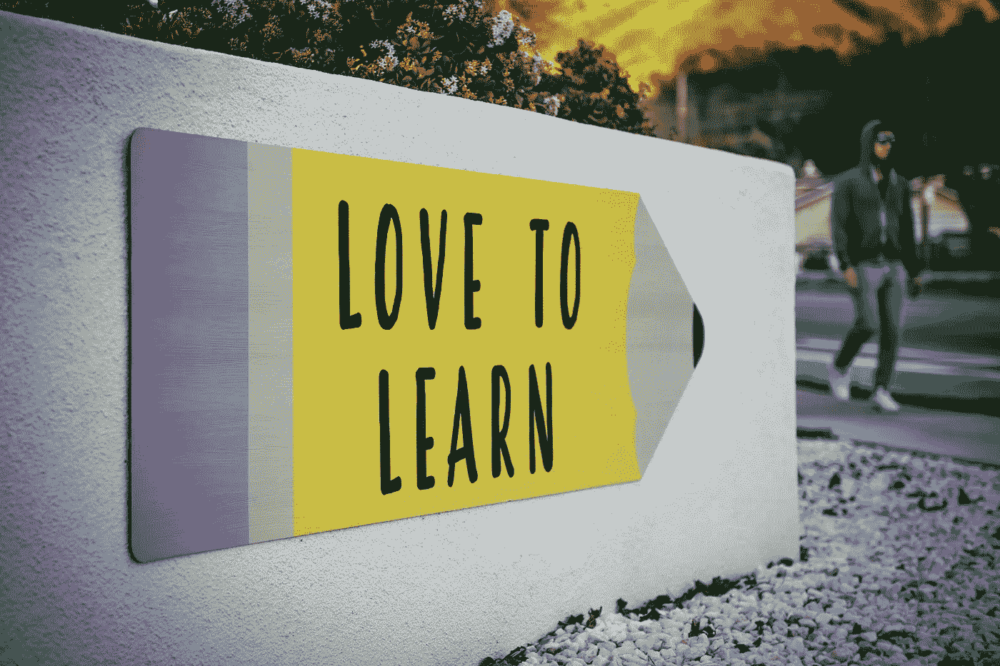

# 学习数据科学的最快方法

> 原文：<https://towardsdatascience.com/the-fastest-way-to-learn-data-science-6b0a648663bb?source=collection_archive---------4----------------------->

## 这不是你知道什么的问题，而是你能做什么的问题

Photo by [Tim Mossholder](https://unsplash.com/photos/WE_Kv_ZB1l0?utm_source=unsplash&utm_medium=referral&utm_content=creditCopyText) on [Unsplash](https://unsplash.com/search/photos/learn?utm_source=unsplash&utm_medium=referral&utm_content=creditCopyText)

当我第一次开始在媒体上写关于数据科学的博客时，我写了一系列文章，描述了一个[学习数据科学的完整路线图](https://medium.com/vickdata/programming-skills-a-complete-roadmap-for-learning-data-science-part-1-7913b289751b)。我在很大程度上自学了数据科学，在过去的几年里，通过反复试验，我找到了一些快速有效学习的好方法。我是一个讲求效率的人，当我试图实现任何目标时，我会尽可能找到最快的路线。在接下来的帖子中，我将分享我的顶级技巧，以加速你在数据科学或其他许多学科的学习。

## 有你非常关心的目标

为了保持学习的动力，你需要你非常关心的目标。我非常热爱数据科学，我的目标是成为一名数据科学家，但这不是我的主要动力。我想用数据以积极的方式影响我周围的世界。所以我的主要驱动力是能够用数据科学做有影响力的事情。这深深地引起了我的共鸣，也是推动我学习前进的最重要的事情。你需要找到你真正热爱的事情，并围绕它设定你的目标。永远记住它们，经常回顾它们，这将帮助你保持敏锐的注意力，快速前进。

## 而是你能做什么

这就引出了我的下一个观点，我对此深有感触，这不是你知道什么的问题，而是你能做什么的问题。数据科学是一门非常宽泛的学科，你永远不可能无所不知。学习每一个模型背后的理论或者你可能会用到的所有数学很容易迷失。不过，关键是要专注于学习你需要什么，以便能够用数据科学做实际的事情。因此，用一个广泛使用的库直接构建一个机器学习模型是很好的。理论可以以后再学。一旦你做好了某样东西并让它运转起来，你天生的好奇心会引导你去理解它背后的更多理论。

> 想法除非付诸实施，否则一文不值，德里克·西弗斯

如果你想成为一名在企业工作的数据科学家，这一点尤其适用。在商业中，价值与努力是最重要的，因此能够找到构建和部署模型的最有效的途径是极其重要的。例如，在商业中，你知道高等微积分的所有知识并不重要。重要的是你能在合理的时间框架内建立一个好的模型，当然也要知道足够的数学知识来评估、理解和提高性能。

## 路线图月度回顾

当我想加快我在数据科学方面的学习时，我创建了一个我需要掌握的技能路线图。在这个列表旁边，我给自己打了一个等级，大致分为:从未用过、初级、中级、高级。每个月初，我会给自己设定一些需要关注的技能。这意味着只要我有一点空闲时间，我就不必考虑做什么。我只需要从这个列表中选择一些东西，然后开始工作。我立刻知道该关注什么。

每个月底，我会根据每项技能给自己打分。这给了我接下来需要开发什么的想法。但也是一个有用的提醒，提醒我每个月都取得了多大的进步。

## 你不必完成 MOOC 的

我在实践中学习得最好，并且发现基于视频的课程对我来说不是特别好。这些大型课程中的绝大多数都是基于视频讲座的。我涉猎了 MOOC(大规模开放在线课程)，在我觉得有必要掌握一个概念的地方观看视频(有时解释一下会有帮助)。然而，我没有完成许多 MOOC。相反，我专注于学习新技能，并将它们快速应用到数据集或数据科学场景中。我在这里的观点是不要太执着于完成每一项技能的全部课程，学习足够的知识来做一些实际的事情，建造一些东西，然后学习它们为什么工作。

## 竞争

我发现数据科学竞赛是衡量我的表现的一个很好的资源，特别是在学习机器学习方面。你可以在两个主要网站上竞争 [Kaggle](https://www.kaggle.com/) 和 [Analytics Vidhya](https://www.analyticsvidhya.com/) 。两者都有丰富的数据集，后者通常对初学者来说更有用。总有一些带有排行榜的公开比赛，你可以在那里建立模型并提交它们来找出你的排名。这对于学习评估机器学习模型的性能特别有用。这不仅仅是试图爬得更高，而是“我对模型分数的解释正确吗？”以及“我如何提高我的模型分数？”。

## 也关注软技能

对于数据科学家来说，技能并不是唯一重要的事情。数据科学可能很难你可能需要向非技术同事解释一个模型，说服董事会投资一个项目，在建立实际模型之前花大量时间清理数据。你需要毅力和韧性。出色的沟通技巧。自信。我在学习这些技能的同时，也在继续学习这些技能。如果你同时努力提高这些素质，它们不仅能让你成为更好的数据科学家，还能让你成为更好的学习者。

一开始，当我开始学习数据科学时，我花了相当多的时间做一些我提到的不要做的事情。例如，我花时间完成统计学和数学的视频课程，认为我需要在建立任何模型之前完成这些。只是这些概念直到我实际上在构建某个东西的过程中才被完全理解。我已经列出了一些加快学习的技巧，但本质上，这些都等同于同一件事。学够了开始造东西，学多了造更好的东西，重复。