# 每个数据科学家都应该知道的 5 种离散分布

> 原文：<https://towardsdatascience.com/the-five-discrete-distributions-every-statistician-should-know-131400f77782?source=collection_archive---------7----------------------->


Photo by [Alex Chambers](https://unsplash.com/@alexchambers?utm_source=medium&utm_medium=referral) on [Unsplash](https://unsplash.com?utm_source=medium&utm_medium=referral)

## 故事、证据和直觉

分布在每个数据科学家的生活中扮演着重要的角色。

现在，从非统计学的背景来看，分布总是给我一种神秘的感觉。

事实是他们有很多。

那么我应该知道哪些呢？我如何认识和理解他们？

这篇文章是关于一些你需要知道的最常用的离散分布以及一些直觉和证明。

# 1.二项分布


这可能是所有离散分布中最简单的，也可能是最有用的。

**故事:**掷硬币，概率为 p，正面朝上。

***用在哪里？:*** 我们可以把二分类目标看作一个伯努利 RV。

**伯努利分布的 PMF 由下式给出:**

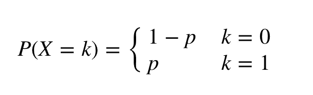

**伯努利分布的 CDF 由下式给出:**

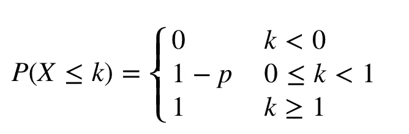

**期望值:**

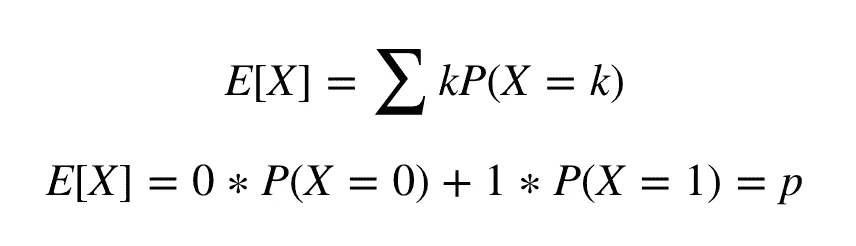

**差异:**

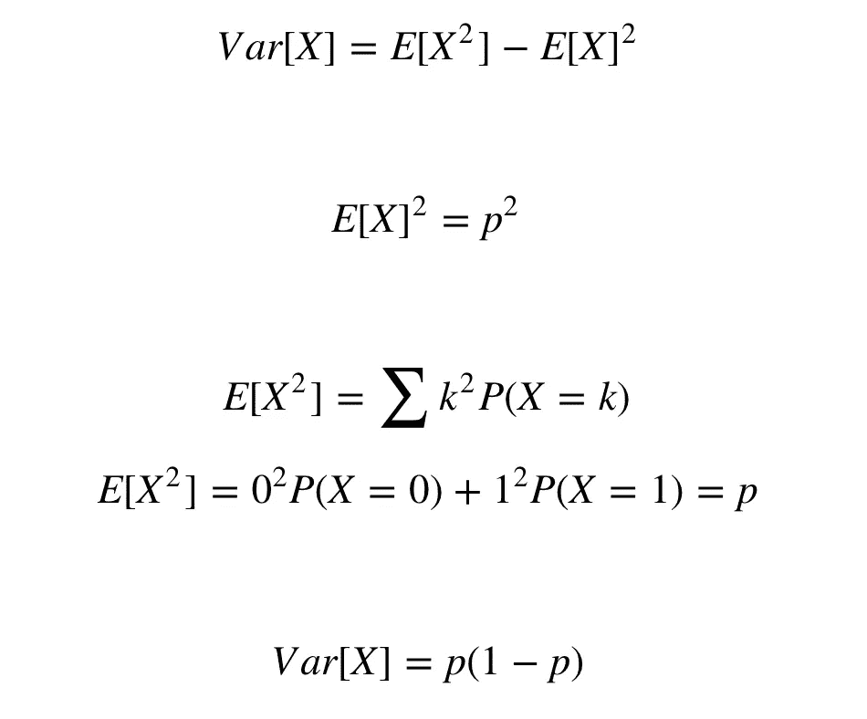

正如我们将在下面看到的，伯努利分布与许多分布密切相关。

# 2.二项式分布:


统计学家工具包中最基本的分布之一。这个分布的参数是 n(试验次数)和 p(成功概率)。

**故事:**在 n 次试验中获得 k 次成功的概率

***用在哪里？:*** *假设我们在一个骨灰盒里有 n 个鸡蛋。打破鸡蛋的概率是 p。骨灰盒中打破鸡蛋的数量是二项分布的。*

## 二项式分布的 PMF 由下式给出:

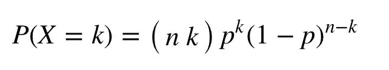

根据我们的故事，这是 k 个灯泡坏了的概率。

## 二项式分布的 CDF 由下式给出:

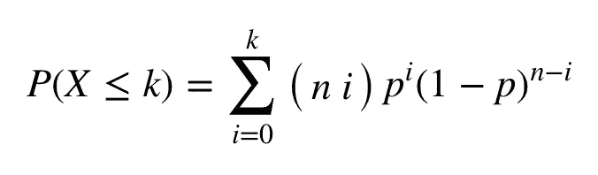

## 预期值:

第一种解决方案:

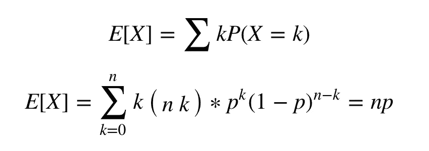

解决这个问题的更好方法是:

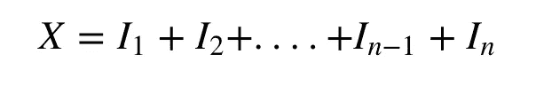

x 是 n 个指示随机变量的和，其中每个 I 是伯努利随机变量。

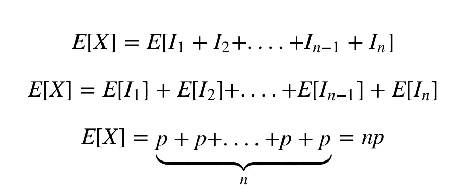

## 差异:

我们也可以使用方差来使用指标随机变量，因为每个指标随机变量都是独立的。

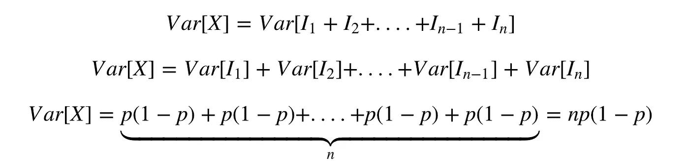

# 3.几何分布:


这个分布的参数是 p(成功的概率)。

**故事:**投掷概率为 p 的硬币时，第一次成功(正面)前的失败次数。

***用在哪里:*** *假设你正在进行一场考试，你获得通过的概率由 p 给出，你在清除考试之前将会出现的失败次数是几何分布的。*

## 几何分布的 PMF 由下式给出:

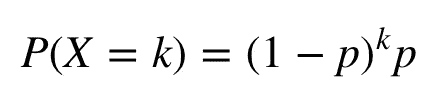

## 几何分布的 CDF 由下式给出:


## 预期值:

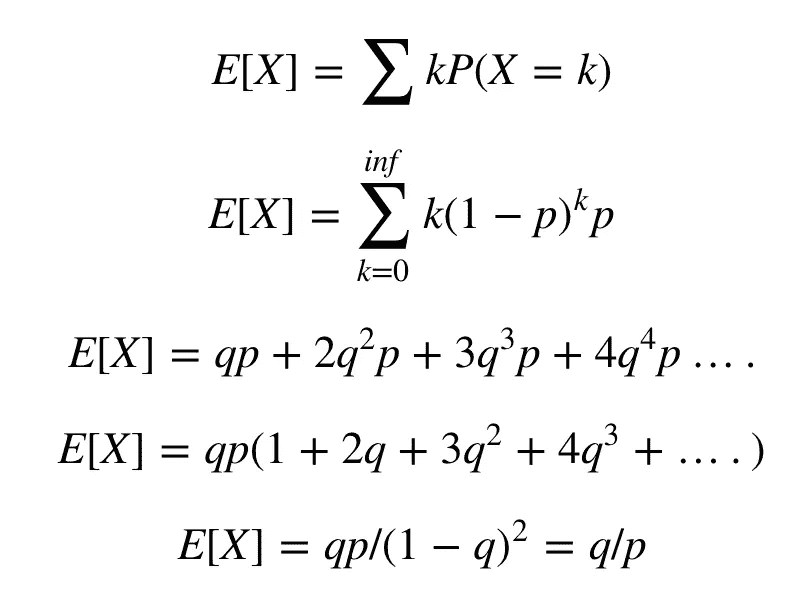

## 差异:

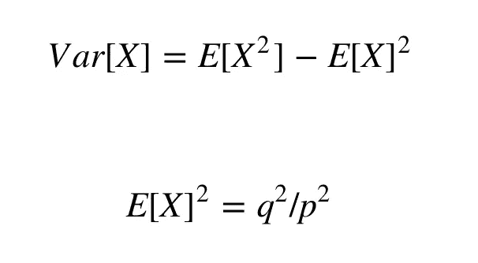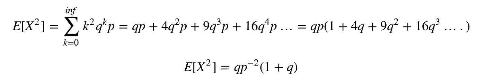

因此，


## 示例:

一名医生正在为一名新诊断的病人寻找一种抗抑郁药。假设，在可用的抗抑郁药物中，任何特定药物对特定患者有效的概率是 p=0.6。发现对该患者有效的第一种药物是尝试的第一种药物、尝试的第二种药物等等的概率是多少？为了找到一种有效的药物，预计将尝试多少种药物？

*为找到有效药物而尝试的预期药物数量=*

*q/p = .4/.6 =.67*

# 4.负二项分布:


这个分布的参数是 p(成功概率)和 r(成功次数)。

**故事:**第 rth 次成功前独立伯努利(p)试验的**次失败**。

***用在哪里:*** *你需要向不同的房子出售 r 糖果条。你卖出一块糖的概率由 p 给出。在获得 r 个成功之前你必须忍受的失败次数是负二项式分布。*

## 负二项分布的 PMF 由下式给出:

r 次成功，k 次失败，最后一次尝试必须成功:

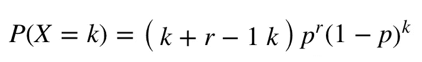

## 预期值:

负二项式 RV 可以表述为 r 个几何 RV 之和，因为几何分布就是第一次成功之前的失败次数。

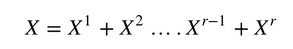

因此，

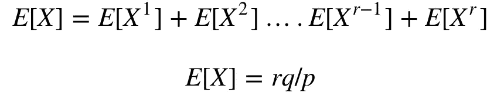

## 差异:

因为 r 个几何 RVs 是独立的。

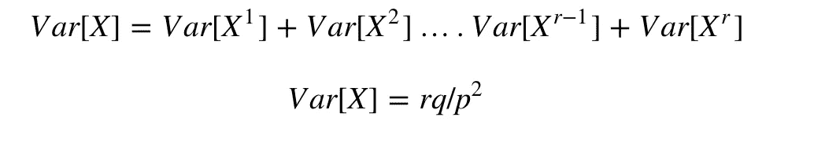

## 示例:

帕特被要求去卖糖果为六年级的实地考察筹款。这个社区有三十栋房子，帕特应该在卖出五块糖果后才回家。于是这个孩子挨家挨户地卖糖果。在每栋房子里，有 0.4 的概率卖出一块糖，有 0.6 的概率什么也卖不出去。第 n 家卖完最后一块糖的概率有多大？

这里，r = 5；k = n — r

在第 n 家卖完最后一块糖的概率=

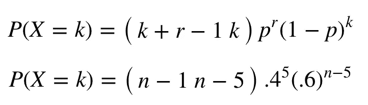

# 5.泊松分布:


这个分布的参数是λ，速率参数。

**动机:**这个发行版本身没有故事，但有使用这个发行版的动机。 ***泊松分布通常用于我们对大量试验的成功率进行计数的应用中，其中每次试验的成功率较低。***

例如，*泊松分布是计算一小时内给你发邮件的人数的一个很好的起点。你的通讯录里有很多人，他们中的任何一个给你发邮件的可能性都很小。*

**泊松分布的 PMF 由下式给出:**

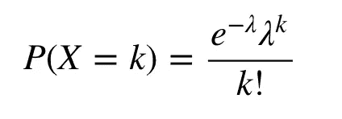

## 预期值:

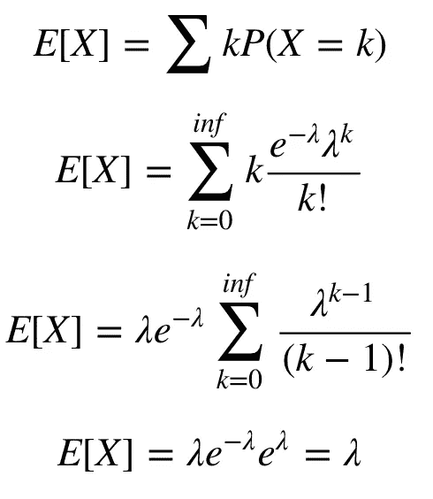

## 差异:


## 示例:

如果电力故障按照泊松分布发生，平均每 20 周发生 3 次故障，计算在特定的一周内不会发生一次以上故障的概率？

概率= P(X = 0)+P(X = 1)= 1

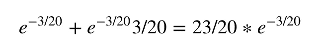

# Seaborn 图和函数

在这里，我将使用 Pythons 内置函数生成我们刚刚讨论过的离散分布的 PMF。关于上层函数的更多细节，请参见我之前的帖子— [用 SeaBorn](http://mlwhiz.com/blog/2015/09/13/seaborn_visualizations/) 创建基本的图形可视化。此外，请查看以下功能的[文档](https://docs.scipy.org/doc/scipy/reference/stats.html)指南

```
# Binomial :
from scipy.stats import binom
n=30
p=0.5
k = range(0,n)
pmf = binom.pmf(k, n, p)
chart_creator(k,pmf,"Binomial PMF")
```

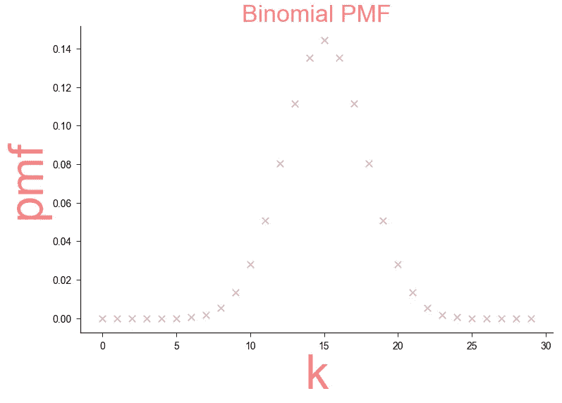

```
# Geometric :
from scipy.stats import geom
n=30
p=0.5
k = range(0,n)
# -1 here is the location parameter for generating the PMF we want.
pmf = geom.pmf(k, p,-1)
chart_creator(k,pmf,"Geometric PMF")
```

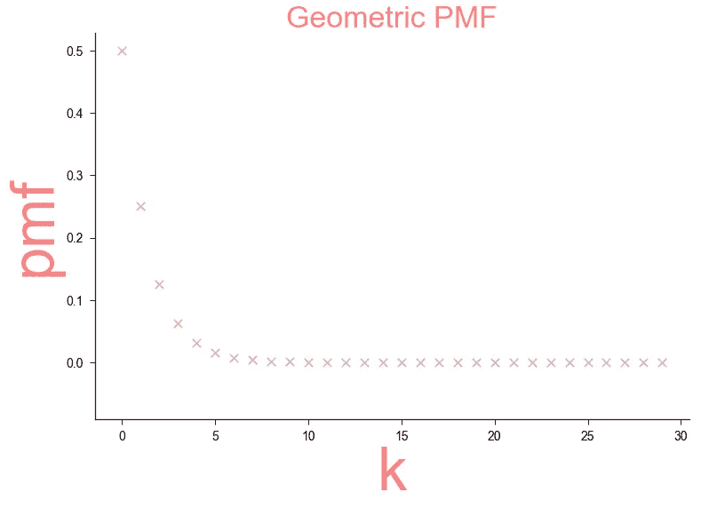

```
# Negative Binomial :
from scipy.stats import nbinom
r=5 # number of successes
p=0.5 # probability of Success
k = range(0,25) # number of failures
# -1 here is the location parameter for generating the PMF we want.
pmf = nbinom.pmf(k, r, p)
chart_creator(k,pmf,"Nbinom PMF")
```

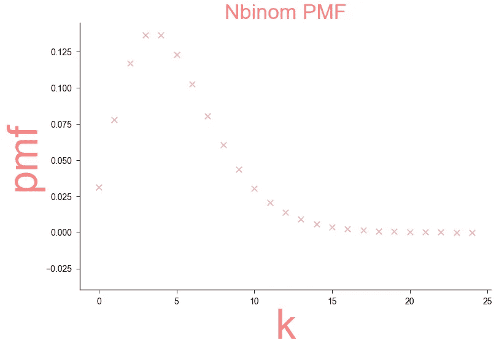

```
#Poisson
from scipy.stats import poisson
lamb = .3 # Rate
k = range(0,5)
pmf = poisson.pmf(k, lamb)
chart_creator(k,pmf,"Poisson PMF")
```

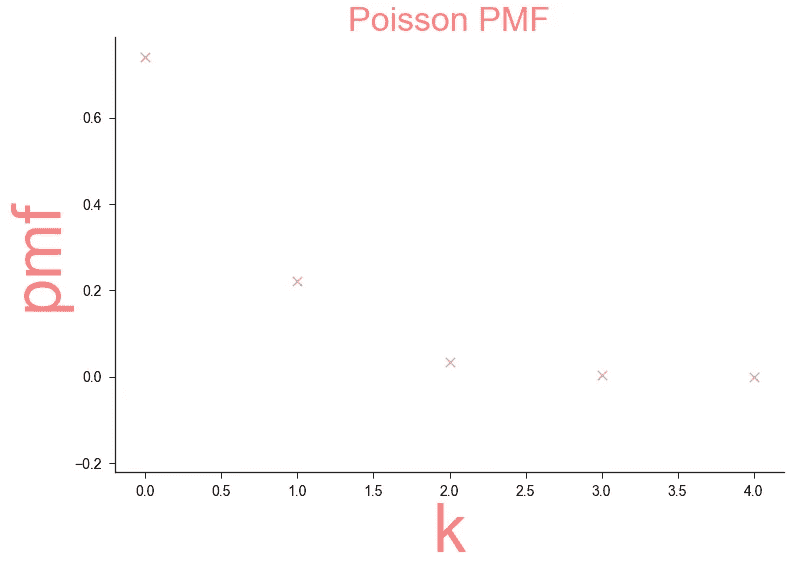

您还可以尝试使用不同于我所使用的参数来可视化分布。

# 结论


理解分布对于任何数据科学家来说都是至关重要的。

它们在生活中经常出现，理解它们会让你的生活更轻松，因为你可以通过使用一个简单的等式很快找到解决方案。

在本文中，我讨论了一些基本的离散发行版，并通过一个故事来支持它们。

这篇文章的格式可能看起来有点烦人，但是 Medium 不支持 latex，所以在这里不能做太多。

我仍然希望这能帮助你更好地理解。

了解他们的最有帮助的方法之一是 Joe Blitzstein 的 [**Stat110**](https://projects.iq.harvard.edu/stat110/home) 课程和他的 [**书**](http://amzn.to/2xAsYzE) 。

你也可以看看这个 [**Coursera**](https://coursera.pxf.io/2rL7KM) 课程。

谢谢你的阅读。将来我也会写更多初学者友好的帖子。在 [**媒体**](https://medium.com/@rahul_agarwal?source=post_page---------------------------) 关注我或者订阅我的 [**博客**](http://eepurl.com/dbQnuX?source=post_page---------------------------) 了解他们。一如既往，我欢迎反馈和建设性的批评，可以通过 Twitter[**@ mlwhiz**](https://twitter.com/MLWhiz?source=post_page---------------------------)联系。