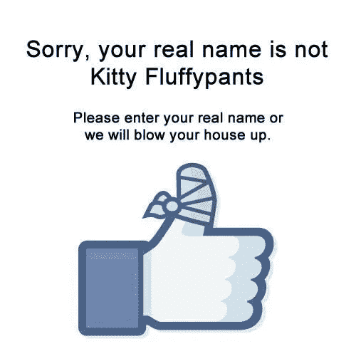

# 你好，脸书，我的真名是胡扯。

> 原文：<https://towardsdatascience.com/the-fluidity-of-digital-identity-on-facebook-or-not-9623f22f25af?source=collection_archive---------33----------------------->

The price of your identity to big companies is at your fingertips.

早在 2017 年，讨论的热门话题是脸书在“[防止假冒、诈骗和网络钓鱼](https://www.facebook.com/help/112146705538576)”的幌子下强制用户使用真实 ID 的严格政策。我不确定使用你的“真名”将如何保护你不被冒名顶替，事实上，这是否会给你带来风险？我们是否像[奈特(2014)建议的那样，允许使用我们的个人数据来规范我们能做什么和不能做什么？](https://doi.org/10.1177%2F1354856514536365)

其假设是，数字身份是真实或不真实地描绘自己的某一面，其优势是与其他具有相似兴趣的人建立一个志同道合的个人或群体的网络。[正如 van Dijck (2013)所解释的](https://doi-org.ezproxy.uws.edu.au/10.1177%2F0163443712468605)“从社交媒体的最早期开始……就是建立联系、促进人际联系和社区建设的工具”。因此，建立你的社交身份是个人应该控制的事情，允许用户将他们的身份与个人、职业或商业身份分开。

脸书的政策对我们向社交媒体平台提供的个人数据提出了一个至关重要的问题。为什么我们不能被允许向公司控制自己的数据？我希望能够保密我是谁，我在哪里，我在做什么，并选择定义什么应该公开。因此，当我们勾选臭名昭著的条款和条件框时，我们真的应该阅读细则。2018 年初，脸书同意剑桥分析公司(Cambridge Analytica)在未经他们同意的情况下收集 5000 万用户的个人数据，这通过识别和影响数百万选民，导致了政治游戏规则的改变。建议检查您的隐私政策是否有任何变化，有时这些变化会产生巨大的影响。

脸书和其他社交网络向雇主、潜在的浪漫约会对象和其他数字用户敞开了大门，让他们进行所谓的“社交建档”。 [Evuleocha & Ugbah (2018)](http://ezproxy.uws.edu.au/login?url=http://search.ebscohost.com/login.aspx?direct=true&db=bth&AN=129955956&site=ehost-live&scope=site) 解释人力资源部门和招聘人员如何使用社交网站进行工作筛选，目的是减少潜在候选人的不确定性，以实现更快的就业结果。澳大利亚的社会貌相已经到了影响公务员的地步，[，](https://www.govnews.com.au/public-servants-not-liking-new-social-media-restrictions/)，[，](https://www.apsc.gov.au/making-public-comment-social-media-guide-employees)限制了公务员的权利，声称他们的雇佣条款与他们的公开言论有关，即使是匿名的。

别担心，这不全是坏消息。我们的千禧一代(也就是我)正在以我们使用社交媒体的方式创造社会影响。Au-Yong-Oliveira (2018) 解释说，千禧一代要求我们的领导人对他们的行为负责，期望被当作人对待。这导致千禧一代要求当权者负责，利用社交媒体和技术作为行动主义或黑客行动主义的工具，以保持这些强大机构的透明度。虽然其中一些活动不是合法进行的，但它带来了一些积极的变化(Auty 2004)，如“匿名者”和山达基教会的事件(观看下面的视频)。

通过在网上放弃我们的个人数据，我们把自己置于危险之中，你怎么看？