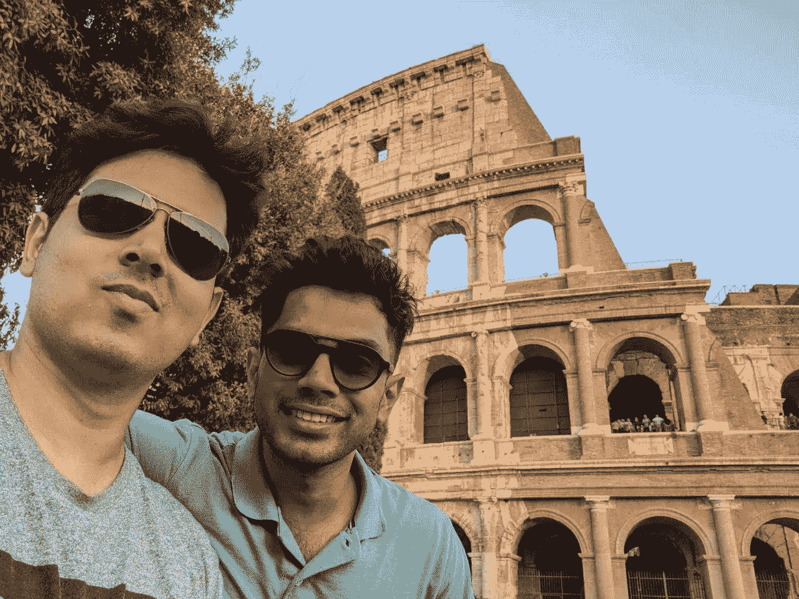
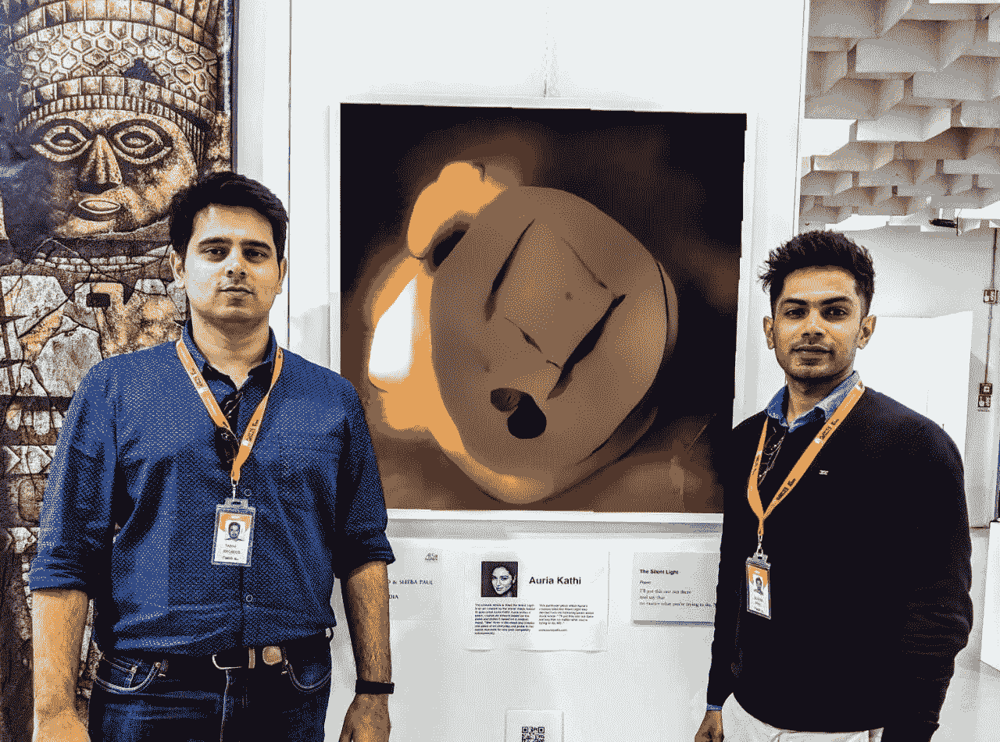

# 生活在云端的 AI 诗人艺术家 Auria Kathi 的充实之旅

> 原文：<https://towardsdatascience.com/the-fulfilling-journey-of-auria-kathi-the-ai-poet-artist-living-in-the-clouds-3237f6b3a605?source=collection_archive---------31----------------------->

2019 年 1 月 1 日，我们( [Fabin Rasheed](https://www.linkedin.com/in/nurecas/) 和我)向世界介绍了一个我们已经工作了几个月的兼职项目。一个人造的诗人艺术家，他并不实际存在于这个世界上，但他写了一首诗，根据这首诗画了一幅抽象的艺术，最后根据情感给艺术上色。

我们称“她”[为 Auria Kathi](/auriakathi-596dfb8710d6)——“艾俳句艺术”的变位词。

[奥瑞亚有一张人工的脸](https://miro.medium.com/max/2048/1*KIPDJWGaGUBxlLaLmP5NSw.png)以及她的人工诗歌和艺术。关于奥瑞亚的一切都是用人工神经网络构建的。2019 年的每一天，奥瑞亚都会在 [Instagram](https://www.instagram.com/auriakathi/) 和 [Twitter](https://twitter.com/AuriaKathi) 上发布一张“她”的作品。写这篇文章时，奥瑞亚在 Instagram 上有 1606 名粉丝。

> Auria 被认为是一个为期一年的项目，今天它即将结束。

# 开始

我和 Fabin 是 2018 年 9 月开始谈的。虽然我们来自同一所大学，但我们从来没有机会一起工作。Fabin 在增强现实、UX 和艺术方面有着辉煌的背景，当时他与 Adobe 有联系。自 2016 年以来，我一直是机器学习的积极实践者，2018 年，我有[个各种特色项目](https://sleebapaul.github.io/projects/)。

虽然背景不同，但我们有许多共同的特征。其中，突出的相似之处是，我们都热爱创造事物。我们都坚信技术创新。也许这些属性导致了合作，然后 Auria Kathi。

它始于随机想法干扰会议。渐渐地，讨论集中到了艺术，然后是艺术家，然后是诗人艺术家，然后是人造的诗人艺术家，然后是在 Instagram 和 Twitter 上发布的人造的诗人艺术家…

> 那些日子是创造性的精致。

That’s us in front of the Colosseum during our visit to Italy to attend Florence Biennale

# 惊人的奔跑

在这一年中，奥瑞亚到达了我们一开始从未预料到的地方。

*   **2019 佛罗伦萨双年展**

佛罗伦萨双年展创办于 1997 年，是意大利佛罗伦萨的主要当代艺术展览，被认为是世界各地国际当代艺术作品的杰出展示。自 1997 年以来，来自 100 多个国家的约 6000 名艺术家作为参展商参加了佛罗伦萨双年展的一个或多个版本。参赛作品由评审团策划，评审团由艺术界的国际知名人士组成，如 Gregorio Luke、Francesco Buranelli、Gerfried Stocker 等。

Presenting work of Auria at Florence Biennale 2019

在 2019 年 10 月举行的第 12 届佛罗伦萨双年展上，我们被接受在当代数字艺术展区展出 Auria 的作品。作为一个国际性的艺术平台，艾的作品在佛罗伦萨双年展上受到了更多的关注。此外，创造性的机器将如何通过激发艺术家提出新颖的想法来建设我们的未来也是讨论的一个重要部分。

*   **与微软的合作**

目前，我们在文献中没有一个单一的算法，可以构建像 Auria 这样的应用程序。但我们可以建立一个当前最先进的算法管道，可以执行 Auria 的组件并解决问题。这是 Auria Kathi 工程架构背后的关键理念。

这种架构方法被证明是[微软 Azure 机器学习管道](https://docs.microsoft.com/en-gb/azure/machine-learning/concept-ml-pipelines)的一个确切用例。多模态机器学习管道是对我们使用端到端机器学习解决我们周围复杂问题的愿景的验证。我们已经非常轻松地将 Auria 的工程栈转移到 Azure 平台，你可以在[这里](/auria-kathi-powered-by-microsoft-azure-machine-learning-pipelines-385de55de062)找到更多细节。

微软雷德蒙首席项目经理 Santhosh Pillai 在达成合作的过程中发挥了关键作用。

微软还赞助了佛罗伦萨双年展的费用。

*   **NeurIPS 在线图库**

[Auria 的作品入选了 NeueIPS 关于机器学习促进创造力和设计研讨会的在线画廊。](http://www.aiartonline.com/community-2019/fabin-rasheed-sleeba-paul-and-santosh-pillai/)

*   **媒体报道(线上和线下)**

1.[创意应用网络](https://www.creativeapplications.net/member-submissions/auria-kathi-an-ai-artist-living-in-the-cloud/)

2.[印度在线快递](https://indianexpress.com/article/cities/bangalore/auria-kathi-an-ai-bot-generates-haiku-poems-and-art-to-go-with-it-5871866/)

3.[巴鲁·埃利奥特的创意人工智能简讯](https://us15.campaign-archive.com/?u=c7e080421931e2a646364e3ef&id=d1a15e8502)

4.[苏乔伊·高什编写布鲁斯博客](https://codingblues.com/2019/01/11/fabin-sleeba-and-wonderful-auria/)

5.[走向数据科学— Auria Kathi](/auriakathi-596dfb8710d6)

6.[走向数据科学——Auria Kathi 和 Azure 机器学习管道](/auria-kathi-powered-by-microsoft-azure-machine-learning-pipelines-385de55de062)

7.[德干纪事报(全印度版)](https://www.deccanchronicle.com/nation/current-affairs/010919/kochi-artificial-poet-an-art-and-tech-collaboration.html)

8.[商业标准报(全印度版)](https://www.business-standard.com/article/technology/the-indian-ai-driven-artist-who-ll-show-her-works-at-the-florence-biennale-119090600630_1.html)

9.[马拉雅拉马诺拉玛报(全部喀拉拉邦版，拥有 1800 万读者群)](https://www.manoramaonline.com/technology/technology-news/2019/08/21/oriya-kathi-ai-writer.html)

*   **会谈**

1. [PyData 大会——Auria Kathi:多模态机器学习管道的力量](https://pydata.org/delhi2019/schedule/presentation/10/auria-kathi-power-multi-model-machine-learning-pipelines/)

2.喀拉拉邦管理协会，科钦-奥瑞亚·卡提艾诗人艺术家

3.喀拉拉邦国立高等法律研究大学——人工智能生成艺术的知识产权

*   **电台**

班加罗尔米尔奇电台——特别报道

# 拒绝

对我们来说，这并不是一片乐土，尽管从远处看似乎如此。

1.  被双年展拒绝参展
2.  拒绝参展——2019 年韩国首尔国际计算机视觉会议
3.  2019 年学术论文——neur IPS for creative 被拒绝参赛
4.  拒绝参加画廊的展览

我们被审查使用机器自动化艺术，并使其成为对人类艺术家的威胁，尽管我们一再澄清，我们的使命是帮助人类的创造力，而不是取代它。

# 我们从 Auria Kathi 身上学到了什么？

1.  如果你相信你的创造，寻找每一个机会展示它。你会惊讶于这种坚持以后会把你带到哪里。
2.  不要为被拒绝而烦恼。尤其是早期的。
3.  不要为批评而烦恼。保持冷静，鞭策自己。
4.  如果你想走得快，就一个人走。想走远，就一起走。

# 代码

我们都是开源的倡导者，相信所有的创新都站在我们先行者的肩膀上。所以回报是很重要的。正如承诺的那样，我们在这里开源了代码[。](https://github.com/sleebapaul/AuriaKathi)

# 许可证

1.  社交媒体上发布的任何用于非商业目的的 Auria 艺术作品都应归功于 Auria Kathi。
2.  在社交媒体上发布的任何用于商业目的的来自 Auria's art 的艺术作品都必须得到 Auria Kathi 创作者的共同同意。
3.  出于商业目的使用品牌名称“Auria Kathi”必须得到 Auria Kathi 创作者的共同同意。

请随意使用代码来创建您自己的诗歌和艺术版本。

> 谢谢你接受了我的想法，并使我获得了巨大的成功。
> 
> 结束。
> 
> 爱情，
> 
> 奥瑞亚·卡希