# 数据科学的基本算法

> 原文：<https://towardsdatascience.com/the-fundamental-algorithms-of-data-science-a00dbe2c953?source=collection_archive---------15----------------------->


## 第 1 部分:线性回归

这是旨在深入探究数据科学基本算法背后的数学的系列文章中的第一篇。作为数据科学家，当利用 scikit-learn 等易于应用的机器学习库时，重要的是我们要对“幕后”发生的事情有一个坚实的理解，而不是简单地插入和遍历 *fit-predict-score* 函数。自然，没有比线性回归更基础的算法了。

## 快速入门

线性回归用于预测一些目标变量，以及获得关于各种特征和目标变量之间的关系的见解。目标通常是一个连续变量，可以写成特征的加权线性组合。因此，对于具有 n 个要素的数据集，线性方程将具有 n 个权重(b₁,…bN)和一些常数(b₀:)

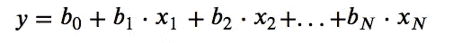

用一个变量来可视化线性回归的结果是相当简单的。在这种情况下，回归函数将是单一特征(x)和目标变量(y)图上的最佳拟合线。

为了便于演示，我从 scikit-learn 导入了波士顿房价数据集。我选择了一个单一的特征，房间数量(“RM”)，并根据目标变量房价绘制了它。

```
from sklearn import datasets
import pandas as pd
import numpy as np
import matplotlib.pyplot as plt
import seaborn as snsboston = datasets.load_boston()
df = pd.DataFrame(boston.data)
df.columns = boston.feature_names
df['PRICE'] = boston.target
del bostonX = df['RM']
Y = df['PRICE']ax = sns.regplot(X, Y, fit_reg=False)
```

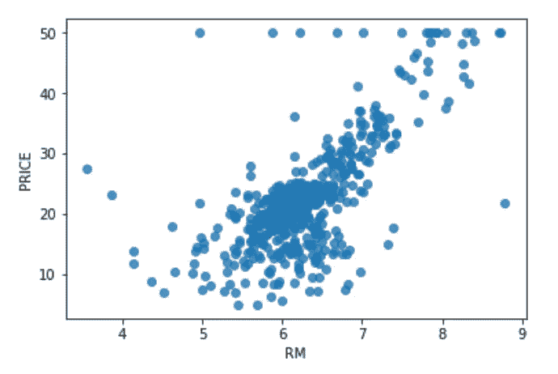

显然，房间数量和房屋售价之间存在正相关关系，我们可以想象通过这些点画一条向上的斜线。但是哪条线是“最好”拟合的线呢？我们如何找到它？

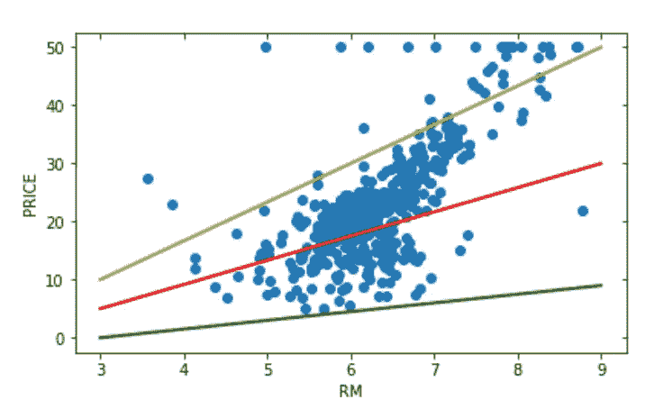

## 价值函数

在单变量情况下，y 的每个预测值(用带小帽子的 y 表示)或 y 的“假设”(h(x))由以下等式给出:

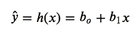

目标是找到 b₁和 b₀，使得成本函数(在这种情况下为均方误差(MSE ))最小化:

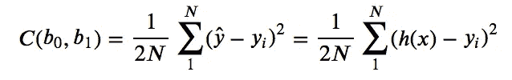

以下是 Python 中用于计算 b₁和 b₀给定值成本的函数:

```
def cost(b0, b1):    
    Yhat = b0+(b1*X)
    SE = (Yhat-Y)**2
    N = len(Y)
    cost = (1/(2*N))*(sum(SE))
    return(cost)
```

输入不同的 b₁值并绘制返回的成本函数值显示了线性回归成本函数的凸性。

```
beta1s = np.arange(0,10.5,0.5)costs = []
for b1 in beta1s:
    costs.append(cost(0,b1))
ax = sns.lineplot(x=beta1s, y=costs)
```

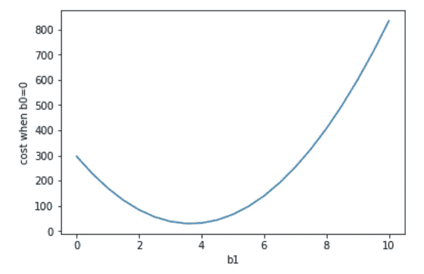

Cost function for various values of b₁

在这种情况下，在 3 和 4 之间的某个 b₁值处存在局部最小值。当然，我把 b₀固定为零，所以我们无法知道这是否是这些权重的最优组合。虽然我们不能用几何学的方法解决这个问题，但幸运的是有数学方法可以优化这两个参数(从而最小化成本函数)，如下所述。

## 方法 1:最小二乘法

最小二乘法将最小化每个点(xᵢ，yᵢ)和 y 的预测值(落在线上)之间的距离。我们可以用下面的公式计算 b₁(x₁的重量，在这种情况下是直线的斜率，因为我们是二维的):

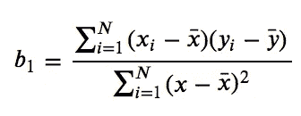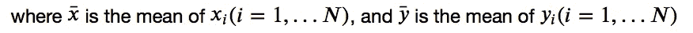

线的截距，或 b₀，是通过取所有 xᵢ的平均值，乘以 b₁，然后从所有 yᵢ:的平均值中减去乘积计算出来的

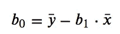

可以使用以下代码在 Python 中计算参数 b₁和 b₀:

```
b1 = sum((X-X.mean())*(Y-Y.mean()))/sum((X-X.mean())**2)
b0 = Y.mean()-(b1*X.mean())
```

它返回值 b₁ = 9.102 和 b₀ = -34.671。将这些值代入上面定义的成本函数得出 C(-34.671，9.102) = 21.801。

## 方法 2:梯度下降

虽然最小二乘法在单变量情况下(即，具有一个特征 x)相当简单，但是对于多重回归(即，多个特征)，它在计算上变得复杂得多。输入梯度下降和偏导数！

梯度下降开始于为 b₁和 b₀设置某个初始值(比如 1 和 1)，并减去相对于 b₁和 b₀的偏导数(乘以某个学习速率α)。重复这个过程，直到它收敛于某个最优的 b₁和 b₀，其中成本函数的斜率为零(即全局最小值)。

用更人性化的术语来说，想象你站在山顶上，目标是找到山谷中的最低点(用黑色的 X 标记)。如果你大踏步跳下山坡，你可能会越过你的目标点。如果你一步一步来，你会花很长时间到达底部。步长相当于 alpha，或学习率，在超过最小值和计算时间之间有一个折衷。

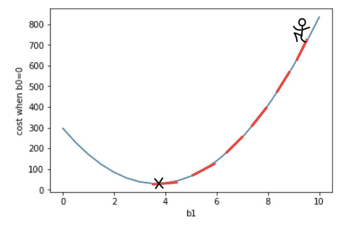

数学上，梯度下降将重复以下步骤，直到收敛:

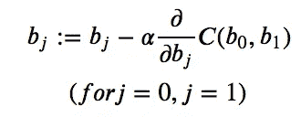

对于线性回归，给定成本函数:

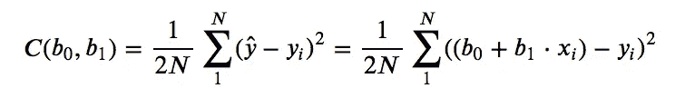

b₀和 b₁的偏导数为:

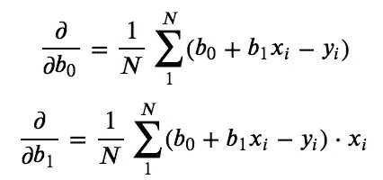

```
def gradient_descent(alpha, b0, b1, epochs):
    for _ in range(epochs):
        Yhat = b0+(b1*X)
        partial_0 = (1/N)*sum(Yhat-Y)
        partial_1 = (1/N)*sum((Yhat-Y)*X)
        temp0 = b0-alpha*partial_0
        temp1 = b1-alpha*partial_1
        b0 = temp0
        b1 = temp1
    return(b0,b1)
```

在这种情况下，学习率(alpha)为 0.01，重复 40000 次，我们得到 b₁ = 9.056 和 b₀ = -34.377，成本函数值为 21.801(如上)。

以下代码将 b₁和 b₀的梯度下降值的回归线叠加到房间数量和房价的散点图上:

```
Yhat = b1*X+b0
grid = sns.JointGrid(X, Y, space=0)
grid.fig.set_figwidth(7)
grid.fig.set_figheight(4)
grid.plot_joint(plt.scatter)
grid.ax_joint.plot(X, Yhat, 'r-', linewidth = 2)
```

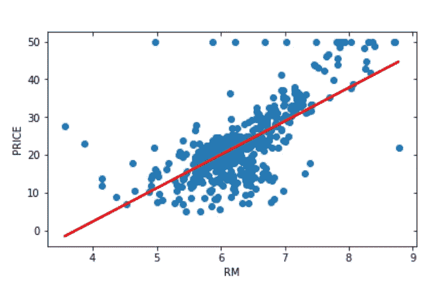

Regression line (red) calculated using gradient descent

## 总结

这篇文章讨论了数据科学和机器学习中一个基本算法的基本构建模块:线性回归。我讨论了优化用于预测目标值 y 的回归权重或参数的两种方法。虽然最小二乘法对于一个要素(x)相当简单，但梯度下降更常用于大型要素集，因为同时计算所有权重会更加复杂。

这篇文章的目的是让读者深入了解基本算法(如线性回归)的“本质”，以确保正确的使用和解释。如果你想了解更多，请查看本系列关于逻辑回归的下一篇文章！

*我希望你觉得这篇文章很有用，并且像往常一样，欢迎在评论中发表意见！请继续关注本系列的后续文章，因为我将继续深入研究我们最基础的算法的数学。*

*来源:*

[](https://www.coursera.org/learn/machine-learning/home/info) [## Coursera |顶尖大学的在线课程。免费加入

### 斯坦福和耶鲁等学校的 1000 多门课程——无需申请。培养数据科学方面的职业技能…

www.coursera.org](https://www.coursera.org/learn/machine-learning/home/info) [](http://people.duke.edu/~rnau/mathreg.htm) [## 简单回归数学

### http://regressit.com。线性回归版本可以在 PC 和 MAC 电脑上运行，并且具有更丰富和更易于使用的…

people.duke.edu](http://people.duke.edu/~rnau/mathreg.htm) [](https://www.edureka.co/blog/linear-regression-in-python/) [## Python | Edureka 中从头开始的线性回归算法

### 4.1K 视图成为认证专家线性回归是机器中最简单的统计模型之一…

www.edureka.co](https://www.edureka.co/blog/linear-regression-in-python/)