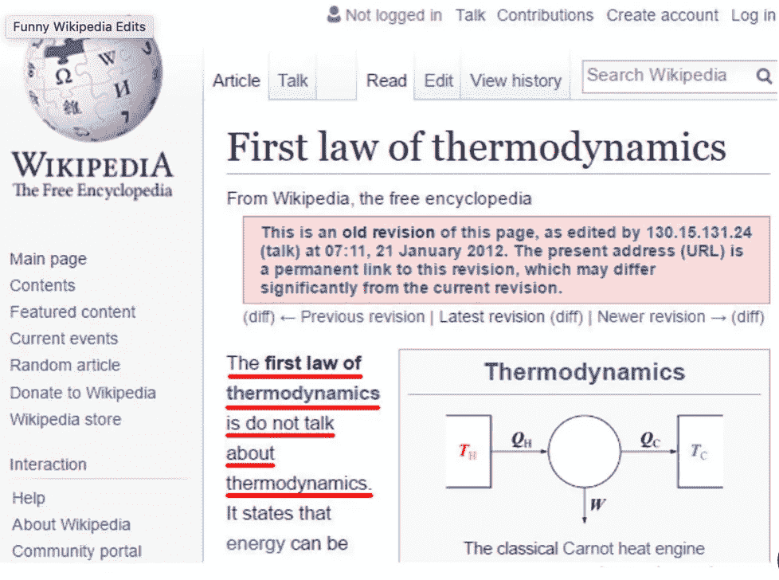
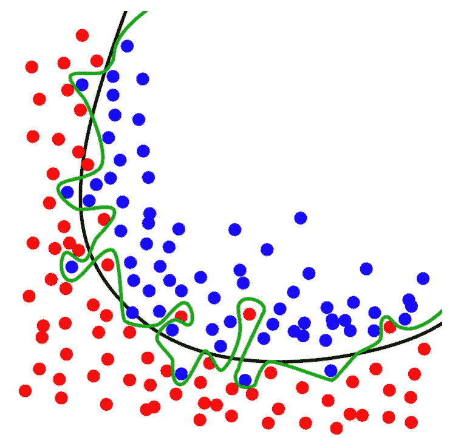
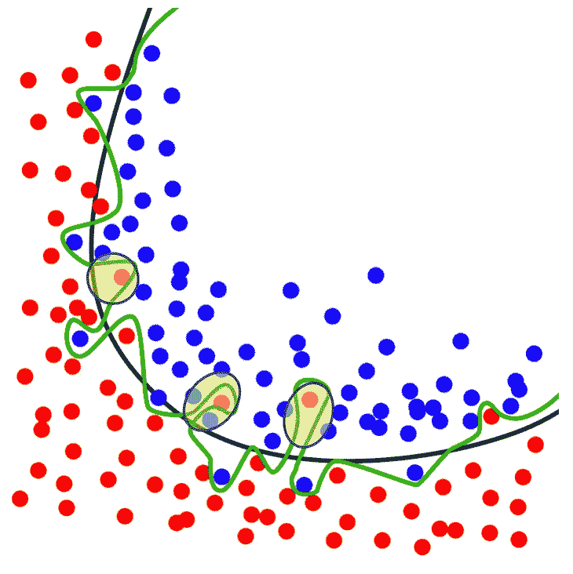
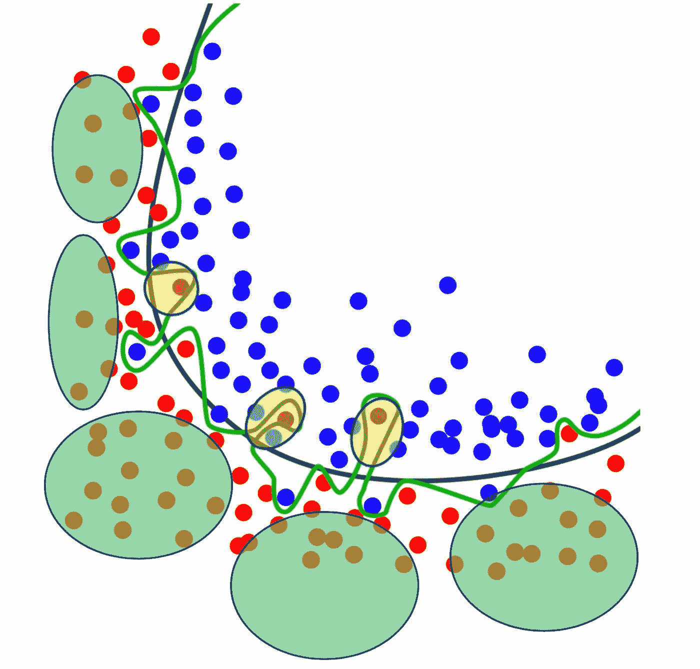
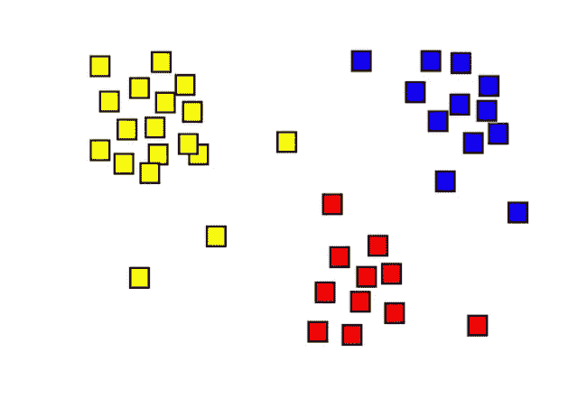

# 机器学习的基本问题，没有数学

> 原文：<https://towardsdatascience.com/the-fundamental-problem-of-machine-learning-without-math-24f3b2708028?source=collection_archive---------10----------------------->

你好！今天，我们将讨论凸同构的部分随机深度神经梯度。我只是在开玩笑；这只是一大堆乱七八糟的字，但是看论文有时候也会有这种感觉。因此，我想以一种不需要先验知识或数学技能的简单易懂的方式来写我认为是机器学习和人工智能中最重要的话题。我也想过这个问题，我用漂亮的图片和冷色调的形式来展示我的观点。我希望，在阅读 10 分钟后，你会有一个直观的理解，而不是用你的头去撞墙。

如果你过去几年没有生活在岩石下，你就会知道人工智能是下一个大事件。汽车在自动驾驶，计算机在围棋上打败了人类，机器人正在取代我们的工作。很快，机器人将推翻政府，奴役我们的孩子…

好吧，也许不是。但这回避了一个问题:如果终结者在不久的将来不会猖獗，人工智能的极限是什么？答案很明显——这取决于你对人工智能的定义。如果你把人工智能定义为只会下围棋的计算机，我可以很有信心地告诉你，未来包含了比今天更好的围棋程序。我们会完成，但不幸的是，我不认为有人使用这个定义。我不认为当梅赛德斯宣传他们的智能驾驶时，他们谈论的是他们的汽车性能有多好。另一方面，你可以像营销人员一样定义人工智能；你的公司在你的产品中使用人工智能，所以我的公司也是。没有人特别确定我们的产品有什么人工智能，但它肯定不是人工愚蠢的，所以嘿。

那么，智力到底是什么？在对人脑、心理学、甚至蚂蚁社会进行了大量研究后，我得出结论:智力由两个主要部分组成:第一，识别模式的能力；第二，应用这些模式实现目标的能力。这有很多理由，但一个例子相当清楚地说明了这一点，我们都知道轶事证据是最强有力和最合乎逻辑的论点。想一个非常聪明的人，比如说，在数学方面。现在想象一下这个人在数学课上。这个人很可能上课不太专心——为什么？因为他/她很快就能得到材料。他/她认识到了这种模式，并决定不再关注班上的其他人。这个人也可能很快完成作业，因为他/她擅长将课堂上学到的知识(也就是模式)应用到作业中。这个定义也适用于其他类型的智力。例如，艺术上聪明的人似乎能够识别什么是好的艺术，并利用这种本能创造新的、好的艺术。如果这不能说服你，要知道维基百科也为智力提供了类似的定义，你肯定不想与维基百科争论，维基百科是互联网上最可靠的知识来源。

Source: boredpanda.com

你猜怎么着？显然，有一整个领域致力于算法，这些算法创建从数据中提取模式并将其应用于其他数据的模型，它被称为机器学习。我想谈谈机器学习中最重要的概念之一，过度适应。过度拟合只是模型发现了太复杂的模式的一种花哨说法，这导致了预测未来点的问题。

Source: wikipedia.org

假设你的任务是画一条线将红色和蓝色的点分开，但是这些点如何着色可能会有一些随机性；数据有些嘈杂。黑线似乎是一个合理的解决方案。它没有对所有的点进行正确分类，但它似乎考虑到了边界上的一些点可能会向任何方向移动。绿色解决方案成功地分离了所有点。但区别在于:我突出显示了一些区域，如果你沿着绿线走，一个新点将被归类为红色，而如果你沿着黑线走，一个新点将被归类为蓝色。

This definitely wasn’t done via Microsoft Word. I definitely used a professional program, like Photoshop.

现在，作为一个没有试图攻击作者的读者，我相信你会同意我的观点，突出显示的黄色区域更可能包含蓝色点而不是红色点。这是过度拟合—绿线在现有点(训练点)上表现更好，但在新点(测试点)上表现更差。

我们可以换句话说，产生绿线的模型在训练点中发现了太多的模式。它太善于发现模式，所以当它要应用它们的时候，它没有看到它发现的模式可能不适用于新的点。那么，根本的问题是发现哪些模式是真实的，哪些只是数据本身的噪音。

我肯定不是第一个注意到这个问题的人。我其实是在课堂上学到的。许多聪明人试图通过想出非常聪明的方法来解决这个问题，这些方法使用长方程和许多希腊字母来防止模型发现像绿色这样的怪异线条；这就是所谓的正规化。无论是在训练期间添加正则化还是将其融入模型本身，这都是机器学习的改进之处。

我的观点略有不同——在我看来，我们跳过了最重要的一步。在诉诸奇特的数学之前，我们忘了问自己为什么。嗯，总是有这样的问题，为什么天空是蓝色的，或者为什么我们存在于宇宙中，但这些不是我提到的问题(这些是*不是*你正在寻找的问题)。不，我更关心的是为什么智力通常会起作用。我们试图找出哪些模式有效，但我们还没有确定为什么任何模式都有效。为什么下一个点应该是蓝色或红色；为什么不能是紫色的？

这个问题，又不是我先问的。事实上，我不知道是谁先问的，但幸运的是，一路上有人决定给出一个答案:一些模式之所以有效，是因为测试数据应该独立于训练数据，两者应该来自同一分布。这只是一种数学方式，说明当我们测试我们的模型时，我们不应该让它处于与我们训练它时不同的环境中。下一个点是紫色的可能性很小，因为我们已经看到了很多点，没有一个是紫色的。毕竟，当我们掷出六面骰子时，我们不能指望一半正面一半反面，但我们可以预计，如果我们以同样的方式掷同样的硬币，我们会得到类似的结果。借用一句励志名言:“如果你一直做你一直做的事情，你就会一直得到你一直得到的东西。”在我写下那句话之前，我从没想过机器学习可以和励志演讲捆绑在一起。

Ok, fine. It was done via Microsoft Word :/

好的，很好，但是让我们回到任务上。这与区分实际模式和过度拟合有什么关系？如果你注意到上面，过度拟合的主要原因是绿线模型试图拟合一些异常值。假设我们可以以某种方式将这些点分组到不同的区域，其中一些区域包含异常值并且不符合找到的模式(黄色区域)，而另一些区域包含符合找到的模式的点(绿色区域)。

直觉上，“绿色”区域应该更大，包含更多点，并且在预测未来点时更准确。换句话说，如果更多的点出现在“绿色”区域，我们会认为它们是红色的。另一方面，如果更多的点出现在“黄色”区域，而一些点是红色的，我们会认为大部分是蓝色的。当然，为了得到更多的分数，我们总是可以收集更多的数据。但有时，你会发现自己是一个贫穷的本科生，没有其他人拥有的金钱、时间或资源。叹气。不管怎样，有时候，收集更多的数据是不可行的。因此，与其这样做，我们可以省去部分训练数据，并通过使用我们省去的点来“添加”点！这也不是一个新的想法——这被称为使用验证集(我们验证模型从训练集中发现的模式)。使用验证集来确定特定的过度拟合区域是一种新方法。然而，人们没有这样做是有原因的。“绿色”区域听起来确实不错，但首先，它们很难找到，其次，这些区域是根据数据构建的。简而言之，一些区域明显是“绿色”，而其他区域明显是“黄色”，但是一些区域将很难着色，因为这些区域是围绕训练数据塑造的。这个问题的解决依赖于与美国相同的基本原则。如果根据不同数据训练的两个模型得出相同的“黄色”区域，这将是奇怪的。因此，如果我们对根据稍微不同的数据训练的模型重复这个着色过程，对于我们在第一个模型中不确定的区域，我们可以在第二个模型中只看它们的颜色作为决定者！如果那个模型发现了相同的区域，那么我们可以非常肯定这不是偶然的，所以它应该是“绿色的”相反，如果第二个模型没有找到该区域，那么它可能是噪声，并且应该被着色为“黄色”

还有一件事。我们如何找到这些区域？我们用聚类！你会问，什么是集群？

Source: wikipedia.org

聚类就是在数据中寻找聚类(我不是故意讽刺)。但是看；聚类就是在数据中找到三个聚类，如图所示。同一簇中的点看起来与模型相似。如果有多种方法来转换点，然后在模型中绘制(例如，在神经网络的每一层中)，那么根据定义，在所有图中处于相同聚类中的点对于模型来说是不可区分的。这是很清楚的——如果模型可以区分它们，那么它们在某个时候会在不同的簇中。不管怎样，如果我们定义了点总是在同一个簇中的位置，那么，现在我们有了我们的区域！

机器学习就是寻找可以分离点的算法(哦，还有回归)。算法倾向于找到绿线，因为这样可以最小化分类错误。机器学习的挑战是找到一种可以找到黑线的算法，因为这可能会在新点上工作得更好。正则化，也就是奇特的数学，帮助我们得到更接近黑线的东西。这就是全部了！

你想要一个正式的版本，应用于实现最先进结果的深度学习吗？你对这如何证明奥卡姆剃刀和传统的正则化技术有兴趣吗？你想成为一个酷小孩吗？->[https://arxiv.org/abs/1904.05488](https://arxiv.org/abs/1904.05488)<—

感谢阅读！