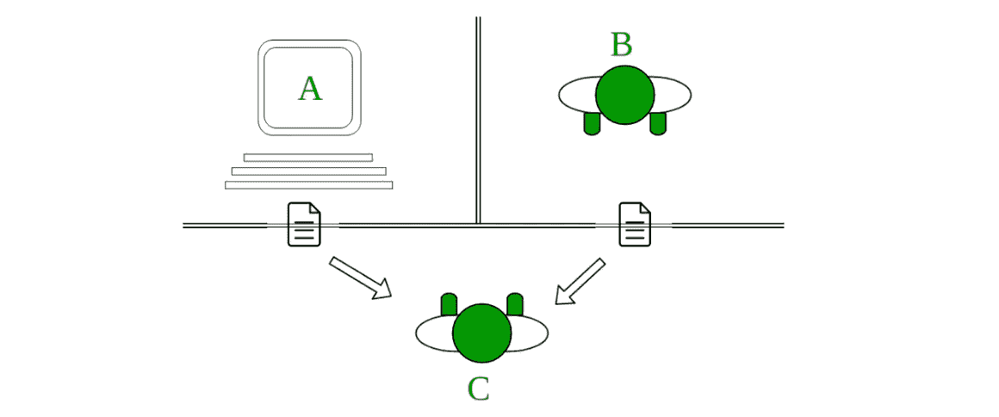
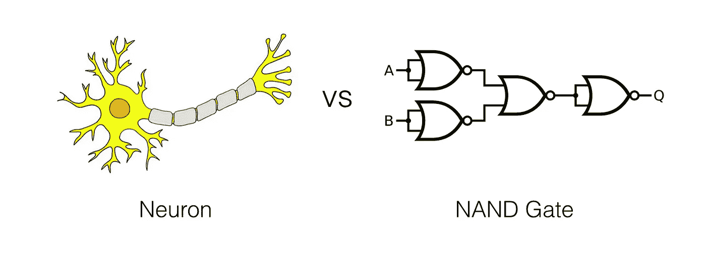
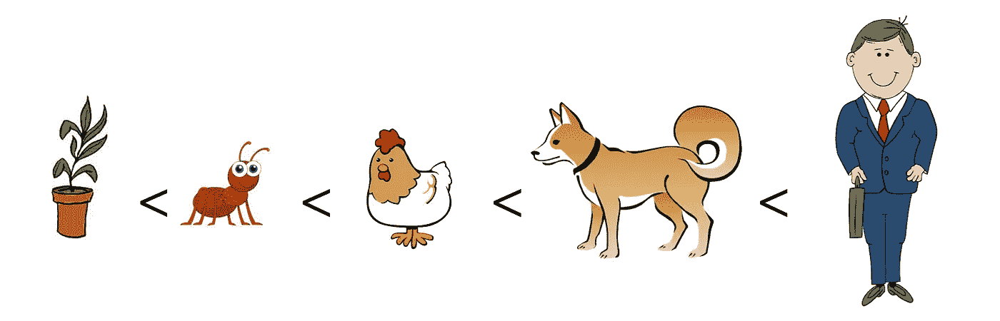
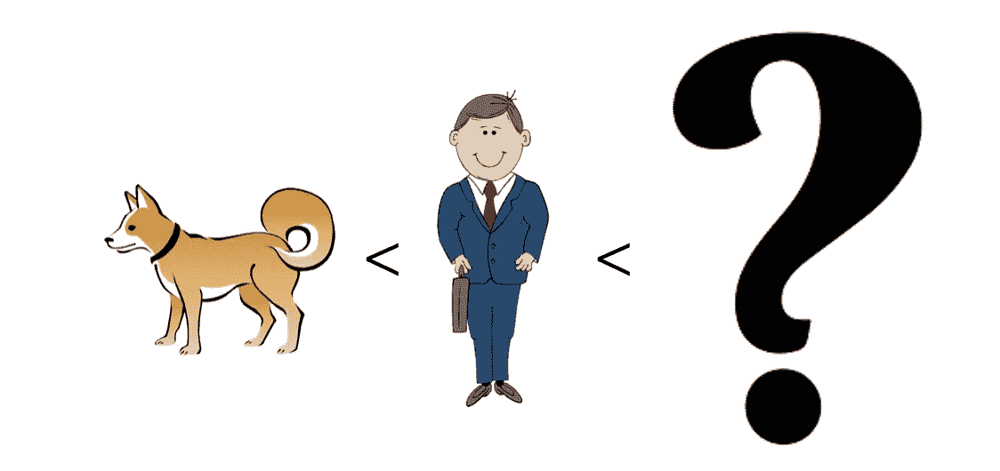
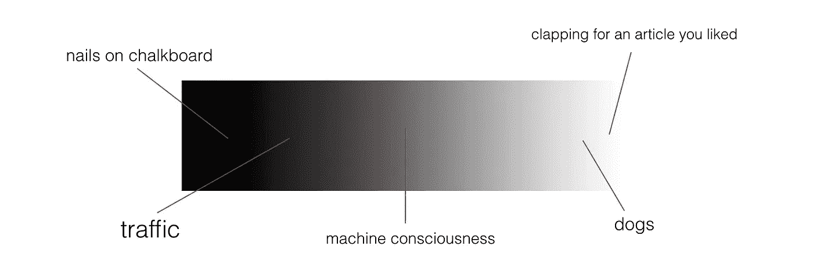

# 机器意识的未来和哲学

> 原文：<https://towardsdatascience.com/the-future-and-philosophy-of-machine-consciousness-872f272875c8?source=collection_archive---------5----------------------->

## 探索令人兴奋又令人恐惧的感知机器人的可能性

如今，科幻小说比以往任何时候都更渴望探索人机关系的可能性。这些故事复杂、感人，而且常常发人深省，在粉丝和未来主义者中广受欢迎。

一些著名的、相当黑暗的例子是:

*   《黑镜》(第一季第二集)马上回来— 一个悲伤的寡妇将她已故丈夫的人格重塑成一个神秘的机器人身体
*   **前玛奇纳**——一名男子爱上了一个背叛他以换取自由的机器人
*   **她的**——一个最近离婚、心碎的男人在一个复杂的聊天机器人中找到了伴侣，最终变成了爱情

这些故事很可怕，因为它们迫使我们去面对我们可能不理解或不知道答案的现实。有一天，我们将不能关掉电视，回到那些情况不在你家门口的生活。但是，即使这一天还没有到来，重要的是开始探索随着这些未来机器慢慢成为现实而变得越来越相关的哲学问题。

今天，我们将探讨与机器意识相关的问题，例如:

1.  机器能思考吗
2.  *机器能体验情感吗*
3.  *机器能有意识吗*

我们将努力保持客观，从多个来源获取不同的观点。这是:

## 机器会思考吗

*简答:*当然可以，为什么不可以。

*长回答:*很复杂。1950 年，被称为现代计算和人工智能之父的艾伦·图灵也在想同样的事情。为了寻找答案，他创造了著名的图灵测试。简而言之:

> 阿兰·图灵于 1950 年发明的图灵测试是一种测试机器表现出与人类同等或不可区分的智能行为的能力的测试

图灵认为思维机器*可以*存在。同时代的人持两种观点，但是针尖倾向于同意图灵最初的观点。

但是，*什么是思维*？这个问题可能比它第一次出现时更加主观。

一个普通的思维实验被称为 [**中国室**](https://www.youtube.com/watch?v=TryOC83PH1g) ，它反对图灵测试作为机器是否能思考的代理的有效性。提出这一思维实验的论文的作者约翰·塞尔认为，聊天机器人不会思考——它只是操纵它不理解的符号，这不是思考。

从本质上说,《中文教室》强调了我们所认为的机器智能只是一种计算。但是，如果硅芯片和电路只是我们脂肪组织和化学大脑的机器模拟，那又有什么区别呢？

这是大脑模拟器对中文教室反应的关键(一个[计算主义](https://en.wikipedia.org/wiki/Computational_theory_of_mind)论点)。心智的计算理论认为，人类的心智只是物理系统中的信息处理。大脑模拟器的回应认为，在最小的尺度上，大脑和处理器只是两个信息系统——它们交换数据，更新状态，并产生输出。

The atomic units of what make our respective processors

所以，让我们假设没有灵魂，并且认为*思维*真的只是信息处理的[突现](https://en.wikipedia.org/wiki/Emergence)属性。那么，情绪是思维的一部分吗？或者它们是一种独特的生物？

## 机器能体验情感吗

> 如果“情绪”只是根据它们对行为的影响或它们在有机体中如何发挥作用来定义的，那么情绪可以被视为一种机制，智能代理使用这种机制来最大化其行为的效用。鉴于情感的这一定义，汉斯·莫拉维克认为“一般来说，机器人对于成为好人会很有感情”。

如上所述，情绪赋予效用。例如，动物能经历的两种最原始的情绪是恐惧和吸引。对危险环境、捕食者和处境的恐惧一直伴随着我们，因为它让我们的祖先活了下来。对有营养的食物、安全的环境和生殖伴侣的吸引力没有什么不同。这些情感帮助我们生存下来，并传递我们的基因。到目前为止效果还不错。

所有养宠物的人都会告诉你，认为情感是纯粹的“人类”特征是错误的。智力范围内的动物都有情感体验。

那么，为什么机器人会有所不同呢？

汉斯·莫拉维克认为，机器人*“会试图以一种明显无私的方式取悦你，因为它会从这种积极的强化中获得快感。你可以把这理解为一种爱。”*

这个论点是基于学习机是基于**函数优化**的。无论是最大化一个[回报](https://en.wikipedia.org/wiki/Reinforcement_learning)或[适应度](https://en.wikipedia.org/wiki/Fitness_function)函数(在强化学习和遗传算法中)还是最小化一个[成本函数](https://en.wikipedia.org/wiki/Loss_function)(在监督学习中)，目标都是相似的:获得尽可能好的分数。

了解了这一点，就很容易明白莫拉维克的论点有什么道理了。将机器人的目标函数定义为取悦你，当它试图获得高分时踢你的脚。

所以简而言之，是的——从一个旁观者的角度来看，机器人可以表现情感。

但是，情绪也是感情。询问一台机器是否能够真正感受到愤怒、快乐、悲伤，这涉及到意识的问题，我们接下来将探讨这个问题。

## 机器会有意识吗

> “心灵”和“意识”这两个词被不同的群体以不同的方式使用。

意识本质上是智能的一种自然属性吗？这是有道理的，因为我们可以说狗比鸡更有意识，鸡比蚂蚁更有意识。按照这个思路，意识不是二元的，而是一个连续体。

而且，谁能说天平到我们这里就结束了呢？从基因上来说，我们和类人猿没什么不同。宣称人类是意识的顶峰是傲慢的，当然事实并非如此(就理论上的可能性而言)。

美国哲学家约翰·塞尔提出了两种人工智能的理论:

*   强人工智能:一个可以拥有思想和精神状态的物理系统
*   弱人工智能:一个可以智能行动的物理系统

他的目标是区分这两者，以便专注于手头更“有趣”的问题——被称为意识的难题。这个问题很“难”,因为我们理解并可以复制意识的许多子系统(如精神状态、信息处理等),但不知道它们是如何结合在一起形成一个生命[的。我们根本不了解一个*机制* 意识的功能是通过它来执行的。](https://en.wikipedia.org/wiki/Qualia)

然而，今天的人工智能研究人员并不关心强人工智能和弱人工智能之间的区别，因为一般的智能只需要这样“行动”,除非证明“意识”需要一些秘密的额外成分。如果我们可以用软件复制一个[大脑，它将(理论上)拥有人脑的所有能力。](https://en.wikipedia.org/wiki/Artificial_brain)

总之，这些论点表明，在我们找到负责意识的可量化的客观机制之前，我们必须*假设*一个会思考、会学习、普遍智能的机器和我们一样有意识。

但是，有些人不同意。

一些新时代的思想家将意识描述为“一种无形的、充满活力的液体，渗透到生活和思想中。”这种想法与灵魂、精神或一个人的其他超凡脱俗的、缥缈的部分一样，使他们不仅仅是一块肉。但是，为了考虑这种可能性，我们再次考察二元意识的问题。狗、鸡、蚂蚁等也有灵魂吗？如果不是，那么他们都是同样有意识的，这当然看起来不像是这样。

已经有一些[实验](http://www.eoht.info/page/Soul+experiments)被用来定量测量灵魂的存在——但没有一个给出实验证实。你可能会说灵魂，也就是意识，是*而不是*可定量测量的。如果是这样的话，一个看不见的，不可测量的*东西*在我们的讨论中是没有分量的(get it)。总的来说，反对机器意识的论点可以总结为精神上的，就实验证据而言没有可信度。

总的来说，天平倾向于机器意识的可能性。没有真正的障碍说这是不可能的。最后，无论哪种方式，我们都不能肯定地说。

## 那么，现在怎么办？

这些都是非常复杂的话题。我们探索的想法仅仅是其他人思考了几十年的观点海洋中的一滴水。这些问题都没有非黑即白的答案。

在不久的将来，什么都不会改变。我们的机器人离网飞上任何能引起恐慌的东西都很远。

未来，谁知道呢？这是另一个开放的话题。

我只是列出了我认为最合理的答案。重要的是保持一个开放的心态，总是对新的信息开放，尤其是关于如此复杂的话题。

如果您对这篇文章感兴趣，我鼓励您深入阅读这个主题(查看下面的参考资料)。感谢阅读！

*进一步阅读(其中许多是我为本文提供的思路):*

*   尼克·博斯特罗姆的《超级智慧》
*   [艾未未哲学百科页面](https://en.wikipedia.org/wiki/Philosophy_of_artificial_intelligence)
*   [中国房间的争论](https://en.wikipedia.org/wiki/Chinese_room)
*   [动物意识](https://en.wikipedia.org/wiki/Animal_consciousness)
*   [模拟大脑](https://en.wikipedia.org/wiki/Artificial_brain)