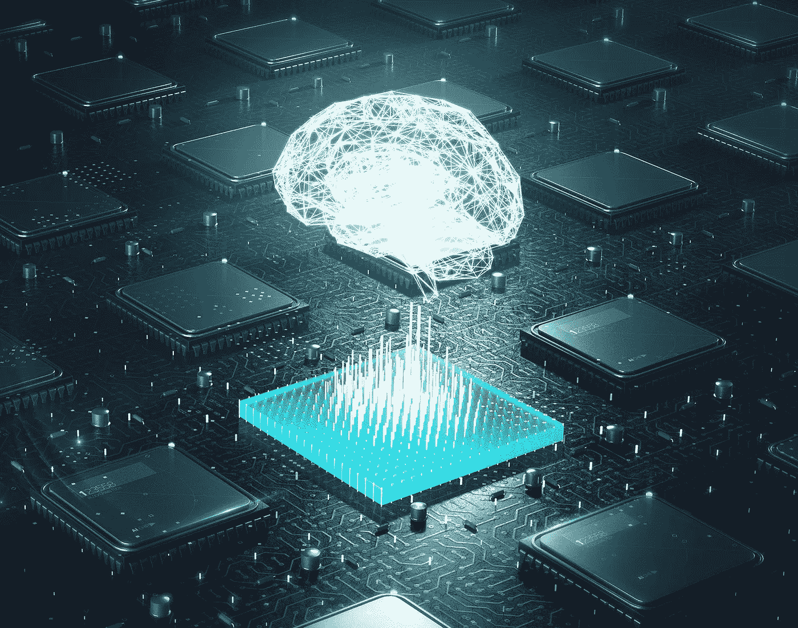
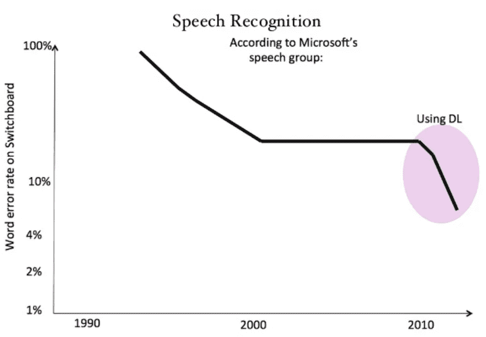
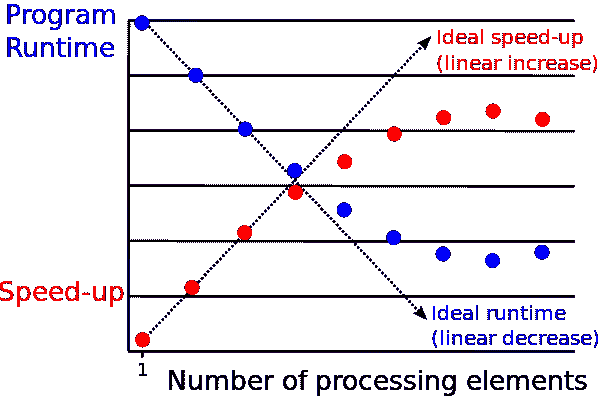
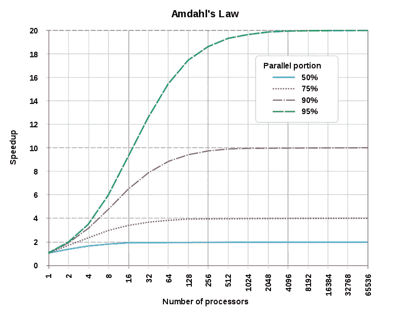
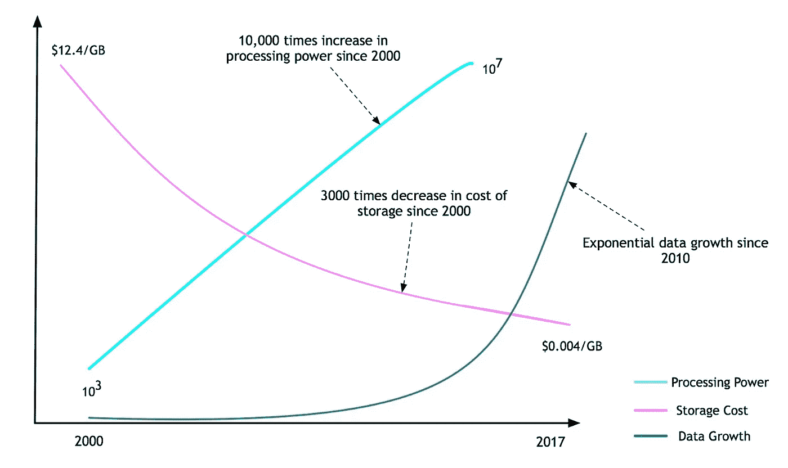
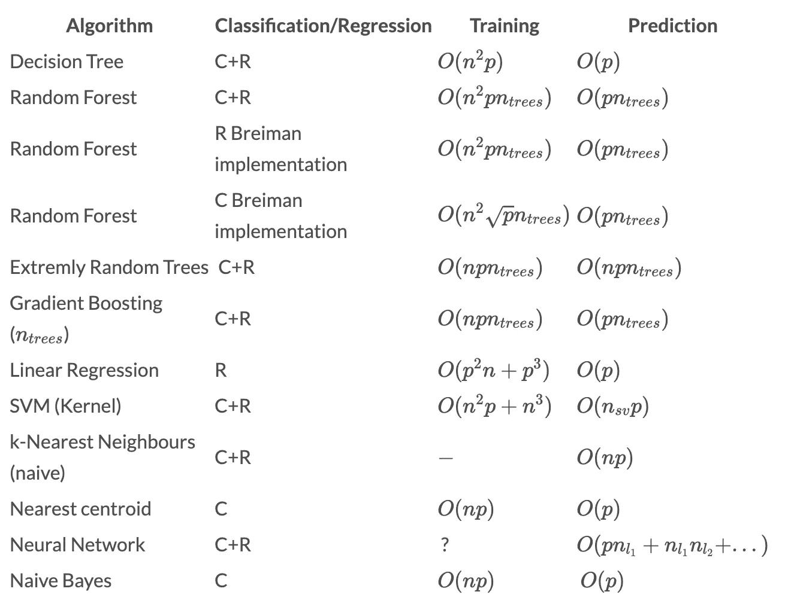
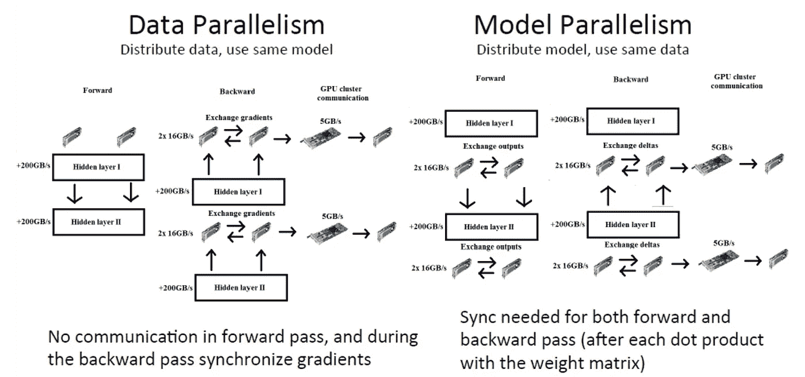
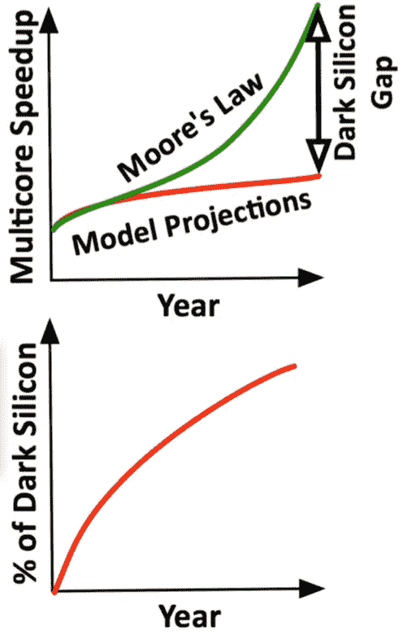

# 机器学习和数据科学计算的未来

> 原文：<https://towardsdatascience.com/the-future-of-computation-for-machine-learning-and-data-science-fad7062bc27d?source=collection_archive---------7----------------------->

## 数据科学家面临哪些挑战，研究人员如何应对这些挑战？

> "人脑比计算机消耗的能量少得多，但它却比计算机复杂得多。"—***全球政策杂志纳耶夫·阿尔·罗德汉***

**

***Source:** [https://www.nanalyze.com/2019/08/neuromorphic-computing-ai-chip/](https://www.nanalyze.com/2019/08/neuromorphic-computing-ai-chip/)*

*在这篇文章中，我将讨论计算科学目前面临的挑战和预期的未来趋势，以及它们对数据科学和机器学习领域的影响。这包括 Dennard scaling 的崩溃——摩尔定律的放缓，物联网(IoT)的新兴领域，以及模仿人脑的更节能计算的出现，即所谓的神经形态计算。*

# *趋势*

## ***深度学习***

*深度学习在现代世界已经无处不在，几乎在每个领域都有广泛的应用。正如所料，人们已经开始注意到，随着深度学习被企业广泛采用，其背后的宣传也在继续增加。深度学习由具有多个隐藏层的神经网络组成，并且在计算资源方面有一些特别苛刻的需求:*

*   *10 亿个参数来训练。*
*   *计算强度随着网络深度的增加而增加*

*深度学习在语音识别、计算机视觉和文本理解的一些重要任务中取得了巨大成功。*

**

*The apparent success of deep learning in the field of speech recognition.*

*深度学习的主要缺点是其计算强度，需要高性能的计算资源和长的训练时间。对于面部识别和图像重建，这也意味着使用低分辨率图像。研究人员打算如何解决这些大型计算问题？这种方法的瓶颈是什么？*

## *物联网*

*未来几年，预计将有 200 亿个嵌入式设备投入使用，包括智能冰箱、电话、恒温器、空气质量传感器、锁、狗项圈，这个名单令人印象深刻。这些设备中的大多数将由电池供电，并且在存储器和计算能力方面受到严重的资源限制。尽管有这些限制，这些设备需要执行智能任务并且易于使用。*

*物联网设备的预期普及带来了重大担忧，特别是关于这些设备的安全性(也许未来的罪犯将是黑客，他们可以侵入我门上的智能锁)。这也预示着数据驱动的深度学习的到来。深度学习已经需要大量的数据，但大规模联网设备或传感器的出现开辟了新的研究途径——特别是在我自己的环境科学领域，该领域正日益朝着低成本和大规模传感器网络的方向发展，以监测大气污染物。*

*这个想法也延伸到了智能手机上。智能手机正变得越来越强大，现在在计算能力上可以与一些老式笔记本电脑相媲美。机器学习越来越多地在这些设备上执行。尽管有所改进，但它们的计算资源仍然有限，因此减少计算和数据开销的趋势在这些设备上越来越重要。*

*这种想法也延伸到自动驾驶汽车，经过长时间的研发，自动驾驶汽车开始商业化。自动驾驶汽车存在自己的问题，但仍然受到同样的关注，其中最受关注的是车辆的安全性和道德基础。*

*更多的数据意味着更多的数据科学(对数据科学家来说！)，但这也意味着需要存储和处理这些数据，并通过无线网络传输这些数据(我要补充的是，要做到安全)。如何解决与物联网相关的问题？而且出了问题谁的责任？*

## ***云计算***

*公司越来越倾向于使用云计算，以便外包其计算需求并最大限度地降低成本。*

*这也有助于公司(尤其是初创公司)降低与购买基础设施相关的资本成本，并将其转移到运营成本中。随着计算密集型和需要高性能系统的机器学习和数据科学的日益普及，以及大多数公司在线业务的不断增加，基于云的分布式计算的这一趋势预计不会很快放缓。*

## ***缩放计算量***

*在仅适度增加能耗的情况下扩大计算规模是一项艰巨的任务。我们需要深度神经网络的这种平衡计算缩放，以最小化它们的能量开销。*

*当前的解决方案是并行使用许多小型、高能效的计算节点来适应大型计算。*

## ***减少能源使用***

*在仅适度降低结果质量(例如，预测准确性)的情况下缩减能量正成为日益重要的任务。物联网设备和可穿戴设备需要这种平衡的能源扩展。这些考虑与一个叫做*近似计算*的新领域有关，这个领域用付出的努力来权衡质量。*

*目前的解决方案是协调使用多个小型节能计算节点来支持智能计算。*

## ***更多数据***

*数据趋势显然不会很快停止！然而，关于这一点的讨论应该有它自己的一节。*

# *数据过载*

*过去二十年的数据爆炸现在意味着**人类每两天**产生的数据量相当于截至 2003 年全人类的数据量。计算趋势表明，我们现在处于亿亿级数据(指 10 亿千兆字节规模的数据计算)和亿级计算(指每秒能够执行 10 次⁸计算的计算机)的区域。*

*谷歌、亚马逊、微软和脸书等所有大型在线存储和服务公司持有的数据总和约为 4800 Pb(4.8 EB)。*

*分析大型数据集(甚至几千兆字节)需要不同的方法在本地笔记本电脑上运行模型——试图这样做只会使您的计算机崩溃。*

***并行化***

*目前，处理高成本计算的标准方式通常是使用*超级计算机*(用于**大计算**任务，需要大量计算能力)，或者使用*大型分布式系统*(用于**大数据**任务，需要大量计算内存)。*

***在不久的将来，如果你想分析大型数据集，你将基本上别无选择，只能转向并行计算。***

*分布式系统在某种程度上工作得很好，但是一旦我们接近具有 1000 个节点的集群(集群中的单个计算机)，分布式系统很快就会崩溃。集群中的大部分时间都花在了通信上，这导致了降低系统整体计算速度的开销。这种现象被称为**。***

****

**Illustration of parallel slowdown — initially, we see an improvement in the speedup as the number of processors increases. This relationship breaks down for large numbers of processing elements due to a communications bottleneck (too many people talking, not enough work being done). [Source](https://en.wikipedia.org/wiki/Parallel_slowdown)**

**我们遇到的另一个复杂问题是我们的计算中可并行化的比例，这由 [**阿姆达尔定律**](https://en.wikipedia.org/wiki/Amdahl%27s_law) 描述:**

> ****阿姆达尔定律**指出，在并行化中，如果 P 是系统或程序可以并行的比例，1-P 是保持串行的比例，那么使用 N 个处理器**可以实现的最大加速是** 1/((1-P)+(P/N))。**

**通俗地说，我们的最大加速取决于程序中必须顺序执行的部分——不可并行的部分。如果我们 50%的计算是可并行化的，那么我们得到的加速比如果我们的程序是 95%可并行化的要少得多。这种现象如下图所示。**

****

**Amdahl’s law, illustrated. As the number of processors we have available increases, we reach a bottleneck which depends on the serial portion of our algorithm. [Source](https://en.wikipedia.org/wiki/Amdahl%27s_law)**

**对于令人尴尬的并行计算*，这个问题消失了，这意味着程序是 100%可并行化的，并且本质上是独立的——例如，测试神经网络的不同超参数。***

> ******注:*** *并行计算和分布式计算有什么区别？* ***并行计算*** *是在共享内存上同时使用多个计算节点。* ***分布式计算*** *是同时使用多个计算节点，每个节点都在各自的内存上工作。****

***如今，支撑许多企业在线系统的分布式计算系统在云上随处可见，企业将大部分计算基础设施卸载给亚马逊和微软等大型云公司，以实现更轻松、更廉价的维护。***

***超级计算机运行良好，但运行和维护起来极其昂贵，而且需求量很大。在哈佛这样的大学里，实验室可以使用一定比例的计算资源，这些资源可以在小组成员之间共享。然而，租赁费用非常昂贵。在环境科学领域，以每小时的时间分辨率运行一个月的全球气候模型可能需要几周的时间，这可能是极其昂贵的。***

***计算能力一直是一个问题，但如今最大的问题是我们拥有的数据变得太大而无法处理。即使我们假设摩尔定律仍然成立(这将在下一节讨论)，数据生产也是指数级的，而摩尔定律是线性的。如果计算强度足够大，可用于处理的数据量会很快使任何通用计算机或集群中配置在一起的一组计算机丧失能力。***

******

***Computing trends in processing power, storage cost, and data growth. [Source](https://medium.com/@rpradeepmenon/an-executive-primer-to-deep-learning-80c1ece69b34)***

***如果您有一千台计算机同时运行来管理您企业的数据库服务器，云计算并不便宜，但至少它是可行的。另一方面，您希望如何在 100 的数据集上执行业务分析？磁盘空间便宜得令人难以置信，但内存却不是，您的数据必须在内存中才能被分析。***

***幸运的是，我们至少可以通过所谓的 [*挂钟时间*](https://en.wikipedia.org/wiki/Elapsed_real_time) *来估计一次计算(也可以扩展到数据)可能需要多长时间。这可以通过首先找到你的计算的计算复杂性来完成:****

****CC = CD*N *T****

*   ***CC =计算复杂度(Flops 数)***
*   ***CD =计算密度(# Flops/site/step)***
*   ***N =域大小或数据点数量(站点数量)***
*   ***T =时间步数或时期数(步数)***

***要计算挂钟时间，您需要知道笔记本电脑的处理能力(例如 1 GFlops/s)。然后:***

****WCT = CC /处理能力****

***例如，如果你在 2D 网格上用 1000 个数据点进行 1000 时间步的计算，你将在每个网格点上进行 6 次计算。这具有 6 万亿次浮点运算的计算强度，在 1 GFlops/s 的笔记本电脑上大约需要 6000 秒(约 2 小时)。***

***有关各种不同机器学习算法的计算复杂性列表，请参见下表。***

******

***Computational complexities of machine learning algorithms. [Source](https://www.thekerneltrip.com/machine/learning/computational-complexity-learning-algorithms/)***

*****在你做大型计算之前，估计一下你的挂钟时间！*****

***可以看出，时间与计算次数成比例增加，这与(1)数据点的数量，或(2)计算域的大小有关。***

***机器学习中的并行化有多重要？事实证明这非常重要。这有两种可能发生的方式:***

*   *****数据并行—** 分发数据，使用相同的模型。***
*   *****模型并行** —分布模型，使用相同的数据。***

******

***Data parallelism vs model parallelism.***

***人们期望如何处理必须分析的日益庞大的数据量？有许多选择，尽管这并不详尽:***

*****【1】**不要将“计算”移动到数据，而是将数据移动到“计算”。由于大规模分布式网络的存在，这在环境科学中有很大的推动力。***

*   *****边缘和雾计算** —在边缘设备上靠近数据源的地方进行计算。这将在物联网基础设施中变得非常重要。***

*****【2】**对工作负载进行分层划分，以产生可以分布的非交互式工作负载(对于交互式工作负载，并非总是可行)。***

*   *****网格计算** —想象在神经网络上执行超参数调整，并将一组超参数发送到一个计算集群，将另一组发送到第二个集群(模型并行性的示例)。这两个集群不通信，实际上是独立的。例如，这对于神经网络中的数据并行性(通常)是不可行的。***

*****【3】**高速通信、并行框架或分布式系统的时间管理方面的改进(这些已经很不错了！).***

*****【4】**使用专用硬件，如 ASICs(就像人们为比特币挖掘所做的那样，为特定计算优化硬件)、GPU 和 TPU。一个 GPU 可以在图形数据上提供 8 个 CPU 的性能，一个 TPU 可以像 8 个 GPU 一样有效-自然，它们并不便宜。***

***如何在自己的工作中实现并行化？***

***由于需要在可处理的时间范围内分析巨大的数据集，速度对于计算变得越来越重要。Python 是一种优秀的语言，是数据科学家使用的最流行的语言，但遗憾的是，它不是一种特别快的语言(首先，它是由*解释的*，而不是由*编译的*，这意味着代码被即时翻译成二进制代码*，这需要额外的时间)。****

****为了加速代码，并行化在大多数语言中都是可能的，这可以是添加额外处理器的形式，正如我们已经讨论过的，或者通过使用额外的*线程—* 如果您不熟悉，可以将这想象为打开两个相同的计算机程序，以便它们可以分担程序负载。这就是所谓的*多线程*，虽然对于大规模数据集来说用处不大，但它仍然可以提供很大的好处。最流行的实现之一是在 C++中使用的 OpenMP。****

***多线程是 Python 的一个重要问题，因为有一种叫做 GIL 的东西。我们不能使用 OpenMP，但幸运的是，有一个被形象地称为`multithreading`的多线程库可以使用。***

***处理器之间的并行化可以使用 MPI 来完成，并可以扩展到图形处理单元(GPU)以及使用其他并行框架(如 OpenACC)的更专业的设备(如 Google 的张量处理单元)。在云提供商提供的实例上设置这些相当容易(TPU 仅由 GoogleCloud 提供)。***

***如果处理图像，我强烈建议至少使用一个 GPU 进行计算。这可以将训练时间减少一个数量级——这就是等待一个小时和一整天的区别。***

# ***摩尔定律的终结(正如我们所知)***

***1965 年，英特尔联合创始人戈登·摩尔做出了一个预言，为我们现代的数字革命定下了基调。通过对一个新兴趋势的仔细观察，Moore 推断计算能力将会以指数级的速度急剧增加，而相对成本将会下降。***

***但预计未来的速度会更慢。2015 年 7 月，英特尔首席执行官布莱恩·科兹安尼克表示，*“半导体制造的指数级进步使得每两年一次的计算和存储变得更快、更便宜，现在这一速度将接近每两年半一次”。****

***如前所述，人们现在致力于开发新的架构和计算模型，利用并行处理来提供平衡的计算和能量调节，而不是继续让微处理器变得越来越强大。***

*****摩尔定律——CPU 上的晶体管数量每两年翻一番的现象——在某种程度上仍然可以观察到，但计算能力仍然与面积成正比的假设已经被认为是不成立的。这种功率密度缩放的假设被称为 [**丹纳德缩放**](https://en.wikipedia.org/wiki/Dennard_scaling) **。*******

*****Dennard scaling 粗略地指出，随着晶体管变得越来越小，它们的功率密度保持不变，因此功率使用与面积成比例:电压和电流都随长度成比例(向下)。*****

**********

*****[Source](https://www.cc.gatech.edu/~hadi/doc/paper/2011-isca-dark_silicon.pdf): Dark Silicon and the End of Multicore Scaling, 2011.*****

*****自 2005-2007 年左右，Dennard scaling 似乎已经崩溃，因此即使摩尔定律在那之后持续了几年，它也没有产生改善性能的红利。击穿的主要原因是，在小尺寸时，电流泄漏带来更大的挑战，并导致芯片发热。*****

*****有各种各样的热管理方法，从通过系统泵送 [Fluorinert](https://en.wikipedia.org/wiki/Fluorinert) ，到混合液体-空气冷却系统或具有正常空调温度的空气冷却。然而，这些方法只能在一定程度上起作用，之后唯一能做的就是选择芯片的某些部分来通电。*****

*****因此，为了将芯片温度保持在安全工作范围内，芯片的某些部分有时不通电。这些区域被称为*暗硅*。*****

*****需要能够动态选择芯片部件通电的设计——这是计算研究的一个活跃领域，将变得越来越重要。久而久之和摩尔定律继续偏离其最初的预测。*****

# *****神经形态计算*****

*****神经形态计算是模拟神经系统中存在的神经生物学架构的计算系统的开发。*****

*****神经形态工程的一个关键方面是了解单个神经元、电路、应用和整体架构的形态如何创建理想的计算，影响信息的表示方式，影响对损伤的鲁棒性，整合学习和发展，适应局部变化(可塑性)，以及促进进化变化。*****

******形态*被定义为处于特定的形状或形式。*神经形态*指具有神经元的行为。*****

*****在 1990 年 IEEE 召开的名为*神经形态电子系统*的会议上，首次引入了神经形态计算的概念。诉讼称:*****

> *****“人脑有 10 个⁶突触，每 100 毫秒有一个神经脉冲到达每个突触。这意味着每秒钟有 10 次⁶复杂运算。在 1W 的功耗下(这里为了简单起见而不是 20W)，大脑每次操作只消耗 1/10⁶j——相比之下，终极硅技术每次操作都会消耗 1/10⁹ J。”*****

*****因此，预计通过实现神经形态计算，我们可能能够实现比我们当前的系统更节能几个数量级的计算。*****

*****推动节能计算有多种原因，而不仅仅是为了降低成本——尽管这只是一个原因。这也释放了硬件的计算，允许在更少的设备上完成相同数量的计算，这具有成本优势以及并行化的潜在优势。降低设备的总能耗对环境也有明显的好处。*****

*****神经形态计算的早期成果有很多例子:*****

*   *****神经网格是由斯坦福大学的 Kwabena Boahen 及其团队于 2005 年开发的多芯片系统(6000 个突触)。*****
*   *****具有紧急瞬态的快速模拟计算(FACETS)，2005 年(5000 万个突触)。*****
*   *****Torres-Huitzil 的 FPGA 模型，2005 年。*****

*****最新的努力之一是 IBM 的 TrueNorth。TrueNorth 每次运算消耗大约 1/10 J，而不是通用计算中的 1/10⁹ J。回想一下，对于人类大脑来说，这个数字是 1/10 ⁶ J。因此，我们还有三个数量级要走！*****

# *******最终意见*******

*****总之，计算的未来看起来将包括加速计算，以处理数据生产中无情的指数增长。然而，由于各种原因，提高单个处理器的速度很难，摩尔定律不可能永远适用——它越来越受到传热和量子力学的限制。并行计算将继续受到更大的推动，特别是 GPU 和 TPUs 等更专业的硬件，以及随着我们进入神经形态计算领域，更节能的计算将成为可能。*****

*****物联网设备的蓬勃发展带来了不同的挑战，这些挑战正试图通过边缘和雾计算等更以计算为中心的想法来应对。*****

*******免责声明**:我在这篇文章中没有提到量子计算，因为我不清楚这在不久的将来是否会成为可行的计算选择。*****

# *****更多主题*****

*****对于感兴趣的读者来说，还有许多其他值得注意的话题。我建议多看看这些，如果它们引起你的兴趣，它们可能在不久的将来变得很重要:*****

*   *****自动处理器*****
*   *****基于神经形态尖峰的计算*****
*   *****人工智能加速器*****
*   *****异构计算*****

# *****参考*****

*****门罗博士(2014 年)。“神经形态计算为(真正的)大时代做好了准备”。[*ACM*的通信](https://en.wikipedia.org/wiki/Communications_of_the_ACM)。**57**(6):13–15。[doi](https://en.wikipedia.org/wiki/Digital_object_identifier):[10.1145/2601069](https://doi.org/10.1145%2F2601069)*****

*****达曼德拉莫德哈(2014 年 8 月)。“具有可扩展通信网络和接口的百万脉冲神经元集成电路”。*科学*。**345**(6197):668–673。*****

*****米德·卡弗(1990)。[《神经形态电子系统》](https://authors.library.caltech.edu/53090/1/00058356.pdf) (PDF)。*IEEE 会议录*。**78**(10):1629–1636。土井 : [10.1109/5.58356](https://doi.org/10.1109%2F5.58356)*****

*****金·阿姆达尔(1967 年)。[“单处理器方法实现大规模计算能力的有效性”](http://www-inst.eecs.berkeley.edu/~n252/paper/Amdahl.pdf) (PDF)。AFIPS 会议记录(30):483–485。[doi](https://en.wikipedia.org/wiki/Digital_object_identifier):[10.1145/1465482.1465560](https://doi.org/10.1145%2F1465482.1465560)。*****

*****戴维·罗杰斯(1985 年 6 月)。[“多处理器系统设计的改进”](https://dl.acm.org/citation.cfm?id=327215)。 *ACM SIGARCH 计算机架构新闻*。美国纽约州纽约市: [ACM](https://en.wikipedia.org/wiki/Association_for_Computing_Machinery) 。**13**(3):225–231。[doi](https://en.wikipedia.org/wiki/Digital_object_identifier):[10.1145/327070.327215](https://doi.org/10.1145%2F327070.327215)。[国际标准书号](https://en.wikipedia.org/wiki/International_Standard_Book_Number)0–8186–0634–7。[ISSN](https://en.wikipedia.org/wiki/International_Standard_Serial_Number)0163–5964*****

*****罗伯特·登纳德；弗里茨·盖恩斯伦；余、华年；赖德奥特，狮子座；欧内斯特·巴索斯；安德烈·勒布朗(1974)。[“极小物理尺寸离子注入 MOSFET 的设计”](http://www.ece.ucsb.edu/courses/ECE225/225_W07Banerjee/reference/Dennard.pdf) (PDF)。IEEE 固态电路杂志。 **SC-9** (5)。*****

*****凯蒂·格林(2011)。[“一个新的改进的摩尔定律:在“库米定律”下，每一年半翻一番的是效率，而不是功率”](http://www.technologyreview.com/news/425398/a-new-and-improved-moores-law/)。[技术评审](https://en.wikipedia.org/wiki/Technology_Review)。*****

*****波尔，马克(2007)。[“Dennard MOSFET 缩放论文 30 年回顾”](http://www.eng.auburn.edu/~agrawvd/COURSE/READING/LOWP/Boh07.pdf) (PDF)。固态电路学会。检索于 2014 年 1 月 23 日。*****

*****哈迪·伊斯玛伊尔泽达；布莱姆，艾米莉；蕾妮·圣阿曼特；Sankaralingam，Kartikeyan 伯格，道格(2012)。[“暗硅和多核扩展的终结”](http://www.cc.gatech.edu/~hadi/doc/paper/2012-toppicks-dark_silicon.pdf) (PDF)。*****

*****乔尔·赫鲁斯卡(2012 年)。[“CPU 扩展的死亡:从一个内核到多个内核——以及我们为何仍停滞不前”](http://www.extremetech.com/computing/116561-the-death-of-cpu-scaling-from-one-core-to-many-and-why-were-still-stuck)。[极限技术](https://en.wikipedia.org/wiki/ExtremeTech)。检索于 2014 年 1 月 23 日。*****