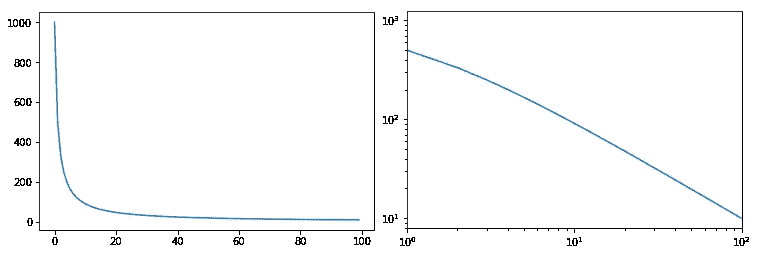

# 数据的未来是假的

> 原文：<https://towardsdatascience.com/the-future-of-data-is-fake-694d2aa0d3d5?source=collection_archive---------14----------------------->

前几天，我和一位在旧金山工作的数据科学家同事共进午餐。我们分享了关于生活和工作的故事，并发现自己对那些经常没有足够数据的情况感到同情。这似乎一直都在发生。有时是因为你正在做一个刚刚起步的项目。其他时候，你会发现自己在和一家老公司打交道，这家公司收集的有用信息还没有他们认为的一半多。有时候，你的客户*有数据，但远不足以训练他们想要的智能机器学习解决方案。在所有情况下，模式都是相同的:没有足够的点来生成干净的结果，所以您最终只能用胶带和试探法拼凑出一个解决方案。*

然后我突然想到:整个全球数据科学的努力都有一个问题。T2 永远不会有足够多的好数据，因为它在世界上的分布不可避免地是无尺度的 T4。这一事实将影响我们从事的每一个项目，并塑造科技行业试图实现的一切。它还告诉我们一些关于数据科学将如何作为一门学科发展的非常重要的事情，以及我们可能能够在职业生涯中增加价值的地方。简而言之:我们可以将数据科学应用于数据科学本身，并预测未来。

对于那些不熟悉术语*无标度分布*的人，我应该回顾一下并解释一下。无标度分布是密度函数遵循幂律的分布。换句话说，对于 k 的某个值，f(x)=ax^-k，你可能会说，很好，但那实际上意味着什么呢？

首先，这意味着在群体中有大量的小物体，中等大小的物体，以及大的离群点的稀疏分散。更重要的是，这意味着分布*没有平均值*。

An example power-law (Zipf) distribution, and the same function appearing as a straight line on a log-log plot (image via Matplotlib)

如果你没有处理过这种数据，你可能会想知道我在说什么。当然，你总是可以将你的总体中的值相加，然后除以项目的数量，不是吗？是的，但是在这种情况下，这个过程不会产生有意义的值。这是因为无标度分布没有集中趋势。很难说你下一步会遇到什么值，因为无论你看什么样的值，总是会有更多的点对应于较小的值，而更少的点对应于较大的值。

遵循这种模式的现象多得惊人。例如，城市规模的分布遵循一种特殊的幂律模式，称为[齐夫定律](https://en.wikipedia.org/wiki/Zipf%27s_law)。世界上任何一种语言的词频也是如此。幂律决定了外层空间岩石的大小，决定了你想检查的任何哺乳动物的血管大小，决定了自文明出现以来人类冲突中的死亡人数。尝试 Geoffrey West 的优秀著作 [Scale](https://www.amazon.com/Scale-Universal-Innovation-Sustainability-Organisms/dp/1594205582) 中引人入胜的解释。

从我们的角度来看，最重要的是，公司规模的分布也遵循这一模式，人们对网站和社交媒体平台的关注也是如此。因此，整个科技行业收集的数据不可避免地以同样的方式汇总。因此，即使全球数据分布(如果我们能够测量的话)最终证明不完全是*无标度的，它也会如此接近，以至于没有区别。这解释了为什么少数组织淹没在数 Pb 的信息中，而我们大多数人却没有足够的信息。*

我们都熟悉来自谷歌和网飞的故事，这些故事讲述了他们从堆积在门口的大量信息中获得的聪明见解。我怀疑我们中的许多人都想知道，尽管我们现在应该生活在大数据时代，并且已经生活了好几年，但为什么这些漂移还没有在我们最喜欢的项目面前积累起来。现在我们知道为什么了。这是因为谷歌和网飞是分布中的巨大异常值，而地球上几乎所有其他组织都填充了它们背后的曲线。

这种分布还告诉我们，抛开乐观的预期，这种情况不会改变。为什么不呢？因为在社会系统中出现的无尺度分布通常是由一个叫做*优先依附*的过程驱动的。

引用维基百科的话:*优先依附过程是一类过程中的任何一种，其中一些数量，通常是某种形式的财富或信用，根据他们已经拥有的多少在许多个人或物体之间分配，因此那些已经富裕的人比那些不富裕的人得到更多*。

换句话说，数据革命不会像我们承诺的那样让大数据变得无处不在，而是会在我们已经看到它的地方堆积起来。这是因为，造成当前全球信息失衡的机制基本上不可能自行逆转。与此同时，数据的价值正在上升，所以人们不会开始免费赠送他们收集的数据。

这意味着，我们需要训练我们一直在构建的聪明的机器学习模型*的所有可爱内容不太可能出现在*。而那些已经拥有足够多的人最终会拥有超出他们能力范围的东西。大数据的现实已经存在，而且非常不均衡。

但是等等！消息并不都是坏的。事实上，我认为认识到这种模式的存在是解决问题的一半。这是因为虽然获得足够的真实数据通常很难，但生成虚假数据却很容易。事实上，过去几年我在 productOps 工作过的一些最令人兴奋的项目根本不需要任何外部数据，因为我一直在做这些数据。事实证明，如果你想在大规模管道投入使用之前对其进行测试，你可以做的最有用的事情之一就是模拟你认为你将会看到的流量。

当然，用虚假数据进行测试并不是什么新鲜事，但使用它的理由比以往任何时候都更加充分。简而言之:*能够弥补数据短缺，并有能力按需生成现实的新数据，这是有职业价值的*。事实上，我怀疑我们即将迎来一场虚假的数据革命。

考虑机器学习中生成性对抗网络的兴起。当我们使用 GANs 时，我们有效地用机器生成的内容来补充不充分的训练集，机器的工作是提供可信的人工样本，结果通常是[显著的](https://www.kdnuggets.com/2019/04/rise-generative-adversarial-networks.html)。与此同时，其他旨在限制训练材料的人工智能工具也在稳步发展，例如出色的[通气管](https://github.com/HazyResearch/snorkel)项目。

在金融科技领域，模拟市场行为的重要性至少十年来一直在增长。伯努瓦·曼德尔布罗的精彩著作《市场的不端行为》于 2007 年出版，如果说他用分形对时间序列建模的研究的影响没有立即显现，那么在随后不久的信贷危机结束时，这种影响肯定会显现出来。

然而，对于我们中的许多人来说，搜索互联网仍然是代理训练数据的最佳来源，尤其是在 NLP 项目中。但我无法想象这种情况会持续多久。随着最近由 Judea Pearl 的工作引发的统计学因果革命的加速，构建工具来产生合成数据以测试任何管道的功能限制将变得越来越容易。

因此，当发现自己生活在一个被不可磨灭的数据鸿沟所充斥的世界时，我并没有感到沮丧，而是感到乐观——甚至兴奋。我自己在复杂系统研究方面的背景推动了我如何在 productOps 建立数据科学团队，我很高兴地说，模拟构建是我们擅长的事情。但我的兴奋不止于此。我一直怀疑模拟可能会推动数据科学的未来，因为模拟使人们能够以静态模型无法做到的方式探索大规模决策的影响。现在我确定这就是我们要去的地方，我很高兴。

大数据已死。大(假)数据万岁！