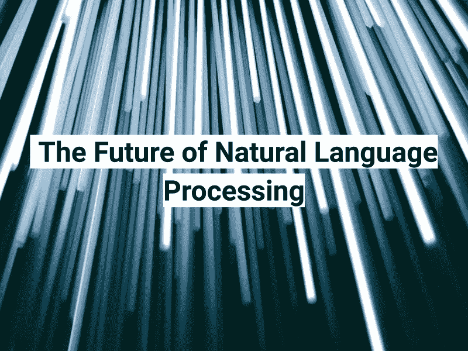
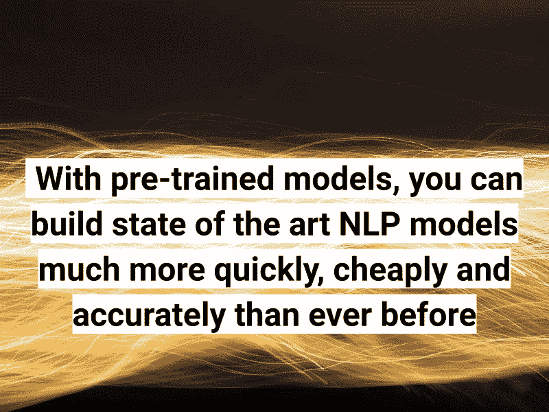

# 自然语言处理的未来

> 原文：<https://towardsdatascience.com/the-future-of-natural-language-processing-2fb35d6ed11e?source=collection_archive---------12----------------------->

数据(和计算机)科学家长期以来一直致力于提高算法从自然(人类)语言中获取意义的能力——无论他们是试图创建一个机器人来回答用户在其网站上的问题，还是确定人们是喜欢还是讨厌他们在 Twitter 上的品牌。

坏消息是，您仍然需要理解大量的概念来优化您的结果。好消息是，有了像 BERT 和 ERNIE 这样的工具，从自然语言处理(NLP)中获得好的结果比以往任何时候都更容易——即使数据集和计算预算适中。另外，谁不想和芝麻街剧组一起做 NLP 呢？！

# 自然语言处理简史

让我们先简要回顾一下这门学科的历史。可以将 NLP 系统的开发分为三个主要阶段:

*   **规则引擎** —在早期，大多数 NLP 系统都是基于复杂的手写规则集。好消息是它们很容易理解，但是它们做得不是很好(它们是可以解释的，但是不是很准确)
*   **统计推断**——在 80 年代，研究人员开始使用词性标注(标注名词、动词等),使用隐马尔可夫模型返回统计上可能的含义以及单词之间的关系
*   **深度学习**——在过去的十年里，神经网络已经成为解决大多数非平凡的 NLP 问题的最常见方式，分层技术，如 [CNN](https://en.wikipedia.org/wiki/Convolutional_neural_network) 、 [RNN](https://en.wikipedia.org/wiki/Recurrent_neural_network) 、 [LSTM](https://en.wikipedia.org/wiki/Long_short-term_memory) ，以提高特定类别的 NLP 任务的性能

深度学习在过去十年中改变了 NLP 的实践。无论你是在尝试实现机器翻译、问题回答、短文本分类还是情感分析，都有深度学习工具可以帮助解决这些问题。然而，从历史上看，创建正确的网络然后训练它的过程需要大量的时间、专业知识、庞大的数据集和大量的计算能力(这是昂贵的)。

# (机器)用芝麻街学习

NLP 的整个"[芝麻街](https://www.sesamestreet.org/)"革命始于 2018 年初一篇讨论 [ELMo](https://allennlp.org/elmo) 表象的论文(ELMo 代表**E**embeddings from**L**language**Mo**dels)。ELMo 是一种[技术](https://arxiv.org/pdf/1802.05365.pdf)，它使用深度双向语言模型，在大型文本语料库上进行预训练，以提高一系列 NLP 任务的性能。

那是什么意思？我们来分解一下。“深度”指的是它使用多层神经网络的事实(如“深度学习”)。双向？历史上大多数语言模型都是单向的，所以对于英语来说，他们会从左向右读单词。在双向模式下，所有的单词被同时接收。这允许在给定充分训练的情况下更准确地推断上下文。预训练意味着已经在非常大的通用语言数据集上训练了模型。在图像识别和 NLP 中，预训练已经被证明能够显著提高精度和/或减少模型最终训练所需的时间和成本。

# 谷歌的伯特

2018 年 11 月，谷歌[开源了 BERT](https://ai.googleblog.com/2018/11/open-sourcing-bert-state-of-art-pre.html) 。BERT 代表**B**I directional**E**n coder**R**代表来自 **T** 变压器。这是一种情境预训练的新技术。上下文意味着它考虑了给定单词周围的单词，因此与流行的 [Word2Vec](https://en.wikipedia.org/wiki/Word2vec) 模型等上下文无关的模型不同，在 BERT 中，bank 在“银行帐户”和“河岸”中不是同一个概念。

BERT 利用了许多现有方法的概念，包括 ELMo 和 [ULMFiT](https://arxiv.org/abs/1801.06146) 。BERT 的核心进步是它屏蔽了任何给定输入短语中的不同单词，然后估计各种单词能够“填充该槽”的可能性。

除了打破处理基于语言的任务的多项记录，包括其在斯坦福问答数据集上的表现，BERT 还大大降低了训练语言模型的成本和复杂性。正如他们在[的博客文章](https://ai.googleblog.com/2018/11/open-sourcing-bert-state-of-art-pre.html)、*中所说，“通过这个版本，世界上的任何人都可以在单个云 TPU 上在大约 30 分钟内，或者使用单个 GPU 在几个小时内，训练他们自己最先进的问答系统(或各种其他模型)”。*

要实现一个分类任务，比如情感分析(根据短语表达的主要情感对短语进行分类)，只需要在 Transformer 输出之上添加一个分类层。

对于需要将一个问题映射到大量文本中的答案的问答任务，需要为文本中任何给定问题的答案的起点和终点添加两个额外的向量。

对于命名实体识别(NER——识别特定实体，如人、公司或产品)，可以通过将每个令牌的输出向量输入预测 NER 标签的分类层来训练模型——因此它只是另一个分类器。底线是，即使只有很小的数据集和有限的预算和经验，使用 BERT，您也可以在很短的时间内创建一个最先进的 NLP 模型。

# XLNet

伯特的经营方式有几个弱点。通过将它屏蔽的单词视为独立的，它不会从训练数据中学习到尽可能多的东西，并且通过不将屏蔽令牌传递给输出，它会降低微调结果的有效性。

2019 年 6 月，谷歌大脑团队成员发表了 [XLNet 论文](https://arxiv.org/pdf/1906.08237.pdf)。XLNet 通过使用一种叫做“置换语言建模”的技术，避免了 BERT 遇到的问题。在置换语言建模中，模型被训练为像传统语言模型一样预测给定在前上下文的一个标记，但是它不是顺序预测标记，而是以随机顺序预测它们。底线是 XLNet 在许多关键的自然语言处理任务上超过了 BERT，并且提升了技术水平。

# 完成阵容

不甘示弱(无论是计算效率还是芝麻街引用)，2019 年 3 月，[百度研究团队](http://research.baidu.com/Index)推出了[厄尼](http://research.baidu.com/Blog/index-view?id=113)，随后在 2019 年 7 月推出了[厄尼 2.0](http://research.baidu.com/Blog/index-view?id=121) 。ERNIE 代表通过 k**N**owledge**I**nt**E**gration 得到的略微复杂的增强的表示，它汇集了 BERT 使用的许多概念，但也匹配来自其他资源(如百科全书、新闻渠道和在线论坛)的语义元素信息。例如，知道哈尔滨是中国黑龙江省的省会，并且知道哈尔滨是一个冬天有冰和雪的城市，当与像 BERT 这样的模型相比时，它可以在执行许多 NLP 任务方面做得更好，该模型将其对世界的知识限制在它被训练的文本上。虽然 ERNIE 方法的一些驱动因素旨在应对使用中文的独特挑战，但 ERNIE 2 在中文和英文的一些关键 NLP 任务[中似乎都优于 BERT 和 XLNet](https://www.infoq.com/news/2019/08/Baidu-OpenSources-ERNIE/)。

# 下一步是什么？

我们正处于 NLP 领域快速变化的时期，但在不到 18 个月的时间里，预训练深度学习解决方案已经至少有四项实质性突破，没有理由相信不会有更多的突破。

目前，下载源代码、使用 TensorFlow 运行一切、将最终层添加到网络并使用您的数据集对其进行训练仍需要一些时间。但是很明显，随着该领域的成熟，执行 NLP 的门槛将会降低，结果的质量将会继续提高——特别是对于小型数据集。

*原载于 https://flatironschool.com***。**