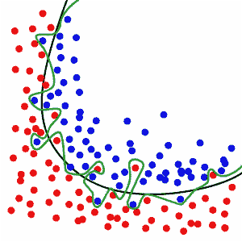
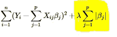

# 正规化的游戏

> 原文：<https://towardsdatascience.com/the-game-of-regularization-91442b3be862?source=collection_archive---------14----------------------->

## 机器学习中使用的不同正则化技术的直观解释

在机器学习中，正则化是一种通过在代价函数中添加惩罚项来解决过拟合问题的方法。我们先来了解一下，

什么是过度拟合，为什么它是一个问题。

在解决机器学习问题时，我们首先用训练数据训练我们的模型，最后概括解决方案(测试机器学习模型学习的概念在多大程度上适用于模型学习时看不到的特定数据点)。如果我们的模型太复杂，就会导致

较高的测试误差，尽管训练误差要低得多。但一个自然的问题是 ***为什么是*** ？ ***什么叫复杂型号*** *？*让我们以为例。

假设我们正在用逻辑回归模型解决一个简单的二元分类问题。让我们红色点是 A 类，蓝色点是 b 类。现在

source : wikepedia

如果我们试图完美地拟合我们的决策边界，也有可能我们也会拟合噪声点(潜在的异常值)。结果，模型将不会学习关于数据的适当模式(并且对于较小的数据集，它将仅仅记忆所有点)，这可能导致更高的概括(读取测试)误差。

为了避免模型中的过度拟合，我们添加了一个正则化项，这将有助于减少泛化误差。让我们列出我们拥有的各种选择:

1.  **L1 正则化**:如果我们看代价函数，L1 正则化是系数的绝对值之和。简单地说，添加它是为了保持值

cost function with L1 regularization

在一定范围内的成本函数。使用 l1 正则化的主要优点是它在解决方案中产生稀疏性(解决方案的大多数系数为零)，这意味着不太重要的特征或噪声项将为零。它使 l1 正则化对异常值具有鲁棒性。

2. **L2 正则化**:在 L2 正则化的情况下，我们添加以下的平方值

cost function with L2 regularization

系数而不是绝对值。在这两种方法中，lambda 是一个超参数，用于调整正则化。就结果而言，l1 和 l2 之间的主要区别在于，对于不太重要的特征，l2 项的系数将非常低，但决不会精确为零。

3.**弹性网**:当 l1 和 l2 正则项一起作为罚项时，称为弹性网正则化。

太酷了。但是 ***如何选择最适合我的正规化*** ？这主要取决于手头的问题。我们总是可以借助交叉验证来为特定问题选择性能更好的方法。对于大维度数据，l1 通过为不太重要的特征赋予零系数来提供更好的特征可解释性。

# 结束注释:

在本文中，我们讨论什么是过拟合，以及我们如何使用正则化来最小化泛化误差。在广泛的机器学习中，你会发现这只不过是一个偏差方差权衡的游戏，模型拟合得越好，结果就越好。希望这篇文章能帮助你掌握基本知识。快乐学习！

**参考文献:**

如果你想深潜，请点击下面的链接

1.  [http://enhancedatascience . com/2017/07/04/machine-learning-explained-regulatory/](http://enhancedatascience.com/2017/07/04/machine-learning-explained-regularization/)
2.  [https://developers . Google . com/machine-learning/速成课程/正则化稀疏化/l1 正则化](https://developers.google.com/machine-learning/crash-course/regularization-for-sparsity/l1-regularization)
3.  [https://stats . stack exchange . com/questions/184019/when-will-L1-regulation-work-better-L2-and-反之亦然](https://stats.stackexchange.com/questions/184019/when-will-l1-regularization-work-better-than-l2-and-vice-versa)