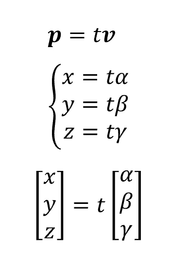

# 三维直线和平面的几何解释

> 原文：<https://towardsdatascience.com/the-geometric-interpretation-of-3d-lines-and-planes-e67b51351bfd?source=collection_archive---------11----------------------->

线性代数是微积分的一个分支，其对象在ℝ.之外这些对象可能是空间中的坐标(因此是点)或多元方程形式的点的组合。

每当我们处理超过 3 个维度的东西时，物理上是不可能将我们的对象可视化的。因此，在这篇文章中，我将提供一个 3D 环境中点、线、面的几何解释，这样你就可以将这些概念扩展到更高的维度。

一般来说，ℝn 是一个坐标空间，或者一组坐标，每个坐标都有 *n* 个分量。因此，在ℝ3 工作时，我们的坐标看起来会是这样的:

每个坐标在空间中可以表示为点或向量:

最后，这些对象的一个非常重要的属性是正交性:实际上，如果两组坐标/向量的内积等于 0，则称它们是正交的(这意味着垂直)。在我们的案例中:

现在，我们如何在 3D 空间中表示直线和平面呢？

## 直线

直线是一个没有宽度的无限物体，其特征在于方向 **v** 。让我们从一个简单的例子开始，一条线穿过我们的轴的原点。让我们考虑一条方向为 **v** 的直线 *r* 。我们想计算一般点 **p** 的那条线的一般方程。这个想法是我们需要拉伸我们的向量 **v** 直到点 **p** 。为此，我们将使用所谓的拉伸系数 t:

基本上，以向量 **v** 为度量单位，我们可以向相同方向(如果 t > 0)或相反方向(如果 t < 0)拉伸(或缩短)我们的向量 **v** 。因此，对于位于 r 上的一般点，我们有以下等式:

这个公式叫做直线的参数表达式。这是一个动态表达式，因为它描述了参考系统中的一条直线，并且它取决于 t。即，如果 t=时间，我们有一个起点(t=0)，那么将来会发生的事情(t>0)和过去已经发生的事情(t <0).

Now, imagine we want to define a line which does not pass through the origin of our axes, but always having direction **v** )。现在它将通过一个给定点 **q.** 所以我们要计算下图中红线的一般方程:

如果我们回忆一下如何计算两个向量之间的差:

我们可以如下进行。首先，让 **p** 是我们直线上的某个点 *r* 。然后，我们计算 **p** 和 **q** 之间的差，这将产生一个平行于 **v** 的向量(根据定义，它是我们直线 r 的方向)，但是偏移了某个值。因此:

其中, **q** 是我们向量的新原点。从上面的图片中，您可以看到 *t* 是大于 1 的正数(因为产生的矢量方向相同，但幅度更大)。新的等式将是:

其中偏移值等于新的原点。

既然我们已经清楚了直线的几何形状，让我们转向平面的几何形状。

## 飞机

平面是由两个特征表征的空间中的对象:

*   方向:它是一条与平面正交的直线。

对于每个方向，都有无限数量的平面:

因此我们需要第二个元素来隔离其中一个。

*   点:是直线穿过平面的点，我们称之为 **q** 。

现在，我们如何定义一个平面的方程？让我们分析位于该平面上的点的性质:

不管它们的位置如何，它们中的每一个与交叉点 **q** 之间的差必须垂直于方向 **v** 。因此，由于正交性，我们知道，考虑到一般点 **p** :

如果我们扩展上面的等式，我们得到:

请注意，如果红色括号中的组件为空，则平面将穿过原点。

## 让我们练习一下

我想用一个非常简单的例子来结束这篇文章，这个例子将帮助你想象这个任务，并使用直线和平面的概念。

假设我们有一个平面的方程，它的方向 v 和属于该平面的一个点的坐标。

我们要计算对称点 **k，k’**相对于我们平面的坐标。想法是这样的:

*   计算穿过 **k** 并与平面正交的直线 *r* 的参数方程:

*   求平面和直线相交点的参数 t 的值:

*   将获得的 t 的值加倍，这样我们就可以获得 **k'** 的值(实际上， **q** 与 **k** 和 **k'** 的距离相等):

## 最终考虑

将你管理的对象形象化是全面理解它们非常重要的一步。然而，在现实世界中，问题的变量往往不同于众所周知的*长-宽-高*。在经济场景中，我们被要求处理数百个变量，可能是商品、国家、市场、宏观经济因素等等。在这些情况下，不可能将你正在管理的东西可视化，但至少在 3D 环境中有这样的想法会使这些推理更容易、更直观。