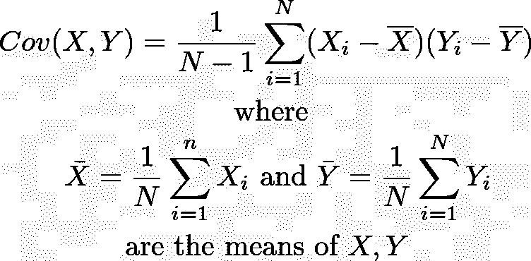
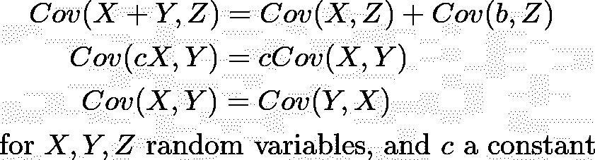
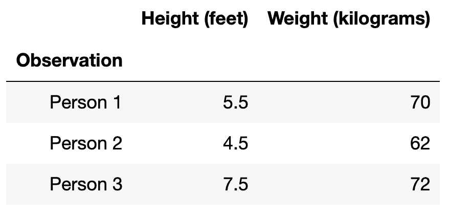
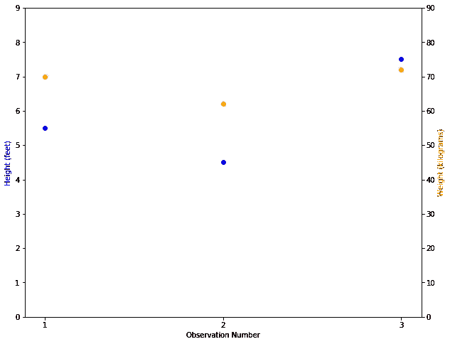
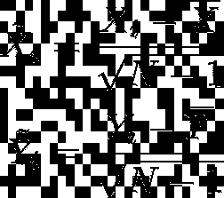
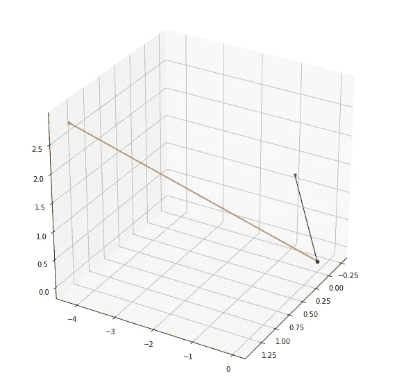
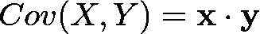
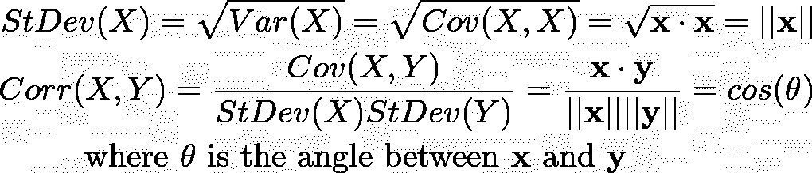

# 协方差的几何意义

> 原文：<https://towardsdatascience.com/the-geometric-meaning-of-covariance-f8e6df967111?source=collection_archive---------12----------------------->

## 统计学和数据科学中理解协方差的几何方法。

对于大小为 N 的样本，您可能以前见过类似于“样本协方差”的公式:

启发性地，协方差告诉我们随机变量 X 和 Y“一起移动”或“共变”(相对于“反变”)远离它们的均值多少。如果 X 和 Y 是独立的，那么我们期望 X 和 Y 在相同方向上的移动量与它们在相反方向上远离平均值的移动量一样多，这意味着协方差应该是 0。如果协方差为正，这大致意味着 X 和 Y 的协变大于反变，反之亦然，如果协方差为负。

协方差可能看起来有点迟钝，也许是任意的。你可能认识到它的一些数学特性，如双线性和对称性:

但是你可能很难想象它到底代表了什么。但事实证明，如果你熟悉线性代数，样本协方差有一个简单(也有点漂亮)的几何描述。我们将通过一系列简单的变换得到这幅图。

**第 0 步(背景):**我们要建立自己的背景。我们从收集具有 n 个观察值的样本开始，其中每个观察值记录两个连续变量的值:x 和 y。我们将观察值 I 上的变量 x 的值标记为 Xᵢ，将观察值 I 上的变量 y 的值标记为 Yᵢ.具体来说，也许 Xᵢ是你样本中第 I 个人的身高，Yᵢ是你样本中第 I 个人的体重。我们想知道:这两个变量是否以某种方式相互关联？

我们的示例数据可能如下所示:

Example of N=3 Observations

这些数据绘制在双轴上，如下所示:

请注意，当我们从一个观察点移动到另一个观察点时，橙色和蓝色的点似乎在一起移动。这表明在这个数据中身高和体重之间有很大的协方差。

**第一步(调整):**从每个变量中减去观察到的平均值，用 N-1 的平方根(比观察次数少一)重新调整:

减去平均值的原因相当简单:我们只关心 X 和 Y 如何偏离它们的平均值。除以平方根 N-1 有点复杂，但我们可以把它看作一个标准化步骤:我们希望样本中每个变量的均值的期望平方差和不依赖于样本的大小。这一标准化步骤使我们能够更容易地提取统计相关信息，并比较具有不同数量观察值的样本。使用 N-1 而不是 N 的原因称为贝塞尔校正，如果我们希望每个变量的均值的期望平方差和是该变量实际总体方差的“无偏估计量”,这是必要的。

但是你不需要理解前面的任何一段来理解这种转换:我们只是移动和重新调整我们的原始随机变量，得到的调整变量 X̃和 Ỹ都有均值 0。

第二步:到目前为止，我们一直认为 X 和 Y 是*属性*或*函数*(也就是说，身高和体重是为每个人分配一个实数的函数)。但是我们也可以认为 X̃和 Ỹ决定了存在于 N-1 维向量空间 v 中的向量 x 和 y，其中向量 v 定义为:

这里是 **x** 的第 I 个坐标(分别为。 **y** )正好是 X̃ (resp。Ỹ)进行第 I 次观察。向量空间 v 继承了ℝᴺ的一个内积(标准的点积)，所以 v 不仅仅是向量空间，它是 N-1 维的内积空间。

使用与上述相同的数据，我们可以绘制这两个向量 **x** 和 **y** 的图，对应于我们 N=3 次观察的“调整后的身高”和“调整后的体重”:

**第三步:**观察 X 和 Y 的样本协方差恰好等于 V 中对应向量 **x** 和 **y** 的内积(点积)！那就是:

如果这对你来说没有几何意义，回想一下线性代数中的点积与欧几里得的长度和角度概念有着错综复杂的联系。首先，一个向量与自身的点积的平方根，正好是那个向量的长度。第二，两个向量的点积是它们的长度乘以它们之间夹角的余弦的乘积。在符号中:

将此与“标准差”和“相关性”的统计定义相结合，我们得到以下两个恒等式:

这是什么意思？意思就是标准差无非就是观测值对应向量的长度(调整后)，相关性就是两个这样的观测值向量之间的夹角(调整后)就是它们之间夹角的余弦！

所以这些通常来源于协方差的标准差和相关性的概念，实际上只是两个观测向量之间的长度和(余弦)角度的花哨名称！希望这能给你一些协方差背后的几何直觉，揭开它的神秘面纱，哪怕只是一点点。