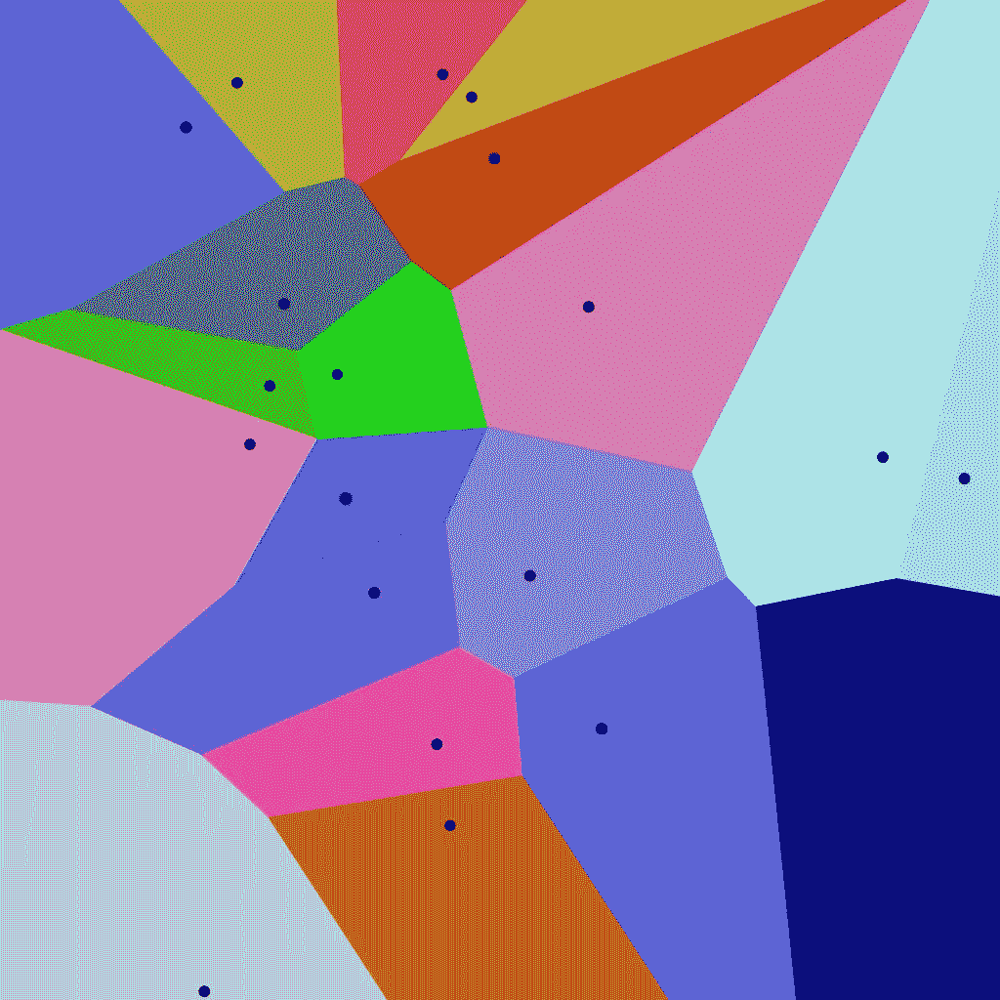
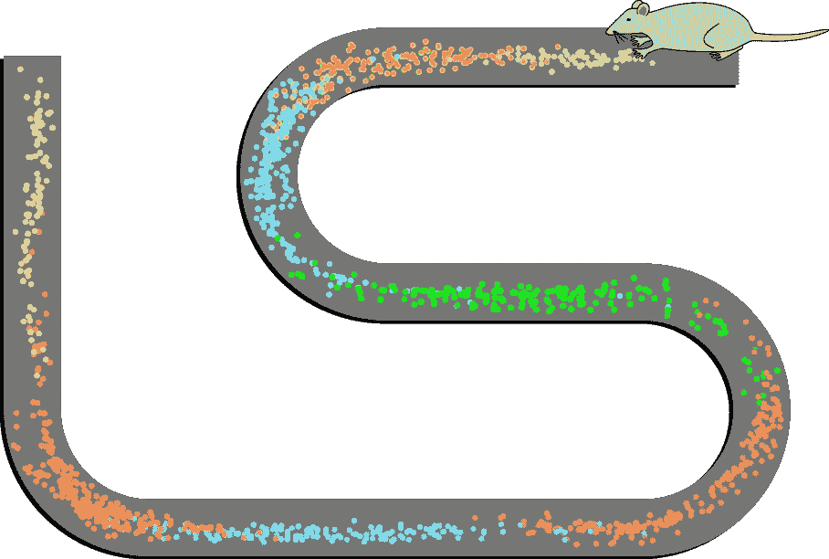

# 思维的几何学

> 原文：<https://towardsdatascience.com/the-geometry-of-thought-700047775956?source=collection_archive---------15----------------------->

## …大脑如何创造概念空间

By José Ferraz de Almeida Júnior [Public domain]

我们每天都在思考，但很难准确说出这个词的确切含义。当我们试图理解思想时，我们不得不通过思考思想本身来把握思想，这感觉是如此的难以捉摸和循环往复。

然后有一百种不同的方式来思考一件事。当你想到一个苹果时，你实际上会做什么？当想到红色时。当思考像爱、悲伤、骄傲、存在这样的抽象概念时。

维基百科将思想定义为一种“ ***有目的的想法和联想的流动，可以导致一个面向现实的结论”。***

想法的流动很容易观察到。想象一个苹果，看看会发生什么，哪些不同的感知维度呈现自己。红绿果皮的一瞥，难以定义的甜果味，也许还有一丝酸味，咬一口的脆响，果汁顺着手流下的感觉。

面向现实的结论很自然地给出了:我们不应该忘记，我们的思维是为了进化的目的而进化的。思想之所以存在，是因为它帮助生命核心的基因机器将自己推向未来。思想之所以存在，是因为它允许我们在我们所处的混乱世界中观察有用的、结构化的模式。把有用的信息从无关的信息中分离出来。

它有助于区分苹果和有毒的水果，了解苹果是否成熟并可以食用，了解苹果是什么，它有什么特性尽管你遇到的每一个苹果都略有不同。

能够比较苹果和橘子是有目的的。能够与你周围的人交流你的想法，告诉他们你的感受，你的所见，这是有意义的。

From the photograph you quickly inferred that these are apples. Photo by [Marina Khrapova](https://unsplash.com/@mimiori?utm_source=medium&utm_medium=referral) on [Unsplash](https://unsplash.com?utm_source=medium&utm_medium=referral)

我们在日常生活中经常需要完成某些任务，因此大脑被优化来完成这项工作。另一方面，我们不擅长做计算机真正擅长的“思考”(像 159476 乘以 6042034869 是多少这样的问题？).在逃离老虎时，解决像 159476 乘以 6042034869 这样的计算并不是我们需要解决的最相关的任务。

听到一些事情可以改变你对世界的看法，可以教会你新的思维方式，新的概念来表达世界的模式。这对你生活的整个社会都有价值。能够向其他人解释一些事情意味着更少的人每次都需要重新思考。

想到科学: ***私人知识变成公共知识*** 。

因此，一个社区内的人们需要就一个共同的概念框架达成一致，以便他们能够有效地将*传授给他们的后代，并作为一个整体社会快速调整。*

## *思维模式*

*为了给出“思想”的初步总结和工作定义(至少是一个非常相关的小节)，我们有*

1.  *由…定义的外部世界模式的分类*
2.  *…流畅且可快速学习的概念(这是苹果，这是桃子)*
3.  *…允许沿着许多不同的抽象维度对物体进行比较(这个苹果更大、更甜、更红、更圆，等等)。)*
4.  *…元认知:对概念框架本身有一个抽象的理解，并且能够在这个框架内进行推理*

*将它们与它们的进化功能联系起来，有助于我们理解它们为什么存在，以及它们最适合做哪些任务。毕竟，进化并不仅仅是为了娱乐我们而产生思维。*

*说到进化:我们能在其他更原始的认知功能中找到思维的“进化祖先”吗？*

****思维会不会进化出一个已经存在的基础设施来服务于一个不同的目的？****

## *架构和功能*

*大脑的运作与我们现象世界的内容密切相关，这是我们意识体验的世界。当有听觉刺激时，我们看到某些大脑区域的活动与对噪音的有意识体验相关。当我们看到一些东西时，我们可以追踪信号从视网膜到枕叶的移动，枕叶是视觉皮层的所在地。因此，思维在大脑中的实施方式应该与思维的功能和现象相一致。*

*人们经常强调，计算机的工作方式与大脑非常不同，这反映在它们的构造方式上。计算机到今天还是基于 ***冯诺依曼架构*** 。所有计算都是在 1 和 0 上进行的。输入计算机的数据被转换成 1 和 0，然后以特定的方式进行运算输出。输出类似地由 1 和 0 给出，然后被翻译回用户可理解的输出。冯·诺依曼架构原则上是基于图灵机*的架构，它在符号层面上操纵信息(更多细节，请参见我的[图灵机非技术性指南](https://medium.com/dialogue-and-discourse/a-non-technical-guide-to-turing-machines-f8c6da9596e5))。**

****

**Photo by [Markus Spiske](https://unsplash.com/@markusspiske?utm_source=medium&utm_medium=referral) on [Unsplash](https://unsplash.com?utm_source=medium&utm_medium=referral)**

**人工智能的研究关注的是制造会“思考”的机器。机器在从数据中学习模式、从非常高维的数据集中提取有用信息和相关特征方面已经变得更好了。**

**但是，计算机不会像学习抽象概念那样容易地应用于世界。他们通常在只看过一个样本后就无法理解什么是苹果。他们不能轻易地将不同的概念层相互联系起来，并在不同的概念之间进行比较。当面对新的挑战时，他们不能灵活地推理或调整自己的行为。**

**在我关于[蚂蚁和神经网络问题](/ants-and-the-problems-with-neural-networks-778caa73f77b)的文章中，我更深入地研究了认知过程的功能和它们最有效(推测)的计算实现之间的关系。假设思想的形状和形式应该以某种方式反映它的实现方式是有意义的。大自然在花费资源方面很吝啬，通常会挑选最有效的架构来完成这项工作。**

## **概念空间**

**在本文的其余部分，我将重点介绍由 ***彼得·加登福斯*** 在他的(非常恰当的标题)书*概念空间(* 2000)中介绍的概念空间的概念(也参见这篇[演讲](https://www.youtube.com/watch?v=Y3_zlm9DrYk&index=8&t=0s&list=PLuqpwpkBmbAlRIMRV3D-vN8Hy74_WavCc)了解一些我无法在此涉及的细节)。**

**如果你读过一些关于机器学习的东西，你可能对特征空间的概念很熟悉。您输入到网络中的数据在特征空间中表示。你把以颜色信息为特征的像素输入到一个网络中，让它根据感官输入(一只猫，一只狗，等等)做出判断。这是一种类似的东西，通过我们的感官获得的信息被我们的大脑处理。**

**概念空间现在被定义为由几个质量维度跨越的实体，其中多模态(多种类型的数据，如视觉和听觉组合)概念被表示。这些特征可以涵盖很大范围的东西，如大小、颜色、音高、音调、长度、明暗、温度、空间本身、味道、形状、甜味、酸味等。**

**一个 ***概念*** 则是概念空间中的一个 ***拓扑区域*** 。你可以认为它们是对 ***属性*** 的多维概括，就像红色一样，都是简单的一维特征。**

**拓扑意味着空间被划分的区域是完全连通的，并且满足某些几何性质，即它们是凸的。这意味着，如果点 z 位于点 x 和 y 之间，并且两者都属于同一个概念，那么该点也必须位于该概念中。**

**实现这一点的一种方式是通过所谓的 ***Voronoi 镶嵌*** ，这里显示为二维空间:**

****

**A Voronoi Tesselation of a two-dimensional space. Credit to Balu Ertl [CC BY-SA 4.0]**

**这些镶嵌将空间分割成从黑点向外辐射的凸起区域。你可以把它们想象成二维质量空间中概念的原始版本。**

**根据 Gardenfors 的说法，这些凸形镶嵌可以实现有效的交流，因为它们消除了不同子概念之间的任何模糊性(原型周围的空间形状清晰，没有任何空洞，如果你比较空间的不同元素并试图衡量它们有多相似，会造成混乱)。**

**比方说，一个维度是你发出的声音是如何发声的，另一个维度决定了声音是在你嘴里的哪个位置发出的。然后，镶嵌对应于从你听到的声音中推导出的字母概念，并映射到你正在听的人的舌头位置和发音程度上。**

**这可以让你对辅音 b 和 p，m 和 n，d 和 t 等进行分类。，取决于你的舌头在你嘴里的位置和你推的力度。请注意，提取这些信息对于语音识别软件(如语音转文本或苹果的 Siri 和亚马逊的 Alexa)至关重要，当然，对于我们来说，对于理解其他人来说也是如此。**

**镶嵌在中心有一些点，可以认为是给定概念的原型。有一种说“d”的方式可以清楚地表明你真的在说“d ”,而当人们咕哝着说外语时，有时很难将你听到的声音正确地映射到音节和单词上。**

## **高维概念空间**

**学习概念的能力表明概念空间的度量发挥了一些灵活性。例如，当我们了解到某些子维度对于分类来说比其他维度更重要时，它可以改变，从而使不同特征子维度的权重结构适应。**

**想想练习什么:我们可以放大一个空间，让它的细分越来越小。专业的品酒师可以比外行更细致地感知葡萄酒的味道，专业的音乐家可以轻松地在一首管弦乐作品中挑选出和弦和乐器。**

**众所周知，孩子们会从单个例子中过度概括概念，但同时，这也是有利的，因为他们不需要看到很多例子就能学到东西。随着时间的推移和更多例子的出现，概念变得越来越复杂。**

**概念学习是递增的。我们学习概念的方式是有层次的:我们可以将越来越多的抽象概念(比如你所生活的社会的规则)堆叠起来，这些概念由越来越多的特征和模式组成，当我们成年后，我们可以将它们之间越来越精细的区别具体化。**

**概念空间可以扩展到非常大的维度:我们已经讨论了一个苹果的例子，但是高维概念空间的学习也会导致有问题的过度概括，正如种族刻板印象所体现的那样。**

**塑造了如此多现代性冲突的种族观念可以用沃罗诺伊镶嵌图来思考:纳粹意识形态宣扬雅利安超人的至高无上(金发碧眼，体格健全，是代表雅利安种族概念的空间中心原型)。与那个生物足够相似的每个人都是群体的一部分，而在重要特征上不同的每个人都不是，而且被认为是劣等的。虽然事实证明，定义这些概念的特征是任意的，根本没有任何生物学事实为基础，但它们仍然被狂热的理论家们传播，并很容易被全国各地的大脑所了解。**

## **符号知识与次符号知识**

**撇开这些事情不谈，让我们回到思维的 ***几何*** 和它在大脑的 ***硬件*** 中的潜在实现之间的关系问题。**

**概念空间旨在弥合大脑中知识表征的符号和次符号理论之间的鸿沟。**

**纯符号思维不擅长概念形成:符号本身不一定意味着很多，相似性度量不能很好地从符号层次转移到语义层次。当你比较单词“nap”、“gap”、“rap”或二进制数字 100000 和 000001 时，它们在象征意义上相距不远，但在含义上不一定非常接近。在我们遗传密码的符号语言的情况下，编码蛋白质的 DNA 序列是非常随意的，并且没有任何功能基础(正如我在这里更详细地讨论的)。**

**因此，如果大脑通过操纵信息的符号表示来工作，它将很难处理其内容之间的相似性，而纯粹的子符号表示将很难流畅地学习新概念(这个问题在机器学习应用中经常遇到:在输入发生一些小的变化后，网络在分类它时变得完全无用，必须重新学习一切)。**

## **特征空间中的相似性和度量**

**概念空间避免了其中的一些问题，因为它们被建模为度量空间(具有距离度量的空间)。**

**它们有效地编码了空间内实体之间的相似关系。我们可以简单直观地回答这样的问题:这五个苹果中哪一个看起来最相似？你的朋友有多像布拉德·皮特？纽约和特拉维夫有多相似？这个单词听起来是不是有点像另一个单词？**

****

**How similar is Tel Aviv to New York? Photo by [Shai Pal](https://unsplash.com/@shaipal?utm_source=medium&utm_medium=referral) on [Unsplash](https://unsplash.com?utm_source=medium&utm_medium=referral)**

**这些问题的答案不能作为查找表硬连线到我们的大脑中:你可以想到无限多的可能关系/比较，所以大脑需要能够动态计算答案。**

## **空间表征与思维的起源**

**我们所知道的所有生命形式都发现自己生活在一个三维空间中(暂且忽略弦理论)，生活在这个三维空间中对我们的进化轨迹产生了影响。**

**在她的著作 ***中，心灵在运动******芭芭拉·特沃斯基*** 提出了九大认知定律。根据她的第六定律， ***空间思维是抽象思维的基础。*****

**潜在的假设是，我们首先进化出在三维空间中成功导航的能力，弄清楚我们在哪里，我们的身体在哪里，如何移动它们，等等。，并慢慢地开始回收已经存在的大脑区域，这些区域最初用于像在空间移动这样的任务，以实现新的思维方式。**

**我不能详细讨论这个假设，但我在这里提到它，因为概念空间的几何性质可以帮助更好地理解它，概念空间的神经生物学基础为它带来了一些令人信服的证据。**

## **大脑中的空间表征**

**大脑中的空间表征包含在它的功能结构中。2014 年诺贝尔医学奖授予了 ***奥基夫*** 和*陀思妥耶夫斯基* ，以表彰他们在 1971 年发现的位置细胞，结合 2005 年 ***爱德华和*** ***迈·布里特·莫泽*** 发现的网格细胞。**

**这些细胞的放电与动物(如老鼠或人类)的空间位置有关，它们被认为是一幅认知地图(见[这幅动画](https://knowingneurons.files.wordpress.com/2013/04/place-cell-animation.gif?w=1000&h=607,)中的插图)。这些细胞主要存在于海马体和内嗅皮层，它们负责记忆、导航和时间感知。**

**位置细胞的放电代表了动物在物理空间中的位置，这个位置通过位置细胞或网格细胞与相邻细胞的相互连接来反映。**

****

**Firing patterns of 8 place cells recorded from a rat. Colored dots show activity, with the color encoding which neuron fired. Credit to Stuartlayton at English Wikipedia [CC BY-SA 3.0]**

**它们的激发模式可以代表抽象的向量空间，而不仅仅是三维空间，因此它们的放电模式原则上可以编码各种空间信息(空间中的距离和位置)。因此，这些结构也可以用来编码非常不同种类的度量空间。**

**看起来大自然母亲很好地利用了这一点。**

**新的研究表明，抽象的概念空间是通过使用内嗅皮层和海马体中相同的位置和网格细胞基础设施来绘制的(更多详细信息，请参见这里的、这里的、这里的或这里的)，这些基础设施绘制了空间位置和方向。**

**因此， ***认知空间*** 的概念不仅是隐喻性的，因为用位置和网格单元实现它们允许大脑在抽象概念空间中编码位置，并有效地计算这些空间内的度量。**

**正如我在开始时指出的那样，这支持了这样一种观点，即我们应该找到证据，证明认知过程(如思维)的功能性与其在大脑中的计算和生物实现结构之间存在密切关系。**

**看起来抽象思维，至少在某种程度上，确实是从空间思维进化出来的。**

## **教机器思维的几何学**

**必须指出的是，这些理论仍然是新的，正在被充分充实，但我认为研究正指向令人兴奋的方向。
理解思维及其在空间感知中的起源可以为我们带来许多关于大脑高级认知功能的新见解。**

**同样，它可能会给如何构建智能系统带来新的动力，这些智能系统在处理信息和学习新事物的方式上发挥更多“类似人类”的特性。**

****

**Photo by [Brett Jordan](https://unsplash.com/@brett_jordan?utm_source=medium&utm_medium=referral) on [Unsplash](https://unsplash.com?utm_source=medium&utm_medium=referral)**

**例如，如果我们可以将深度神经网络与架构相结合，该网络致力于从([多模态](http://ai.stanford.edu/~ang/papers/icml11-MultimodalDeepLearning.pdf))输入数据中进行模式识别和信息提取，该架构受位置和网格单元的启发，允许有效映射从输入中提取的模式之间的相似性，并减少高阶概念的数据量学习，我们可能会教机器我们自己思想 的 ***几何，从而教它们变得越来越像我们。*****