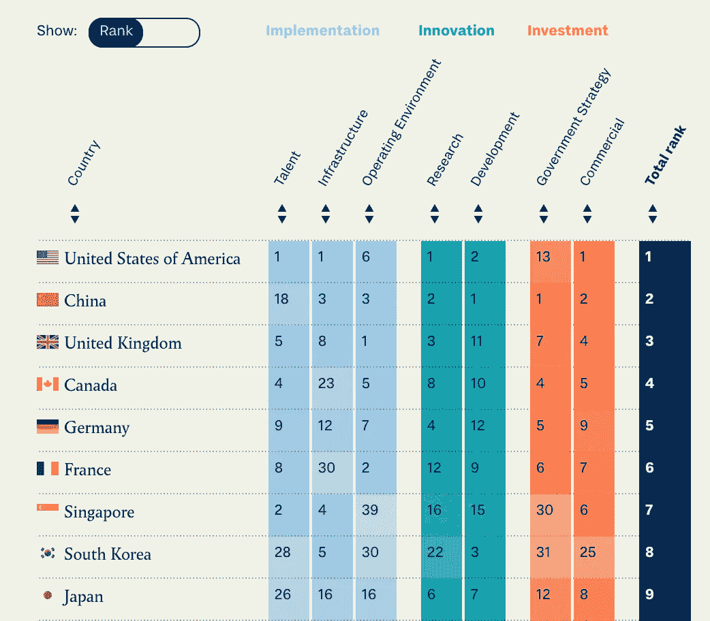
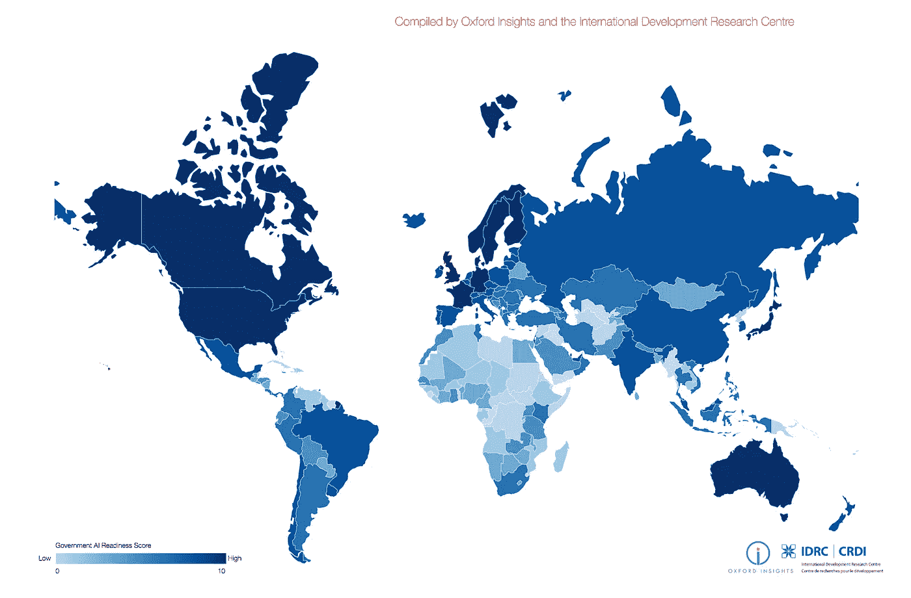
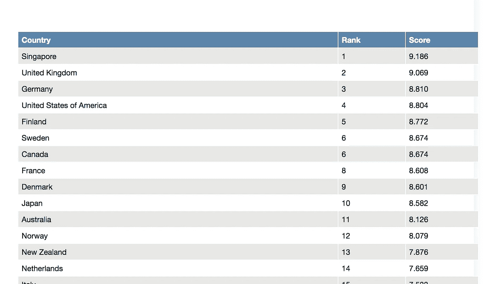

# 2018-2019 年全球人工智能指数

> 原文：<https://towardsdatascience.com/the-global-artificial-intelligence-indexes-2018-2019-1b0d0dce5f60?source=collection_archive---------25----------------------->

Photo by [@francesco_ungaro](https://unsplash.com/@francesco_ungaro)

## 衡量全球人工智能的不同指标概述

有一些机构和组织已经开始在人工智能领域索引不同的国家。所以我想我可以在短时间内成为索引的索引者。我想我会开始研究衡量人工智能的不同指数。我希望这能对你有所帮助，并且你能帮我更新这个列表或者修改任何错误。

## 斯坦福大学 2018 年人工智能指数报告

这份报告由斯坦福大学人工智能指数指导委员会，以人为中心的人工智能倡议发布。它是:*“…追踪、整理、提炼和可视化与人工智能相关的数据的努力。它渴望成为政策制定者、研究人员、高管、记者和公众的综合数据和分析资源，以发展对人工智能复杂领域的直觉。”*

 [## 为关于人工智能的对话打下基础。

### 将关于人工智能的对话建立在数据的基础上。人工智能指数是一种追踪、整理、提炼和可视化数据的努力…

aiindex.org](https://aiindex.org/) 

## 乌龟传媒的全球人工智能指数

2019 年 12 月 3 日发布的新指数对 54 个国家进行了排名

在 12 个月的时间里，他们衡量了 54 个国家的 7 项关键指标:人才；基础设施；操作环境；研究；发展；政府战略；和商业投资。在咨询了该领域的专家后，对每个指标的重要性进行了加权。

 [## 军备竞赛

### 世界正处于一场前所未有的人工智能军备竞赛中，美国和中国在这场竞赛中遥遥领先，可能会…

members.tortoisemedia.com](https://members.tortoisemedia.com/2019/12/03/global-ai-index/content.html) 

他们有一个互动的显示，让你根据不同的参数对不同的国家进行排名。

## 政府人工智能就绪 2019

这份报告有一个由牛津见解和国际发展研究中心撰写的发展观点。*“人工智能(AI)技术预计到 2030 年将为全球经济增加*[*15 万亿*](https://www.pwc.com/gx/en/issues/data-and-analytics/publications/artificial-intelligence-study.html) *美元。根据我们指数的调查结果，正如所料，全球北方国家的政府比全球南方国家的政府更能利用这些收益。因此，全球南方国家有可能被所谓的第四次工业革命甩在后面。他们不仅不会收获人工智能的潜在好处，还存在不平等实施扩大全球不平等的危险。”*

 [## 2019 年政府人工智能就绪指数-牛津洞察-牛津洞察

### 在国际发展研究中心的支持下制作的 2019 年政府人工智能就绪指数…

www.oxfordinsights.com](https://www.oxfordinsights.com/ai-readiness2019) 

这里是#500daysofAI，您正在阅读的是第 183 条。500 天来，我每天都写一篇关于人工智能或与之相关的新文章。