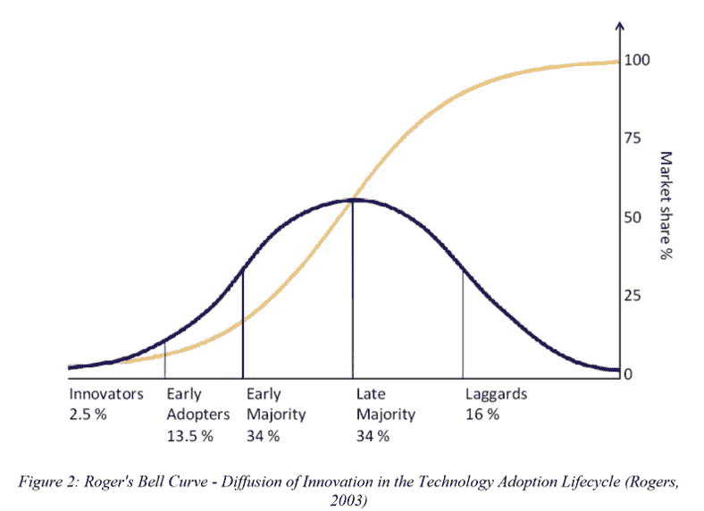
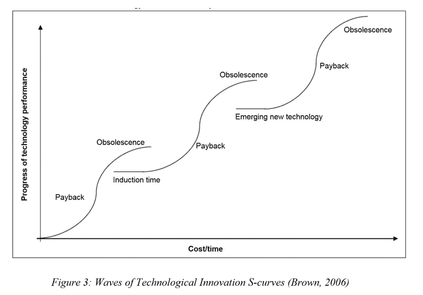
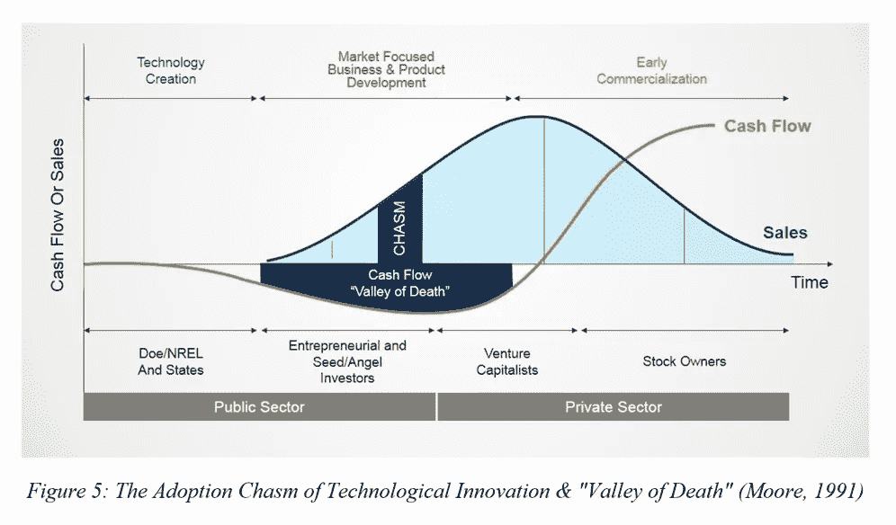

# 金色的人工智能冰川:重新思考医疗保健领域的罗杰钟形曲线

> 原文：<https://towardsdatascience.com/the-golden-ai-glacier-rethinking-rogers-bell-curve-for-healthcare-c6280e522e12?source=collection_archive---------12----------------------->

“人们对创新的传播如此感兴趣的一个原因是，即使一个新想法有明显的优势，它也很难被采纳，”埃弗里特·罗杰斯(Everett Rogers)在 1983 年出版的第三版开创性著作《创新的传播》(Rogers，1983)的前言中说。正如罗杰斯博士指出的，这个想法不是他独创的；几个世纪以来，它一直是人类生活的一部分。一位不亚于尼可罗·马基亚维利的观察家在他 1513 年的信中写道，470 年前的*王子*观察到:

“没有什么比创造一种新的事物秩序更难计划，更难成功，也没有什么比管理起来更危险……每当他的敌人有机会攻击创新者时，他们都以游击队员的热情这样做，而其他人则慢吞吞地为他辩护，因此创新者和他的政党都很容易受到攻击”(马基雅弗利，1532)。

此后，1747 年的英国海军、1781 年的美国发明家和国父 Ben Franklin、1903 年的法国法官和非专业科学家加布里埃尔·塔尔德、1937 年的英国人类学家 Edward Gifford 和 Alfred Kroeber、1943 年的研究人员 Bryce Ryan 和 Neal Gross，以及 1941 年至 1962 年的 21 年间至少有 1，953 名作者在同行评审期刊上发表了论文(Rogers，1983)(见图 1)。

罗杰斯博士将“扩散”定义为:

“……随着时间的推移，创新通过某些渠道在社会系统成员之间传播的过程；这是一种特殊类型的交流，因为信息与新思想有关”(罗杰斯，1983)。

这种新奇本身就包含着不确定性。在这种情况下，不确定性涉及对新思想替代品的看法，以及这些替代品的功效的比较概率，包括现状(Rogers，1983)。在现代，许多创新都是技术，罗杰斯接着将其定义为:“减少实现预期结果所涉及的因果关系中的不确定性的工具性行动的设计”(罗杰斯，1983)。因此，技术创新使潜在采用者对其相对于替代品的功效产生不确定性，同时，通过应用更快和更准确的因果关系，为减少不确定性提供了机会(Rogers，1983)。人们可以合理地争辩说，技术的传播是不确定性的二阶导数——潜在用户对技术是否会减少不确定性的感知的不确定性。

现代创新扩散理论最初是基于 20 世纪 50 年代对农业和家政学新方法的采用，罗杰斯在此基础上概括了该理论，并从 20 世纪 60 年代开始将其应用于涉及硬件和软件的技术(Beal，1957)。采用者头脑中感知到的这些不确定性的不确定性被放大或缩小的过程，是因为采用者的方法、文化和性质以及他们关注的焦点领域决定了创新扩散或技术采用的速度。这些因素体现在管理组织的政策中，决定了组织的存在理由(从军队到制造商到医疗保健)何时提供新的能力。

# 罗杰钟形曲线

罗杰斯假设，在创新理论的扩散下，技术的采用速度可以被绘制为标准化的高斯分布——或“钟形曲线”——在 x-y 轴上，首先熟悉笛卡尔坐标系。其中，罗杰斯发现并展示了收养者根据他们在收养年表中的位置被分成五个部分。最早的采用者是“创新者”，占市场的 2.5%。按时间顺序排列的第二批采用者是“早期采用者”，他们占市场的 13.5%。“早期多数”用户排在第三位，占市场的 34.5%。“后期多数”用户代表了另外 34.5%的市场份额，排在第四位。“落后者”代表了市场的最后 16%(Rogers，2003)(见图 2)。而且，罗杰斯假设每一类采纳者都经历了四个认知阶段:(1)意识；(二)决定采纳或者拒绝；(3)初次使用；和(4)继续使用；其中，对采纳者决策步骤影响最大的五个因素是:(1)相对优势；㈡兼容性；㈢复杂性；㈣可审判性；以及(v)可观测性(LaMorte，2018 年)。

虽然对技术采用过程中的步骤及其原因的这种理解水平已经在许多学科中取得了成功，但它也包含了成为医疗保健和公共卫生领域缺点的元素(LaMorte，2018)。具体而言，由于该模式起源于医疗保健和公共卫生领域之外，它:(a)未能包括医疗保健中通常需要的参与性方法，以确保“六 P”的认同:患者、提供者、支付者、制药商、供应商和决策者；(b)更多地应用于行为的采用，而不是行为的停止，这是一个主要问题，因为在现代医疗保健技术中，大多数创新正在取代现有技术；(c)未能考虑组织或采用者的资源、社会和同行对采用新技术的支持(LaMorte，2018)。

# 发展罗杰的钟形曲线

虽然所有的学术和概念理论都在不断地被新的假设和发现调整和调整，但在 1962 年至 2015 年之间，罗杰斯作为创新扩散和技术采用模型传播的钟形曲线出现了五次重大演变。与此相关的第一次重大演变是技术 S 曲线，由 Richard Foster 于 1986 年提出，并由 Clayton Christensen 于 1997 年在他的开创性著作*The Innovator ' S Dilemma*(Foster，1986) (Christensen，1997) *中更广泛地应用。* Foster 推断，技术创新可以用 x 轴上的成本和/或时间以及 y 轴上的技术绩效进展来绘制，其中新技术的曲线或直线总是某种形式的“S”，新技术的诱导时间(“研发”)是基础，通过采用的投资回报或收益是垂直的，市场饱和和过时是“S”的顶部(Foster，1986)。第二，Christensen，除了别的以外，注意到这些“S”曲线连接在一系列的波浪中(见图 3)，其中它们成功的关键决定因素是:(a)组织进入曲线的时间框架，以便不被更有先见之明的竞争者超越创新；以及(b)他们不间断地持续创新以保持这些“S”波长期持续的能力(Christensen，1997)。第三，克里斯滕森接着指出了一项技术创新是否被采纳的两个关键原因，以及它被采纳或否决的速度；这与采纳者的相对需求和资源有关。如果现状在可用资源范围内满足了潜在采纳者的需求，他们会坚持现状，推迟或拒绝创新。类似地，如果一项技术创新不在采纳者的既定资源范围内，在某些情况下，不管感知到的需求如何，他们也会坚持现状，拒绝或推迟创新。这些原因是医疗保健采用人工智能和类似更新技术的关键(Christensen，2015)。

基于创新扩散的技术采用生命周期的下一个主要演变，发生在第三个年表，但为了凝聚力和清晰性，在这里被列为第四个，是关于差距或鸿沟。1991 年，杰弗里·摩尔在*跨越鸿沟*中观察到，大量技术创新经历了归纳/研究和开发阶段，受到早期采用者的欢迎和使用，但由于过多的原因，从未被市场更广泛地采用(见图 4) (Moore，1991)。

摩尔认为，过于简单地说，早期采纳者和多数采纳者之间存在鸿沟，因为他们在如何和为什么做出决定方面有本质上不同的心理特征。创新者和早期采用者倾向于采用，因为他们对新功能有内在的欣赏；他们偏向于喜欢，想要，采纳。然而，构成其早期和晚期大多数的 68%的市场更关注实用性——克里斯滕森写的关于需求和资源的那种。这种市场大多数也是怀疑论者，通常来自经验，知道绝大多数新技术创新永远不会走远或不会持续(摩尔，1991)。后期多数采纳者与早期多数采纳者比例相当，他们的不同之处还在于他们对自己实施组织变革的能力缺乏信心(Moore，1991)。根据 Moore 的说法，为了克服这些怀疑论者并区分一项技术的存在，需要大量的教育、营销和关系建设，这反过来需要持久力，这反过来需要资本——比大多数公司拥有或能够筹集的资本更多，从而创造了技术创新初创企业的“死亡之谷”(见图 5) (Moore，1991)。

第五，也是最后一点，从 1998 年到 2008 年，Carl May 和他的同事提出了标准化过程理论(NPT)来发展先前的模型，并帮助解释医疗保健领域的创新扩散和技术采用生命周期(2009 年 5 月)。NPT 关注医疗环境中与技术采用相关的三个核心问题:(1)实施——将新行动付诸实践的社会过程；(2)嵌入——将这些新的实践融入到习惯和惯例中；以及(3)整合——在组织范围内复制和维持新实践的过程(2009 年 5 月)。《不扩散条约》假定:(A)由于共同努力制定法律的个人的集体努力，实践已经深入人心，成为惯例；(B)制定"通过表达人类能动性的生成机制(一致性、认知参与、集体行动、反思性监测)的运作得到促进或抑制；"以及(C)在整个组织范围内复制实践需要组织中全体变革代理人的持续支持和投资(2009 年 5 月)。

# 医疗保健中的人工智能采用冰川

除了人工智能将扰乱医疗保健，使其从被动型转变为预测型和主动型，个性化医疗将我们的寿命延长几十年之外，现实是，如果你与经验丰富和广为人知的数字健康企业家交谈，大规模或及时采用这些工具来实现这一承诺仍然在很大程度上是夸张的。尽管 2017 年对数字健康公司的私人投资估计为 120 亿美元——其中许多都与人工智能有关——但很少有人获得足以证明私募股权投资合理的巨大成功(Yock，2018)。

尽管人工智能在一个对人类至关重要的领域有望带来非常好的结果，但为什么人工智能在医疗保健领域的采用一直很冷淡，这一解释似乎有五个方面。第一，健康技术专家给出的解释是以这样一种想法为中心的，即大多数数字健康和人工智能创业公司都遵循了错误的模式，这种模式在其他行业的消费者和产品中取得了成功，但忽略了医疗保健的根本差异(Yock，2018)。其他行业经过测试和验证的技术创业战略侧重于快速将最低可行的产品推向市场，然后根据在早期最终用户中证明成功的特性和功能集迭代新版本和新版本(Yock，2018)。这种策略表面上忽视了利益相关者、风险厌恶和医疗保健行业监管环境的复杂性(Yock，2018)。

其次，摩尔所描述的“死亡之谷”在医疗保健领域更长、更深，这是采用周期更长的结果。创业公司必须生存更长时间，进行更多的营销和前景教育，这需要更多的资本，才能成功克服 Yock 描述的额外障碍。此外，数据科学、人工智能和创业公司形成的尖端领域的技术专家在金融技术或消费产品等其他行业往往需求量很大。因此，在医疗保健行业缓慢采用新技术的过程中，将这位极具竞争力的人才保留多年的成本会更高。

第三，我们必须重新审视创新扩散理论，因为专注于医疗保健的技术专家似乎变得过于依赖其简化进化论，而忽视了其最初的警告。首先，我们可以看看罗杰斯定义的创新要素:(1)相对优势；(2)兼容性；(3)复杂性；以及(4)可试用性(罗杰斯，1983)。在这些领域中，医疗保健中的人工智能都是有问题的。人工智能通常与现有的系统、策略和流程不兼容，因此需要被替换。此外，人工智能是众所周知的复杂，超出了许多用户的知识，有时甚至是理解；因此，他们不愿意接受他们不能信任的东西，也不能信任他们不能理解的东西。此外，人工智能在许多医疗保健问题上的试验很麻烦，因为它们涉及影响人类福祉的关键领域，这是高风险的，并涉及许多伦理问题。

第二，正如罗杰斯所指出的，支持创新的变革推动者和那些必须获得社会认同的变革推动者通常是异嗜性的——这意味着他们通过相似性聚集在一起，每个群体都与其他群体截然不同。因此，变革推动者往往比用户在技术上更先进，从而产生了一种偏见，不利于在交流中有效地相互理解。

第三，也许是对医疗保健领域的人工智能初创公司最务实和最有影响力的，罗杰斯在他的著作《创新的科学验证的重要性》(罗杰斯，1983 年)中指出。在医疗保健领域，这意味着临床试验；然而，几乎没有像药物试验那样被广泛接受的软件临床试验标准。此外，最重要的是，大多数试验极其昂贵，学术医疗机构可以进行这些试验(例如，马萨诸塞州总医院等)。)将它们视为一种方法，通过这种方法利用它们的“批准印章”来获得额外的收入，所有这些都增加了摩尔“死亡之谷”的巨大深度和宽度。简而言之，目前缺乏资金来支付医疗保健中人工智能应用的软件试验。因此，绝大多数创新从未经过科学验证，许多可能被早期采用的创新被证明存在科学缺陷，以至于大多数采用之前的怀疑和分歧扩大，随之而来的是技术采用生命周期中的“死亡之谷”。

第四，回忆一下克里斯腾森的 S 曲线波(图 4)。即使医疗保健领域的人工智能初创公司能够克服这些重大障碍，这也只是一个采用周期，或者说，如果它们要维持自身的话，这肯定是一波 S 曲线中的第一条 S 曲线。一个结果是，很大一部分在医疗保健领域采用人工智能的竞争中胜出的公司必须通过新的创新重复这样做，否则他们有可能成为寿命短得多的单一产品公司(又名“一招小马”)。

最后，我们被时间尺度所吸引，医疗保健中的人工智能是否真正具有破坏性，以及破坏性到底意味着什么。Christensen 表明，市场中技术成熟度的生命周期通常是 15-20 年(Brown，2006)。这个时期不是真正的破坏性，而是变革性的。如果我们研究其他变革性技术，如电子邮件和互联网，我们会有趣地证实克里斯滕森，因为他们的发明和广泛使用之间过去了几十年。对于医疗保健领域的人工智能初创公司来说，他们已经面临着技术采用生命周期中漫长而深刻的鸿沟，以及持续创新的竞争需求，这种转型的持续时间极大地放大了每次创新的“死亡之谷”。

解决人工智能初创公司在医疗保健领域面临的众多挑战的关键可能在于克里斯滕森对中断的正确定义。克里斯滕森认为，当应用于产品或服务的新技术能力时，颠覆是误导性的(克里斯滕森，2015)。相反，根据 Christensen 的说法，颠覆是一个过程——在这个过程中，颠覆者从低端或市场边缘(“边缘”)的小规模实验开始，并专注于需求如何在长时间内发生变化和演变，以形成新的商业模式(Christensen，2015)。颠覆者找到一种新的模式来满足新生的和不断发展的客户需求，而一种技术完全替代或替代另一种技术的转变通常仍需要几十年的时间(Christensen，2015)。然而，初创公司随后摆脱了持续创新的许多竞争压力，因为它们不被视为竞争的核心或威胁，具有较低的成本以支持度过特大的“死亡之谷”，并且通过让早期客户提供反馈，能够解决技术采用中的许多结构性特质。

# 参考

比尔、罗杰斯、波伦、J.M. (1957)。采纳过程中阶段概念的有效性。*农村社会学*，22(2):166–168。

布朗博士(2006 年)。目标选择和制药行业生产率:我们能从技术 S 曲线理论中学到什么？*药物发现的当前观点&发展*，9(4):414–8。

克里斯滕森，C. (1997 年)。创新者的困境:当新技术导致大公司失败时。波士顿:哈佛商学院出版社。

c .克里斯滕森、m .雷诺、r .麦克唐纳(2015 年 12 月)。什么是颠覆性创新？【哈佛商业评论】https://hbr.org/2015/12/what-is-disruptive-innovation.，pp.

福斯特，R. (1986 年)。*创新:攻击者的优势。纽约:顶峰图书公司。*

拉莫特，W. (2018 年 8 月 29 日)。*行为变化模型:创新理论的扩散*。检索自波士顿大学公共卫生学院:[http://SPH web . bumc . bu . edu/otlt/MPH-Modules/SB/BehavioralChangeTheories/BehavioralChangeTheories 4 . html](http://sphweb.bumc.bu.edu/otlt/MPH-Modules/SB/BehavioralChangeTheories/BehavioralChangeTheories4.html)

马基雅维利，N. (1532)。 *De Principatibus(君主国)(又名王子)。意大利:安东尼奥·布拉多·达索拉。*

May，c .，Mair，f .，Finch，t .，MacFarlane，a .，Dowrick，c .，Treweek，s .，和 Rapley，t .，等人(2009 年)。实现和集成理论的发展:规范化过程理论。*实现科学*，4:29。

摩尔(1991 年)。*跨越鸿沟。纽约:哈珀柯林斯出版社。*

罗杰斯，E. (1983)。*创新的扩散(第三版。).纽约:自由出版社。*

罗杰斯(2003 年)。创新的扩散(第 5 版。).纽约州:西蒙和舒斯特。

Yock，P. (2018 年 10 月 17 日)。为什么数字健康创业公司不断失败？*快公司*，PP .[https://www . Fast Company . com/90251795/why-do-digital-health-startups-keep-failing。](https://www.fastcompany.com/90251795/why-do-digital-health-startups-keep-failing.)

## 这篇文章发表在 [The Startup](https://medium.com/swlh) 上，这是 Medium 最大的创业刊物，拥有+409，714 名读者。

## 在这里订阅接收[我们的头条新闻](http://growthsupply.com/the-startup-newsletter/)。

