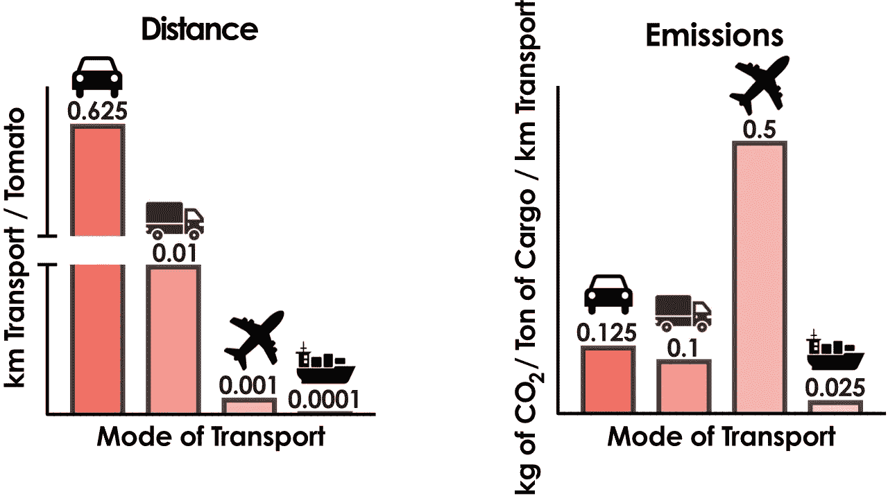

# 这山望着那山高:购买当地产品及其缺点

> 原文：<https://towardsdatascience.com/the-grass-really-is-greener-on-the-other-side-buying-local-and-its-shortcomings-f35490744912?source=collection_archive---------12----------------------->

## 循证政策比你或你的感觉更重要——第二部分

仅仅因为你的蔬菜经过数千公里的运输到达你的餐桌，并不意味着它们不会比你当地农贸市场的产品对环境更好。那里。我已经说过了。就不受欢迎的观点而言，这一观点介于“披萨上的菠萝”和“如果我们不能让非常老的人活着，医疗保健会更便宜”之间(声明:我不同意这些观点)。但是不受欢迎不代表不真实。我想用你生命中接下来的 5 分钟来说服你，默认购买本地在多个层面上都是错误的。说你购买当地食品是因为你想保护环境和加强你的社区是很有说服力的，因为它与我们喜欢持有的价值观产生了共鸣。所以为了说服你，我们需要解决这两个支持购买当地食物的主要论点。我们开始吧！

首先，请查看我在这个系列的第一篇文章中关于气候变化的一般免责声明。第二，我不会说买本地货总是不好，也不会说从遥远的 T4 购买总是更好。我的立场仅仅是你应该(定量地)考虑哪一个选择是最好的，事实证明，在大多数情况下，放弃购买当地食物是更好的选择。因此，如果你真的想坚持一种普遍的态度(当然我不建议)，要么都是本地的，要么都是远方的，你选择后者更有可能是正确的。

Visualization of distances & emissions per vegetable for different modes of transport. For cars, trips of 5 km for 8 tomatoes with an average car weight of two tons are assumed. For trucks, trips of 3000 km with 45 metric tons of tomatoes are assumed. For planes, trips of 3000 km with 400 metric tons of tomatoes are assumed. For ships, trips of 18000 km with 25000 metric tons of tomatoes are assumed.

**环境论证——运输**

我们先来看看环境论证。从本质上来说，这是一个论点:汽车/卡车/飞机/轮船从遥远的地方运输食物到你的超市消耗大量的燃料，因此从你附近的农场购买食物具有较低的运输碳足迹是更可取的。的确，我们的大部分食物在到达我们的餐桌之前要经过数千公里的路程，这个概念被称为食物里程。但是“食物里程”是衡量环境影响的一个有意义的指标吗？想象一下，你开车去 5 公里外的农贸市场买西红柿，买了 8 个西红柿。也就是 0.625 食物公里/番茄(单程！).一辆[番茄卡车](http://www.ctga.org/TomatoFacts)运送大约 30 万个番茄。如果我们真的很慷慨，估计这辆卡车从生产地到超市行驶 3000 公里，这将相当于 0.01 食物公里/番茄。无论你如何扭曲它，你都无法击败这里的规模经济。如果你喜欢这个指标，你也可以用二氧化碳/番茄排放量来玩这个游戏。现代卡车[每公里每公吨货物排放大约 0.1 公斤二氧化碳。在我们的例子中，这将是 0.1*45 公吨的西红柿*3000 公里= 13500 公斤或 13.5 吨的二氧化碳。从你的农贸市场购买等量的西红柿，而(在美国)](https://timeforchange.org/co2-emissions-shipping-goods)[平均每公里排放](https://www.epa.gov/greenvehicles/greenhouse-gas-emissions-typical-passenger-vehicle) 0.25 公斤二氧化碳的汽车相当于 5 公里*0.25 公斤二氧化碳/公里*(每位顾客 300，000/8 个西红柿)= 46875 公斤或 46.9 吨二氧化碳。三倍多！

你可能会说，即使有了卡车，你仍然需要去超市买蔬菜，但请记住，a)卡车的排放量与汽车的排放量相比仍然微不足道，b)你的农民市场的蔬菜也必须首先到达那里，通常由农民用车辆运输，就每种蔬菜的排放量而言，车辆的效率肯定低于番茄卡车。另一种避免低效率交易的方式是在网上订购蔬菜。除了带来令人愉快的便利之外，蔬菜订单将被打包并以优化的路线交付给你和其他顾客，与你和其他人去商店相比，每份蔬菜的排放量[更低](https://www.sciencedaily.com/releases/2009/02/090202113553.htm)。此外，如果你的食物是用船运送的，那么在排放方面[比卡车更有效率](https://timeforchange.org/co2-emissions-shipping-goods)(大约。每公里每公吨货物 0.025 千克二氧化碳)。

Location matters. Values are total emission for production (UK, lamb, red or Sweden, tomatoes, orange) or total emission for transport + production (New Zealand-UK, lamb, blue or Spain-Sweden, tomatoes, turquoise). [Source](https://www.nytimes.com/2007/08/06/opinion/06mcwilliams.html) for lamb values. [Source](https://www.portofgothenburg.com/globalassets/broschyrer/report-9_tomtao.pdf) for tomato values (Table 5).

**环境论证——生产**

在证明了规模化经营的每种蔬菜的运输排放量远低于当地农民之后，我现在要做一些不寻常的事情。我要说的是，无论如何，交通排放真的没那么重要。因为到你的超市或当地中心的商业运输只占生产食品总排放量的 5-11%。信不信由你，这实际上是食品生产排放清单上最小的*项。以下是一些比较重要的:餐馆(16%)、家庭烹饪(25%)和生产&加工食品(45%)。因此，到目前为止，排放清单上最大的一项实际上是蔬菜是如何生产的，而不是如何到达你的餐桌。这意味着生产效率将对环境产生最大的影响，而不是从农场到餐桌过程中的任何其他变化。那么，我们究竟为什么要去干旱的亚利桑那州购买当地的苹果，而不是从更远但农业生产丰富的华盛顿(美国苹果总产量的一半以上来自华盛顿)购买呢？*

或者，更粗鲁一点，为什么不是来自新西兰？船舶运输比卡车运输环保得多，它位于南半球，确保了淡季新鲜苹果的供应，而不必冷藏前一个收获季节的苹果，它可以说是生产苹果和其他水果+蔬菜最茂盛和最多产的地方之一。这导致了一些违反直觉的结果，例如，在新西兰饲养并从新西兰运往英国的羊肉的碳足迹[仅为在英国直接饲养和消费的羊肉的四分之一](https://www.nytimes.com/2007/08/06/opinion/06mcwilliams.html)(乳制品和水果的比例相似)。同样，从西班牙进口西红柿到瑞典比在瑞典生产西红柿更环保。考虑到生产效率的相对重要性，我们更应该考虑我们希望我们的食物在什么条件下生长，而不是它离我们家有多近。

**道德论证**

在我们结束之前，让我们简要地谈一下第二个论点，即购买当地产品可以加强社区。这一策略引出了有趣的哲学推论。比方说，你当地的农民非常成功地向你出售他们所有的蔬菜，以至于他们扩大经营，开始向其他地区销售。这是否意味着他们不再是本地人，不再是社区的一部分？严格来说，这难道不是(反向)保护主义的论据吗？在这种保护主义中，来自你们社区的任何出口都将被禁止，因为这会削弱外国社区。将这场辩论与科技行业进行对比。本地或本地生产的电脑或 iPhone 听起来多么牵强！如果我们不对其他部门和产品提出同样的本地态度，那么挑出食品生产作为购买本地产品在道德上至高无上的领域似乎是武断的。考虑到农民在人口中所占的比例很小(比美国的 2%少)，以及之前证明的生产效率的重要性，而生产效率又严格取决于当地的天气，食品似乎是一个非常不适合“本地第一”态度的候选对象。如果你真的想去当地(虽然我仍然不推荐它作为一般规则)，尝试制成品。至少这影响了 8.5%的人口(在[美国](https://www.thebalance.com/u-s-manufacturing-what-it-is-statistics-and-outlook-3305575))，并且较少受天气和位置的影响(仅适用于监管/工资，这也适用于农业部门)。

**结论**

这让我得出了我的结论:购买当地食物作为一般规则既不环保也不道德。事实上，平均来说，这是相当有害的。我不排除这样一种可能性，即在某些情况下，本地食品可能至少等同于遥远的进口食品，例如，如果你生活在一个适合高效生产某种水果或蔬菜的地区。但我们大多数人都没有这种奢侈，不得不在高强度、温室辅助生产和生产碳足迹小的环保运输产品之间做出选择。虽然支持你的社区并做一些表面上的好事可能感觉非常好，但基于证据的政策和行为并不是让你感觉良好，而是做得最好。所以如果你关心全球环境和你行为的后果，不要去当地。走向全球。