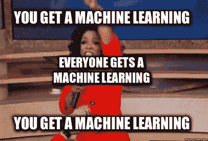
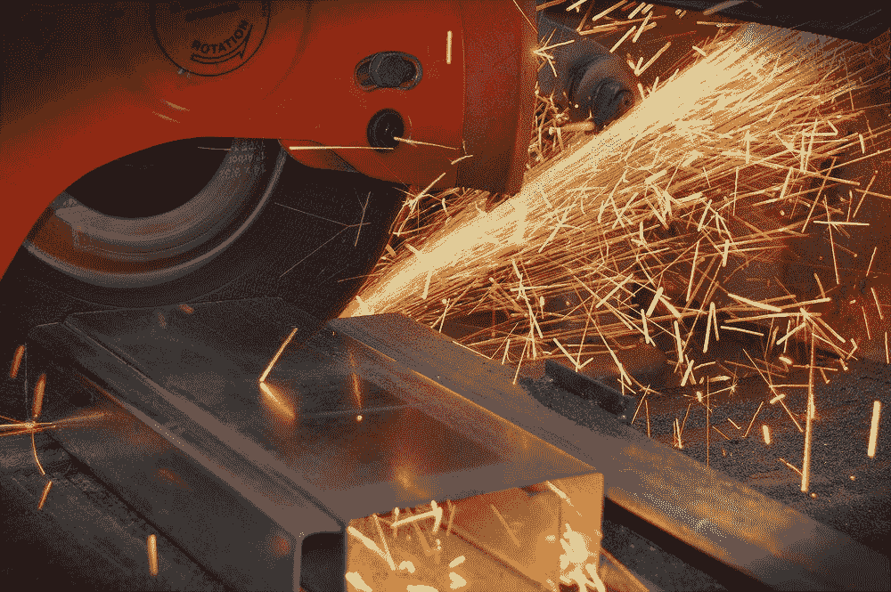

# 糖蜜大洪水——预测金属熔点

> 原文：<https://towardsdatascience.com/the-great-molasses-flood-predicting-the-melting-point-of-metals-1c4440d2edd2?source=collection_archive---------13----------------------->

## 冶金和材料科学中的机器学习

***1919 年 1 月 15 日，在北波士顿一个安静的街区，一场灾难正在酝酿。***

出乎意料的是，一声巨大的爆炸声响彻整个城市，在任何人知道发生了什么之前，**12000 吨**糖蜜以几乎 **60 公里的时速，** **冲进街道，导致 21 人**死亡，**150 人**受伤。

Imagine how sticky the ground must have been… (Courtesy of Wikipedia)

***据说直到今天，有时候，在炎热的夏天，北波士顿地区闻起来有点像糖蜜的味道。***

大糖蜜洪水是由于热疲劳导致的**材料失效的主要例子。在那灾难性的一天，气温从负两位数波动到正。这导致了装糖蜜的罐子变弱。再加上高温发酵造成的压力增加，导致储罐破裂。**

今天，我们既有技术又有材料来防止这种愚蠢而毁灭性的灾难再次发生。但是，当我们推进到大胆的新领域时，上述技术和材料的极限将受到考验。

> ***我们怎么能在这样高能量、高特异性、有时甚至是危险的环境中测试这些材料呢？***

我们可以使用机器学习。

# 好吧，但是为什么呢？

Because it’s not like we have enough machine learning

这个项目是我为 Deltahacks 访问安大略省汉密尔顿时获得的个人挑战，世界上最大的钢铁生产商安赛乐米塔尔赞助了这个活动。因为他们的 Dofasco 总部就在这条街上，所以我问他们有什么不同的做法。 他们管道的亮点包括**在组织**的库存、运输和管理方面使用人工智能，但没有一个在研发方面产生影响。

由于我对数据驱动科学进步的想法很着迷，我提出了一些公司可以使用 **A.I 来改善 R & D** 的方法，这是任何像安赛乐米塔尔这样的大公司最昂贵和最耗时的部分之一。一些高层次的想法包括:

*   高通量虚拟筛选
*   自动化实验室实验
*   分子的发现和优化(逆模型)
*   分子的性质预测(正向模型)

最后一个特别有趣，有人问我**是否有可能预测一种给定金属的熔点，特别是如果这种金属以前从未被合成过。**我回答了监督学习的一个基本原则，其表述方式甚至连伟大的阿基米德本人都会赞同:

> 给我一个足够大的数据集和正确的机器学习模型，我可以预测任何事情(在一定程度的准确度内)

这是一个严重的，有时甚至是危险的过度简化，我说我会看看我能做些什么。

**这个提议变成了熔融计划。**

# 项目熔化

Project Molten 是一个神经网络，用于预测给定分子的熔点(摄氏度)。该模型在超过 28，000 个标记分子的数据集上进行训练，证明可用于现实世界的应用，特别是冶金、金相学和材料工程。

There are an incredible multitude of alloys and more yet to be discovered (Courtesy of Unsplash)

值得注意的是,“熔化工程”中使用的分子并不完全由金属构成；数据集中有各种各样的分子。

这种模型可能有助于预测由热材料失效引起的灾难，比如糖蜜大洪水。

该模型接收 SMILES 串作为输入，并输出预测熔点温度。使用字典将 SMILES 字符串唯一地映射到一个整数，并用 0 填充以确保它们长度相同。填充的长度是通过向数据集中最长的微笑字符串添加 1 个额外的 0 来确定的。在这种情况下，填充后所有字符串的长度为 282 个字符。

The very least you can do to help your poor PC

标准化数据集是这个项目的关键步骤，因为它减少了训练算法所需的计算量，节省了时间，简化了过程。有两种流行的归一化方法，要么通过**将给定的输入除以唯一输入的总数，要么使用`x-min(x))/(max(x)-min(x))`在 0 和 1** 之间归一化。

Your basic normalization code **(best practice calls for making a function)**

在标准化微笑字符串和温度之后，数据集被分成 90%用于训练，10%用于测试。也可以分配一个**验证集，**但是为了有尽可能多的训练数据，它保持原样。一小部分代码被分配给`assert`,表明数据集具有相同的大小，并准备好被网络接收。

神经网络模型是使用 PyTorch ML 库创建的，这使得定义网络参数变得 Pythonic 化、简单和清晰。使用了带有`Adam`优化器的均方误差(`MSE`)。学习率(`lr`)设置为 0.001，但是可以自由调整。经过 100 多个时期的训练，损耗被编程为每 10 个时期打印一次，同时打印当前的运行损耗。

注意网络的形状； **282 个输入神经元用于匹配填充和整合的微笑字符串的大小。**从第二个隐藏层开始，每层的神经元数量大约减半。输出层为 1；计算我们输出的形状，如果一切顺利的话，这是一个**单一的预测数字，这将是估计的熔点温度，以摄氏度为单位，包括负数。**

# **关键要点和可能的方向**

Polymers, Ceramics, Composites, and most importantly, **Metals** (Courtesy of Unsplash)

熔融项目是机器学习如何用于材料研究和开发的一个基本例子。最终，这个项目是仍在开发中的 Project Deliquesces 的前身。“潮解工程”的目标是**将这种经过训练的模型用作生成模型的一部分，该模型能够生成具有特定熔点温度的新分子。**未来的工作将集中在寻找以微笑字符串的形式生成这些分子的方法，或者也许使用像**分子图这样更准确的分子表示。**

在未来，**物联网设备**可以收集重要的环境数据，然后我们可以使用这些数据进行计算，训练监督学习模型，并进行实时预测**，降低材料故障的可能性，并在另一场灾难来袭时提供更多关于原因的见解。在一个野火肆虐、海平面上升、自然灾害日益频繁的世界里，确保我们的基础设施为未来的艰辛做好准备从未像现在这样重要。**

**希望我们再也不用担心糖蜜末日了。**

## **关键要点**

*   **机器学习在工业中的应用**不仅仅是自动化****
*   ****在科学领域，数据标准化至关重要****
*   **分配一些注意力给远见；**比你自己先想两步****

# **需要看到更多这样的内容？**

***跟我上*[***LinkedIn***](http://www.linkedin.com/in/flawnson)***，*** [***脸书***](https://www.facebook.com/flawnson) ***，***[***insta gram***](https://www.instagram.com/flaws.non/?hl=en)*，当然还有* [***中***](https://medium.com/@flawnsontong1)**

****我所有的内容都在* [***我的网站***](http://www.flawnson.com) *我所有的项目都在*[***GitHub***](https://github.com/flawnson)***

****我总是希望结识新朋友、合作或学习新东西，所以请随时联系*[***flawnsontong1@gmail.com***](http://mail.google.com)***

> ***向上和向前，永远和唯一🚀***

******

***📝稍后在[杂志](https://usejournal.com/?utm_source=medium.com&utm_medium=noteworthy_blog&utm_campaign=guest_post_read_later_text)上阅读这个故事。***

***🗞每周日早上醒来，你的收件箱里会有本周最值得关注的科技故事、观点和新闻:[获取值得关注的时事通讯>](https://usejournal.com/newsletter/?utm_source=medium.com&utm_medium=noteworthy_blog&utm_campaign=guest_post_text)***