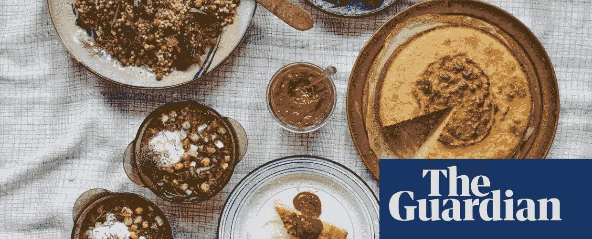
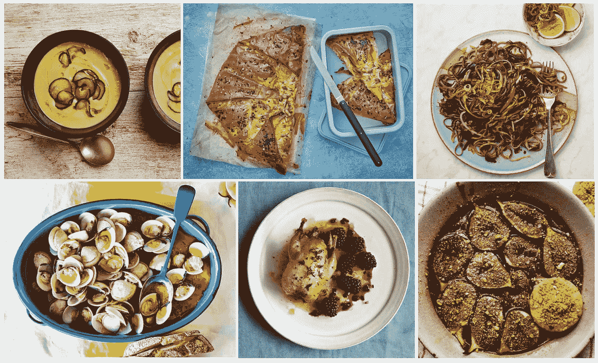
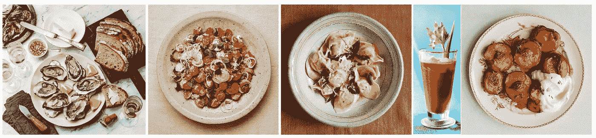
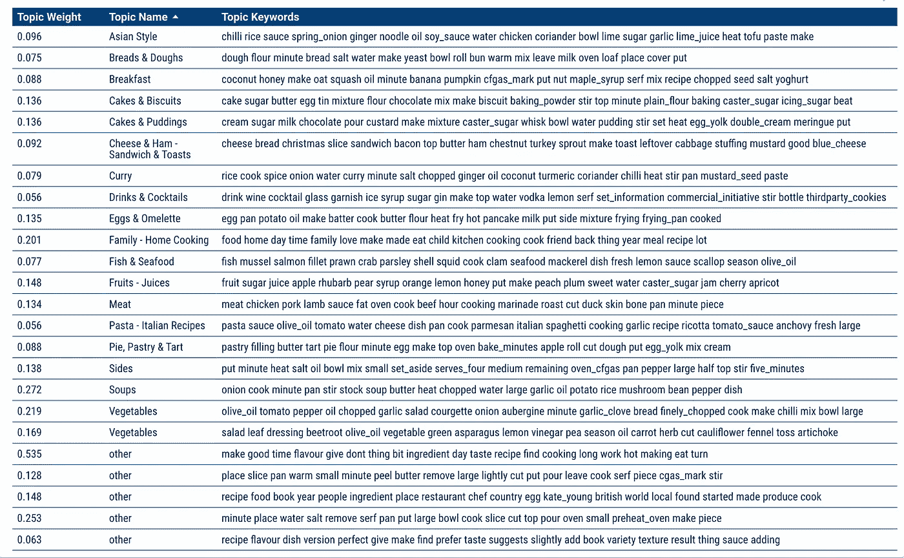
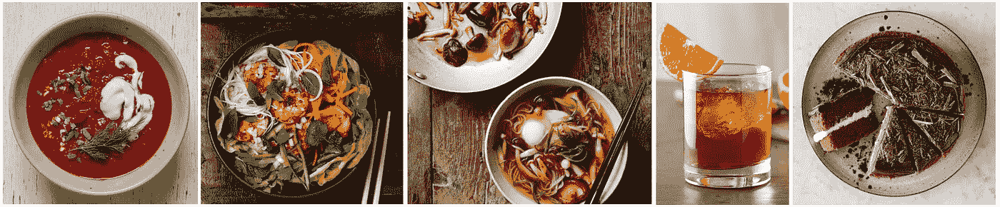
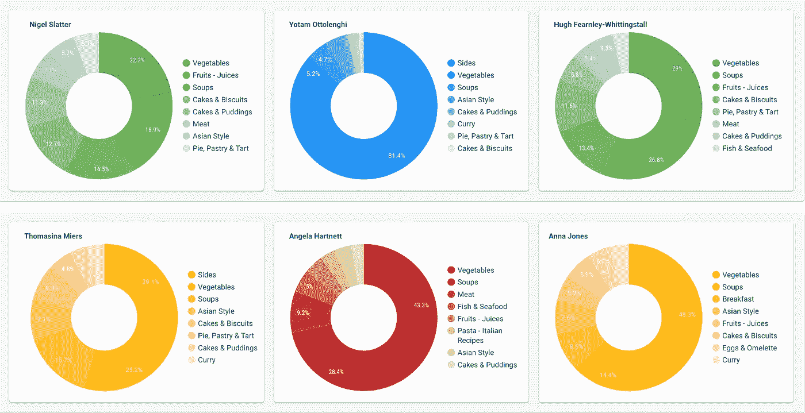
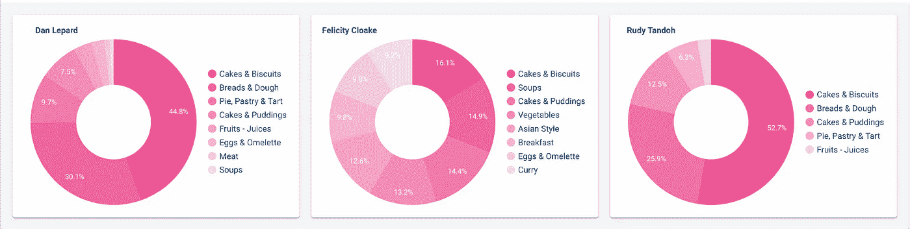

# 《卫报》食品食谱—主题建模

> 原文：<https://towardsdatascience.com/the-guardian-recipes-part-2-lda-topic-modeling-51e5b13faefa?source=collection_archive---------39----------------------->

The Guardian Food Recipes by recipes from [The Guardian](https://www.theguardian.com/tone/recipes)

# 介绍

《卫报》的美食栏目邀请业余厨师探索无限的烹饪世界，接触新的食材和风味，学习烹饪技术或为庆祝盛宴寻找灵感。

在本系列的第一篇博文中，我告诉了你我对食物的热情和对数据科学的好奇。我向你展示了一些**探索性数据分析**，这些数据来自《卫报》最近 10 年每日发布的食谱。

本文的目的是参与**主题建模**。这种方法对于发现文档集合中出现的抽象“主题”非常有用。它允许快速理解一个长文本的含义，提取其关键字并对其内容进行分类。

你喜欢馅饼和果馅饼吗，你喜欢沙拉还是蛋糕，你喜欢鱼还是肉？到文章结束时，你就会知道该打电话给哪些《卫报》厨师专栏作家来为你的下一次晚宴做菜了！

如果你饿得等不到最后，你可能已经想看看这里的食谱*。*

The Guardian Food Recipes — Yotam Ottolenghi’s chilled cucumber and yoghurt soup (photo by Louise Hagger), Claire Thomson’s spiced filo pumpkin pie (photo by Jean Cazals), Meera Sodha’s mee goreng (photo by Louise Hagger), José Pizarro’s clams ‘a la plancha’ (photo by Martin Poole), Henry Harris’ roast partridge and spiced blackberries (Ola O Smit), Nigel Slater’s figs with pistachio biscuits (photo by Romas Foord)

# 数据和方法

在从《卫报》收集了 7361 篇食谱文章后，最早的一篇可以追溯到 2009 年 1 月 3 日，最近的一篇是 2019 年 6 月 16 日，我首先清理了 Python 笔记本中的文本数据。

执行主题建模需要一些预备步骤。这些步骤包括文本数据的格式化:标记化、停用词去除以及词条化。关于这些步骤的更多细节，请看来自[苏珊李](https://medium.com/u/731d8566944a?source=post_page-----51e5b13faefa--------------------------------)的[文章](/topic-modeling-and-latent-dirichlet-allocation-in-python-9bf156893c24)。

不同的技术可以用来做主题建模。在这篇文章中，我选择使用**潜在狄利克雷分配** (LDA)。为了更好地了解 LDA 是如何工作的，你可以阅读大卫·m·布雷和艾尔的原始研究论文[。或者从](http://www.jmlr.org/papers/volume3/blei03a/blei03a.pdf)[费利克斯回复](https://medium.com/u/414435874b4b?source=post_page-----51e5b13faefa--------------------------------)来一篇更容易理解的[文章](/the-complete-guide-for-topics-extraction-in-python-a6aaa6cedbbc)。Greg Rafferty 关于哈利波特的系列博客文章也是一个很好的资源。

Fiona Beckett’s Wine Selection for Seafood (photo by The Picture Pantry), Yotam Ottolenghi’s tomato with lime and cardamom yoghurt (photo by Louise Hagger), Vicky Bennison’s cappellacci with pumpkin, Jeremy Lee’s bloody mary (photo by Martin Poole), and Anna Jones’ roast peaches with vanilla and thyme.

# 食谱主题建模

下表和图表显示了 Gensim LDA 模型的结果。所采取的预处理步骤是:

*   选择 LDA 模型。这里我用了 Gensim(变分贝叶斯采样)和 Mallet(吉布斯采样)。
*   确定题目的数量。在可视化了主题数量的模型一致性分数之后，我决定用 24 个不同的主题来训练模型。Gensim 的最佳一致性分数为 0.48。
*   根据模型输出的前 10 个关键词，为 24 个潜在主题中的每一个指定一个主题名称。
*   计算一些对《卫报》食谱贡献最大的厨师的主导话题。

以下见解值得半信半疑！Gensim 和 Mallet 的 LDA 模型在大多数情况下都有成熟的果实，但也有一些酸味。因此，我选择只选择与柔软多汁的水果相匹配的食谱文章，而忽略另一篇。这意味着，在我收获的所有食谱中，大约有 20%被搁置一旁(在下表中，这个主题被归为“其他”)。

**主题建模，主题名称**

Mallet 模型的结果可以比作食谱的成分。*食材是关键词，菜品是文档。*

有些话题或者你喜欢的菜式很容易识别。例如，关键字“饮料、葡萄酒、鸡尾酒、玻璃杯……”可以很快与链接到饮料和鸡尾酒的食谱相关联，类似地，“鱼、贻贝、鲑鱼、鱼片……”无疑指的是包含鱼的食谱。对其他人来说，需要多一点解读！如何看待以下配对？它适合你的口味吗，或者你会推荐别的吗？

The table gives an overview of LDA Mallet Topic Modeling results. The Topic Weight shows the probability of a document having a particular topic, the Topic Name shows the name assigned to the Mallet topic keywords.

**菜谱厨师的主要话题**

在第一部分中，我看到了这些年来对《卫报》食谱贡献最大的厨师。虽然每个厨师都喜欢从汤到坚果的一切，但他们通常根据自己的菜肴类型脱颖而出。通过查看他们所有的食谱可以注意到这一点吗？好吧，通过给每个食谱分配它们的主导主题，这可能会给我们一块美味的蛋糕！

Tiko Tuskadze’s apple, fennel and beetroot borscht (photo by Jonathan West), Thomasina Miers’ prawn bun cha (photo by Louise Hagger), Ken Yamada’s wild mushroom ramen (photo by Louise Hagger), Chad Parkhill’s negroni, and Mary Berry’s milk chocolate cake (photo by Ola O Smit)

在对《卫报食谱》贡献最大的作者中，奈杰尔·斯莱特、托马斯娜·迈尔斯、约坦·奥托林吉或安娜·琼斯值得一提。他们之间的区别是什么？如果你喜欢晚餐吃鱼或肉，或者你喜欢一碗汤配一块馅饼，你应该看看谁的食谱？

乍一看，结果似乎有点鸡肋！大多数厨师的食谱都是关于蔬菜、配菜或汤的。但是再咬一口，一些香料会变得明显。

海洋或牧场的爱好者，你可能会被奈杰尔·斯莱特、安吉拉·哈特内特或休·费恩利·惠汀斯托尔的肉类和鱼类菜肴所吸引。世界爱好者，你最好去 will Yotam Ottolenghi、Thomasina Miers 或 Anna Jones，品尝他们的咖喱和亚洲菜肴。

为了激起你的食欲， [Nigel 的秋季菜单](https://www.theguardian.com/food/2019/oct/21/nigel-slater-autumn-recipes-take-time-spiced-rice-beef-rib)是一套舒适的菜肴，有南瓜、甜菜根、菠菜糕点、牛肋排和覆盆子千层饼。然而，安娜·琼斯提出了一些冬季沙拉或令人垂涎的[威尔士蛋糕](https://www.theguardian.com/food/2019/oct/18/welsh-cakes-and-bara-brith-anna-jones-family-recipes)。

The doughnuts charts show the three most famous men and the three most famous women chefs contributing to The Guardian. The doughnuts illustrate the percentage of their recipes belonging to each of the different categories.

没有一点甜点，用餐者就不完整！[丹·莱帕德](https://www.theguardian.com/profile/danlepard)、[费莉希蒂·柯尔特](https://www.theguardian.com/food/series/how-to-cook-the-perfect----)和[鲁比·坦多](https://www.theguardian.com/profile/ruby-tandoh)大概是《卫报》最甜的厨师了。他们食谱的分类清楚地表明，他们是糕点、蛋糕和饼干的大师！所以，如果你想成为下一届英国烘焙大赛的一员，你应该喜欢阅读这些作者的作品！

The doughnut charts show the three most famous chefs writing recipes for baking. The doughnuts illustrate the percentage of their recipes belonging to each of the different categories.

节日菜肴，异国情调的饭菜，或节日饮料是同样重要的其他膳食！雷切尔·罗迪、米拉·索达和亨利·丁布尔比对此了如指掌！如果你一直想去意大利，品尝传统的意大利面食，[瑞秋·罗迪](https://www.theguardian.com/profile/rachel-roddy)会告诉你一切。如果你更喜欢向东旅行，进入一个丰富多彩的辛辣世界，那么 [Meera Sodha](https://www.theguardian.com/profile/meera-sodha) 将带你穿越咖喱、dal、mee goreng 和 bahn mi 的世界。如果你需要什么东西来让自己开心一点，那么亨利·丁布尔比可能有办法。

The doughnut charts show the classification of Rachel Roddy, Meera Sodha and Henry Dimbleby’s recipes. The doughnuts illustrate the percentage of their recipes belonging to each of the different categories.

# **结论**

本文探讨了 2013 年 1 月至 2019 年 6 月《卫报》发表的 7361 份食物食谱的 LDA 主题建模。研究表明，LDA 主题建模是深入了解英国名厨食谱的有用工具。然而，它也显示了一些局限性:一些食谱不能用 LDA 分类。

这部分是因为一些食谱文章提供了完整的菜单、配菜、主菜和甜点。但这也是因为烹饪可以被认为是一个“话题”:剁碎、切片、切割、剥皮、加热都是用来制作令人垂涎的菜肴的技术。不知道它们是否适用于苹果、西红柿或一些土豆，仍然很难知道你最后会吃甜点还是沙拉！

如果你有兴趣看我的预处理步骤，我是如何挑选，清洗，切碎，调味并最终整理众多数据的，你可以在这里看看我的 GitHub 资源库！点击查看[上的互动可视化！](https://datastudio.google.com/s/qz7oT2uiuYc)

感谢阅读！奥德

**洗碗前！**

我希望你喜欢这篇文章，如果你想留下任何意见，建议或想法，我真的很感激！所以，请随时伸出手来！

在下一篇博文中，我的目标是使用单词云，并可视化多年来、各个季节以及每位厨师使用的顶级食材。

*我是* [*数据和植物科学家*](http://www.audevuilli.com) *在* [*垂直未来*](https://www.verticalfuture.co.uk/) *，先前在*[*WBC SD*](https://www.wbcsd.org/)*。理学硕士。在城市分析和智能城市方面，来自 UCL 的 Bartlett* [*伦敦的 CASA*](https://www.ucl.ac.uk/bartlett/casa/) *和 BSc。在食品科学中从* [*苏黎世联邦理工学院*](https://ethz.ch/en.html) *。对城市、美食、健康充满热情通过*[*Twitter*](https://twitter.com/audevuilli)*或*[*LinkedIn*](https://www.linkedin.com/in/aude-vuilliomenet-69248711a/)*联系。*