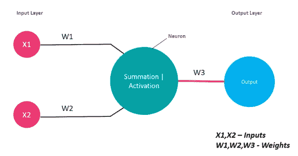
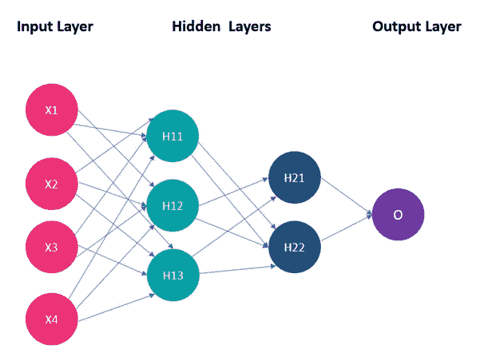
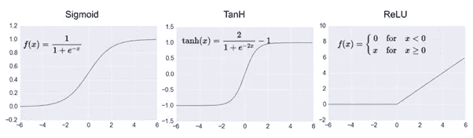
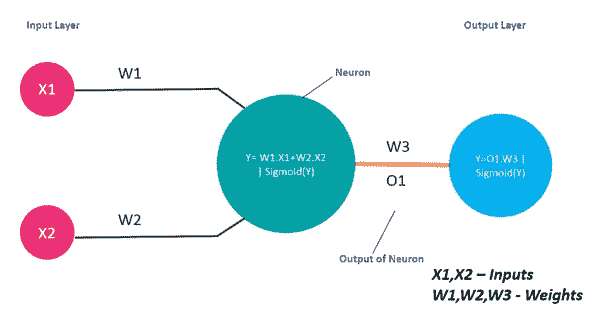
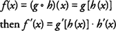
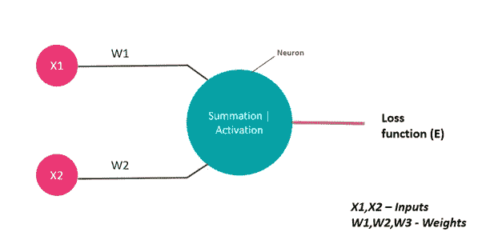
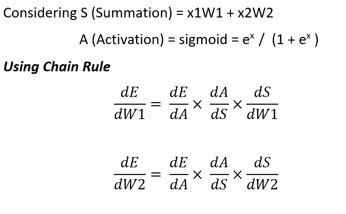
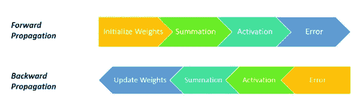
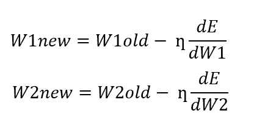

# 人工神经网络背后的数学

> 原文：<https://towardsdatascience.com/the-heart-of-artificial-neural-networks-26627e8c03ba?source=collection_archive---------9----------------------->

## 像大脑一样的神经元和像心脏一样的数学

> 就像大脑由数十亿个高度连接的神经元组成一样，神经网络中的一个基本操作单元是一个类似神经元的节点。它从其他节点获取输入，并将输出发送给其他节点。—费·

image by [Anastasia Dulgier](https://unsplash.com/@dulgier)

> 由于语音识别、计算机视觉和文本处理方面的许多突破性成果，人工神经网络在机器学习研究和行业中产生了许多兴奋。

在这篇文章中，我将关注神经元的基本结构，神经元如何工作以及神经网络背后的数学。

# 感知器

具有输入层和输出层的简单人工神经元称为感知器。

这个神经元包含什么？

1.  求和函数
2.  激活功能

给感知器的输入由求和函数处理，然后由激活函数处理以获得期望的输出。

Perceptron

这是一个简单的感知器，但如果我们有许多输入和巨大的数据，一个感知器是不够的，对不对？？我们必须继续增加神经元。这是基本的神经网络，有输入层，隐藏层，输出层。

Neural network

我们应该永远记住，神经网络只有一个输入层，输出层，但它可以有多个隐藏层。在上图中，我们可以看到样本神经网络有一个输入层、两个隐藏层和一个输出层。

> 作为神经网络的先决条件，让我们知道什么是激活函数和激活函数的类型。

# 激活功能

> 激活函数的主要目的是将神经元输入信号的加权和转换成输出信号。并且该输出信号被用作下一层的输入。

任何激活函数都应该是可微分的，因为我们使用反向传播机制来减少误差并相应地更新权重。

## 激活功能的类型

image [Source](http://adilmoujahid.com/posts/2016/06/introduction-deep-learning-python-caffe/)

## 乙状结肠的

1.  范围从 0 到 1。
2.  x 的小变化会导致 y 的大变化。
3.  通常用于二进制分类的输出层。

## 双曲正切

1.  范围在-1 和 1 之间。
2.  输出值以零为中心。
3.  通常用于隐藏层。

## RELU(校正线性单位)

1.  范围在 0 和最大值(x)之间。
2.  与 sigmoid 和 tanh 函数相比，计算成本较低。
3.  隐藏层的默认功能。
4.  它会导致神经元死亡，这可以通过应用漏 RELU 函数来补偿。

> 到目前为止，我们已经学习了感知机和激活功能的先决条件。现在让我们深入研究神经网络(神经网络的核心)的工作原理。

# 神经网络的工作

神经网络基于两个原理工作

1.  正向传播
2.  反向传播

让我们借助一个例子来理解这些积木。这里我考虑的是单一的输入层，隐藏层，输出层，使理解清晰。

## 正向传播

1.  考虑到我们有数据，并希望应用二元分类来获得所需的输出。
2.  取一个具有 X1、X2 特征的样本，这些特征将在一组过程中被操作以预测结果。
3.  每个特征与一个权重相关联，其中 X1，X2 作为特征，W1，W2 作为权重。这些被用作神经元的输入。
4.  神经元执行这两种功能。a)求和 b)激活。
5.  在求和过程中，所有特征都乘以它们的权重，然后对偏差求和。(Y=W1X1+W2X2+b)。
6.  这个求和函数应用于激活函数。该神经元的输出乘以权重 W3，并作为输入提供给输出层。
7.  同样的过程发生在每个神经元中，但我们改变了隐藏层神经元的激活函数，而不是输出层。

> 我们只是随机初始化权重，然后继续这个过程。有许多初始化权重的技术。但是，你可能会怀疑这些权重是如何更新的，对吗？？？这将使用反向传播来回答。

## 反向传播

让我们回到我们的微积分基础，我们将使用学生时代学到的链式法则来更新权重。

**链式法则**

**链规则**为我们提供了一种寻找复合函数导数的技术，组成复合函数的函数数量决定了需要多少个微分步骤。例如，如果复合函数 *f* ( *x* )被定义为

Chain rule

让我们将链式法则应用于单个神经元，

Chain Rule

在神经网络中，我们的主要目标是减少误差，为了使之成为可能，我们必须通过反向传播来更新所有的权重。我们需要找到权重的变化，以使误差最小。为此，我们计算 dE/dW1 和 dE/dW2。

Change in Weights

Backward Propagation

一旦你计算出与误差有关的重量变化，我们的下一步将是使用梯度下降程序更新重量。请点击查看关于梯度下降[的更多详情。](https://www.analyticsvidhya.com/blog/2017/03/introduction-to-gradient-descent-algorithm-along-its-variants/)

New weights

对于所有样本，前向传播和后向传播将是连续的，直到误差达到最小值。

# 包扎

在这里，我们了解了什么是神经元，神经网络如何工作的基础知识。但是，这还不够，在更新权重时还存在许多问题，如神经元死亡、权重超出范围等。我将发表一篇新文章，讨论激活函数面临的挑战以及如何减少神经元以减少训练错误。

# 参考

链式法则，克里夫笔记，[https://www . cliffs Notes . com/study-guides/calculus/calculus/the-derivative/chain-Rule](https://www.cliffsnotes.com/study-guides/calculus/calculus/the-derivative/chain-rule)

> 希望你喜欢它！！！敬请期待！！！请对任何疑问或建议发表评论！！！！