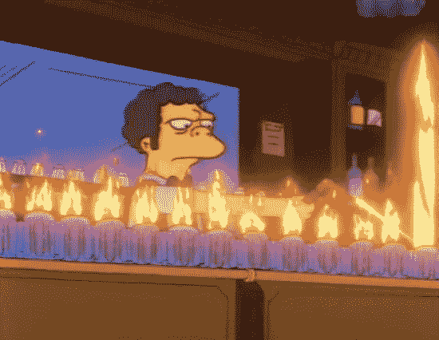
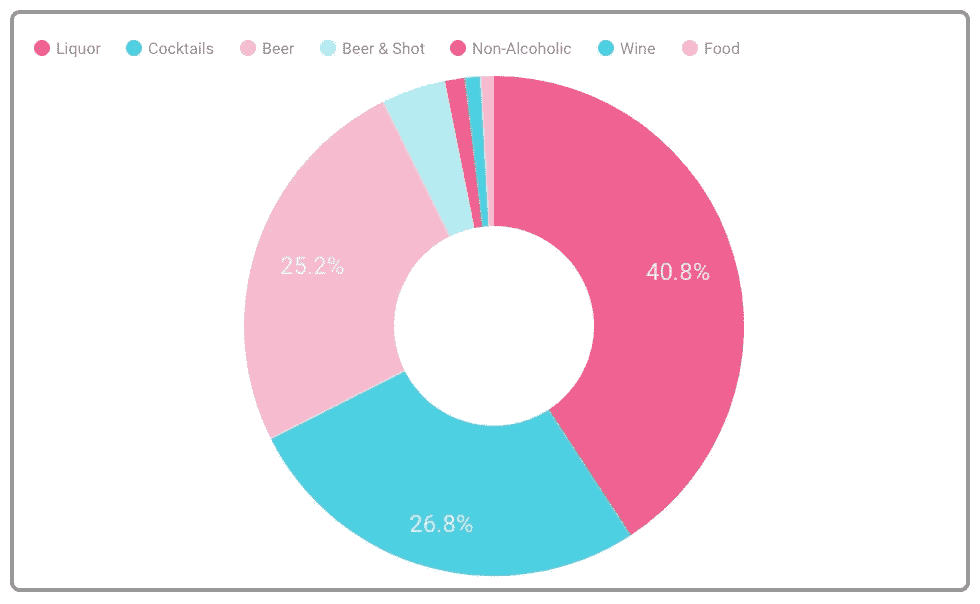
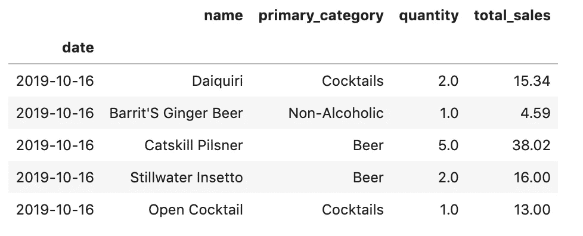
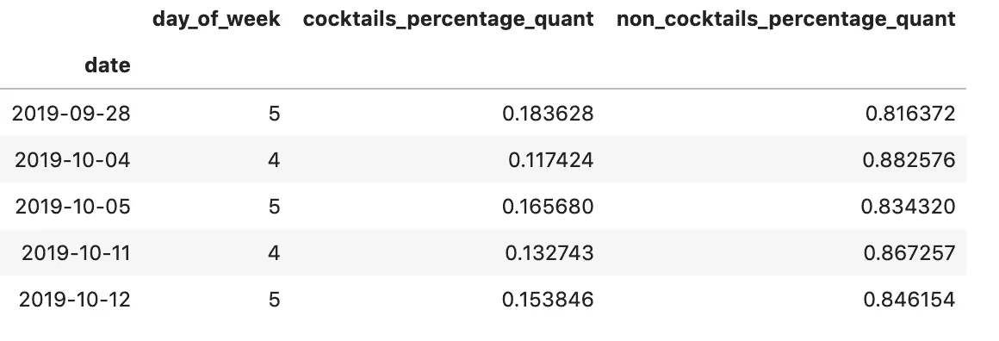
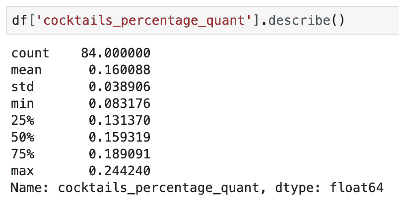
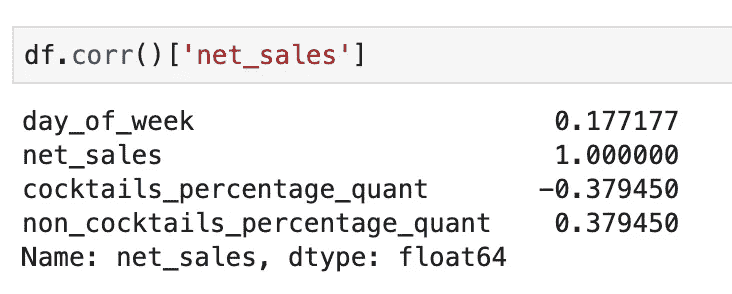
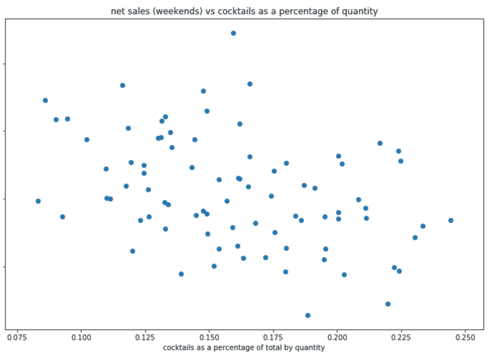
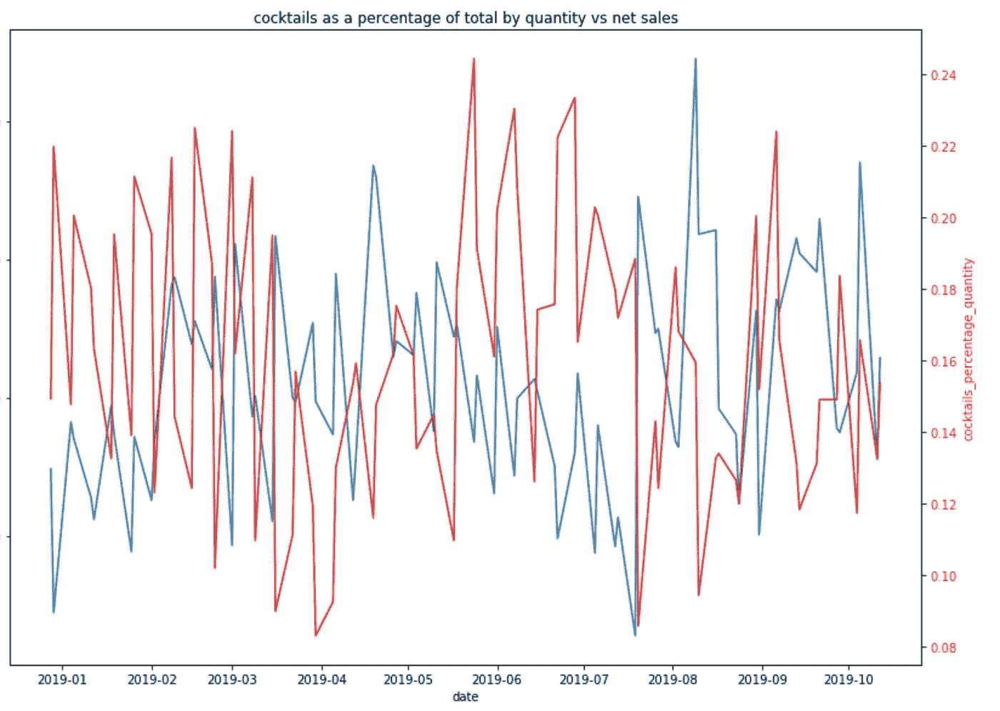

# 鸡尾酒的隐性成本

> 原文：<https://towardsdatascience.com/the-hidden-cost-of-cocktails-8763340c7db7?source=collection_archive---------20----------------------->

鸡尾酒不仅仅是高端烈酒、新鲜果汁和异国情调的配料——时间和机会成本也很重要。

*在以前的博客文章中，我已经讨论过在*[*【Jupiter Disco】*](http://www.jupiterdisco.com/)*自动化我们一些日常工作流程的过程，特别是* [*解析我们的日常销售报告*](https://medium.com/swlh/automating-workflows-pos-data-to-google-sheets-using-an-apps-script-62f98c878a86) *和* [*产品组合报告*](https://medium.com/better-programming/coding-interview-questions-applied-14c3a37e58ae) *到 Google Sheets。此后，我在 Google Apps 脚本中添加了一个集成，将数据加载到位于 Google CloudSQL 实例中的 MySQL 数据库中，并通过*[*Stitch*](https://www.stitchdata.com/)*在*[*big query*](https://cloud.google.com/bigquery/)*中复制。虽然数据管道和架构仍然是一项正在进行的工作，但在这一点上，我已经有足够的东西可以挖掘，并开始使用 SQL、Python 和统计数据挖掘一些见解。*

# 关于酒吧

我想预先声明，酒吧是神奇的和必不可少的。它们是无脚本生活的最后堡垒之一，我这个正在进行的项目的目的是帮助我的酒吧和其他人在数字时代繁荣发展。技术既是颠覆性的，也是变革性的——如果我们能够将网飞和堡垒之夜消耗的一小部分技术带宽应用于我们的小实体空间，也许我们将有机会与这些晚期资本主义的庞然大物对抗，至少在我们都试图进入[黑太阳](https://en.wikipedia.org/wiki/Snow_Crash)之前是如此。

# 还有鸡尾酒

*“我可以在同样的时间内卖出 10 杯伏特加苏打水，利润却更高，为什么还要提供鸡尾酒呢？”*烦人的酒吧老板

恼人的酒吧老板当然在技术上是正确的，就像大多数经济学家对经济阴谋的理论是正确的一样。但是，酒吧，就像它们所在的经济一样，是由人建造、经营和消费的，而人们，在他们所有不可预测、有创造力和古怪的荣耀中，并不总是想要伏特加苏打，有时他们不知道他们想要什么，很多时候他们喝的其实并不重要，但他们确实喜欢在大块冰块上提供精心制作的鸡尾酒。只是不太甜。

鸡尾酒规则。真正伟大的鸡尾酒酒吧提供的菜单是异想天开的、怪诞的、复古的、创新的和永恒的——一种有形的、可消费的展示，如果[欧格斯·兰斯莫斯](https://en.wikipedia.org/wiki/Yorgos_Lanthimos)被指定指挥《沙丘》,而 [DJ 巴士替换服务](https://soundcloud.com/resident-advisor/ra610-dj-bus-replacement-service?in=deejaybrs/sets/bus-replacement-services)负责音乐监督,《沙丘》( 2020)看起来会是什么样子。我不相信任何鸡尾酒已经突破到“真正的艺术”领域，但有些至少已经达到了沙丘(1984)的地位，这不是什么。因此，让我们深入研究这些数据，梳理出一些“可操作的见解”。

# 建立

这是 Jupiter Disco 年初至今的产品组合，第一张图表基于销售额:

Jupiter Disco Product Mix YTD — Sales

因此，在一个高层次上，Jupiter Disco 年初至今的销售额中有 40.8%属于酒类，这代表了 highballs(前面提到的伏特加苏打、杜松子酒和威士忌姜汁饮料等)、shots 和直饮。另外 26.8%是鸡尾酒，包括经典鸡尾酒和家酿鸡尾酒，25.2%是啤酒，包括生啤酒和罐装啤酒。

根据销售量，产品组合看起来有点不同——注意，鸡尾酒占美元收入的百分比从 26.8%上升到占销售量的百分比 17.8%。

Jupiter Disco Product Mix YTD — Quantities

我们卖很多 5 美元的 Narragansetts。虽然 13 美元的鸡尾酒不多，但总的来说，我们的鸡尾酒收入略高于啤酒收入。

在我们继续之前:*酒吧有许多不同的形式和格式。Jupiter Disco 是一个 1000 平方英尺的鸡尾酒吧/舞蹈俱乐部，周末通常会达到其有限的常设允许容量。这是一种完全不同于只有座位的鸡尾酒吧的形式，鸡尾酒吧本身也是一种完全不同于“提供真正美味鸡尾酒的社区酒吧”的形式。我们都是不同的，所以你的里程可能会有所不同。*

# 问题

那么经营一家裹着夜店的鸡尾酒吧有什么影响呢？首先，我们必须花更多的钱来维护我们的音响系统:

但另一个原因是，我们在高音量环境下提供合适的鸡尾酒，而这些鸡尾酒需要时间来调制。我们能量化那段时间的成本吗？

# 编码时间到了

在查询我们的数据库并做了一些清理后，我的数据帧如下所示:

所以每一行代表每天每种产品的数量和总销售额。该数据集有 12，341 行(实际上是 2019 年年初至今)，我可以使用`df.pivot_table()`和`.apply()`方法将这些行聚合并转换为百分比，添加一个包含星期几的列，合并为“鸡尾酒”和“非鸡尾酒”，并过滤数据帧，只显示周末:

此时，我会将其与包含每日净销售额的数据框架合并，并准备好一个完整的数据框架，包含总共 84 行(2019 年的每周五和周六晚上)。

为了为下一步分析做好准备，让我们来看看一年中鸡尾酒总量百分比的平均值、标准差、范围和四分位数:

因此，在周末，我们的平均鸡尾酒百分比为 16.0%，您会注意到这略低于整体(包括全天)的 17.8%。

# 相关

让我们看看鸡尾酒和非鸡尾酒百分比与净销售额之间的相关性:

这很有趣。看起来我们的鸡尾酒百分比与净销售额呈负相关，相关系数为-0.38。对此的一种解释是，当我们在周末销售鸡尾酒与非鸡尾酒的比例较高时，我们的销售额会较低。虽然相关性并不意味着因果关系，事实上我们客观地知道鸡尾酒比罐装啤酒需要更长的时间来制作，我们可以怀疑鸡尾酒的价格溢价是否没有完全捕捉到制作一杯鸡尾酒所需时间的机会成本。

我们的周六比周五更忙，这种关系甚至比周五更牢固:

让我们计划周末:

Net Sales on the Y-Axis, Cocktails as a Percentage of Total by Quantity on the X-Axis

-0.38 不是一个很强的相关性，但它是中等程度的，并且在上面的散点图中可以看出这种模式。我们还可以看看一年来的关系:

Net Sales (Blue) versus Cocktails Percentage of Total by Quantity (Red)

很明显，我遮住了左边的 Y 轴，因为这篇文章的目的不是在互联网上大肆宣传 Jupiter Disco 的销售，希望你们都明白。

# 统计显著性

为了尝试量化影响，我将该数据集分为两个样本集:(1)低鸡尾酒百分比，代表低于中值鸡尾酒百分比 15.9%的 50%的数据，以及(2)高鸡尾酒百分比，代表上述数据的 50%。

查看每个样本集的统计数据，低鸡尾酒百分比组的平均销售额比整体平均值高 5.3%，高鸡尾酒百分比组的平均销售额比整体平均值低 5.3%，根据我们销售的鸡尾酒百分比，这似乎是一个相当大的波动。

有统计学意义吗？

在我们进行测试之前，让我们把问题恰当地组织起来。我们的无效假设是，高比例的鸡尾酒**不会**对销售产生负面影响。我们的另一个假设是，高比例的鸡尾酒**确实对销售有负面影响。让我们将显著性水平设置为 0.05，并进行 t 检验，以评估我们是否可以拒绝或无法拒绝我们的零假设。**

****

**因此，p 值为 0.01，看起来这两个平均值之间的差异确实具有统计学意义，我们可以**拒绝**零假设。**

# **现在该怎么办**

**量化运行鸡尾酒计划的成本是困难的。数据中无疑有很多噪音。人群会发生变化，一个晚上的总人数会随着时间的推移而变化，而且会有员工流动。鸡尾酒本身也会改变。**

**但看起来这个数据中确实有一点信号，这意味着鸡尾酒价格溢价并没有完全捕捉到生产时间的机会成本(这里的机会成本是调酒师可能出售伏特加苏打水的时间)。如果我们不想提价(我们确实不想)，这意味着我们必须重新审视制作鸡尾酒的构建和流程，看看我们是否可以节省一些时间，让它们更快地出来。**

**从高层次上来说，我希望这篇文章能帮助你理解鸡尾酒比高杯酒更贵的原因之一。不仅仅是杯子里的成分。花在搅拌鸡尾酒上的每一分钟都不是花在倒啤酒和饮料上的时间，在繁忙的夜晚，这些时间会累积起来。这还是在我们开始考虑每种鸡尾酒的研发成本、培训时间以及所有其他进入其真实成本的因素之前，无论是否明确说明。**

**希望你喜欢。**