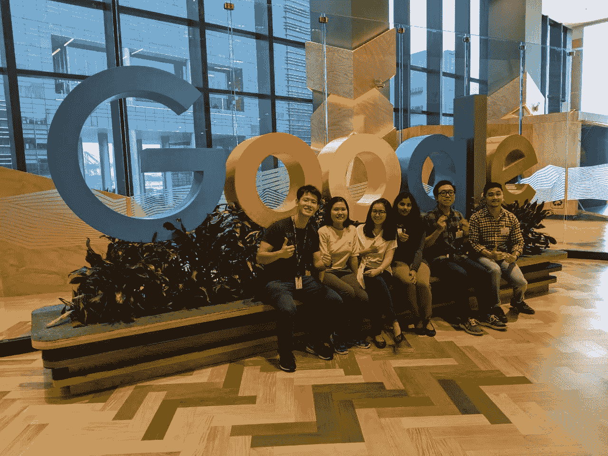
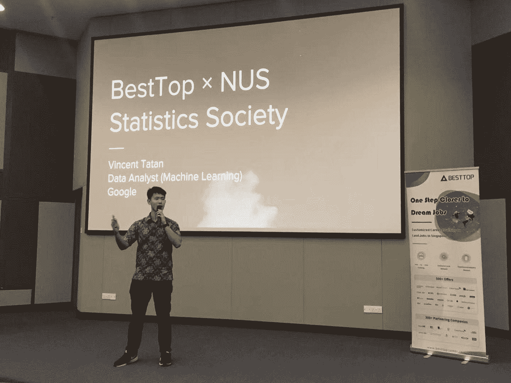
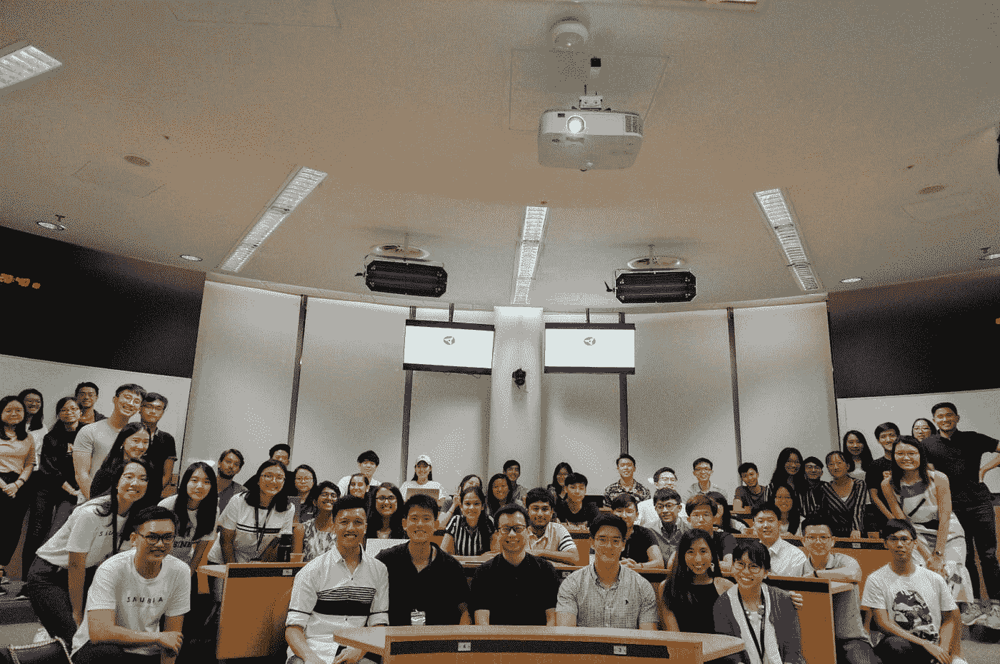

# 写作分析的隐藏宝石

> 原文：<https://towardsdatascience.com/the-hidden-gems-of-writing-analytics-6db78fad5a51?source=collection_archive---------29----------------------->

## 我对有志成为数据初学者的建议

## 这是我在谷歌工作、吸引被动收入、激励数据初级人员以及更多事情的黄金入场券

Source: Unsplash

4 年前，也就是 2015 年，我成为新加坡管理大学(Singapore Management University)首批参加分析专业化考试的学生之一。

尽管最初有大量学生涌入尝试这些专业，但许多商科学生发现它们很难，于是辍学了。他们是突然面临编码和分析思维困难的商科学生。由于课程仍然很新，帮助他们弥补学习差距的支持数量很少。

因此，作为一名分析爱好者，我发现了一个我可以做出贡献的差距。

> “我如何帮助我的下级(具有商业背景)更好地学习数据分析？”

我认为这将是我学习的一个很好的机会，同时也能帮助我的学生学习分析。

# 写作和教学是最重要的

## 我是如何开始的:构建价值投资工具

我意识到，许多苦苦挣扎的学生转而学习金融和股票分析，因为他们希望在知名公司工作。因此，我决定我的第一个目标是构建对他们重要的分析应用程序。在当地投资俱乐部的帮助下，我[开发了一个分析工具来快速提取和处理相关的财务比率](/value-investing-dashboard-with-python-beautiful-soup-and-dash-python-43002f6a97ca)。

## 构建和教授重要的解决方案

随着它变得成功，我进一步教我的低年级学生更多的学习用例。对于运营管理的学生，我教他们[线性和整数优化(LP & IP)](https://www.youtube.com/watch?v=uVZQUN4sAh4&t=163s) 。对于市场营销专业的学生，我教他们 [Twitter 情绪和社交媒体分析](https://www.youtube.com/watch?v=YnMhFV8Q_K4)。

结果是成功的；我收到了我的学弟的笔记，他用我的代码来开发 Twitter 情绪仪表板。然后，我产生了足够的兴趣，促成了一个非正式的社区，供商科学生学习分析。我在 Github 上预订了小自习室来方便我的项目。

## 在 Youtube 上教授分析

很快，我有了一个为 [SMU 商业情报和分析俱乐部(BIA)](https://www.smubia.org/) 起草课程的计划。我[开始在 Youtube](https://www.youtube.com/channel/UCkdLA9vR9S_SbVKdfWuMyKg?view_as=subscriber) 上教学，这让我可以推广我的频道并大规模地回顾我的教学。几个月后，我的通道被用作 SMU·BIA 教授他们学生的创世课程。

## “帮助我的学生更好地学习数据分析”…等等

半年之内，我在媒体上发表了 30 多篇关于我的[侧面分析项目的博客，并获得了 800 多名关注者。这证明了许多潜力为需要指导的有抱负的数据科学家增加了价值。](https://towardsdatascience.com/@vincentkernn)

# 编写数据分析背后隐藏的 5 颗宝石

我想和你分享写分析如何通过 5 个隐藏的宝石帮助我成长为一名有能力的数据科学家:职业、灵感、收入、可信度和价值。

# 职业:它让我进入谷歌

Inviting Singapore Institute of Management (SIM) Society of Mathematical Sciences Org Comm to Google

正如你从我最近的文章中所知道的[，我被谷歌挖走了。谷歌是拥有最聪明员工的顶级公司之一。怎么可能 Google HR 猎头我？难道他们不应该已经有很多非常合格的申请者求着走进他们的大门吗？](/ace-your-data-analytics-interviews-ef114606c5d7)

答案很有意思，因为我恰好是特例之一。在谷歌，有两种常规的招聘方式:推荐和直接申请。我两样都没做，反而被猎头挖走了。

> 那么我是怎么被猎头挖走的呢？

我的 HR 告诉了我一个简单的答案:我是 LinkedIn 的顶级推荐。

我很惊讶，因为我从来没有定期更新我的 LinkedIn。有很多数据科学家和机器学习工程师把他们的 Linkedin 个人资料装饰得比我好。那么我为什么要做置顶推荐呢？

在深入研究了 Linkedin 的数据之后，我意识到我的关于数据科学的文章在我的 Linkedin 上吸引了大量的流量。你们中的许多人与我联系，询问数据分析方面的建议。因此，你是我进入谷歌的事实！谢谢大家！

同样，我鼓励你分享你的知识。它会让你以你永远无法预见的方式获得更好的机会。

# 灵感:它给了我学习数据科学的意义

Source: unsplash

> “你是世界之光。建在山上的城镇是无法隐藏的。人们也不会点灯放在碗下。取而代之的是，他们把它放在灯架上，它给房子里的每个人都带来了光亮。你们的光也当这样照在人前，叫他们看见你们的好行为，便将荣耀归给你们在天上的父。——马太福音 5:14–16

我真的很喜欢看到学弟学妹的成长。我喜欢学习和教育他人。最重要的是。我喜欢给我的后辈梦想。我总是邀请他们去 Google office 吃午饭，和他们分享我的经历。我很高兴了解并收到反馈，我所做的对他们很重要。我们在世上的时间是有限的，所以我决定尽我所能成为世上的盐和光，来荣耀我们在天上的父。

这成了我花很多时间自我教育的动力来源。尽可能多的学习，教育别人，成了我的灵感。尽管我有很多不完美之处，但我很高兴分享我在学习和成为一名更好的数据科学家方面的努力。我学的越多，我教的就越多。我教的越多，学到的越多。

同样，我希望你能找到学习分析的主要原因，并与世界分享。这将成为你继续深入分析世界的灵感

# 收入:它给了我学习的自主权

Source: Unsplash

在《走向数据科学》写作也给了我一笔不错的收入。最初，当我第一次成为媒体合伙人作家时，我很高兴一个月能收到 10 美元。但是现在，随着我的粉丝越来越多，我每写一篇好文章就能赚 300 美元。

这证明了写作的复合收益是公司环境所不具备的。今天，我通过 Google Home 和 Medium 应用程序将我的文章推广给了成千上万的观众。在 6 个月内，我看到我每月的写作收入呈指数增长。

此外，在媒介上写作的最大好处是你可以得到美元报酬。我来自一个货币疲软的国家(印度卢比和新加坡元)，我从我的中等收入中获得足够的金额。

这打开了许多可能性的大门。你会更少地依赖你目前全职工作的收入，反而会更擅长你所做的事情。

# 可信度:它让我找到更好的学习和教学机会

My Analytics Journey sharing at National University of Singapore (NUS)

写作给了我说话和学习的机会。顶尖大学、公司和分析聚会邀请我分享我对某些主题的想法。

写文章给了我的听众一个可信的平台来检验我的意识形态和思想。这让他们确信我的想法与他们的目标一致。

同样，写作也让我对我工作的公司更有价值。我在很多活动中都代表过 Visa 和 Google。这种可信度也让我可以向 Visa 和谷歌申请教育补助，在 omsc 攻读硕士学位。

同样，我想鼓励你开始教授数据分析。这将有助于你在未来提升自己的声誉，成为一名更有意义、知识更丰富的数据科学家。

# 价值:找到你写作和教学的声音

The joy of growing with SMU BIA Club

我还记得当我在大学的时候，SMU·BIA 真的很小。为了重振俱乐部，我和我的朋友预订了小房间，录制了 Youtube 视频，为我们的低年级学生教授简单的课程。很快到了现在，组委会已经发展到 20 人，他们的每一次活动都有人出席。SMU·BIA 给我上了一课，我一直很感激:即使我的知识和时间有限，我也能帮助别人。

我很高兴我的作品做到了这一点。你们中的许多人在 Linkedin 上与我联系，分享我的作品如何为你们的生活增添价值的故事。

我找到了自己的声音，你也可以。

# 结论:开始写你的故事

> “你拥有发生在你身上的一切。说出你的故事。如果人们希望你热情地写他们，他们应该表现得更好。”安妮·拉莫特的《一只鸟接一只鸟》

如果你害怕开始，那么请记住安妮·拉莫特的这句话。我个人建议看这本书，有更好的心态去写自己的想法。

虽然在你的机器学习知识中保持聪明和技术是好的，但在你的发现中加入一些个人色彩也是有益的。毕竟你的故事是属于你的。好好分享一下:)

作为一名作家，另一个艰难的时刻是当你面对拒绝的恐惧时——T2，骗子综合症。但是你可以慢慢克服这些障碍，从小事做起，一只鸟一只鸟地写你的文章*。*

开始写吧，希望你会有收获:

1.  职业:写下你的想法，为更好的机会做准备。
2.  **启发:**找出你为什么学习分析学，站得高。
3.  **收入:**拓展机会写出世人看重的东西。
4.  **可信度:**为你设立基金会，检验你的意识形态。
5.  **价值:**找到自己的声音，写作启发。

索利·德奥·格洛丽亚

# 最后…

我真的希望这是一本很棒的读物，是你发展和创新的灵感来源。

请在下面的**评论**提出建议和反馈。就像你一样，我也在学习如何成为一名更好的数据科学家和工程师。请帮助我改进，以便我可以在后续的文章发布中更好地帮助您。

谢谢大家，编码快乐:)

# 关于作者

Vincent Tatan 是一名数据和技术爱好者，拥有在 Google LLC、Visa Inc .和 Lazada 实施微服务架构、商业智能和分析管道项目的相关工作经验[。](https://bit.ly/2I8jkWV.?source=post_page---------------------------)

Vincent 是土生土长的印度尼西亚人，在解决问题方面成绩斐然，擅长全栈开发、数据分析和战略规划。

他一直积极咨询 SMU BI & Analytics Club，指导来自不同背景的有抱负的数据科学家和工程师，并为企业开发他们的产品开放他的专业知识。

文森特还在 10 日至 8 日开放了他的一对一导师服务，指导你如何在谷歌、Visa 或其他大型科技公司获得你梦想中的数据科学家/工程师工作。如果你正在寻找良师益友，请在此 **与他预约。**

最后，请通过 [**LinkedIn**](http://www.linkedin.com/in/vincenttatan/?source=post_page---------------------------) **，**[**Medium**](https://medium.com/@vincentkernn?source=post_page---------------------------)**或** [**Youtube 频道**](https://www.youtube.com/user/vincelance1/videos?source=post_page---------------------------) 联系文森特