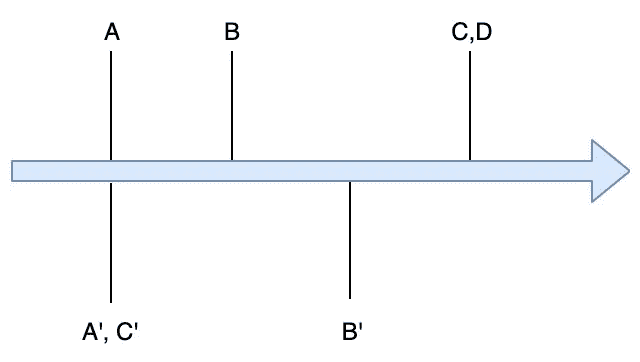
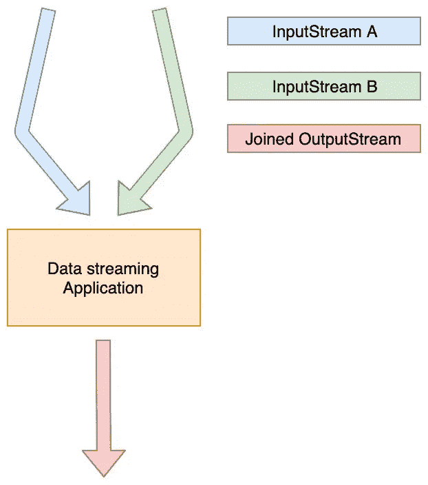
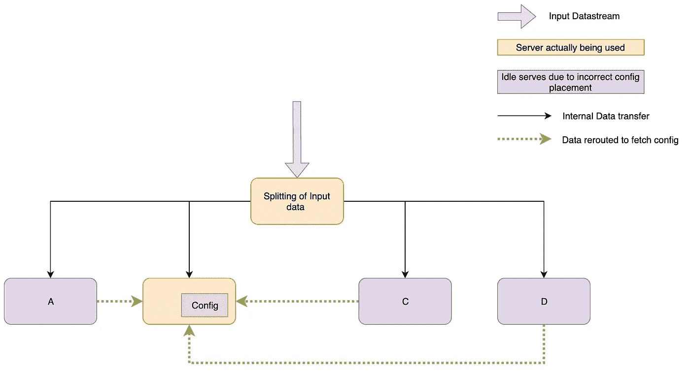

# 实时数据流应用程序隐藏的特性

> 原文：<https://towardsdatascience.com/the-hidden-peculiarities-of-realtime-data-streaming-applications-23b6484d2307?source=collection_archive---------20----------------------->


Photo by [Lysander Yuen](https://unsplash.com/@lysanderyuen?utm_source=medium&utm_medium=referral) on [Unsplash](https://unsplash.com?utm_source=medium&utm_medium=referral)

随着开源框架(如 Apache Flink、Apache Spark、Apache Storm)和云框架(如 Google Dataflow)的不断增加，创建实时数据处理作业变得非常容易。API 定义良好，Map-Reduce 等标准概念在所有框架中都遵循几乎相似的语义。

然而，直到今天，在实时数据处理领域起步的开发人员还在为这个领域的一些特性而奋斗。因此，他们不知不觉地创建了一个路径，导致应用程序中相当常见的错误。

让我们来看看在设计实时应用程序时可能需要克服的一些奇怪的概念。

# 事件时间

数据源生成数据的时间戳称为**事件时间**，而应用程序处理数据的时间戳称为**处理时间**。不区分这些时间戳是实时数据流应用程序中最常见陷阱的原因。

下面就来细说一下。

由于几个问题，例如代理中的高 GC 或导致背压的过多数据，数据队列容易延迟。我将用(E，P)表示一个事件，其中 E 是事件时间戳(HH:MM:SS 格式)，P 是处理时间戳。在理想世界中，E==P，但这不会发生在任何地方。

让我们假设我们收到以下数据

```
('05:00:00', '05:00:02'), ('05:00:01', '05:00:03'),      ('05:00:01', '05:00:03'), ('05:00:01', '05:00:05'),
('05:00:02', '05:00:05'), ('05:00:02', '05:00:05')
```

现在让我们假设有一个程序计算每秒收到的事件数。根据事件时间，程序返回

```
[05:00:00, 05:00:01) = 1
[05:00:01, 05:00:02) = 3
[05:00:02, 05:00:03) = 2
```

但是，根据处理时间，输出是

```
[05:00:00, 05:00:01) = 0
[05:00:01, 05:00:02) = 0
[05:00:02, 05:00:03) = 1
[05:00:03, 05:00:04) = 2
[05:00:04, 05:00:05) = 0
[05:00:05, 05:00:06) = 3
```

如你所见，这两者是完全不同的结果。

# 数据流中不寻常的延迟

大多数实时数据应用程序都使用分布式队列中的数据，如 Apache Kafka、RabbitMQ、Pub/Sub 等。队列中的数据由其他服务生成，如来自消费者应用程序的点击流或来自数据库的日志。

问题队列容易受到延迟的影响。生成的事件甚至可以在几十毫秒内到达您的作业，或者在最坏的情况下可能需要一个多小时(极端背压)。数据可能会由于以下原因而延迟—

*   卡夫卡的高负荷
*   生产者在其服务器中缓冲数据
*   由于应用程序中的反压力，消耗速度较慢

不假设数据会有延迟是一个陷阱。开发人员应该始终拥有测量数据延迟的工具。例如，在卡夫卡中，你应该检查一下偏移滞后。

您还应该监控作业中的背压和延迟(即事件时间和处理时间之间的差异)。没有这些将导致意外的数据丢失，例如 10 分钟。时间窗口可以显示为无数据，窗口为 10 分钟。之后的值是期望值的两倍。

# 连接

在批处理数据处理系统中，连接两个数据集相对来说比较简单。在流式世界中，情况变得有点麻烦。

```
//The dataset is in the format (timestamp, key, value)//Datasteam 1
(05:00:00, A, value A), (05:00:01, B, value B),
(05:00:04, C, value C), (05:00:04, D, value D)//Datastream 2
(05:00:00, A, value A'), (05:00:02, B, value B'), 
(05:00:00, C, value C')
```



Both data streams represented on a single time scale

我们现在在它们的键上连接两个数据流。为了简单起见，我们将做一个内部连接。

**键 A** —两个值 A &值 A’同时到达。因此，我们可以很容易地将它们组合成一个函数并输出结果

**键 B**—B 值比 B 值早 1 秒。因此，我们需要在数据流 1 上等待至少 1 秒钟，以使连接工作。因此，你需要考虑以下几点-

*   你会把这一秒钟的数据存储在哪里？
*   如果这 1 秒钟不是固定的延迟，而是不规则地变化，在最坏的情况下上升到 10 分钟，那该怎么办？

**C 键**—C 值比 C 值晚 4 秒到达。这与之前的情况相同，但现在数据流 1 和 2 都有不规则的延迟，没有固定的模式来确定哪个流将给出值 1。

**键 D** —值 D 到达，但没有观察到值 D’。考虑以下情况-

*   你要等多久才能得到 d `?
*   如果值 d '可以在从至少 5 秒到接近 1 小时的任何时间出现呢？
*   如果这是一个外部连接，并且您必须决定何时单独发出值 D，该怎么办？
*   如果在前一种情况下，在发出值 D 1 分钟后，值 D `到达，会怎样？



Join in a streaming application

以上所有问题的答案将取决于您的使用案例。重要的是考虑所有这些问题，而不是忽视流媒体系统的复杂性。

# 配置

在标准微服务中，配置存在于作业内部或数据库中。在数据流应用程序中也可以这样做。但是，在使用这种方法之前，您需要考虑以下几点。

## 您访问配置的频率是多少？

如果需要为每个事件访问配置，并且事件的数量很多(超过一百万 RPM)，那么您也可以尝试其他方法。一种是将配置存储在作业状态中。这可以在 Flink 和 Spark 中使用有状态处理来完成。可以使用文件阅读器或 Kafka 中的另一个流在状态中填充配置。

在流式世界中，对每个事件进行 DB 调用会降低应用程序的速度并导致背压。选择是要么使用快速数据库，要么通过在应用程序中存储状态来消除网络调用。

## 你的配置有多大？

如果配置非常大，您应该只使用应用程序内状态，如果配置可以跨多个服务器拆分，例如，配置为每个用户保存一些阈值。这种配置可以根据用户 id 键在几台机器上进行分割。这有助于减少每台服务器的存储量。

如果配置不能跨节点拆分，则首选 DB。否则，所有数据将需要被路由到包含配置的单个服务器，然后再次重新分发。在这个场景中，唯一包含配置的服务器充当了瓶颈。



Config present in a single server leading to a bottleneck

设计实时数据流应用程序似乎很容易，但开发人员会犯很多类似上面提到的错误，特别是如果他们来自微服务领域。

重要的部分是理解数据流的基础，以及如何处理单个数据流，然后转到处理多个连接、实时配置更新等的复杂应用程序。

这个领域最重要的书籍之一是
[设计数据密集型应用程序:可靠、可伸缩和可维护系统背后的伟大思想](https://www.amazon.com/Designing-Data-Intensive-Applications-Reliable-Maintainable/dp/1449373321)。

***联系我*** [***领英***](http://www.linkedin.com/in/kartik-khare) ***或*** [***脸书***](https://www.facebook.com/KK.corps) ***或如有任何疑问，请发邮件至***[***kharekartik@gmail.com***](mailto:kharekartik@gmail.com)