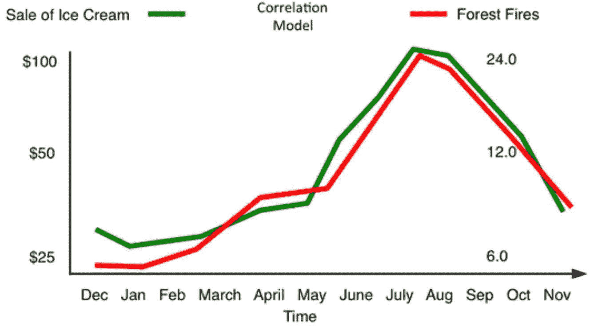
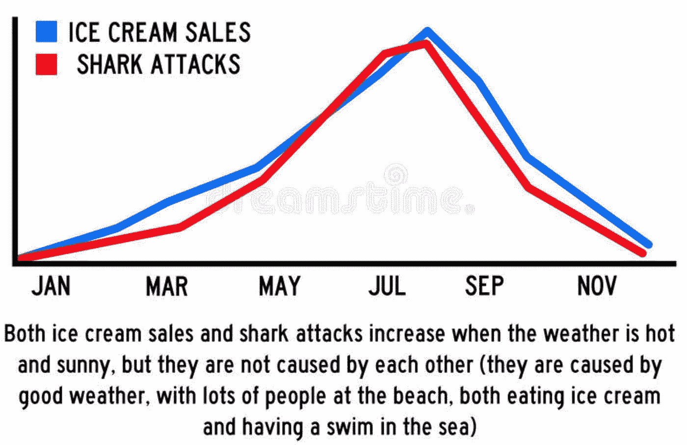
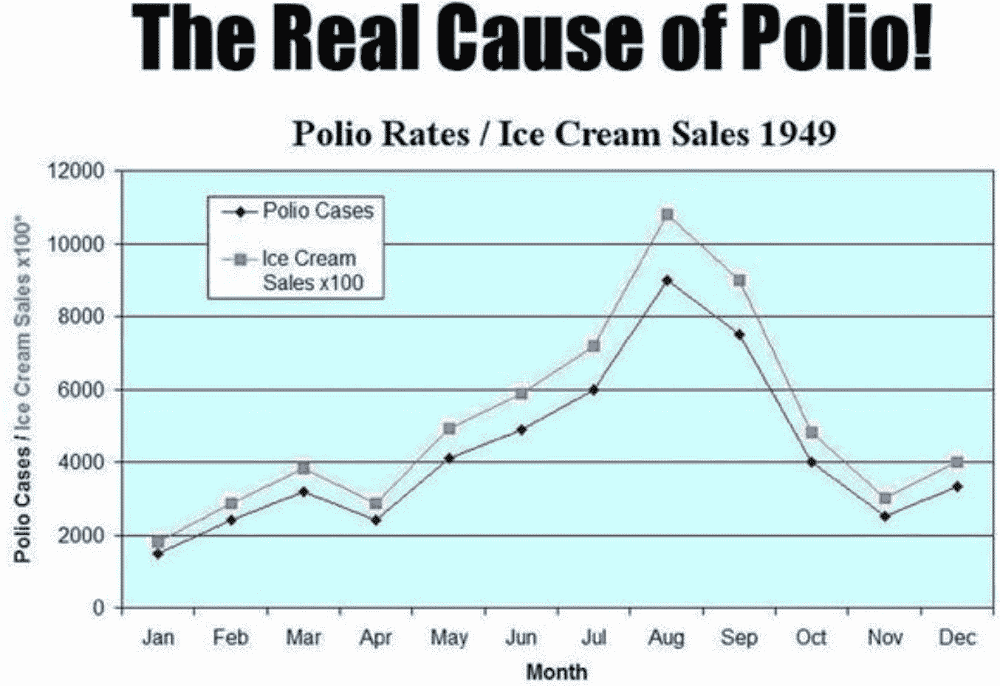

# 人工智能和大数据的隐藏风险

> 原文：<https://towardsdatascience.com/the-hidden-risk-of-ai-and-big-data-3332d77dfa6?source=collection_archive---------13----------------------->

## 人工智能的最新进展是通过访问“大数据”和廉价的计算能力实现的。但是它会出错吗？

大数据突然无处不在。从稀缺和难以找到数据(和信息)，我们现在有大量的数据。近年来，可用数据量呈指数级增长。反过来，由于记录数据的设备数量的巨大增长，以及所有这些设备之间通过物联网的连接，这也成为可能。每个人似乎都在收集、分析、从大数据中赚钱，并庆祝(或害怕)大数据的威力。通过结合现代计算的力量，它有望解决几乎任何问题——仅仅通过处理数字。

但是，大数据真的能兑现所有这些宣传吗？在某些情况下，是的，在其他情况下，也许不是。一方面，毫无疑问，大数据已经在某些领域产生了至关重要的影响。例如，几乎每一个成功的人工智能解决方案都涉及一些严肃的数字运算。

首先要注意的是，虽然 AI 目前非常擅长在大数据集内寻找模式和关系，但它仍然不是很智能(取决于你对智能的定义，但那是另一回事了！).处理这些数字可以有效地识别和发现我们数据中的微妙模式，但它不能直接告诉我们这些相关性中哪些实际上是有意义的。

# 相关性与因果关系

我们都知道(或者应该知道！)那个“[关联并不意味着因果关系](https://en.wikipedia.org/wiki/Correlation_does_not_imply_causation)”。然而，人类的大脑天生就喜欢寻找模式，当我们看到倾斜在一起的线条和数据中明显的模式时，我们很难抗拒找出原因的冲动。

然而，从统计学角度来看，我们无法实现这一飞跃。《虚假相关性》 [*、*](http://www.tylervigen.com/) 的作者泰勒·维根在他的网站上对此大做文章(我强烈推荐你去看看一些有趣的统计数据！)这种虚假关联的一些例子可以在下面的数字中找到，我收集了一些例子，表明冰淇淋显然正在造成许多糟糕的事情，从森林火灾到鲨鱼袭击和脊髓灰质炎爆发。

看看这些情节，有人可能会说我们可能早就应该禁止冰淇淋了。事实上，在 20 世纪 40 年代脊髓灰质炎的例子中，公共卫生专家建议人们停止食用冰淇淋作为“抗脊髓灰质炎饮食”的一部分。幸运的是，他们最终意识到小儿麻痹症的爆发和冰淇淋消费之间的关联仅仅是因为小儿麻痹症的爆发在夏季最为常见。

在[统计](https://en.wikipedia.org/wiki/Statistics)中，虚假关系或[虚假相关](https://en.wikipedia.org/wiki/Spurious_relationship)是一种数学关系，其中两个或多个事件或变量与相关联，但 [*与*](https://en.wikipedia.org/wiki/Correlation_does_not_imply_causation) [没有因果关系](https://en.wikipedia.org/wiki/Causality)，这是由于巧合或某个第三个看不见的因素(称为“共同反应变量”、“混杂因素”或“[潜伏变量](https://en.wikipedia.org/wiki/Lurking_variable)”)的存在。这种“潜在变量”的一个例子可能是冰淇淋销售和鲨鱼攻击之间的表面相关性(我非常确信冰淇淋销售的增加不会导致鲨鱼攻击人)。但是，这两个数字背后有一个共同的联系，那就是温度。更高的温度导致更多的人去买冰淇淋，也导致更多的人去游泳。因此，这个“潜伏变量”实际上是表面相关性的原因。幸运的是，我们已经学会了区分相关性和因果性，我们仍然可以在炎热的夏天享受冰淇淋，而不用担心脊髓灰质炎的爆发和鲨鱼的袭击！

# 相关性的力量和极限

有了足够的数据，计算能力和统计算法模式就会被发现。但是这些模式有什么意义吗？并非所有都是如此，因为虚假模式很容易超过有意义的模式。当正确应用于正确的问题时，结合算法的大数据可能是一个非常有用的工具。然而，没有科学家认为你可以通过独自处理数据来解决问题，无论统计分析多么强大。你应该总是基于对你试图解决的问题的潜在理解来开始你的分析。

# 数据科学是科学的终结(或者是？)

2008 年 6 月，《连线》杂志前主编 C. Anderson 写了一篇颇具煽动性的文章，题为:“[理论的终结:数据泛滥使科学方法过时”，](https://www.wired.com/2008/06/pb-theory/)他在文章中指出，“有了足够的数据，数字就能说话”。相关性取代了因果关系，即使没有一致的模型和统一的理论，科学也能进步。

这种方法的强度和通用性取决于数据量:数据越多，基于计算发现的相关性的方法就越强大和有效。我们可以简单地将数字输入强大的计算机，让统计算法自动发现有趣的模式和见解。

不幸的是，这种简化的分析方法有一些潜在的陷阱，这可以通过 John Poppelaars 在[博客上找到的一个例子很好地说明:](https://john-poppelaars.blogspot.com/2015/04/do-numbers-really-speak-for-themselves.html)

*假设我们想要为某个变量 y 创建一个预测模型。例如，这可能是一家公司的股票价格、在线广告的点击率或下周的天气。接下来，我们收集所有我们可以得到的数据，并将其放入一些统计程序中，以找到 y 的最佳可能预测模型。一个常见的程序是首先使用所有变量估计模型，筛选出不重要的变量(在某个预定义的显著性水平上不显著的变量)，然后使用选定的变量子集重新估计模型，并重复此程序，直到找到显著的模型。很简单，不是吗？*

*然而安德森提出的分析方式有一些严重的缺陷。让我举例说明。按照上面的例子，我通过从 0 和 1 之间的均匀分布中抽取 100 个样本，为 Y 创建了一组数据点，所以它是随机噪声。接下来，我创建了一组 50 个解释变量 X(i ),从 0 到 1 之间的均匀分布中抽取 100 个样本。所以，所有 50 个解释变量也是随机噪声。我使用所有 X(i)变量来估计线性回归模型，以预测 y。由于没有任何相关(所有均匀分布和独立的变量)，所以预计 R 的平方为零，但事实上并非如此。结果是 0.5。对于一个基于随机噪声的回归来说还不错！幸运的是，这个模型并不重要。不重要的变量被逐步剔除，模型被重新估计。重复这个过程，直到找到一个重要的模型。几个步骤后，发现一个显著模型，其调整后的 R 平方为 0.4，7 个变量的显著性水平至少为 99%。同样，我们正在回归随机噪声，其中绝对没有关系，但我们仍然找到了一个具有 7 个重要参数的重要模型。如果我们只是将数据输入统计算法去寻找模式，就会发生这种情况。”*

# 数据集越大，噪音越强

最近的研究提供了证据，随着数据集变大，它们必须包含任意的相关性。这些相关性的出现仅仅是由于数据的大小，这表明许多相关性将是虚假的。不幸的是，太多的信息往往表现得像很少的信息。

在处理高维数据的应用程序中，这是一个主要问题。例如，假设您从一个工厂的数千个传感器中收集传感器数据，然后挖掘这些数据来优化性能。在这种情况下，你很容易被愚弄，根据虚幻的相关性而不是运营绩效的真实指标采取行动。这可能是一个非常坏的消息，无论是在经济上还是在工厂的安全运营方面。

# 添加数据与添加信息

作为数据科学家，我们可能经常声称，改善我们的人工智能模型的最佳解决方案是“添加更多数据”。然而，仅仅“添加更多数据”就能神奇地提高模型性能的想法可能并非如此。我们应该关注的是“增加更多的信息”。“添加数据”和“添加信息”之间的区别至关重要:添加更多的数据不等于添加更多的信息(至少是有用和正确的信息)。相反，通过盲目添加越来越多的数据，我们会遇到添加包含错误信息的数据的风险，从而降低我们模型的性能。随着对数据的大量访问以及处理数据的计算能力，考虑这一点变得越来越重要。

# 观点

那么，上述挑战会阻止您采用数据驱动的决策吗？不，远非如此。数据驱动的决策将会持续下去。它将变得越来越有价值，因为我们获得了更多关于如何最好地利用所有可用数据和信息来推动绩效的知识，即点击您的网站或优化工厂的运营。

然而，重要的是要意识到，它需要的不仅仅是硬件和大量的数据才能成功。大数据和计算能力是重要的组成部分，但不是全部的解决方案。相反，您应该理解连接数据的底层机制。数据不会自己说话，我们赋予数字它们的意义。数据的数量、种类或速度都无法改变这一点。

如果你有兴趣了解更多与人工智能/机器学习和数据科学相关的主题，你也可以看看我写的其他一些文章。你会发现他们都列在我的中型作者简介，[，你可以在这里找到。](https://medium.com/@vflovik)

而且，如果你想成为一个媒体会员，免费访问平台上的所有资料，你也可以使用下面我的推荐链接。(注意:如果您使用此链接注册，我也会收到一部分会员费)

 [## 通过我的推荐链接加入媒体- Vegard Flovik

### 作为一个媒体会员，你的会员费的一部分会给你阅读的作家，你可以完全接触到每一个故事…

medium.com](https://medium.com/@vflovik/membership) 

# 更多来自 Vegard Flovik 媒体:

1.  蒙特卡洛方法简介
2.  [从物理学到数据科学的转变](/q-a-with-a-data-scientist-1f872518315f)
3.  [什么是图论，你为什么要关心它？](https://builtin.com/machine-learning/graph-theory)
4.  [用于图像分类的深度迁移学习](/deep-transfer-learning-for-image-classification-f3c7e0ec1a14)
5.  [构建一个能读懂你思想的人工智能](https://www.linkedin.com/pulse/building-ai-can-read-your-mind-vegard-flovik-phd/)
6.  [机器学习:从炒作到现实应用](/machine-learning-from-hype-to-real-world-applications-69de7afb56b6)
7.  [如何使用机器学习进行异常检测和状态监控](/how-to-use-machine-learning-for-anomaly-detection-and-condition-monitoring-6742f82900d7)
8.  [如何(不)使用机器学习进行时间序列预测:避免陷阱](/how-not-to-use-machine-learning-for-time-series-forecasting-avoiding-the-pitfalls-19f9d7adf424)
9.  [如何利用机器学习进行生产优化:利用数据提高绩效](/machine-learning-for-production-optimization-e460a0b82237)
10.  [如何给 AI 系统教物理？](/how-do-you-combine-machine-learning-and-physics-based-modeling-3a3545d58ab9)
11.  我们能使用纳米级磁铁建立人工大脑网络吗？
12.  [供应链管理中的人工智能:利用数据推动运营绩效](/artificial-intelligence-in-supply-chain-management-predictive-analytics-for-demand-forecasting-80d2d512f155)

# 来源:

[Calude，C.S. & Longo，g .发现 Sci (2017) 22: 595:虚假相关性泛滥](https://www.di.ens.fr/users/longo/files/BigData-Calude-LongoAug21.pdf)

[blogs.crikey.com:大数据等于大问题吗？](https://blogs.crikey.com.au/fullysic/2015/11/13/does-big-data-equal-big-problems/)

[朱塞佩·隆戈:大数据的数学使用和滥用](https://core.ac.uk/download/pdf/144286974.pdf)

[纽约时报:八(不，九！)大数据的问题](https://www.nytimes.com/2014/04/07/opinion/eight-no-nine-problems-with-big-data.html)

[电线:理论的终结:数据洪流使科学方法过时](https://www.wired.com/2008/06/pb-theory/)

约翰·波普尔拉斯:数字真的能说明问题吗

## 人工智能研讨会——从宣传到现实应用