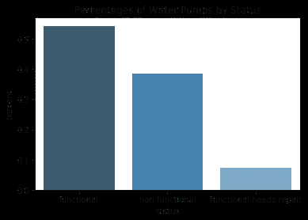
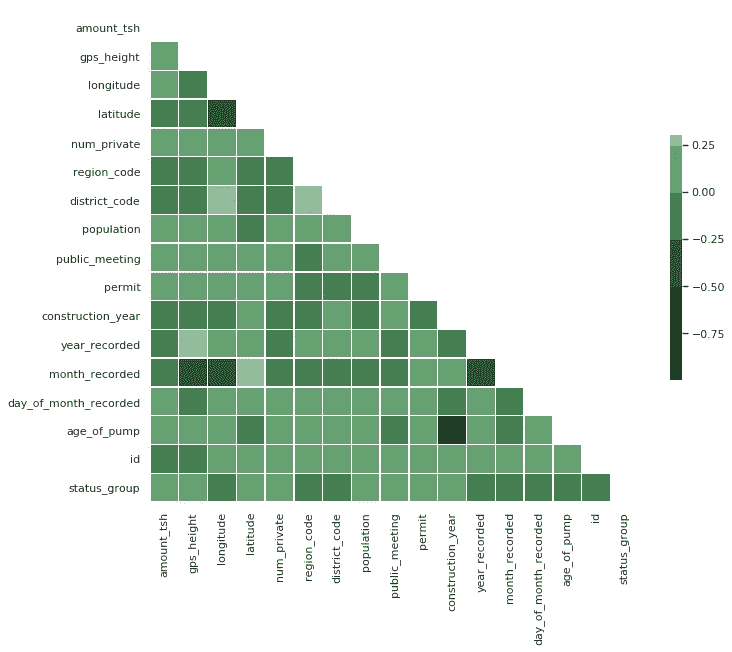
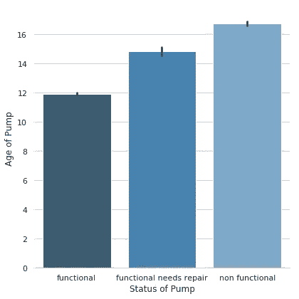
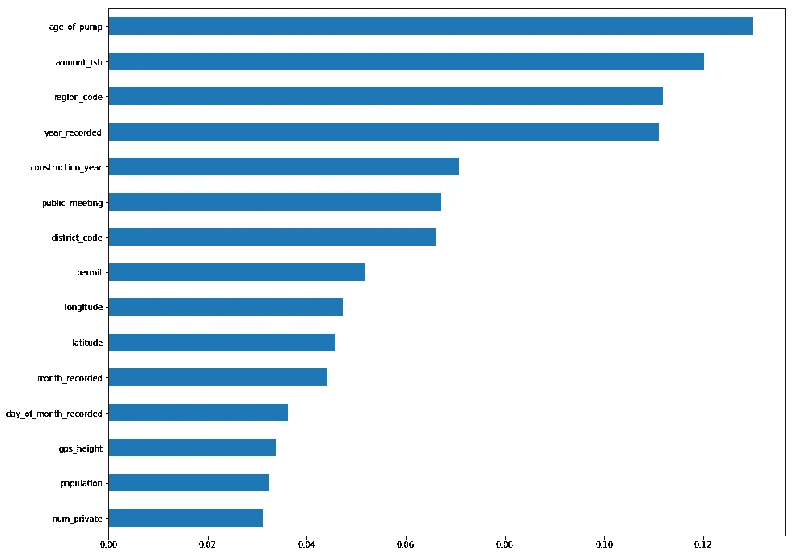

# 创建机器学习模型的高点、低点和平台

> 原文：<https://towardsdatascience.com/the-highs-lows-and-plateaus-of-creating-a-machine-learning-model-970bf546ebf9?source=collection_archive---------31----------------------->

作为我在 Lambda School 的第二个单元的压轴戏周，我们的数据科学团队在 Kaggle 风格的比赛中相互竞争。

给定一个来自 [DrivenData](https://www.drivendata.org/) 的数据集，该数据集包含来自坦桑尼亚水利部的信息，我们被要求制作一个机器学习模型，该模型可以根据这项研究准确预测水泵的功能。

*   目标:创建一个模型来预测坦桑尼亚油井的功能。
*   子目标:获得 80 分以上的准确率，并击败我团队中的所有其他书呆子(我亲切地说书呆子，因为我肯定是其中之一。)

这是我第一次深入机器学习，我很兴奋能够开始。利用我在过去几周学到的东西，我知道我可以创建一个模型，它可以很好地对抗我的同学。我花了整整 4 天时间研究这些数据，用不同的方法和预测模型进行实验。我将带你经历一周中成功和失败的大起大落。

**第一天** 我们拿到数据，然后出发！我首先看了一下我试图预测的目标——水泵的状态。

如果我要建立一个初始模型来预测每个泵的功能，我将有 54%的正确率。

*   功能性:0.543
*   非功能性:0.384
*   功能需求修复:0.072

54%的准确率是一个开始，但我知道我可以从这里提高。快速浏览数据后，我看到很多列都有非数字数据。在它可用之前，需要花时间去探索、清理和编码成数字数据。我想快速进步，所以我决定现在跳过这一步。我创建了一个仅使用数字列的线性回归模型，获得了 59%的准确率。

我对这些特征之间的相关性很好奇，所以我使用热图进行了更深入的研究。

我的目标特征“status_group”似乎与任何数字特征都没有很强的相关性。这让我想到了我的下一个任务:获取所有可用格式的分类数据，并将其添加到我的模型中。

到目前为止，我还没有花任何时间清理或处理这些数据中的空值。这是一个乏味的过程，但我确信我所做的工作将会改进我的模型。我花了第二天的大部分时间梳理每一列数据，找出处理空值的最佳方式，并了解对我的数据进行编码的不同方法。

我做了一些特征工程，并使用泵的建造日期和最近记录的年份创建了一个名为“泵的年龄”的类别。这变成了我最重要的特点之一。

经过一整天的清理、特征工程和编码，我重新运行了我的模型，并将我的准确度分数提高了…大约 6%。

第三天
好了，时间越来越有限，我开始怀疑我所做的那些乏味的工作是否有意义。我开始第三天使用梯度推进分类器。我从经验中知道，这种模式往往做得很好，尤其是在 Kaggle 比赛中。我对所有清理过的数据运行了一个简单的 xgboost 分类器。77%!令人尊敬的分数，我可以深呼吸，然后继续提高。

大约有 40 个特征用于训练我的模型，我想看看它们是否都对结果有贡献。我对我最近的模型进行了一个特性重要性测试，然后查看了前 15 个特性。

利用这些知识，我继续改进我的模型。我选择了 8 个我认为最重要的特性，然后运行另一个模型。78%

第四天**这是我喜欢称之为迭代日的一天。我使用了我的 XGBClassifier，并调整了一些东西，直到没有其他东西可以尝试。我运行了大概 24 个模型，并改变了一个小项目，直到我耗尽了时间(和耐心)。)**

*   模型 1-8 特征，简单估算器，标准缩放器:78%
*   模型 2-8 特征，简单估算器，无缩放器:78%
*   模型 3-8 特征，简单估算器的调整参数，标准缩放器:78%
*   模型 4-8 特征，简单估算器，鲁棒定标器:79%
*   模型 5-9 特征，简单估算器，标准缩放器:79%

我一直在走。我最终突破了 80 分的准确率，但我不会详细说明我是如何做到这一点的。如果你想看看我这一周的工作，你可以看看我的 github 库[中的代码。](https://github.com/livjab/DS3-Kaggle-Comptetion/blob/master/Kaggle_competition_final_notebook.ipynb)

**我学到的东西**

*   简单(通常)更好
*   领域知识是理解数据关系的重要部分。
*   清理您的数据可以带来实质性的变化。
*   如果你有时间，迭代可能是一种高效的方法。