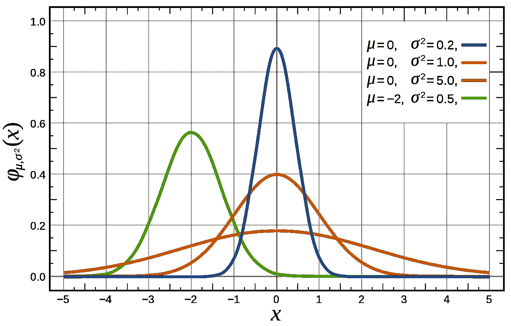
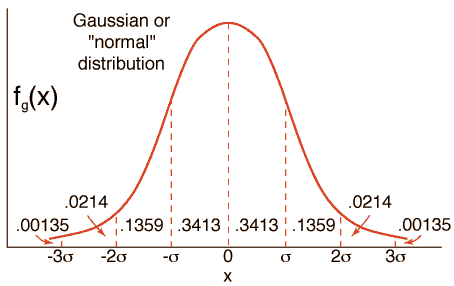
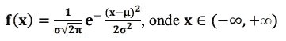

# 68.2 95.4 99.7 统计学的历史

> 原文：<https://towardsdatascience.com/the-history-of-68-2-95-4-99-7-in-statistics-82fdcef0a0ea?source=collection_archive---------14----------------------->

## 从德·莫维尔到高斯

Source: Wikipedia

如果你上过统计学课程，但仍然对它一无所知，或者听到你的书呆子朋友谈论这种东西，以下是你需要知道的。

# 这个规则有什么故事？

所谓的“[经验法则](https://www.statisticshowto.datasciencecentral.com/empirical-rule-2/)”(同一事物，不同名称)可以追溯到 18 世纪。**亚伯拉罕·德莫佛**(1667–1754)，一位法国数学家，他不像我们一样是个孩子，他过去常常把时间花在数学上，幸运的是，他实际上弄清楚了当前数学和统计学的一些主要概念。1738 年，他发表了一篇文章解释他的发现，指出随着事件发生次数的增加，二项式分布接近平滑曲线。这里有一个有趣的概念需要记住:

> 大错误比小错误更少见，也就是说，错误越大越不频繁，错误越小越频繁。

Source: Giphy

跟着我…

通过 Moivre(请带点法国口音)，误差均匀地分布在算术平均值周围，形成一个对称的钟形，落在左右尾部。

另一位法国人皮埃尔·西蒙·拉普拉斯也喜欢数字。他开展了几项相关研究，但对我们的故事来说最重要的是*的分析，描述了误差的分布。这种方法是估计有利情况的数量占可能情况总数的比例，它包括将任何函数的连续值视为另一个函数展开的系数。这导致了概率的正态分布，这就是所谓的拉普拉斯-高斯分布。更多关于拉普拉斯[这里](http://www-groups.dcs.st-and.ac.uk/history/Biographies/Laplace.html)。*

***阿德里安-玛丽·勒让德**(也是……法语)，应用拉普拉斯-高斯分布曲线引入[最小二乘法](https://en.wikipedia.org/wiki/Least_squares)。*

*弗朗西斯·高尔顿，英国人，查尔斯·达尔文的表弟，在 1872 年引入了高斯曲线，讽刺的是高斯是以曲线命名的，尽管他既没有创造也没有命名。高斯完成了高尔顿的一半工作，发展了著名的正态分布定律来分析天文数据。*

**

**Standard normal distribution showing standard deviations.**

*德国人约翰·卡尔·弗里德里希·高斯被称为数学家中的王子，他的智商估计有 240。1823 年，高斯写下了关于可观测误差的理论。在《理论与行动》的第三部分，他介绍了著名的正态分布定律。*

**

*The Gaussian Curve formula*

# *✅的理论史*

*让我们看看上述数学家所做的这些工作在现实世界中有什么影响。*

# *简言之*

*   *大约 68%的数值落在[平均值](https://www.statisticshowto.datasciencecentral.com/probability-and-statistics/statistics-definitions/mean-median-mode/#mean)的一个[标准差](https://www.statisticshowto.datasciencecentral.com/probability-and-statistics/standard-deviation/) (+- **σ** ) **)内。***
*   *大约 95%的值落在平均值的两个标准偏差(+-2 **σ** )内。*
*   *几乎所有的值(约 99.7%)都在平均值的三个标准偏差范围内(+-3 **σ** )。*

# *何时使用该规则*

*每当我们被告知数据是正态分布时，就可以使用这个规则。如果一个问题提到正态或接近正态分布，*和*你就会得到[标准差](https://www.statisticshowto.datasciencecentral.com/probability-and-statistics/standard-deviation/)；这几乎肯定意味着，你可以用这个规则来估计，你的分数有多少会落在一定数量的标准差内。*

# *例子*

*特定磅数的面包重量平均为 1kg，平均值为 1kg，标准偏差为 0.1kg。假设重量遵循正态分布*

1.  *低于平均值 2 个标准差的权重是多少？*
2.  *平均值以上 1 个标准差的权重是多少？*
3.  *中间的 68%的面包重多少？*

***答案:***

1.  *2 标准差是 2 * 0.1 = 0.2 磅。因此，如果一条面包比平均值低 2 个标准差，那么它的重量是 1 千克——0.2 千克= 0.8 千克*
2.  *1 标准偏差是 0.1 千克，所以一条高于平均值 1 标准偏差的面包重量为 1 千克+0.1 千克= 1.1 千克。*
3.  *68 95 99.7 规则告诉我们，68%的权重应该在平均值两边的 1 个标准差以内。1 以上标准差(问题 2 答案中给出)为 1.1kg1 下面的标准偏差是 1 千克—0.1 千克是 0.9 千克。因此，68%的面包重量在 0.9 千克到 1.1 千克之间*

# *结论*

*在过去的数百年中，许多重要的数学家对我们今天认为理所当然的事情做出了贡献。下次你看到高斯分布时，请记住高斯只是这个概念的一部分，尽管它有自己的名字。*