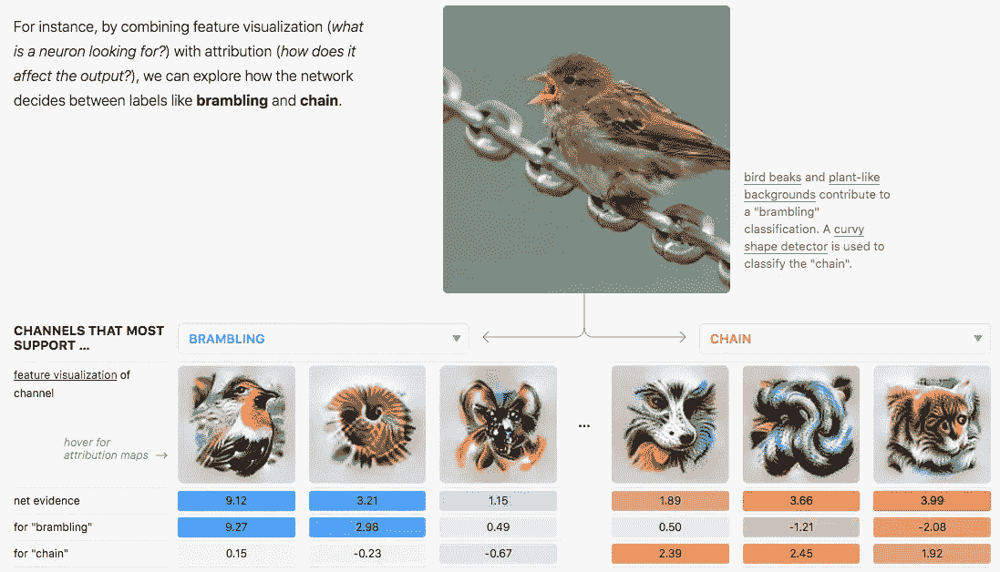

# 人工智能伦理指南第 2 部分:人工智能是什么

> 原文：<https://towardsdatascience.com/the-hitchhikers-guide-to-ai-ethics-part-2-what-ai-is-c047df704a00?source=collection_archive---------17----------------------->

## 探索人工智能伦理问题的 3 集系列

# 放大

第一部分探讨了人工智能的伦理是什么和为什么，并将伦理景观分为四个领域——人工智能是什么，人工智能做什么，人工智能影响什么以及人工智能可以成为什么。在第 2 部分，我深入探讨了人工智能是什么的伦理问题。

**Not this, Not this!** (Top 6 Google Image Search Results for AI de-biased for authors’ search history)

# 放大

人工智能最常见的部署形式可以描述为一组数学函数(**模型**)，给定一些输入(**数据**)，学习*某些东西*并使用它来*推断*其他东西(做出**预测**)。换句话说，人工智能就是数据、模型和预测。这一领域的伦理探索涵盖了诸如模型预测中的**偏差**和结果的**公平性**(或缺乏公平性)等问题；以及通过**问责制**和**透明度**解决这些问题的方法。

# 偏见和公平

所有的认知偏差都是人类与生俱来的，并影响我们如何做决定。以及我们建造的人工智能。凭借[它如何学习](https://medium.com/@laurahelendouglas/ai-is-not-just-learning-our-biases-it-is-amplifying-them-4d0dee75931d)、[它可以触发的失控反馈回路](https://algorithmicfairness.wordpress.com/2018/01/05/models-need-doubt-the-problematic-modeling-behind-predictive-policing/)以及[它的影响规模](https://www.forbes.com/sites/nelsongranados/2016/06/30/how-facebook-biases-your-news-feed/#1def73271d51)、 **AI 可以放大人类的偏见**。这是有后果的。有偏见的算法系统会导致不公平的结果、歧视和不公正。在规模上。

**Algorithmic Systems Have Real World Consequences.** (Image Credits Below)

理解人工智能中的偏见始于理解其来源，并确定哪些可以用技术来解决，哪些不能。偏差，如“一个模型不能足够准确地表示输入数据或基本事实”，是一个机器学习问题。偏见，就像“一个模型在其预测中反映了不适当的偏见”，不仅仅是一个机器学习问题。引用凯特·克劳福德的话，

> **“结构性偏见首先是社会问题，其次才是技术问题。”**

认为我们可以仅仅通过技术来对抗我们社会结构中现存的偏见是鲁莽的。事实上，我们可以让它变得更糟，我们经常这样做。

数据是机器学习中偏见的一大来源，并在大众媒体中引起了极大的关注。我们现在都听说过“[垃圾进垃圾出](https://www.google.com/search?q=garbage+in+garbage+out+ai&rlz=1C5CHFA_enIN556IN556&source=lnms&sa=X&ved=0ahUKEwic1sj-t5viAhWYjp4KHXRVAtMQ_AUICSgA&biw=1268&bih=690&dpr=1)的口号。**但是有偏见的数据只是故事的一部分。偏见也可以从其他来源渗透到机器的智能中；从人工智能研究人员(理解为人类)如何构建问题，到他们如何训练模型，再到系统如何部署，都是如此。即使有无偏的数据，一些机器学习模型实现准确性的过程也可能导致有偏见的结果。**

让我们画画。(忍我一会儿，你就知道为什么了)。抓起一张纸，在上面撒上一些点。现在通过这些随机分布的点画一条线。点越分散，线条越弯曲。现在再补充几点。你的线不再适合所有的点！现在，你意识到你的线不可能在不损失未来通用性的情况下适合所有的点，所以你满足于“让我尽力而为”。你画一条尽可能接近尽可能多的点的线。你热爱数学，所以你用一个方程(或函数)来表示你的线，用另一个函数来表示这个“尽可能接近”的计算。恭喜你，你得到了一个机器学习模型！嗯，比真实的要简单几个数量级，但是你明白了。

**Optimal Line vs Squiggly Line** (Image: [pythonmachinelearning.pro](https://pythonmachinelearning.pro/a-guide-to-improving-deep-learnings-performance/))

试图通过最小化“损失函数”来使一个数学函数适应数据点的随机分布，往往会模仿谚语“吱吱作响的轮子得到润滑油”。损失函数是对其对立面所代表的所有点的“尽可能接近”的计算，即直线距离它试图代表的点有多远。因此，通过最小化它，你成功地得到尽可能多的点。但是有一个副作用。声音最大的人损失最小。其中表示可以暗示“一个组的数据量”以及模型用来理解该组的“特征”。机器学习算法通过模式来理解数据，依赖于人类在数据背后识别的或通过发现它们来识别的“特征”。在这两种方法中，主导数据的“特征”成为算法的北极星。少数人，**那些特征过于独特，无法产生足够强的信号被模型拾取的人，将在决策过程中被忽略**。使用这种模式为所有人做决定会导致对某些人不公平的结果。

考虑一个例子。在来自世界各地的人脸上训练的面部情感识别模型。假设我们在年龄、性别、种族、民族等方面有足够的多样性。我们都直觉地知道，我们表达情绪的强度也与其他定性因素相关。我微笑的大小与文化上适合我的东西相关联，我与扳机的关系有多深，我对我的牙齿的感觉如何，我被批评笑得太大声的频率，我当时的精神状态等等。如果我们用这个模型来评估[的学生在教室](https://www.linkedin.com/feed/update/urn:li:ugcPost:6512705430114926592/)有多快乐，会发生什么？(猜一猜为什么有人会想这么做，没有奖励！一个数学函数能代表所有可能的幸福强度吗？这些考虑使用了可见的和可测量的特征，如微笑的大小，笑声的音量，眼睛睁得多大？人工智能研究人员可能会说可以。我还没被说服。

所以偏见有多种来源和多种形式。Harini Suresh 的博客[提供了一个简单的框架来理解它们。我总结了她的 5 个偏差来源:**历史**偏差*已经*存在于数据中，而**表示**偏差和**测量**偏差是数据集创建方式的结果。**评估**和**聚集**偏差是构建模型时所做选择的结果。](https://medium.com/@harinisuresh/the-problem-with-biased-data-5700005e514c)

> 标签的选择、模型的选择、特征的选择、参数化或优化的内容，都是人工智能开发者(即人类)做出的一些选择，因此存在封装人类偏见和盲点的风险。

那么，摆脱偏见的方法是什么呢？对去偏置技术、数据失衡调整等的研究已经在进行中(详见[本次演讲](https://youtu.be/25nC0n9ERq4?t=685))。但这是在数据集偏差被识别出来之后。这需要严格的审计，正如 Timnit Gebru 等人在其论文“[数据集数据表](https://arxiv.org/pdf/1803.09010.pdf)”中所建议的那样。类似于在电子工业和化学安全规范中发现的数据表可以帮助早期识别偏差，但除了数据集偏差，还需要跨学科的努力。让领域专家参与进来，建立[多元化的跨学科团队是及早发现偏见的关键](https://ainowinstitute.org/discriminatingsystems.pdf)。

虽然识别偏见是好事，并试图通过技术消除偏见是一个崇高的目标，但这还不够。

# 问责制和补救性

算法被部署在人类生活各个方面的决策系统中——我们如何看待自己，与谁互动，我们如何看待自己，我们如何看待 T2。[我们如何被雇佣](https://www.theverge.com/2019/1/30/18202335/ai-artificial-intelligence-recruiting-hiring-hr-bias-prejudice)，[谁被解雇](https://www.bloomberg.com/news/articles/2018-07-09/your-raise-is-now-based-on-next-year-s-performance)；[我们买什么](https://theconversation.com/when-ai-meets-your-shopping-experience-it-knows-what-you-buy-and-what-you-ought-to-buy-101737)，[我们能买什么](https://www.entrepreneur.com/article/310262)；[我们住在哪里](https://www.bisnow.com/london/news/economy/this-algorithm-can-predict-house-price-moves-and-taught-itself-about-gentrification-78517)，[我们如何通勤](https://www.wired.com/2017/06/creepy-quest-save-humanity-robocar-commuting/)，[我们看什么新闻](https://archives.cjr.org/news_literacy/algorithms_filter_bubble.php)，一直到[谁被警察监视，谁没有](https://www.smithsonianmag.com/innovation/artificial-intelligence-is-now-used-predict-crime-is-it-biased-180968337/)。算法会产生不公平和歧视性的结果。把两者结合起来；不能低估让算法系统负起责任的必要性。

> 问责制促进信任。它提供了一条通往正义的道路，以确定和补救不公平或歧视性的结果。

问责可以通过人工审计、影响评估或通过政策或法规进行治理来实现。科技公司通常更喜欢自我监管，但即使是他们现在也认识到了外部干预的需要(T21)。通过"[人在回路](https://arxiv.org/pdf/1804.05892.pdf)"的治理，即某些被确定为高风险的决定需要由人来审查，也被提议作为问责制的一种模式。

但是一旦造成损害会发生什么呢？受影响方是否有机会或途径来纠正负面影响？他们能得到应有的赔偿吗？他们甚至能确定造成的伤害吗？！到目前为止，我还没有看到任何正在使用的算法系统定义一个明确的补救流程，尽管 [WEF 将补救](http://www3.weforum.org/docs/WEF_40065_White_Paper_How_to_Prevent_Discriminatory_Outcomes_in_Machine_Learning.pdf)确定为负责任的人工智能的一个支柱。但调查性新闻和研究团体，如 [ProPublica](https://www.propublica.org) 、[算法正义联盟](https://www.ajlunited.org/)和 [AI Now Institute](https://ainowinstitute.org/) 不知疲倦地识别不公平或歧视性的系统，并推动问责和行动，这是值得称赞的。在某些情况下，这种不公平的制度已经被撤销或修改。但是在其他许多地方，科技公司继续忽视人们的担忧，或者认为他们的责任仅限于提供使用指南。

# 透明度、可解释性和可解释性

围绕人工智能的许多伦理问题源于其固有的“黑箱”行为。这部分是因为公司不想分享让他们的模型成功的“秘方”，部分是因为机器学习中有太多的学习被锁定在大型复杂的数学运算中。但是当决定导致伤害时，公正的独立调查需要查明事实。但是谁来决定什么程度的事实是充分的呢？知道一个决定造成了伤害就够了吗？我们需要了解这个决定是如何做出的，由谁做出的吗？这些问题从不同角度探讨了机器学习系统的透明性。

算法通过多个“层”(多个数学运算)从输入数据中“学习”；逐步调整“权重”(ax+b 中的 a 和 b)以越来越接近数据中的模式。到目前为止，透明度是有限的，因为没有简单的方法来一层一层地“解释”正在“学习”的东西，或者“解释”所有这些学习是如何导致最终决策的。幸运的是，随着透明度成为研究焦点，这种情况正在改变。

**What is a neural network looking for and how is it attributing what it sees?** (Image: [Building Blocks of Interpretability by Olah et al](https://distill.pub/2018/building-blocks/) — I highly recommend playing with this interactive paper!)

可解释性研究主要集中在[打开](https://distill.pub/2018/building-blocks/)黑匣子。可解释性研究主要集中在[理解](https://www.darpa.mil/attachments/XAIProgramUpdate.pdf)决策上。

一些研究人员说，只有算法的[输出需要是可辩护的，而其他人说这是不够的](https://www.forbes.com/sites/cognitiveworld/2018/12/20/geoff-hinton-dismissed-the-need-for-explainable-ai-8-experts-explain-why-hes-wrong/#28e79b53756d)或太冒险。一些人认为[算法应该解释它们自己](/transparent-reasoning-how-mit-builds-neural-networks-that-can-explain-themselves-3aea291cd9cc)。而很少有人[从透明的角度完全否定可解释性及其需求](https://hackernoon.com/explainable-ai-wont-deliver-here-s-why-6738f54216be)。在我看来，对于所有公平和公正的事情，背景将决定一个算法系统需要有多可解释或可解释或透明；并且某种外部规章或商定的标准将必须确定和执行这一点。

这里还需要提到另一种透明度。组织透明度。科技公司对发布他们的人工智能研究有多开放，他们的人工智能动机和目标，他们如何在产品中使用人工智能，他们使用什么指标来跟踪其性能等；所有这些都很重要。

# 缩小，直到下一次旅行

构建人工智能很难。更难理解它与社会的相互作用。这么多的故事，这么多的研究，这么细微的差别。我几乎没有触及表面，但我希望这足以提高认识和引发反思。

# 参考资料和补充阅读

*   [机器偏差(ProPublica COMPAS 报告)(图片来源)](https://www.propublica.org/article/machine-bias-risk-assessments-in-criminal-sentencing)
*   [哎，我不是女人吗(Joy Buolamwini，AJL)(图片鸣谢)](https://www.notflawless.ai/)
*   [谷歌翻译中的性别偏见(瑞秋·托马斯)(图片鸣谢)](https://twitter.com/math_rachel/status/1123356919467347968)
*   [YouTube 事实审查员 AI 错误(Dailymail.co.uk)(图片鸣谢)](https://www.dailymail.co.uk/news/article-6927219/YouTube-fact-check-algorithm-incorrectly-tags-live-broadcast-Notre-Dame-fire-9-11-attacks.html)
*   [课堂行为分析(印度 GoM AI 挑战赛)(图片鸣谢)](https://www.linkedin.com/feed/update/urn:li:activity:6512705571802714112)
*   [谷歌 ML 公平教程(玛格丽特·米歇尔视频)](https://youtu.be/8bYysCme3mk)
*   [ML 中的公平前沿(Alexandra Chouldechova，Aaron Roth)](https://arxiv.org/pdf/1810.08810.pdf)
*   [现实世界中更公平的机器学习(Veale 等人)](https://journals.sagepub.com/doi/full/10.1177/2053951717743530)
*   [揭秘人工智能黑匣子(科学美国人)](https://www.scientificamerican.com/article/demystifying-the-black-box-that-is-ai/)
*   [AI 影响评估框架(AI Now Institute)](https://ainowinstitute.org/aiareport2018.pdf)

这是探索人工智能伦理的 3 部分系列的第 2 部分。 [*第一部分，此处可用*](/ethics-of-ai-a-comprehensive-primer-1bfd039124b0?source=friends_link&sk=02e78d6fe2c2c82b000b47230193d383) *，勾勒出问题的全貌。* [*第三部分，此处可用*](https://medium.com/@naliniwrites/the-hitchhikers-guide-to-ai-ethics-part-3-what-ai-does-its-impact-c27b9106427a) *，看人工智能做什么和人工智能影响什么的伦理。*

*非常感谢* [*雷切尔·托马斯*](https://twitter.com/math_rachel)*[*卡蒂克·杜莱萨米*](https://www.linkedin.com/in/karthik-duraisamy-66705025/) *和* [*斯里拉姆·卡拉*](https://twitter.com/skarra) *对初稿的反馈。**