# 《搭车人特征提取指南》

> 原文：<https://towardsdatascience.com/the-hitchhikers-guide-to-feature-extraction-b4c157e96631?source=collection_archive---------5----------------------->

## Kaggle 和日常工作的一些技巧和代码

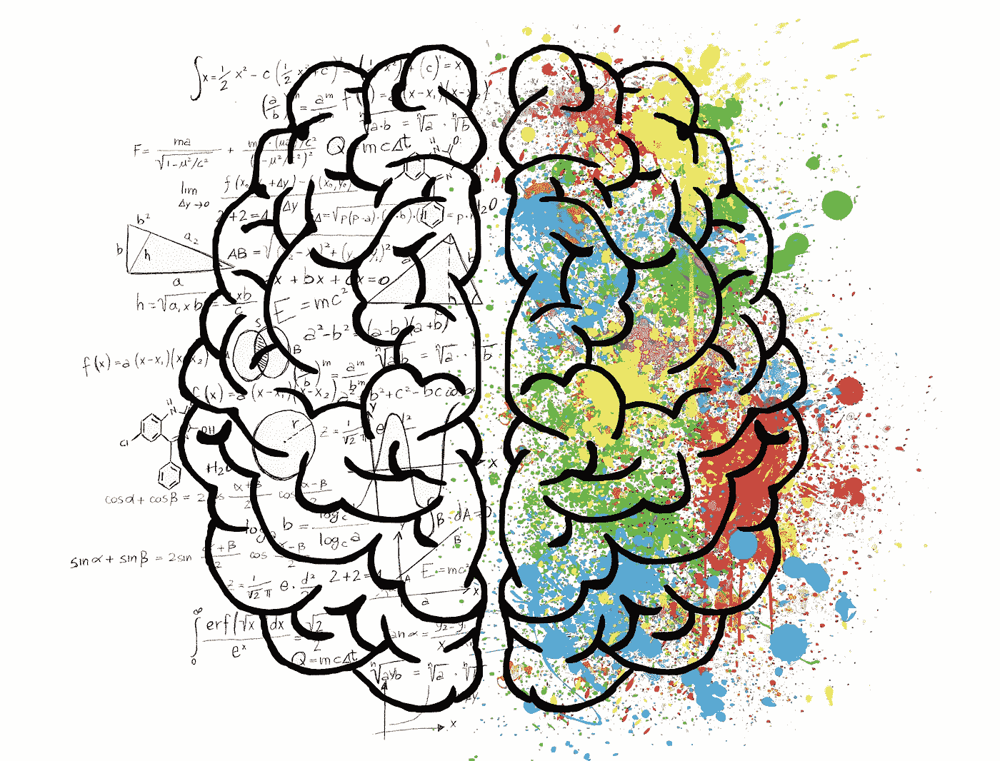

好的特征是任何机器学习模型的支柱。

好的特性创建通常需要领域知识、创造力和大量时间。

在这篇文章中，我将谈论:

*   特征创建的各种方法——自动和手动
*   处理分类特征的不同方法
*   经度和纬度特征
*   一些骗人的把戏
*   以及其他一些关于特征创建的想法。

***TLDR；这个帖子是关于有用的*** [***特征工程***](https://amzn.to/2Y4kd9Z) ***方法和技巧，我学到了，最后经常使用。***

# 1.使用特征工具自动创建特征:


Automation is the future

你读过 featuretools 吗？如果没有，那么你会很高兴。

**特征工具**是一个执行自动化特征工程的框架。它擅长将时态和关系数据集转换为机器学习的特征矩阵。

怎么会？让我们用一个玩具示例向您展示 featuretools 的强大功能。

假设我们的数据库中有三个表:**客户、会话和事务。**

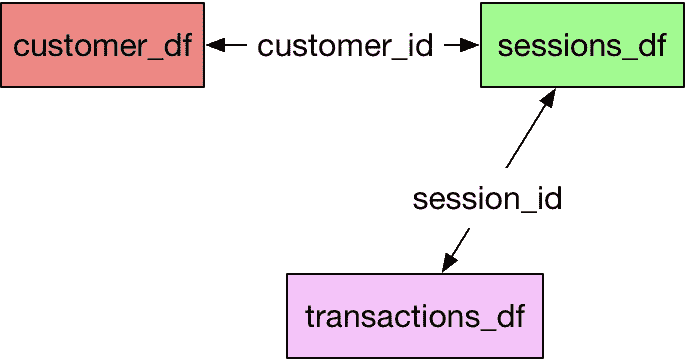

Datasets and relationships

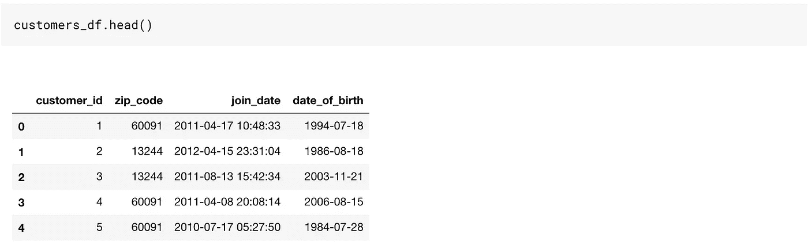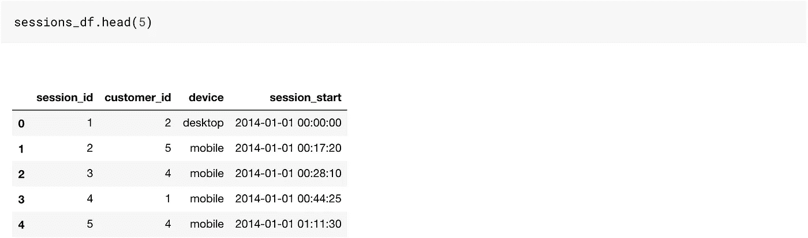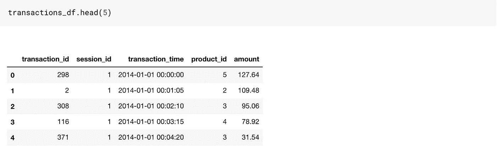

这是一个相当不错的玩具数据集，因为它有基于时间的列以及分类和数字列。

如果我们要在这些数据上创建特征，我们将需要使用 Pandas 进行大量的合并和聚合。

Featuretools 让我们变得如此轻松。尽管有一些事情，在我们的生活变得更容易之前，我们需要学习。

Featuretools 使用 entitysets。

你可以把一个 entityset 理解为一个数据帧的桶以及它们之间的关系。


Entityset = Bucket of dataframes and relationships

所以事不宜迟，让我们创建一个空的 entityset。我只是以顾客的身份给出了名字。您可以在这里使用任何名称。现在只是一个空桶。

```
# Create new entityset
es = ft.EntitySet(id = 'customers')
```

让我们添加我们的数据框架。添加数据帧的顺序并不重要。要将数据帧添加到现有的 entityset，我们需要执行以下操作。

```
# Create an entity from the customers dataframees = es.entity_from_dataframe(entity_id = 'customers', dataframe = customers_df, index = 'customer_id', time_index = 'join_date' ,variable_types = {"zip_code": ft.variable_types.ZIPCode})
```

我们在这里做了一些事情，将数据帧添加到空的 entityset 桶中。

1.  提供了一个`entity_id`:这只是一个名字。把它当成客户。
2.  `dataframe`名称设置为 customers_df
3.  `index`:该参数将表中的主键作为输入
4.  `time_index`:**时间索引**被定义为第一次可以使用一行中的任何信息。对于客户来说，这是加入日期。对于交易，它将是交易时间。
5.  `variable_types`:用于指定某一特定变量是否必须进行不同的处理。在我们的 Dataframe 中，我们有一个`zip_code`变量，我们想区别对待它，所以我们使用它。这些是我们可以使用的不同变量类型:

```
[featuretools.variable_types.variable.Datetime,
 featuretools.variable_types.variable.Numeric,
 featuretools.variable_types.variable.Timedelta,
 featuretools.variable_types.variable.Categorical,
 featuretools.variable_types.variable.Text,
 featuretools.variable_types.variable.Ordinal,
 featuretools.variable_types.variable.Boolean,
 featuretools.variable_types.variable.LatLong,
 featuretools.variable_types.variable.ZIPCode,
 featuretools.variable_types.variable.IPAddress,
 featuretools.variable_types.variable.EmailAddress,
 featuretools.variable_types.variable.URL,
 featuretools.variable_types.variable.PhoneNumber,
 featuretools.variable_types.variable.DateOfBirth,
 featuretools.variable_types.variable.CountryCode,
 featuretools.variable_types.variable.SubRegionCode,
 featuretools.variable_types.variable.FilePath]
```

这就是我们的 entityset bucket 现在的样子。它只有一个数据帧。也没有关系

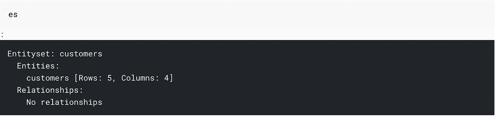

让我们添加所有的数据帧:

```
# adding the transactions_df
es = es.entity_from_dataframe(entity_id="transactions",
                                 dataframe=transactions_df,
                                 index="transaction_id",
                               time_index="transaction_time",
                               variable_types={"product_id": ft.variable_types.Categorical})# adding sessions_df
es = es.entity_from_dataframe(entity_id="sessions",
            dataframe=sessions_df,
            index="session_id", time_index = 'session_start')
```

这是我们的实体集桶现在的样子。

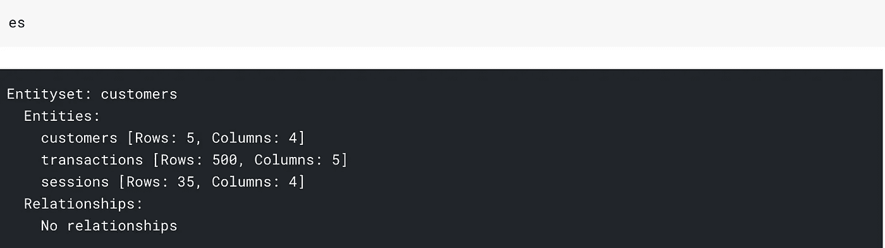

所有三个数据帧，但没有关系。我所说的关系是指我的 bucket 不知道 customers_df 和 session_df 中的 customer_id 是相同的列。

我们可以向我们的 entityset 提供以下信息:

```
# adding the customer_id relationship
cust_relationship = ft.Relationship(es["customers"]["customer_id"],
                       es["sessions"]["customer_id"])# Add the relationship to the entity set
es = es.add_relationship(cust_relationship)# adding the session_id relationship
sess_relationship = ft.Relationship(es["sessions"]["session_id"],
                       es["transactions"]["session_id"])# Add the relationship to the entity set
es = es.add_relationship(sess_relationship)
```

在此之后，我们的 entityset 看起来像:

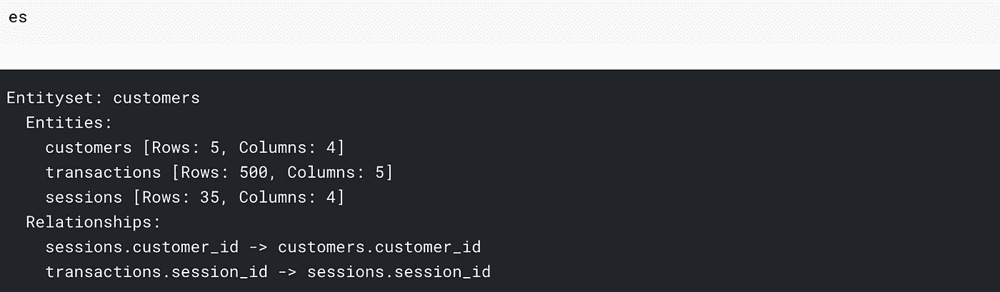

我们可以看到数据集和关系。我们这里的大部分工作已经完成了。我们已经准备好做特色菜了。


Cooking is no different from feature engineering. Think of features as ingredients.

创建特征非常简单:

```
feature_matrix, feature_defs = ft.dfs(entityset=es, target_entity="customers",max_depth = 2)feature_matrix.head()
```


我们最终得到了 73 个新特性。 *你可以从* `*feature_defs.*` *中看到特征名称，我们最终创建的一些特征是:*

```
[<Feature: NUM_UNIQUE(sessions.device)>,
 <Feature: MODE(sessions.device)>,
 <Feature: SUM(transactions.amount)>,
 <Feature: STD(transactions.amount)>,
 <Feature: MAX(transactions.amount)>,
 <Feature: SKEW(transactions.amount)>,
 <Feature: DAY(join_date)>,
 <Feature: YEAR(join_date)>,
 <Feature: MONTH(join_date)>,
 <Feature: WEEKDAY(join_date)>,
 <Feature: SUM(sessions.STD(transactions.amount))>,
 <Feature: SUM(sessions.MAX(transactions.amount))>,
 <Feature: SUM(sessions.SKEW(transactions.amount))>,
 <Feature: SUM(sessions.MIN(transactions.amount))>,
 <Feature: SUM(sessions.MEAN(transactions.amount))>,
 <Feature: SUM(sessions.NUM_UNIQUE(transactions.product_id))>,
 <Feature: STD(sessions.SUM(transactions.amount))>,
 <Feature: STD(sessions.MAX(transactions.amount))>,
 <Feature: STD(sessions.SKEW(transactions.amount))>,
 <Feature: STD(sessions.MIN(transactions.amount))>,
 <Feature: STD(sessions.MEAN(transactions.amount))>,
 <Feature: STD(sessions.COUNT(transactions))>,
 <Feature: STD(sessions.NUM_UNIQUE(transactions.product_id))>]
```

可以得到类似于 ***金额的 std 之和(***`SUM(sessions.STD(transactions.amount))`***)****或者* ***金额的 std 之和(***`STD(sessions.SUM(transactions.amount))`***)***这就是`max_depth`参数在函数调用中的含义。在这里，我们将其指定为 2，以获得两个级别的聚合。

***如果我们将*** `*max_depth*` *改为 3，我们可以得到如下特征:* `MAX(sessions.NUM_UNIQUE(transactions.YEAR(transaction_time)))`

试想一下，如果您必须编写代码来获得这些功能，您将需要花费多少时间。另外，需要注意的是，增加`max_depth`可能需要更长的时间。

# 2.处理分类特征:标签/二进制/散列和目标/均值编码

创建自动化功能有它的好处。但是如果一个简单的库可以完成我们所有的工作，为什么还需要我们这些数据科学家呢？

在这一节中，我将讨论如何处理分类特征。

## 一个热编码


One Hot Coffee

我们可以用 ***一个热编码*** 来编码我们的分类特征。因此，如果我们在一个类别中有 n 个级别，我们将获得 n-1 个特征。

在 sessions_df 表中，我们有一个名为`device,`的列，它包含三个级别——桌面、移动或平板。我们可以从这样的列中得到两列，使用:

```
pd.get_dummies(sessions_df['device'],drop_first=True)
```

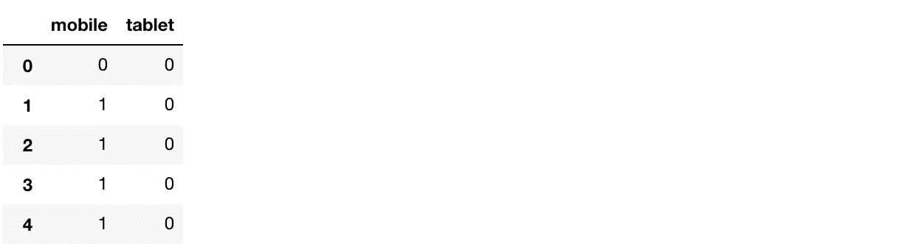

这是谈论分类特征时想到的最自然的事情，并且在许多情况下都很有效。

## 普通编码

有时有一个与类别相关联的顺序。在这种情况下，我通常在 pandas 中使用一个简单的 map/apply 函数来创建一个新的序数列。

例如，如果我有一个包含三个温度级别的数据帧:高、中、低，我会将其编码为:

```
map_dict = {'low':0,'medium':1,'high':2}
def map_values(x):
    return map_dict[x]
df['Temperature_oe'] = df['Temperature'].apply(lambda x: map_values(x))
```

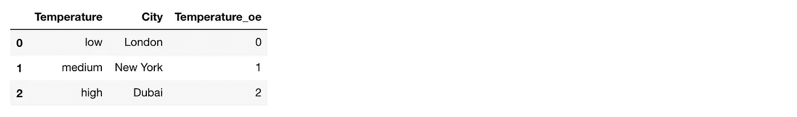

用这个我保存了低位的信息

## LabelEncoder

We could also have used ***LabelEncoder*** 把我们的变量编码成数字。标签编码器主要做的是，它看到列中的第一个值，并将其转换为 0，下一个值转换为 1，依此类推。这种方法在树模型中工作得相当好，当分类变量中有很多级别时，我最终会使用它。 我们可以用这个作为:

```
from sklearn.preprocessing import LabelEncoder
# create a labelencoder object
le = LabelEncoder()
# fit and transform on the data
sessions_df['device_le'] = le.fit_transform(sessions_df['device'])
sessions_df.head()
```

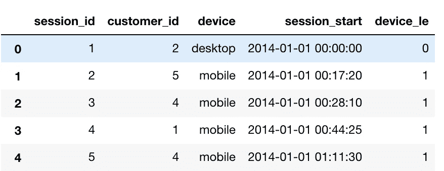

## 二进制编码器

BinaryEncoder 是另一种可以用来编码分类变量的方法。如果一列中有许多级别，这是一个很好的方法。虽然我们可以使用一个热编码使用 1023 个列来编码具有 1024 个级别的列，但是使用二进制编码我们可以仅使用十个列来实现。

假设我们的 FIFA 19 球员数据中有一列包含所有俱乐部名称。该列有 652 个唯一值。一个热编码意味着创建 651 列，这意味着大量内存使用和大量稀疏列。

如果我们使用二进制编码器，我们将只需要 10 列作为 2⁹ <652 <2¹⁰.

We can binaryEncode this variable easily by using BinaryEncoder object from category_encoders:

```
from category_encoders.binary import BinaryEncoder
# create a Binaryencoder object
be = BinaryEncoder(cols = ['Club'])
# fit and transform on the data
players = be.fit_transform(players)
```

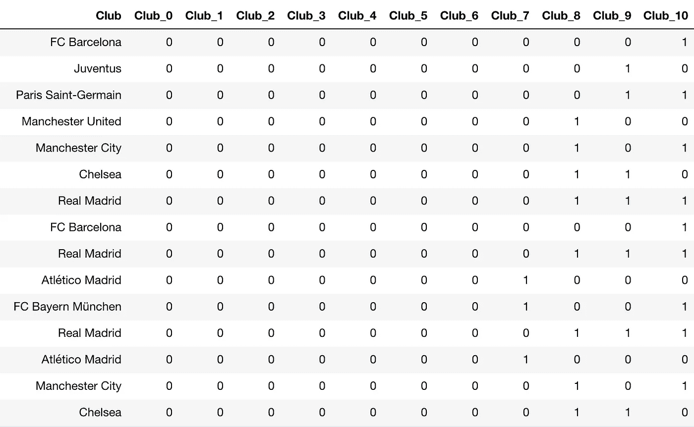

## HashingEncoder


***人们可以把散列编码器想象成一个黑盒函数，它把一个字符串转换成 0 到某个预先指定的值之间的一个数。***

它不同于二进制编码，因为在二进制编码中，两个或多个俱乐部参数可能是 1，而在散列中只有一个值是 1。

我们可以使用哈希函数:

```
players = pd.read_csv("../input/fifa19/data.csv")from category_encoders.hashing import HashingEncoder
# create a HashingEncoder object
he = HashingEncoder(cols = ['Club'])
# fit and transform on the data
players = he.fit_transform(players)
```

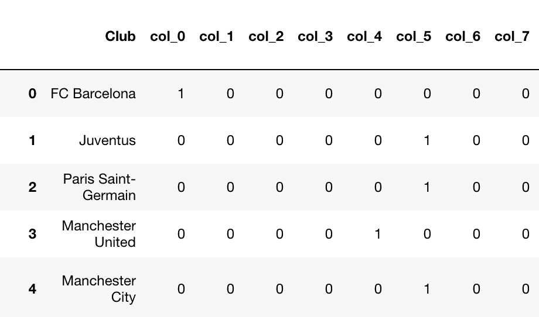

必然会有冲突(两个俱乐部具有相同的编码。例如，尤文图斯和 PSG 有相同的编码)但有时这种技术工作得很好。

## 目标/均值编码


这是一个我发现在 Kaggle 比赛中非常有效的技巧。如果两个训练/测试都来自同一时间段(横截面)的同一数据集，我们可以对特征进行巧妙处理。

比如:泰坦尼克号知识挑战赛中，测试数据是从训练数据中随机抽取的。在这种情况下，我们可以使用不同分类变量的平均目标变量作为特征。

在 Titanic 中，我们可以在 PassengerClass 变量上创建一个目标编码特征。

***我们在使用目标编码时必须小心，因为它可能会导致我们的模型过度拟合。*** 这样我们在使用的时候就使用了 k 倍目标编码。

然后，我们可以创建一个平均编码特征，如下所示:

```
targetc = KFoldTargetEncoderTrain('Pclass','Survived',n_fold=5)
new_train = targetc.fit_transform(train)new_train[['Pclass_Kfold_Target_Enc','Pclass']]
```

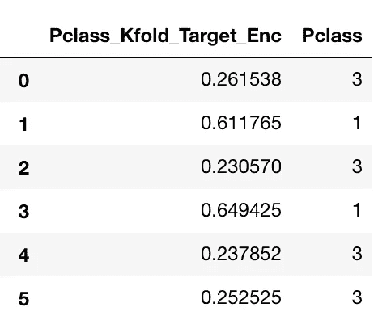

您可以看到，根据从中获取平均值的折叠，乘客类别 3 如何被编码为 0.261538 和 0.230570。

这个特性非常有用，因为它对类别的目标值进行了编码。仅看这个特征，我们可以说，与等级 3 相比，等级 1 中的乘客具有较高的幸存倾向。

# 3.一些骗人的把戏:

虽然不一定是特色创建技术，但您可能会发现一些有用的后处理技术。

## 测井损耗削波技术；

这是我在杰瑞米·霍华德的神经网络课上学到的。它基于一个基本的想法。

如果我们非常自信和错误，日志丢失会对我们不利。

因此，在分类问题的情况下，我们必须预测 Kaggle 中的概率，最好将我们的概率限制在 0.05-0.95 之间，这样我们就永远不会非常确定我们的预测。反过来，受到的惩罚也更少。可以通过简单的`np.clip`来完成

## gzip 格式的 Kaggle 提交:

一小段代码将帮助你节省无数的上传时间。享受吧。

```
df.to_csv(‘submission.csv.gz’, index=False, compression=’gzip’)
```

# 4.使用纬度和经度功能:

这一部分将讨论如何很好地使用经纬度特性。

对于这个任务，我将使用操场竞赛的数据:[纽约市出租车旅行持续时间](https://www.kaggle.com/c/nyc-taxi-trip-duration/data)

训练数据看起来像:


我在这里要写的大部分函数都是受 Beluga 写的 Kaggle 上的一个[内核](https://www.kaggle.com/gaborfodor/from-eda-to-the-top-lb-0-368)的启发。

在这个竞赛中，我们必须预测旅行持续时间。我们得到了许多功能，其中的纬度和经度的接送也有。我们创造了如下特色:

## A.两个纬度之间的哈弗线距离:

> 给定经度和纬度，哈弗辛公式确定了球体上两点之间的大圆距离

```
def haversine_array(lat1, lng1, lat2, lng2): 
    lat1, lng1, lat2, lng2 = map(np.radians, (lat1, lng1, lat2, lng2)) 
    AVG_EARTH_RADIUS = 6371 # in km 
    lat = lat2 - lat1 
    lng = lng2 - lng1 
    d = np.sin(lat * 0.5) ** 2 + np.cos(lat1) * np.cos(lat2) *      np.sin(lng * 0.5) ** 2 
    h = 2 * AVG_EARTH_RADIUS * np.arcsin(np.sqrt(d)) 
    return h
```

然后，我们可以使用该函数:

```
train['haversine_distance'] = train.apply(lambda x: haversine_array(x['pickup_latitude'], x['pickup_longitude'], x['dropoff_latitude'], x['dropoff_longitude']),axis=1)
```

## B.两个纬度之间的曼哈顿距离:


Manhattan Skyline

> 沿直角轴测量的两点之间的距离

```
def dummy_manhattan_distance(lat1, lng1, lat2, lng2): 
    a = haversine_array(lat1, lng1, lat1, lng2) 
    b = haversine_array(lat1, lng1, lat2, lng1) 
    return a + b
```

然后，我们可以使用该函数:

```
train['manhattan_distance'] = train.apply(lambda x: dummy_manhattan_distance(x['pickup_latitude'], x['pickup_longitude'], x['dropoff_latitude'], x['dropoff_longitude']),axis=1)
```

## C.两个纬度之间的方位:

一个**方位**用来表示**一点**相对于另一个**点**的方向。

```
def bearing_array(lat1, lng1, lat2, lng2): 
    AVG_EARTH_RADIUS = 6371 # in km 
    lng_delta_rad = np.radians(lng2 - lng1) 
    lat1, lng1, lat2, lng2 = map(np.radians, (lat1, lng1, lat2, lng2)) 
    y = np.sin(lng_delta_rad) * np.cos(lat2) 
    x = np.cos(lat1) * np.sin(lat2) - np.sin(lat1) * np.cos(lat2) * np.cos(lng_delta_rad) 
    return np.degrees(np.arctan2(y, x))
```

然后，我们可以使用该函数:

```
train['bearing'] = train.apply(lambda x: bearing_array(x['pickup_latitude'], x['pickup_longitude'], x['dropoff_latitude'], x['dropoff_longitude']),axis=1)
```

## D.接送点之间的中心纬度和经度:

```
train.loc[:, 'center_latitude'] = (train['pickup_latitude'].values + train['dropoff_latitude'].values) / 2 
train.loc[:, 'center_longitude'] = (train['pickup_longitude'].values + train['dropoff_longitude'].values) / 2
```

这些是我们创建的新列:


# 5.自动编码器:

有时人们也使用自动编码器来创建自动特征。

***什么是自动编码器？***

编码器是[深度学习](https://amzn.to/2Lv2hU0)函数，近似从 X 到 X 的映射，即输入=输出。他们首先将输入特征压缩成低维的*表示*，然后从该表示中重建输出。

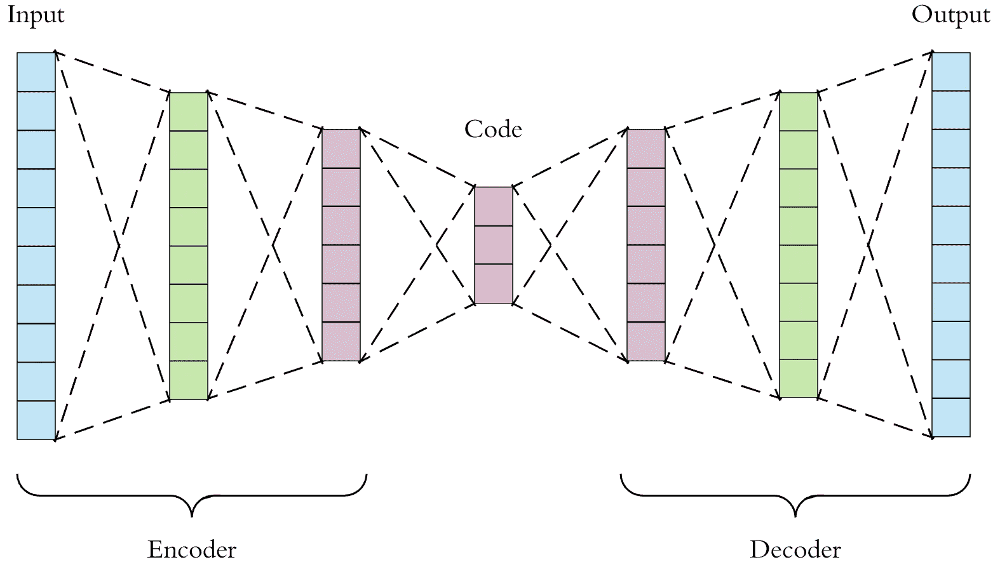

我们可以使用这个*表示*向量作为我们模型的一个特征。

# 6.您可以对要素执行的一些常规操作:

*   *****使用标准偏差进行标准化:*** 这是一种很好的方法，通常需要对线性模型、神经网络进行预处理**
*   *****基于日志的特征/目标:*** 使用基于日志的特征或基于日志的目标功能。如果使用假设要素呈正态分布的线性模型，对数变换可以使要素呈正态分布。在收入等扭曲变量的情况下，这也很方便。**

**或者在我们的例子中是旅行持续时间。下图是未进行对数变换的行程持续时间。**

**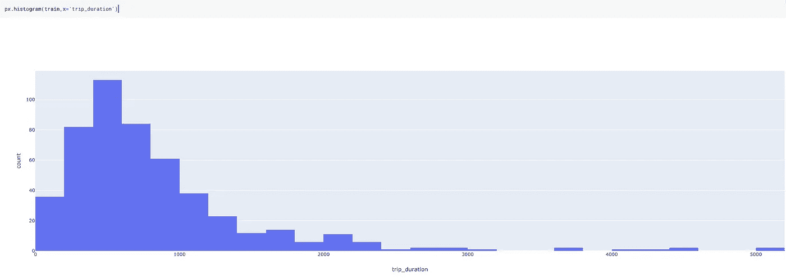**

**通过对数变换:**

```
train['log_trip_duration'] = train['trip_duration'].apply(lambda x: np.log(1+x))
```

**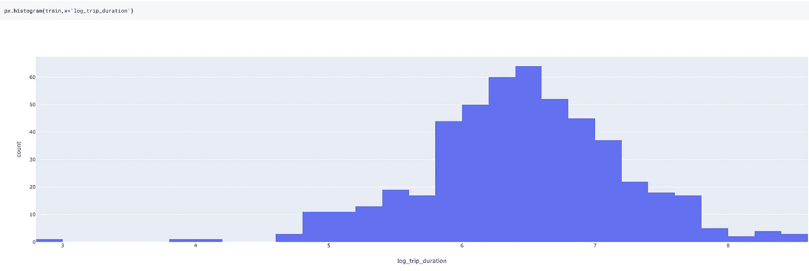**

**行程持续时间的对数变换偏差更小，因此对模型更有帮助。**

# **7.一些基于直觉的附加功能:**

## **日期时间特征:**

**人们可以基于领域知识和直觉创建附加的日期时间特征。例如，基于时间的特征，如“晚上”、“中午”、“晚上”、“上个月的购买量”、“上个星期的购买量”等。可以适用于特定的应用。**

## **特定于领域的功能:**

****

**Style matters**

**假设您已经获得了一些购物车数据，并且想要对 TripType 进行分类。这正是沃尔玛招聘中的问题:Kaggle 上的旅行类型分类。**

**旅行类型的一些例子:客户可能进行一次小的每日晚餐旅行，一次每周大型杂货旅行，一次为即将到来的假期购买礼物的旅行，或者一次购买衣服的季节性旅行。**

**要解决这个问题，您可以考虑创建一个类似“时尚”的功能，通过将属于男性时尚、女性时尚、青少年时尚类别的项目数量相加来创建这个变量。**

*****或者你可以创建一个类似“稀有”*** 的功能，它是通过根据我们拥有的数据将一些物品标记为稀有，然后计算购物车中这些稀有物品的数量来创建的。**

**这些功能可能有效，也可能无效。从我的观察来看，它们通常提供了很多价值。**

*****感觉这就是塔吉特的《怀孕少女模特》的制作方式。*** 他们会有一个变量，保存一个怀孕少女可以购买的所有物品，并将它们放入一个分类算法中。**

## **互动功能:**

**如果您有特征 A 和 B，您可以创建特征 A*B、A+B、A/B、A-B 等。**

**例如，要预测房子的价格，如果我们有两个特征长度和宽度，更好的办法是创建一个面积(长度 x 宽度)特征。**

**或者在某些情况下，一个比率可能比只有两个特征更有价值。示例:信用卡利用率比信用额度和已用额度变量更有价值。**

# **结论**

****

**Creativity is vital!!!**

**这些只是我用来创建特征的一些方法。**

*****但是说到*** [***特色工程***](https://amzn.to/2Y4kd9Z) ***肯定是没有限制的，限制你的只是你的想象力。*****

**就这一点而言，我总是在考虑特征工程的同时记住我将使用什么模型。适用于随机森林的要素可能不适用于逻辑回归。**

**特征创建是反复试验的领域。在尝试之前，你无法知道什么样的转换有效，或者什么样的编码效果最好。永远是时间和效用的权衡。**

**有时，特征创建过程可能需要很长时间。在这种情况下，你可能想要[并行化你的熊猫函数](https://medium.com/me/stats/post/1c04f41944a1)。**

**虽然我已经尽力保持这篇文章尽可能详尽(这很可能是我在 medium 上最大的一篇文章)，但我可能已经错过了一些有用的方法。请在评论中让我了解他们。**

**你可以找到这篇文章的所有代码，并在这个 [Kaggle 内核](https://www.kaggle.com/mlwhiz/feature-creation/)中运行它**

**看一下 Google Cloud Specialization 上的[高级机器学习。本课程将讨论模型的部署和生产。绝对推荐。](https://coursera.pxf.io/5bDx3b)**

**将来我也会写更多初学者友好的帖子。让我知道你对这个系列的看法。在[](https://medium.com/@rahul_agarwal)**关注我或者订阅我的 [**博客**](https://mlwhiz.ck.page/a9b8bda70c) 了解他们。一如既往，我欢迎反馈和建设性的批评，可以通过 Twitter [@mlwhiz](https://twitter.com/MLWhiz) 联系。****