# 使用 Spark 处理大数据的指南

> 原文：<https://towardsdatascience.com/the-hitchhikers-guide-to-handle-big-data-using-spark-90b9be0fe89a?source=collection_archive---------4----------------------->


## 不仅仅是介绍

大数据已经成为数据工程的代名词。

但是数据工程和数据科学家之间的界限日益模糊。

此时此刻，我认为大数据必须是所有数据科学家的必备技能。

原因: ***每天生成太多数据***

这就把我们带到了 [Spark](https://amzn.to/2JZBgou) 。

现在，大多数 Spark 文档虽然不错，但没有从数据科学家的角度进行解释。

所以我想尝试一下。

**这篇文章的主题是——“如何让 Spark 发挥作用？”**

这个帖子会很长。实际上我在媒体上最长的帖子，所以去买杯咖啡吧。

# 这一切是如何开始的？-MapReduce


假设你的任务是砍伐森林中的所有树木。也许在全球变暖的情况下，这不是一个好生意，但这符合我们的目的，我们只是在假设，所以我会继续。你有两个选择:

*   *让巴蒂斯塔带着电锯*去做你的工作，让他一棵一棵地砍下每棵树。
*   *找 500 个有普通轴的普通人*让他们在不同的树上工作。

***你更喜欢哪个？***

尽管有些人仍然会选择选项 1，但是对选项 2 的需求导致了 MapReduce 的出现。

用 Bigdata 的话来说，我们称 Batista 解决方案为纵向扩展***/纵向扩展*** ，即在单个 worker 中添加/填充大量 RAM 和硬盘。

第二种解决方案叫做水平缩放***/横向缩放*** 。就像你把许多普通的机器(内存较少)连接在一起，并行使用它们。

现在，垂直扩展比水平扩展有一定的优势:

*   **问题规模小就快:**想 2 棵树。巴蒂斯塔会用他的电锯干掉他们两个，而我们的两个家伙还在用斧子砍人。
*   **很容易理解。这是我们一贯的做事方式。我们通常以顺序模式思考问题，这就是我们整个计算机体系结构和设计的演变。**

但是，水平缩放是

*   **更便宜:**得到 50 个正常家伙本身就比得到巴蒂斯塔这样的单身家伙便宜多了。除此之外，巴蒂斯塔需要大量的照顾和维护，以保持冷静，他非常敏感，即使是小东西，就像高容量内存的机器。
*   **问题规模大时速度更快:**现在想象 1000 棵树和 1000 个工人 vs 一个 Batista。通过横向扩展，如果我们面临一个非常大的问题，我们只需多雇佣 100 或 1000 名廉价工人。巴蒂斯塔就不是这样了。你必须增加内存，这意味着更多的冷却基础设施和更多的维护成本。

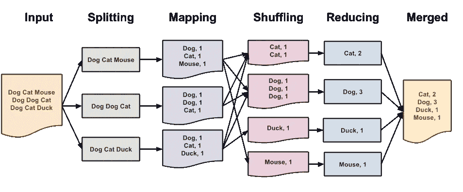

***MapReduce*** 通过让我们使用 ***计算机集群*** 进行并行化，使得第二种选择成为可能。

现在，MapReduce 看起来像一个相当专业的术语。但是让我们打破它一点。MapReduce 由两个术语组成:

## 地图:

它基本上是应用/映射功能。我们将数据分成 n 个数据块，并将每个数据块发送给不同的工作器(映射器)。如果我们希望对数据行应用任何函数，我们的工作人员会这样做。

## 减少:

使用基于 groupby 键的函数来聚合数据。它基本上是一个团体。

当然，有很多事情在后台进行，以使系统按预期工作。

不要担心，如果你还不明白的话。继续读下去。在我将要提供的例子中，当我们自己使用 MapReduce 时，也许你就会明白了。

# 为什么是火花？


Because Pyspark

Hadoop 是第一个向我们介绍 MapReduce 编程范式的开源系统，Spark 是使它更快的系统，快得多(100 倍)。

Hadoop 中曾经有大量的数据移动，因为它曾经将中间结果写入文件系统。

这影响了你分析的速度。

Spark 给我们提供了一个内存模型，所以 Spark 在工作的时候不会对磁盘写太多。

简单地说，Spark 比 Hadoop 快，现在很多人都在用 Spark。

***那么我们就不再多说，开始吧。***

# Spark 入门

安装 Spark 其实本身就很头疼。

由于我们想了解它是如何工作的，并真正使用它，我建议您在社区版中使用 Sparks on Databricks[here](https://databricks.com/try-databricks?utm_source=databricks&utm_medium=homev2tiletest)online。别担心，这是免费的。

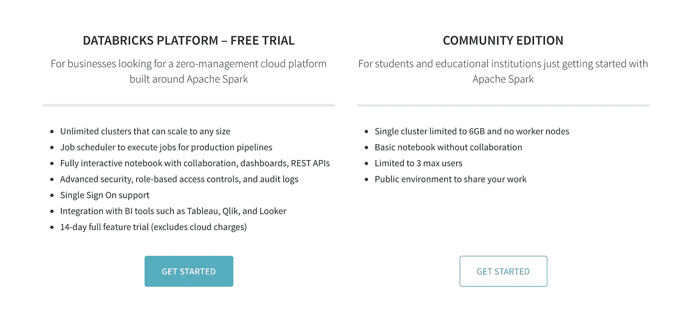

一旦您注册并登录，将出现以下屏幕。

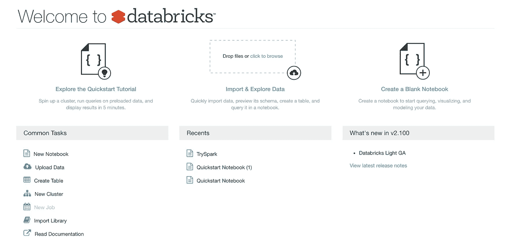

你可以在这里开始一个新的笔记本。

选择 Python 笔记本，并为其命名。

一旦您启动一个新的笔记本并尝试执行任何命令，笔记本会询问您是否要启动一个新的集群。动手吧。

下一步将检查 sparkcontext 是否存在。要检查 sparkcontext 是否存在，只需运行以下命令:

```
sc
```

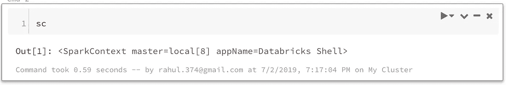

这意味着我们可以在笔记本上运行 Spark。

# 加载一些数据

下一步是上传一些我们将用来学习 Spark 的数据。只需点击主页选项卡上的“导入和浏览数据”。

在这篇文章的最后，我将使用多个数据集，但让我们从一些非常简单的开始。

让我们添加文件`shakespeare.txt`，你可以从[这里](https://github.com/MLWhiz/data_science_blogs/tree/master/spark_post)下载。

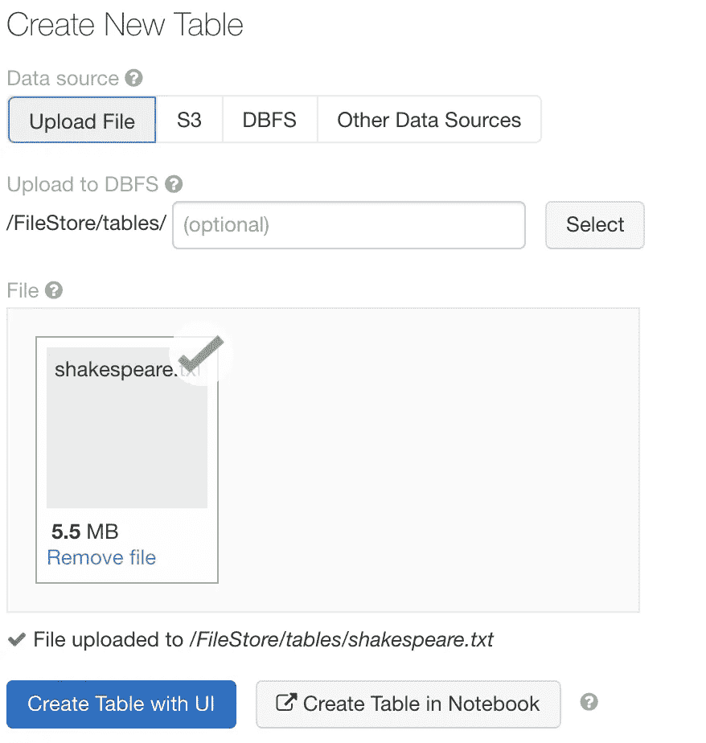

您可以看到文件被加载到了`/FileStore/tables/shakespeare.txt`位置。

# 我们的第一个星火计划

我喜欢通过例子来学习，所以让我们完成分布式计算的“Hello World”:***word count 程序。***

```
# Distribute the data - Create a RDD 
lines = sc.textFile("/FileStore/tables/shakespeare.txt")# Create a list with all words, Create tuple (word,1), reduce by key i.e. the word
counts = (lines.flatMap(lambda x: x.split(' '))          
                  .map(lambda x: (x, 1))                 
                  .reduceByKey(lambda x,y : x + y))# get the output on local
output = counts.take(10)                                 
# print output
for (word, count) in output:                             
    print("%s: %i" % (word, count))
```


这是一个小例子，它计算文档中的字数，并打印出 10 个。

大部分工作在第二个命令中完成。

如果你还不能理解，请不要担心，因为我仍然需要告诉你让 Spark 工作的事情。

但是在我们进入 Spark 基础知识之前，让我们刷新一些 Python 基础知识。如果你使用过 Python 的[函数式编程，理解 Spark 会变得容易得多。](https://amzn.to/2SuAtzL)

对于那些没有使用过它的人，下面是一个简短的介绍。

# Python 编程的函数式方法

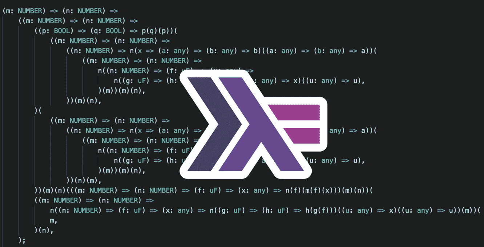

## 1.地图

`map`用于将一个函数映射到一个数组或一个列表。假设您想对列表中的每个元素应用一些函数。

你可以通过简单地使用 for 循环来实现这一点，但是 python lambda 函数允许你在 python 中用一行代码来实现这一点。

```
my_list = [1,2,3,4,5,6,7,8,9,10]
# Lets say I want to square each term in my_list.
squared_list = map(lambda x:x**2,my_list)
print(list(squared_list))
------------------------------------------------------------
[1, 4, 9, 16, 25, 36, 49, 64, 81, 100]
```

在上面的例子中，您可以将`map`看作一个带有两个参数的函数——一个函数和一个列表。

然后，它将该函数应用于列表中的每个元素。

lambda 允许你做的是写一个内联函数。在这里，`**lambda x:x**2**`部分定义了一个以 x 为输入并返回 x 的函数。

你也可以提供一个合适的函数来代替 lambda。例如:

```
def squared(x):
    return x**2my_list = [1,2,3,4,5,6,7,8,9,10]
# Lets say I want to square each term in my_list.
squared_list = map(squared,my_list)
print(list(squared_list))
------------------------------------------------------------
[1, 4, 9, 16, 25, 36, 49, 64, 81, 100]
```

同样的结果，但是 lambda 表达式使得代码更紧凑，可读性更好。

## 2.过滤器

另一个广泛使用的功能是`filter`功能。这个函数有两个参数——一个条件和要过滤的列表。

如果你想使用某种条件过滤你的列表，你可以使用`filter`。

```
my_list = [1,2,3,4,5,6,7,8,9,10]
# Lets say I want only the even numbers in my list.
filtered_list = filter(lambda x:x%2==0,my_list)
print(list(filtered_list))
---------------------------------------------------------------
[2, 4, 6, 8, 10]
```

## 3.减少

我要讲的下一个函数是 reduce 函数。这个功能将是 Spark 中的主力。

这个函数有两个参数——一个 reduce 函数有两个参数，还有一个要应用 reduce 函数的列表。

```
import functools
my_list = [1,2,3,4,5]
# Lets say I want to sum all elements in my list.
sum_list = functools.reduce(lambda x,y:x+y,my_list)
print(sum_list)
```

在 python2 中 reduce 曾经是 python 的一部分，现在我们不得不用`reduce`作为`functools`的一部分。

这里，lambda 函数接受两个值 x，y，并返回它们的和。直观上，您可以认为 reduce 函数的工作方式如下:

```
Reduce function first sends 1,2    ; the lambda function returns 3
Reduce function then sends 3,3     ; the lambda function returns 6
Reduce function then sends 6,4     ; the lambda function returns 10
Reduce function finally sends 10,5 ; the lambda function returns 15
```

我们在 reduce 中使用的 lambda 函数的一个条件是它必须是:

*   交换的，即 a + b = b + a 和
*   结合律即(a + b) + c == a + (b + c)。

在上面的例子中，我们使用了 sum，它既可交换又可结合。我们可以使用的其他函数:`max`**`min``*`等。**

# **再次走向火花**

**现在我们已经了解了 Python 函数式编程的基础，让我们再一次回到 Spark。**

**但首先，让我们深入了解一下 spark 的工作原理。火花实际上由两种东西组成，一个是司机，一个是工人。**

**工人通常做所有的工作，司机让他们做这些工作。**

## **RDD**

**RDD(弹性分布式数据集)是一种并行化的数据结构，分布在工作节点上。它们是 Spark 编程的基本单元。**

**在我们的字数统计示例中，第一行**

```
lines = sc.textFile("/FileStore/tables/shakespeare.txt")
```

**我们取了一个文本文件，并把它分布在工作节点上，这样他们就可以并行地处理它。我们也可以使用函数`sc.parallelize`将列表并行化**

**例如:**

```
data = [1,2,3,4,5,6,7,8,9,10]
new_rdd = sc.parallelize(data,4)
new_rdd
---------------------------------------------------------------
ParallelCollectionRDD[22] at parallelize at PythonRDD.scala:267
```

**在 Spark 中，我们可以对 RDD 进行两种不同类型的操作:转换和操作。**

1.  ****转换:**从现有的 rdd 创建新的数据集**
2.  ****动作:**从 Spark 获得结果的机制**

# **转型基础**

****

**让我们假设你已经得到了 RDD 形式的数据。**

**要重新报价，您的数据现在可供工作机访问。您现在想对数据进行一些转换。**

**你可能想要过滤，应用一些功能，等等。**

**在 Spark 中，这是使用转换函数来完成的。**

**Spark 提供了许多转换功能。这里 可以看到 [**的综合列表。我经常使用的一些主要工具有:**](http://spark.apache.org/docs/latest/rdd-programming-guide.html#transformations)**

## **1.地图:**

**将给定函数应用于 RDD。**

**请注意，语法与 Python 略有不同，但它必须做同样的事情。现在还不要担心`collect`。现在，就把它想象成一个将 squared_rdd 中的数据收集回一个列表的函数。**

```
data = [1,2,3,4,5,6,7,8,9,10]
rdd = sc.parallelize(data,4)
squared_rdd = rdd.map(lambda x:x**2)
squared_rdd.collect()
------------------------------------------------------
[1, 4, 9, 16, 25, 36, 49, 64, 81, 100]
```

## **2.过滤器:**

**这里也不奇怪。接受一个条件作为输入，只保留那些满足该条件的元素。**

```
data = [1,2,3,4,5,6,7,8,9,10]
rdd = sc.parallelize(data,4)
filtered_rdd = rdd.filter(lambda x:x%2==0)
filtered_rdd.collect()
------------------------------------------------------
[2, 4, 6, 8, 10]
```

## **3.独特:**

**仅返回 RDD 中的不同元素。**

```
data = [1,2,2,2,2,3,3,3,3,4,5,6,7,7,7,8,8,8,9,10]
rdd = sc.parallelize(data,4)
distinct_rdd = rdd.distinct()
distinct_rdd.collect()
------------------------------------------------------
[8, 4, 1, 5, 9, 2, 10, 6, 3, 7]
```

## **4.平面图:**

**类似于`map`，但是每个输入项可以映射到 0 个或多个输出项。**

```
data = [1,2,3,4]
rdd = sc.parallelize(data,4)
flat_rdd = rdd.flatMap(lambda x:[x,x**3])
flat_rdd.collect()
------------------------------------------------------
[1, 1, 2, 8, 3, 27, 4, 64]
```

## **5.按键减少:**

**与 Hadoop MapReduce 中的 reduce 并行。**

**现在，如果 Spark 只处理列表，它就不能提供值。**

**在 Spark 中，有一个对 rdd 的概念，这使得它更加灵活。假设我们有一个数据，其中有一个产品、它的类别和它的售价。我们仍然可以并行处理数据。**

```
data = [('Apple','Fruit',200),('Banana','Fruit',24),('Tomato','Fruit',56),('Potato','Vegetable',103),('Carrot','Vegetable',34)]
rdd = sc.parallelize(data,4)
```

**现在我们的 RDD`rdd`拥有元组。**

**现在我们想找出我们从每个类别中获得的总收入。**

**为此，我们必须将我们的`rdd`转换成一个对 rdd，这样它就只包含键值对/元组。**

```
category_price_rdd = rdd.map(lambda x: (x[1],x[2]))
category_price_rdd.collect()
-----------------------------------------------------------------
[(‘Fruit’, 200), (‘Fruit’, 24), (‘Fruit’, 56), (‘Vegetable’, 103), (‘Vegetable’, 34)]
```

**这里我们使用了 map 函数来得到我们想要的格式。当使用文本文件时，形成的 RDD 有很多字符串。我们用`map`把它转换成我们想要的格式。**

**所以现在我们的`category_price_rdd`包含产品类别和产品销售价格。**

**现在，我们希望减少关键类别并对价格求和。我们可以通过以下方式做到这一点:**

```
category_total_price_rdd = category_price_rdd.reduceByKey(lambda x,y:x+y)
category_total_price_rdd.collect()
---------------------------------------------------------[(‘Vegetable’, 137), (‘Fruit’, 280)]
```

## **6.按关键字分组:**

**类似于`reduceByKey`,但是没有减少，只是把所有的元素放在一个迭代器中。例如，如果我们希望将所有产品的类别和值作为关键字，我们将使用该函数。**

**让我们再次使用`map`来获得所需形式的数据。**

```
data = [('Apple','Fruit',200),('Banana','Fruit',24),('Tomato','Fruit',56),('Potato','Vegetable',103),('Carrot','Vegetable',34)]
rdd = sc.parallelize(data,4)
category_product_rdd = rdd.map(lambda x: (x[1],x[0]))
category_product_rdd.collect()
------------------------------------------------------------
[('Fruit', 'Apple'),  ('Fruit', 'Banana'),  ('Fruit', 'Tomato'),  ('Vegetable', 'Potato'),  ('Vegetable', 'Carrot')]
```

**然后我们使用`groupByKey`作为:**

```
grouped_products_by_category_rdd = category_product_rdd.groupByKey()
findata = grouped_products_by_category_rdd.collect()
for data in findata:
    print(data[0],list(data[1]))
------------------------------------------------------------
Vegetable ['Potato', 'Carrot'] 
Fruit ['Apple', 'Banana', 'Tomato']
```

**这里,`groupByKey`函数起作用了，它返回类别和该类别中的产品列表。**

# **动作基础**

****

**你已经过滤了你的数据，映射了一些函数。完成你的计算。**

**现在，您希望在本地机器上获取数据，或者将数据保存到文件中，或者在 excel 或任何可视化工具中以一些图表的形式显示结果。**

**你需要为此采取行动。此处 **提供了一个全面的行动列表 [**。**](http://spark.apache.org/docs/latest/rdd-programming-guide.html#actions)****

**我倾向于使用的一些最常见的操作是:**

## **1.收集:**

**这个动作我们已经用过很多次了。它获取整个 RDD，并将其返回到驱动程序。**

## **2.减少:**

**使用 func 函数(接受两个参数并返回一个)聚合数据集的元素。该函数应该是可交换的和可结合的，这样它就可以被正确地并行计算。**

```
rdd = sc.parallelize([1,2,3,4,5])
rdd.reduce(lambda x,y : x+y)
---------------------------------
15
```

## **3.拿走:**

**有时你需要查看你的 RDD 包含了什么，而不是获取内存中的所有元素。`take`返回 RDD 的前 n 个元素的列表。**

```
rdd = sc.parallelize([1,2,3,4,5])
rdd.take(3)
---------------------------------
[1, 2, 3]
```

## **4.外卖:**

**`takeOrdered`使用自然顺序或自定义比较器返回 RDD 的前 n 个元素。**

```
rdd = sc.parallelize([5,3,12,23])# descending order
rdd.takeOrdered(3,lambda s:-1*s)
----
[23, 12, 5]rdd = sc.parallelize([(5,23),(3,34),(12,344),(23,29)])# descending order
rdd.takeOrdered(3,lambda s:-1*s[1])
---
[(12, 344), (3, 34), (23, 29)]
```

**我们终于学到了基础知识。让我们回到字数统计的例子**

# **理解字数示例**

****

**现在我们有点理解 Spark 提供给我们的转换和动作。**

**现在理解 wordcount 程序应该不难。让我们一行一行地检查程序。**

**第一行创建了一个 RDD，并将其分发给工人。**

```
lines = sc.textFile("/FileStore/tables/shakespeare.txt")
```

**这个 RDD `lines`包含文件中的句子列表。您可以使用`take`查看 rdd 内容**

```
lines.take(5)
--------------------------------------------
['The Project Gutenberg EBook of The Complete Works of William Shakespeare, by ',  'William Shakespeare',  '',  'This eBook is for the use of anyone anywhere at no cost and with',  'almost no restrictions whatsoever.  You may copy it, give it away or']
```

**这个 RDD 的形式是:**

```
['word1 word2 word3','word4 word3 word2']
```

**下一行实际上是整个脚本中最重要的函数。**

```
counts = (lines.flatMap(lambda x: x.split(' '))          
                  .map(lambda x: (x, 1))                 
                  .reduceByKey(lambda x,y : x + y))
```

**它包含了我们对 RDD 线所做的一系列变换。首先，我们做一个`flatmap`转换。**

**`flatmap`转换将行作为输入，将单词作为输出。所以在`flatmap`变换之后，RDD 的形式是:**

```
['word1','word2','word3','word4','word3','word2']
```

**接下来，我们对`flatmap`输出进行`map`转换，将 RDD 转换为:**

```
[('word1',1),('word2',1),('word3',1),('word4',1),('word3',1),('word2',1)]
```

**最后，我们做一个`reduceByKey`转换，计算每个单词出现的次数。**

**之后 RDD 接近最终所需的形状。**

```
[('word1',1),('word2',2),('word3',2),('word4',1)]
```

**下一行是一个动作，它在本地获取生成的 RDD 的前 10 个元素。**

```
output = counts.take(10)
```

**这一行只是打印输出**

```
for (word, count) in output:                 
    print("%s: %i" % (word, count))
```

**这就是单词计数程序。希望你现在明白了。**

**到目前为止，我们讨论了 Wordcount 示例以及可以在 Spark 中使用的基本转换和操作。但我们在现实生活中不做字数统计。**

**我们必须解决更大、更复杂的问题。不要担心！无论我们现在学到了什么，都将让我们做得更好。**

# **用实例点燃行动的火花**

****

**让我们用一个具体的例子来处理一些常见的转换。**

**我们将在 Movielens [ml-100k.zip](https://github.com/MLWhiz/data_science_blogs/tree/master/spark_post) 数据集上工作，这是一个稳定的基准数据集。1000 个用户对 1700 部电影的 100，000 次评分。1998 年 4 月发布。**

**Movielens 数据集包含许多文件，但我们将只处理 3 个文件:**

**1) **用户**:该文件名保存为“u.user”，该文件中的列有:**

```
['user_id', 'age', 'sex', 'occupation', 'zip_code']
```

**2) **评级**:该文件名保存为“u.data”，该文件中的列有:**

```
['user_id', 'movie_id', 'rating', 'unix_timestamp']
```

**3) **电影**:该文件名保存为“u.item”，该文件中的栏目有:**

```
['movie_id', 'title', 'release_date', 'video_release_date', 'imdb_url', and 18 more columns.....]
```

**让我们从使用 home 选项卡上的 Import and Explore Data 将这 3 个文件导入 spark 实例开始。**

**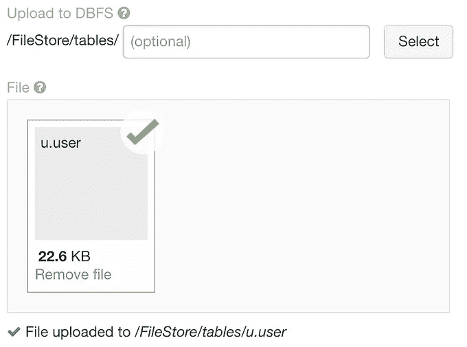****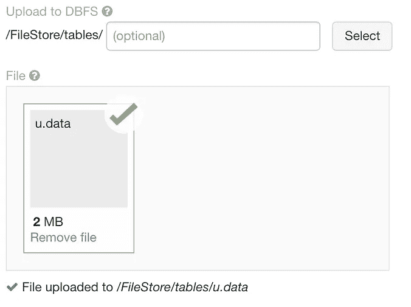****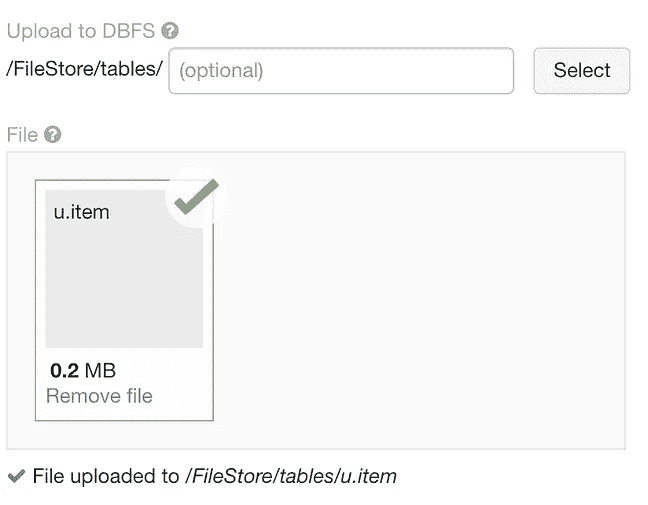**

**我们的业务合作伙伴现在找到我们，要求我们从这些数据中找出 ***25 个收视率最高的电影名称*** 。一部电影被评了多少次？**

**让我们将数据加载到不同的 rdd 中，看看数据包含什么。**

```
userRDD = sc.textFile("/FileStore/tables/u.user") 
ratingRDD = sc.textFile("/FileStore/tables/u.data") 
movieRDD = sc.textFile("/FileStore/tables/u.item") 
print("userRDD:",userRDD.take(1))
print("ratingRDD:",ratingRDD.take(1))
print("movieRDD:",movieRDD.take(1))
-----------------------------------------------------------
userRDD: ['1|24|M|technician|85711'] 
ratingRDD: ['196\t242\t3\t881250949'] 
movieRDD: ['1|Toy Story (1995)|01-Jan-1995||http://us.imdb.com/M/title-exact?Toy%20Story%20(1995)|0|0|0|1|1|1|0|0|0|0|0|0|0|0|0|0|0|0|0']
```

**我们注意到，要回答这个问题，我们需要使用`ratingRDD`。但是`ratingRDD`没有电影名。**

**所以我们必须用`movie_id`合并`movieRDD`和`ratingRDD`。**

****我们如何在 Spark 中做到这一点？****

**下面是代码。我们还使用了新的转换`leftOuterJoin`。请务必阅读下面代码中的文档和注释。**

```
OUTPUT:
--------------------------------------------------------------------RDD_movid_rating: [('242', '3'), ('302', '3'), ('377', '1'), ('51', '2')] 
RDD_movid_title: [('1', 'Toy Story (1995)'), ('2', 'GoldenEye (1995)')] 
rdd_movid_title_rating: [('1440', ('3', 'Above the Rim (1994)'))] rdd_title_rating: [('Above the Rim (1994)', 1), ('Above the Rim (1994)', 1)] 
rdd_title_ratingcnt: [('Mallrats (1995)', 54), ('Michael Collins (1996)', 92)] ##################################### 
25 most rated movies: [('Star Wars (1977)', 583), ('Contact (1997)', 509), ('Fargo (1996)', 508), ('Return of the Jedi (1983)', 507), ('Liar Liar (1997)', 485), ('English Patient, The (1996)', 481), ('Scream (1996)', 478), ('Toy Story (1995)', 452), ('Air Force One (1997)', 431), ('Independence Day (ID4) (1996)', 429), ('Raiders of the Lost Ark (1981)', 420), ('Godfather, The (1972)', 413), ('Pulp Fiction (1994)', 394), ('Twelve Monkeys (1995)', 392), ('Silence of the Lambs, The (1991)', 390), ('Jerry Maguire (1996)', 384), ('Chasing Amy (1997)', 379), ('Rock, The (1996)', 378), ('Empire Strikes Back, The (1980)', 367), ('Star Trek: First Contact (1996)', 365), ('Back to the Future (1985)', 350), ('Titanic (1997)', 350), ('Mission: Impossible (1996)', 344), ('Fugitive, The (1993)', 336), ('Indiana Jones and the Last Crusade (1989)', 331)] #####################################
```

**《星球大战》是 Movielens 数据集中评分最高的电影。**

**现在我们可以使用下面的命令在一个命令中完成所有这些，但是代码现在有点乱。**

**我这样做是为了说明可以在 Spark 中使用链接函数，并且可以绕过变量创建过程。**

**让我们再做一次。为了练习:**

**现在，我们希望使用相同的数据集找到评分最高的 25 部电影。我们实际上只想要那些已经被评级至少 100 次的电影。**

```
OUTPUT:
------------------------------------------------------------
rdd_title_ratingsum: [('Mallrats (1995)', 186), ('Michael Collins (1996)', 318)] 
rdd_title_ratingmean_rating_count: [('Mallrats (1995)', (3.4444444444444446, 54))] 
rdd_title_rating_rating_count_gt_100: [('Butch Cassidy and the Sundance Kid (1969)', (3.949074074074074, 216))]##################################### 
25 highly rated movies: [('Close Shave, A (1995)', (4.491071428571429, 112)), ("Schindler's List (1993)", (4.466442953020135, 298)), ('Wrong Trousers, The (1993)', (4.466101694915254, 118)), ('Casablanca (1942)', (4.45679012345679, 243)), ('Shawshank Redemption, The (1994)', (4.445229681978798, 283)), ('Rear Window (1954)', (4.3875598086124405, 209)), ('Usual Suspects, The (1995)', (4.385767790262173, 267)), ('Star Wars (1977)', (4.3584905660377355, 583)), ('12 Angry Men (1957)', (4.344, 125)), ('Citizen Kane (1941)', (4.292929292929293, 198)), ('To Kill a Mockingbird (1962)', (4.292237442922374, 219)), ("One Flew Over the Cuckoo's Nest (1975)", (4.291666666666667, 264)), ('Silence of the Lambs, The (1991)', (4.28974358974359, 390)), ('North by Northwest (1959)', (4.284916201117318, 179)), ('Godfather, The (1972)', (4.283292978208232, 413)), ('Secrets & Lies (1996)', (4.265432098765432, 162)), ('Good Will Hunting (1997)', (4.262626262626263, 198)), ('Manchurian Candidate, The (1962)', (4.259541984732825, 131)), ('Dr. Strangelove or: How I Learned to Stop Worrying and Love the Bomb (1963)', (4.252577319587629, 194)), ('Raiders of the Lost Ark (1981)', (4.252380952380952, 420)), ('Vertigo (1958)', (4.251396648044692, 179)), ('Titanic (1997)', (4.2457142857142856, 350)), ('Lawrence of Arabia (1962)', (4.23121387283237, 173)), ('Maltese Falcon, The (1941)', (4.2101449275362315, 138)), ('Empire Strikes Back, The (1980)', (4.204359673024523, 367))] 
#####################################
```

**到目前为止，我们一直在谈论 rdd，因为它们非常强大。**

**您也可以使用 rdd 来处理非关系数据库。**

**他们让你做很多用 SparkSQL 做不到的事情？**

*****是的，你也可以在 Spark 中使用 SQL，这就是我现在要说的。*****

# **火花数据帧**

**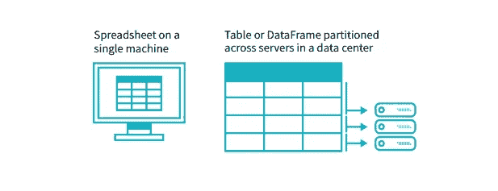**

**Spark 为美国数据科学家提供了 DataFrame API 来处理关系数据。这是为喜欢冒险的人准备的文档。**

**请记住，在背景中，它仍然是所有的 rdd，这就是为什么这篇文章的开始部分侧重于 rdd。**

**我将从一些你使用 Spark 数据框需要的常用功能开始。会看起来很像熊猫，只是有一些语法上的变化。**

## **1.读取文件**

```
ratings = spark.read.load("/FileStore/tables/u.data",format="csv", sep="\t", inferSchema="true", header="false")
```

## **2.显示文件**

**我们有两种方法使用 Spark 数据帧显示文件。**

```
ratings.show()
```

**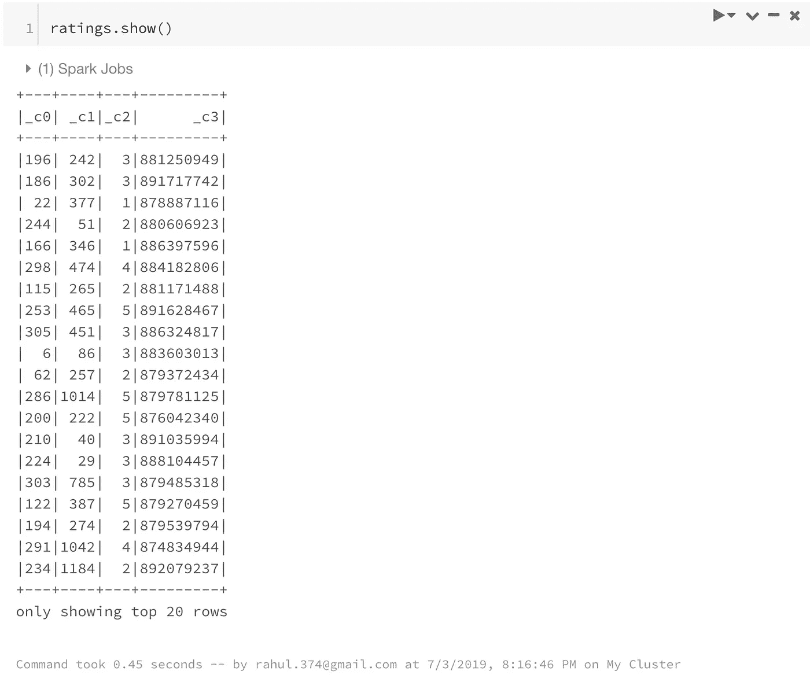**

```
display(ratings)
```

**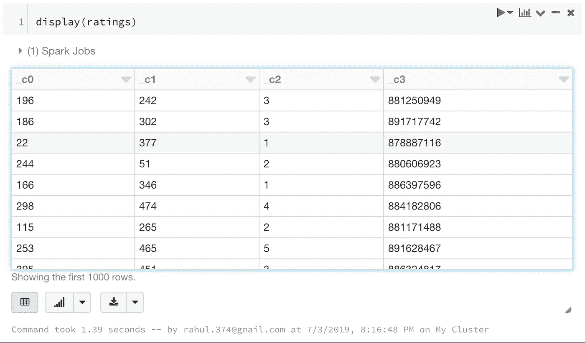**

**我更喜欢`display`，因为它看起来更漂亮、更干净。**

## **3.更改列名**

**功能性好。总是需要。别忘了单子前面的`*`。**

```
ratings = ratings.toDF(*['user_id', 'movie_id', 'rating', 'unix_timestamp'])display(ratings)
```

**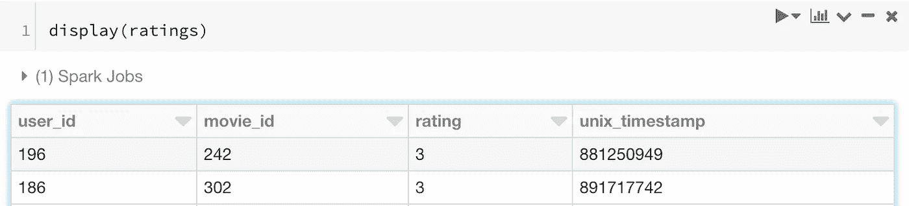**

## **4.一些基本数据**

```
print(ratings.count()) #Row Count
print(len(ratings.columns)) #Column Count
---------------------------------------------------------
100000
4
```

**我们还可以使用以下方式查看数据帧统计数据:**

```
display(ratings.describe())
```

**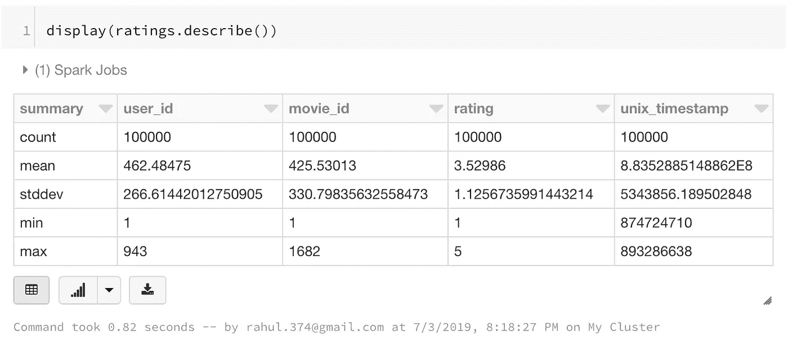**

## **5.选择几列**

```
display(ratings.select('user_id','movie_id'))
```

****

## **6.过滤器**

**使用多个条件过滤数据帧:**

```
display(ratings.filter((ratings.rating==5) & (ratings.user_id==253)))
```

**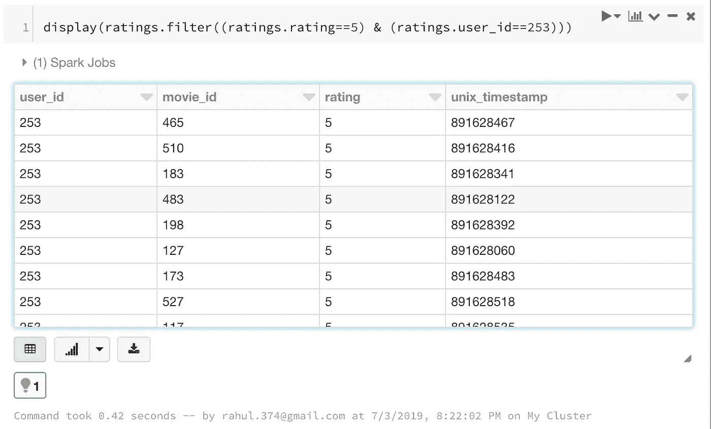**

## **7.分组依据**

**我们也可以对 spark 数据帧使用 groupby 函数。除了你需要导入`pyspark.sql.functions`之外，和熊猫组基本相同**

```
**from** pyspark.sql **import** functions **as** F
display(ratings.groupBy("user_id").agg(F.count("user_id"),F.mean("rating")))
```

**在这里，我们发现了每个 user_id 的评分计数和平均评分**

**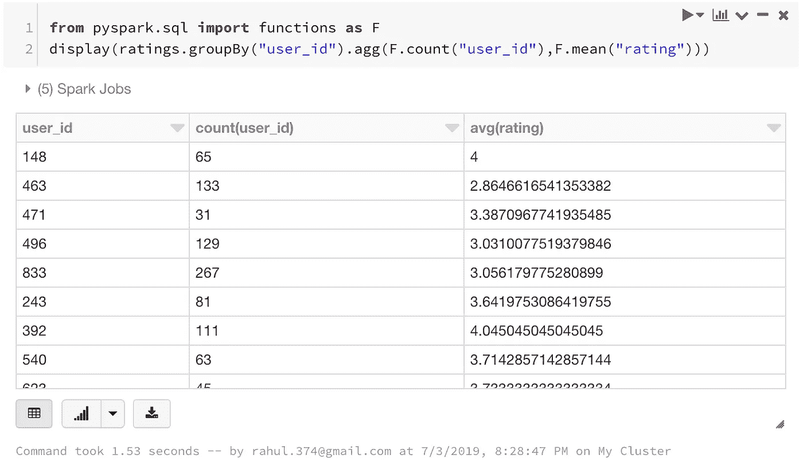**

# **8.分类**

```
display(ratings.sort("user_id"))
```

**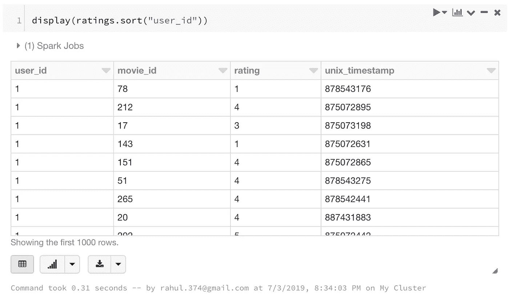**

**我们也可以使用下面的`F.desc`函数进行降序排序。**

```
# descending Sort
**from** pyspark.sql **import** functions **as** F
display(ratings.sort(F.desc("user_id")))
```

****

# **与 Spark 数据帧连接/合并**

**我找不到与 Spark 数据帧合并功能相当的 pandas，但是我们可以将 SQL 用于数据帧，因此我们可以使用 SQL 合并数据帧。**

**让我们试着对评级运行一些 SQL。**

**我们首先将评级 df 注册到一个临时表 ratings_table 中，我们可以在这个表中运行 sql 操作。**

**如您所见，SQL select 语句的结果又是一个 Spark 数据帧。**

```
ratings.registerTempTable('ratings_table')
newDF = sqlContext.sql('select * from ratings_table where rating>4')
display(newDF)
```

**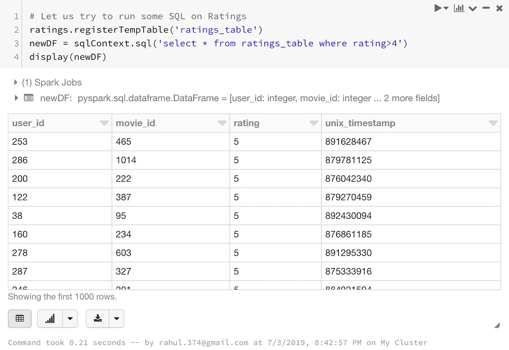**

**现在，让我们再添加一个 Spark 数据帧，看看是否可以通过 SQL 查询使用 join:**

```
#get one more dataframe to join
movies = spark.read.load("/FileStore/tables/u.item",format="csv", sep="|", inferSchema="true", header="false")# change column names
movies = movies.toDF(*["movie_id","movie_title","release_date","video_release_date","IMDb_URL","unknown","Action","Adventure","Animation ","Children","Comedy","Crime","Documentary","Drama","Fantasy","Film_Noir","Horror","Musical","Mystery","Romance","Sci_Fi","Thriller","War","Western"])display(movies)
```

**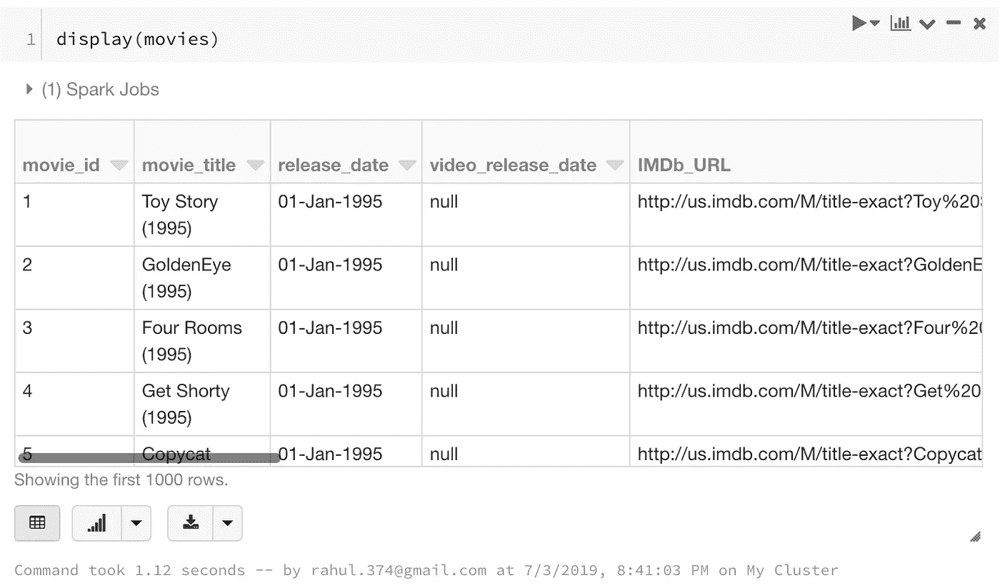**

**现在，让我们尝试连接 movie_id 上的表，以获得 ratings 表中的电影名称。**

```
movies.registerTempTable('movies_table')display(sqlContext.sql('select ratings_table.*,movies_table.movie_title from ratings_table left join movies_table on movies_table.movie_id = ratings_table.movie_id'))
```

**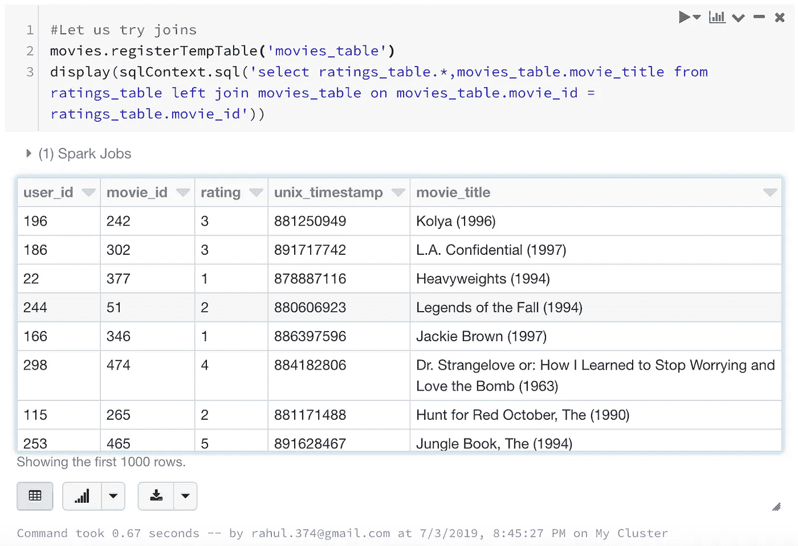**

**让我们试着做我们之前在 RDDs 上做的事情。寻找收视率最高的 25 部电影:**

```
mostrateddf = sqlContext.sql('select movie_id,movie_title, count(user_id) as num_ratings from (select ratings_table.*,movies_table.movie_title from ratings_table left join movies_table on movies_table.movie_id = ratings_table.movie_id)A group by movie_id,movie_title order by num_ratings desc ')display(mostrateddf)
```

**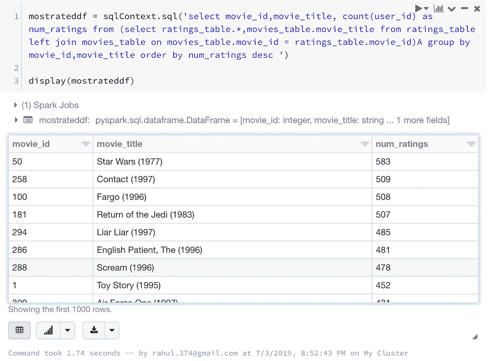**

**并找到投票数超过 100 的最高评级的前 25 部电影:**

```
highrateddf = sqlContext.sql('select movie_id,movie_title, avg(rating) as avg_rating,count(movie_id) as num_ratings from (select ratings_table.*,movies_table.movie_title from ratings_table left join movies_table on movies_table.movie_id = ratings_table.movie_id)A group by movie_id,movie_title having num_ratings>100 order by avg_rating desc ')display(highrateddf)
```

**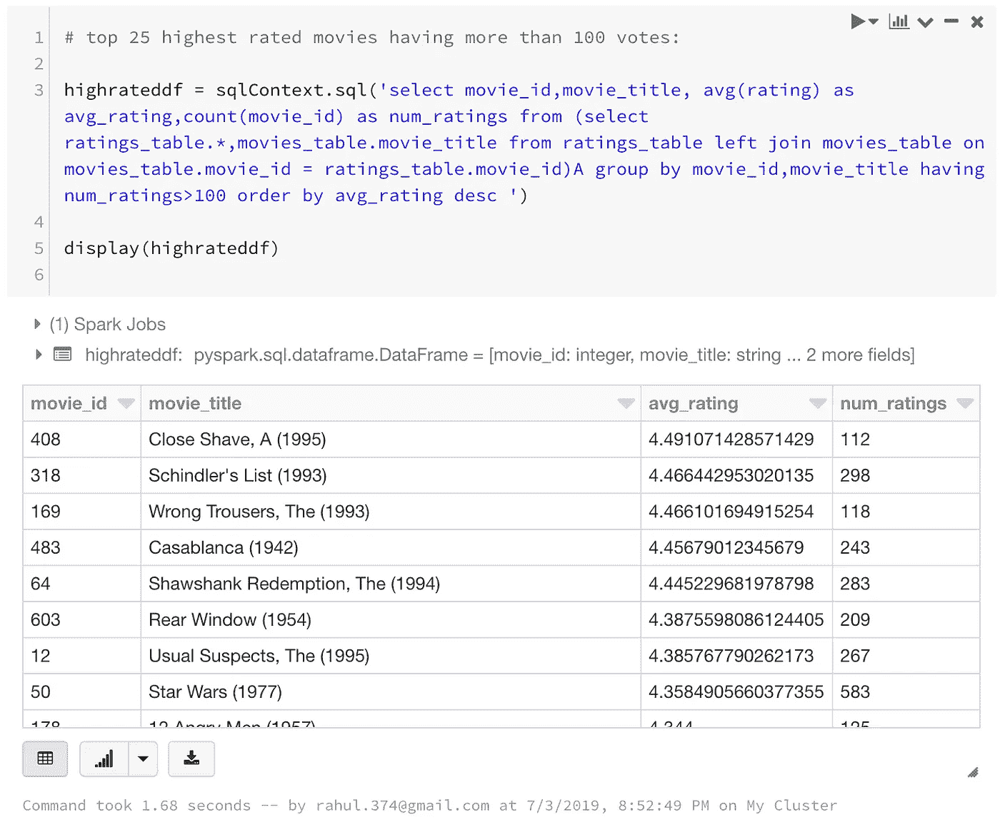**

**我在上面的查询中使用了 GROUP BY、HAVING 和 ORDER BY 子句以及别名。这表明你可以用`sqlContext.sql`做很多复杂的事情**

# **关于显示的一个小注意事项**

**您也可以使用`display`命令显示笔记本中的图表。**

**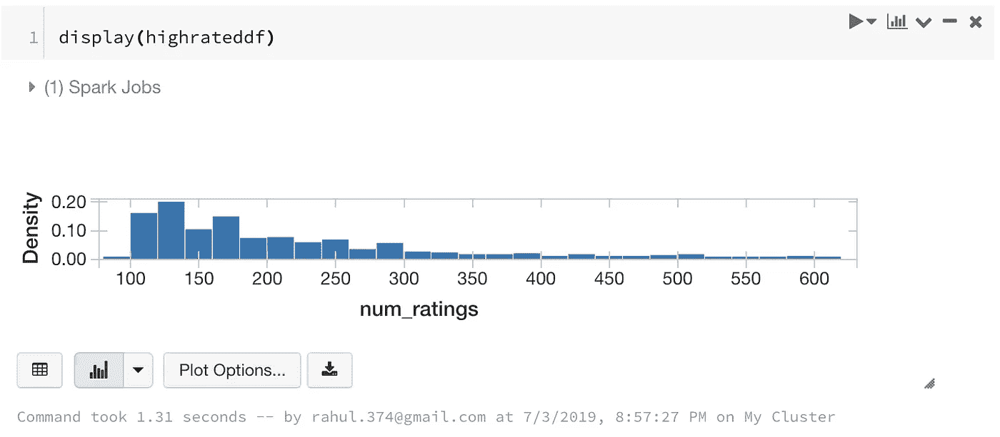**

**选择 ***剧情选项可以看到更多选项。*****

**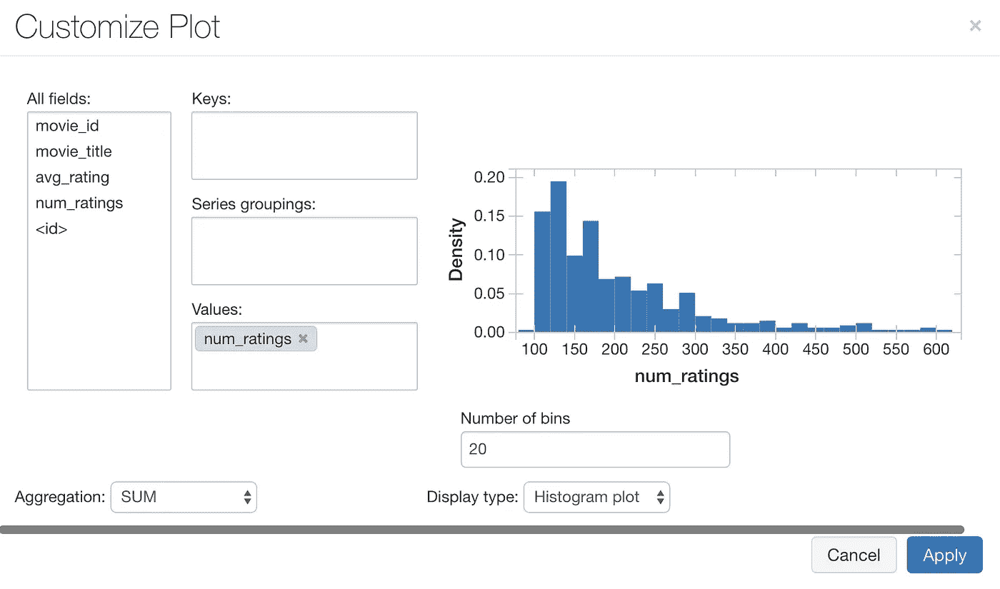**

# **从火花数据帧转换到 RDD 数据帧，反之亦然:**

**有时，您可能希望从 spark 数据框架转换到 RDD 数据框架，反之亦然，这样您就可以同时拥有两个世界的优势。**

**要从 DF 转换到 RDD，您只需执行以下操作:**

```
highratedrdd =highrateddf.rdd
highratedrdd.take(2)
```

**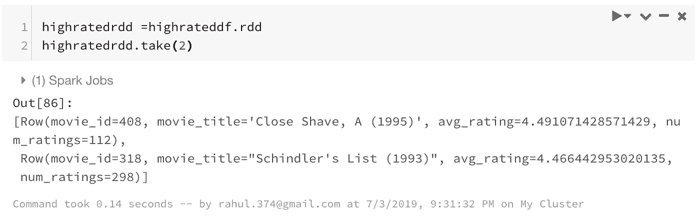**

**要从 RDD 转到数据帧:**

```
from pyspark.sql import Row
# creating a RDD first
data = [('A',1),('B',2),('C',3),('D',4)]
rdd = sc.parallelize(data)# map the schema using Row.
rdd_new = rdd.map(lambda x: Row(key=x[0], value=int(x[1])))# Convert the rdd to Dataframe
rdd_as_df = sqlContext.createDataFrame(rdd_new)
display(rdd_as_df)
```

**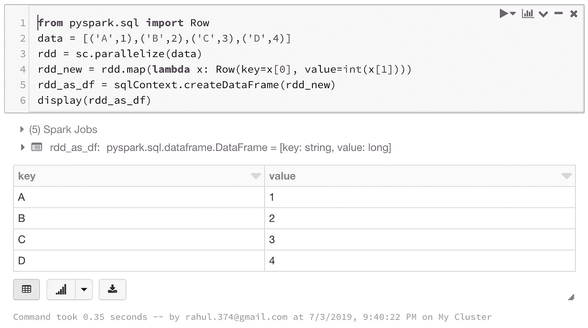**

**RDD 为您提供了 ***更多的控制*** 以时间和编码工作为代价。而 Dataframes 为您提供了 ***熟悉的编码*** 平台。现在你可以在这两者之间来回移动。**

# **结论**

****

**这是一个很大的帖子，如果你完成了，恭喜你。**

**Spark 为我们提供了一个接口，我们可以在这个接口上对数据进行转换和操作。Spark 还提供了 Dataframe API 来简化数据科学家向大数据的过渡。**

**希望我已经很好地介绍了基础知识，足以激起您的兴趣，并帮助您开始使用 Spark。**

*****你可以在***[***GitHub***](https://github.com/MLWhiz/data_science_blogs/tree/master/spark_post)***库中找到所有的代码。*****

**此外，如果你想了解更多关于 Spark 和 Spark DataFrames 的知识，我想在 Coursera 上调出这些关于[大数据基础的优秀课程:HDFS、MapReduce 和 Spark RDD](https://coursera.pxf.io/4exq73) 。**

**我以后也会写更多这样的帖子。让我知道你对这个系列的看法。在[](https://medium.com/@rahul_agarwal)**关注我或者订阅我的 [**博客**](http://eepurl.com/dbQnuX) 了解他们。一如既往，我欢迎反馈和建设性的批评，可以通过 Twitter [@mlwhiz](https://twitter.com/MLWhiz) 联系。****