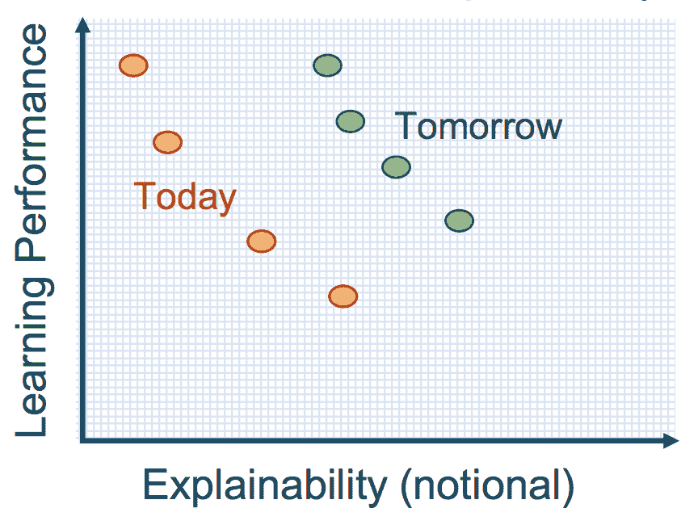
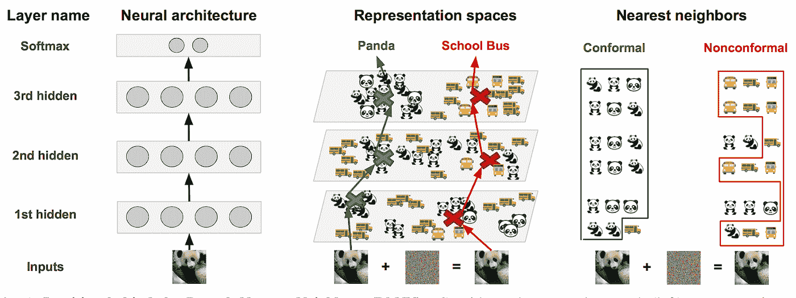
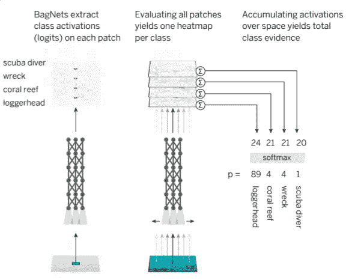
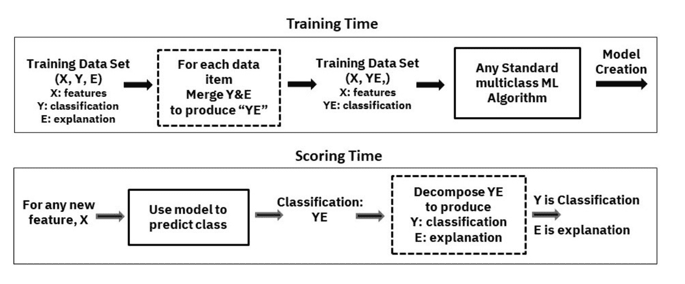
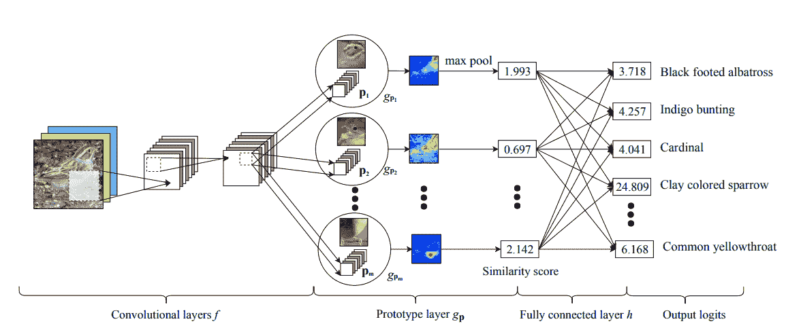

# 可解释人工智能的方法:可解释的建模

> 原文：<https://towardsdatascience.com/the-how-of-explainable-ai-explainable-modelling-55c8c43d7bed?source=collection_archive---------9----------------------->

在我们如何解释人工智能概述的第一部分，我们看了一个[预建模可解释性](https://medium.com/@bahador.khaleghi/the-how-of-explainable-ai-pre-modelling-explainability-699150495fe4?sk=2b46ff2038a0830c5c391dd54d7a92dd)。然而，可解释性的真正范围要广泛得多。可解释性可以在人工智能开发的所有阶段考虑，即建模前、模型开发和建模后。

大多数人工智能可解释性文献旨在解释已经开发的黑盒模型，即后建模可解释性。我们将在下一部分的[中回顾后建模可解释性方法论。然而，理想情况下，我们可以通过开发一个通过设计可以解释的模型，从一开始就避免黑箱问题。这种可解释的建模方法是本系列文章的重点。](https://medium.com/p/8b4cbc7adf5f/edit)

**The three stages of AI explainability: Pre-modelling explainability, Explainable modelling and post-modelling explainability.**

# 可解释的建模

实现可解释的建模有时被认为等同于将人工智能模型的选择限制在被认为是内在可解释的特定模型家族。我们将回顾这一系列人工智能模型。然而，我们的讨论远远超出了传统的可解释的模型家族，并包括更多的最新和新颖的方法，如联合预测和解释，混合模型，等等。

> 理想情况下，我们可以通过开发一个通过设计可以解释的模型，从一开始就避免黑箱问题。

## 采用一个内在可解释的模型族

实现可解释建模的传统方法是采用被认为是可解释的特定模型族。这个模型家族通常提供 Zack Lipton 提出的[三个层次的模型透明性](https://arxiv.org/pdf/1606.03490.pdf)中的一个(或多个),即可模拟性、可分解性和算法透明性。这些族的例子包括[线性模型](https://link.springer.com/article/10.1007/s10994-015-5528-6)、[决策树](https://ieeexplore.ieee.org/document/809084)、[规则集](https://arxiv.org/pdf/1702.04690.pdf)、[决策集](https://www-cs-faculty.stanford.edu/people/jure/pubs/interpretable-kdd16.pdf)、[广义可加模型](http://www.cs.cornell.edu/~yinlou/papers/lou-kdd13.pdf)和[基于案例的推理方法](https://europepmc.org/backend/ptpmcrender.fcgi?accid=PMC2232607&blobtype=pdf)。

然而，在实践中，简单地采用一个来自可解释家族的模型并不能自动保证可解释性。例如，对高维输入进行操作的线性回归模型[可能无法模拟](https://arxiv.org/pdf/1606.03490.pdf)，因此无法解释。为了避免这一问题，我们可以在模型训练期间使用某种正则化来限制重要输入特征的数量，例如 Lasso 回归中的 L1 范数。此外，在要素多重共线性的情况下，也就是说，由于观察到的或未观察到的混杂要素而相关的要素，为线性回归模型估计的系数可能不稳定。进一步的规范化，[，例如 L2 规范](https://www.lexjansen.com/wuss/2018/131_Final_Paper_PDF.pdf)，可以用来缓解这个问题。

> 简单地采用一个来自可解释家族的模型并不能自动保证可解释性。

虽然一些缓解措施可用于特定的方法，但可解释的模型族通常相对简单，因此不足以捕捉一些现实世界问题的复杂性。这种观察导致了所谓的[可解释性与性能的权衡](https://www.darpa.mil/attachments/XAIProgramUpdate.pdf)，也就是说，一个模型的性能越高，它就越不可解释，反之亦然。

**The alleged** [**explainability vs performance tradeoff**](https://www.darpa.mil/attachments/XAIProgramUpdate.pdf)**: the higher the model performance, the lower its explainability, and vice versa.**

然而，许多研究人员已经表明，通过开发既可解释又可执行的模型，所谓的可解释性与性能的权衡并不总是成立的。开发这样一个模型的主要挑战是设计一个足够简单的模型，让它的受众能够理解，同时又足够复杂，能够恰当地适应底层数据。这一类别中有相对较多的相关方法。因此，我们根据它们关键的潜在的、可能重叠的想法对它们进行分组，以使我们的演示更容易理解。

> 许多研究人员已经表明，通过开发既可解释又可执行的模型，所谓的可解释性与性能的权衡并不总是成立的。

## 混合可解释模型

有可能将一种内在可解释的建模方法与一种复杂的黑盒方法混合起来，设计出一种高性能且可解释的模型。这是混合可解释模型的潜在直觉。

[深度 K 近邻(DkNN)](https://arxiv.org/pdf/1803.04765.pdf) 方法提出对通过深度网络的层学习的训练数据集的隐藏表示使用 K 近邻(kNN)推断。然后，保形预测框架用于以数学上严格的方式组合所有层的 kNN 预测。DkNN 被证明是有效和稳健的，同时根据每层中使用的最近训练样本为其预测提供基于示例的解释。然而，DkNN 需要存储整个训练数据集的隐藏表示，这对于大型数据集来说是不可行的。

[深度加权平均分类器(DWAC)](https://arxiv.org/pdf/1811.02579.pdf) 方法在进行预测方面类似于 DkNN，在保形预测框架内，依靠类似于给定输入实例的训练样本的标签。然而，仅使用最终层的低维表示来计算相似性。

**The** [**Deep k-Nearest Neighbors (DkNN)**](https://arxiv.org/pdf/1803.04765.pdf) **hybrid explainable modelling method: applying K-nearest neighbor (kNN) inference on the hidden representation of training dataset learnt through layers of a deep network.**

再比如[自解释神经网络(SENN)](https://arxiv.org/pdf/1806.07538.pdf) 。SENN 背后的关键思想是通过允许使用三个神经网络来学习线性分类器的特征、它们相应的系数以及它们聚集成预测的方式，来概括线性分类器。这些神经网络分别被称为概念编码器、相关性参数化器和聚集器。所得到的混合分类器被认为具有线性模型的可解释结构，以及神经网络的表达能力和灵活性。SENN 为学习混合可解释模型提供了一个灵活而有吸引力的框架。然而，作者提出的初步工作没有充分解决使用概念编码器网络学习高级特征的挑战。特别是，作者承认，这些概念应该有一个直接的人类可以理解的解释，这使得学习它们成为一项主观任务，难以量化。

作为另一个例子，考虑[上下文解释网络(CEN)](https://arxiv.org/pdf/1705.10301.pdf) 框架，它与森有一些相似之处。CEN 假设了一个学习问题，其中要对给定上下文中的输入进行预测。其思想是首先使用一个复杂的模型，以概率的方式将上下文编码到一个固有的可解释模型的参数空间中。然后，输入被馈送到这个内在可解释的模型以做出预测。

[BagNets](https://medium.com/bethgelab/neural-networks-seem-to-follow-a-puzzlingly-simple-strategy-to-classify-images-f4229317261f) 架构是另一个非常有趣的混合解释模型的例子。BagNets 基本上是一个特征包模型，其中的特征是使用深度网络学习的。对于图像分类任务，提出将每幅图像视为一个特征包。这种特征包表示是通过将图像分成小块来获得的，这些小块通过深层网络来获得每个小块的局部类别证据。然后，将每个类别的这些局部证据加在一起，并通过 softmax 函数来获得每个类别的总体概率。有趣的是，当应用于 ImageNet 数据集时，BagNet 产生的性能可与最新的黑盒深度网络架构(如 VGG-16)相媲美，同时仍然可以通过设计来解释。

**An overview of the** [**deep bag of features model (BagNets)**](https://openreview.net/pdf?id=SkfMWhAqYQ) **architecture: an input image is divided into small patches, which are passed through a deep network to obtain class evidences (logits) for each patch. These evidences are then fed into a linear classifier yielding one logit heatmap per class. Finally, these heatmaps are averaged spatially and fed to a softmax layer to produce the final class probabilities.**

## 联合预测和解释

人工智能模型可以被训练来共同提供预测和相应的解释。换句话说，一个复杂的模型可以被明确地训练来为它的预测提供一个解释。然而，这些方法有几个局限性，我们将在下面讨论。

例如，[决策的教学解释(TED)框架](https://arxiv.org/pdf/1811.04896.pdf)提出增加训练数据集，其中每个样本包括一组特征、一个决策和用户对该决策的基本原理，一个解释。给定的决策及其解释在训练时被编码到单个标签中。在测试时，由模型提供的输出被解码以产生一个决策及其相应的解释。TED 框架据称有几个优点，包括产生与最终用户的心智模型相匹配的解释，以及广泛适用。

**The** [**TED (Teaching Explanations for Decisions)**](https://arxiv.org/pdf/1811.04896.pdf) **framework for explainable modelling through joint prediction and explanation.**

Park 等人提出了一种生成[多模态解释](http://export.arxiv.org/pdf/1802.08129)的建模方法。他们的解决方案类似于 TED，因为它需要一个增加了视觉和文本解释的训练数据集。为了评估他们的方法，作者收集了两个新的数据集，增加了对活动识别和视觉问答任务的多模态解释。他们的实验表明，整合多模态解释可以提高预测性能。

上述方法有两个主要缺点。首先，他们假设训练数据集中有解释，但事实往往并非如此。第二，这些方法产生的解释不一定反映模型预测是如何做出的，而是人类希望看到的解释。

此类别中的一些方法不需要对训练数据集中的每个预测进行解释。例如，Hendricks 等人提出了一种[视觉解释](http://export.arxiv.org/pdf/1603.08507)生成方法，用于使用深度网络的图像中的对象识别任务。他们的方法只需要在训练时对图像及其类别标签进行文本描述，以便在测试时生成图像预测的特定类别视觉解释。

雷等人的[合理化神经预测](https://people.csail.mit.edu/taolei/papers/emnlp16_rationale.pdf)是另一个例子。他们提出的 NLP 模型由两部分组成，即生成器和编码器，它们被一起训练。前者将输入文本片段的分布指定为候选解释(作者称之为推理)，然后将候选解释传递给后者以映射到预测中。重要的是，这些基本原理是在培训中发现的，而不是提供的。这只能通过实施两个要求来实现，即，它们必须是短且连贯的文本片段，并且它们必须足以作为给定预测任务的原始文本的替代。由于编码器依赖于生成器生成的推理来进行预测，因此他们的方法不会遭受前面提到的两个缺点中的任何一个。然而，[仅提供理由不足以](https://arxiv.org/pdf/1711.06178.pdf)让最终用户模拟预测。

## 通过架构调整的可解释性

这类方法通过调整模型架构来增强模型的可解释性。此外，他们专注于深层网络架构。

例如，张等人开发了一个[可解释的卷积神经网络](http://openaccess.thecvf.com/content_cvpr_2018/papers/Zhang_Interpretable_Convolutional_Neural_CVPR_2018_paper.pdf)架构，它可以自动将更高层过滤器的表示推送到对象部分，而不是模式的混合。这是通过添加特定的损失函数来实现的，该损失函数被应用于传统卷积网络中的滤波器的特征图。这种损失函数偏爱某一类别的特定对象部分，而对其他类别的图像保持沉默。重要的是，这种方法不需要对象零件注释数据。使用这种方法训练的可解释卷积网络比传统卷积网络在其高层过滤器中编码更多语义上有意义的知识。此外，就预测性能而言，可解释的卷积网络在单类别分类问题上优于其不可解释的对应模型，甚至在多类别分类问题上优于它们。

另一个例子是陈等人提出的 [*【这个】看起来像*【那个】**](https://arxiv.org/pdf/1806.10574.pdf)可解释的深度架构，这个架构的灵感来源于人类如何通过将图像部分与一组已学习的图像部分原型进行比较来描述自己的分类推理。作者建议在传统的卷积网络中增加一个原型层，位于卷积层和全连接层之间。原型层包含每个类的预设数量的图像部件原型。每个特定于类的 protype 旨在捕获最相关的部分或语义概念，以识别给定类的图像。使用特殊的损失函数一起学习原型层参数和传统卷积层的参数。接下来，使用稀疏凸优化方法学习全连接层的权重。两个图像分类任务的实验结果表明，所提出的可解释深度网络产生了与不可解释深度模型相当的性能。

**An overview of the** [***This* Looks Like *That***](https://arxiv.org/pdf/1806.10574.pdf) **explainable deep network architecture: The key idea is to add a prototype layer to conventional convolutional networks. The prototype layer contains a preset number of image part prototypes for each class. Each class-specific protype is meant to capture the most relevant parts or semantic concepts for identifying images of a given class.**

注意机制旨在识别输入中与给定任务最相关的部分。通常，这种相关性由分配给输入部分的一组权重/分数来表征，即注意力图。存在多种多样的注意力机制。基于注意力的模型通常用在各种 [NLP](https://arxiv.org/pdf/1811.05544.pdf) 、[视觉](https://arxiv.org/pdf/1704.03549.pdf)和[时间序列](https://arxiv.org/pdf/1608.05745.pdf)建模任务中，并声称提供了某种程度的可解释性。包含某种形式注意力的深层网络架构，通常是为了提高模型性能，有时被认为是可解释的模型。

然而，最近一项关于注意力作为一种可解释机制的正式研究发现，几乎没有证据支持这一长期持有的信念。换句话说，[注意力可能不构成解释](https://arxiv.org/pdf/1902.10186.pdf)。跨各种 NLPs 任务的一组广泛的实验表明，注意力地图与基于梯度的特征重要性的度量仅弱相关。此外，通常有可能识别出导致相同预测的非常不同的注意力地图集合。

## 正则化的可解释性

经常使用各种正则化方法来提高人工智能模型的预测性能。然而，正则化也可以用来提高模型的可解释性。

例如，Wu 等人提出了[树正则化](https://arxiv.org/pdf/1711.06178.pdf)来增强深度网络的可解释性。关键的想法是鼓励学习一个模型，它的决策边界可以用一个小决策树来很好地近似，从而使它的预测可以被人类模拟。这是通过向用于训练模型的损失函数添加新的正则化项来实现的。他们对几个现实世界任务的实验结果表明，使用这种方法开发的模型更易于解释，而不会牺牲预测性能。

此外，越来越多的工作使用正则化来明确约束模型预测的解释，以确保它们有更好的理由是正确的。

Ross 等人提出了一个框架来[约束模型预测的局部解释](https://arxiv.org/pdf/1703.03717.pdf)以匹配训练期间的领域知识。他们认为输入梯度是局部模型行为的一阶线性近似，即对于给定模型输入的一阶解释。假设领域知识被编码为二进制注释矩阵，该矩阵指定是否应该使用每个特征来对每个输入进行预测。然后，用于训练模型的损失函数被增加一个新的项，以惩罚与该注释矩阵不匹配的输入梯度。他们的实验结果显示，当在显著不同的数据集上训练和测试时，用他们的方法训练的模型概括得更好。

> 越来越多的工作使用正则化来明确地约束模型预测的解释，以确保它们有更好的理由是正确的。

Ghaeini 等人提出了一种与 Ross 等人的方法具有类似特征的方法，称为[显著性学习](https://arxiv.org/pdf/1902.08649.pdf)。显著性学习包括专注于输入的相关部分而非不相关部分的专家注释，以及与输入维度级别相对的单词嵌入级别的注释。使用模拟解释在几个任务上执行的实验显示，使用显著性学习训练的模型提供了更准确和可靠的预测。

## 其他方法

还有许多其他值得注意的可解释的建模方法。Angelino 等人提出的[可认证最优规则列表(CORELS)](http://www.jmlr.org/papers/volume18/17-716/17-716.pdf) 方法是一个有吸引力的选择，因为它提供了一个发现最优规则列表的解决方案，以最小化给定训练数据的经验风险。此外，CORELS 被证明是快速的，并带有一个易于使用的[软件实现](https://corels.eecs.harvard.edu/corels/install.html)。然而，它的主要限制是只能处理分类数据。

# 下一步是什么？

模型可解释性经常被作为事后的想法来处理。换句话说，一些后建模可解释性方法被用来为一个预先开发的模型提取解释。这部分是由于所谓的可解释性与性能的权衡。然而，我们提出了一套不断增长和多样化的方法，证明了开发既可解释又可执行的模型的可能性。对可解释模型的进一步研究将在未来提供更坚实的证据来支持这种可能性。

目前，XAI 的大部分研究集中在后建模可解释性方法学上，本系列的下一个也是最后一个部分将基于一个新的分类法探索该领域的相关文献。

*特别感谢* [*泽维尔·斯内尔格罗夫*](https://wxs.ca/)*[*埃尔纳兹·巴尔尚*](https://ca.linkedin.com/in/elnaz-barshan-845964ba)*[*林赛·布林*](http://www.lindsaydbrin.com/)*[*圣地亚哥·萨尔西多*](https://ca.linkedin.com/in/santiagosalcido) *，以及* [*情妇玛侬·格鲁阿兹*](http://manongruaz.com/) [*彼得亨德森*](https://www.linkedin.com/in/pnhenderson/) *编辑。****