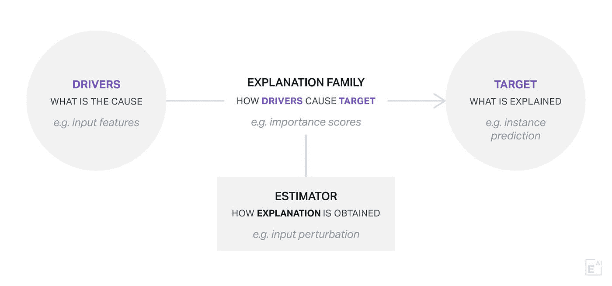
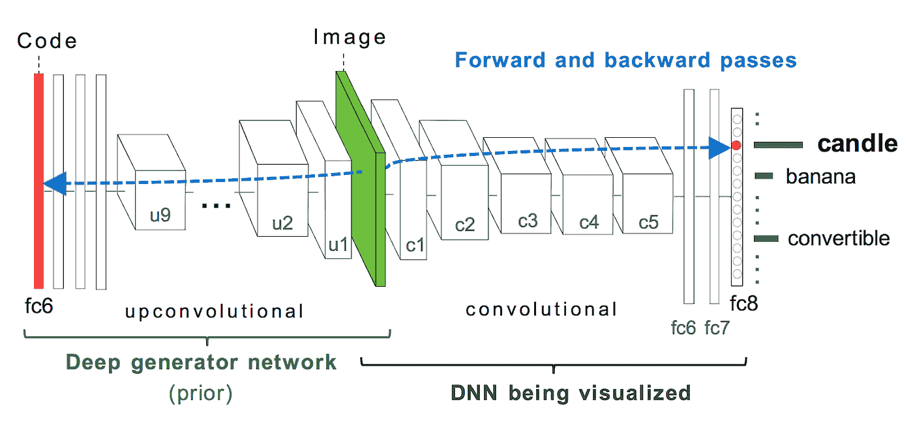
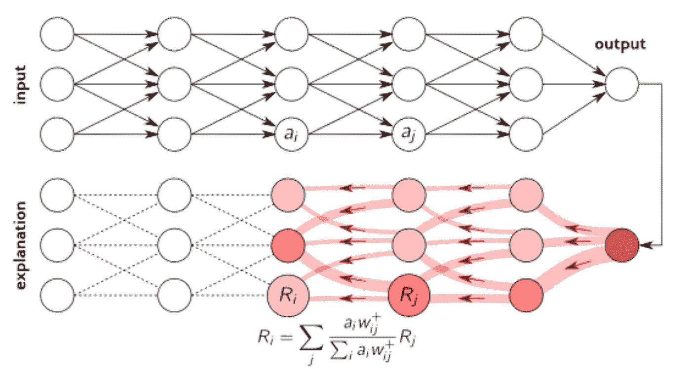

# 可解释人工智能的方法:后建模可解释性

> 原文：<https://towardsdatascience.com/the-how-of-explainable-ai-post-modelling-explainability-8b4cbc7adf5f?source=collection_archive---------6----------------------->

在 XAI 方法概述的前两部分中，我们研究了[预建模可解释性](https://medium.com/@bahador.khaleghi/the-how-of-explainable-ai-pre-modelling-explainability-699150495fe4)和[可解释建模](https://medium.com/@bahador.khaleghi/the-how-of-explainable-ai-explainable-modelling-55c8c43d7bed?sk=998bbb1d6d73722fd0d633a3cbc86b53)方法，这两种方法侧重于数据集阶段和模型开发期间的可解释性。然而，与事后可解释性相比，这些都是相对次要的领域，后建模可解释性是大多数 XAI 科学家关注和研究的重点。

**The three stages of AI explainability: Pre-modelling explainability, Explainable modelling and post-modelling explainability.**

# 建模后可解释性

目前，人工智能模型的开发通常只考虑预测性能。因此，大多数 XAI 文献致力于解释预先开发的模型。这种关注的偏向以及最近 XAI 研究的流行导致了众多不同的事后解释方法的发展。

由于研究 XAI 的方法多种多样，要理解这些大量的文学作品很有挑战性。为了理解事后可解释性方法，我们提出了一个分类法或一种分解这些方法的方法，显示了它们的公共结构，围绕四个关键方面组织:目标，关于模型要解释什么；司机，是什么导致了你想要解释的事情；解释族，关于引起目标的驾驶员的解释信息如何传达给用户；而估算者，实际获得解释的计算过程。

例如，流行的[局部可解释模型不可知解释(LIME)](https://arxiv.org/pdf/1602.04938.pdf) 方法使用重要性分数、通过模型输入的局部扰动计算的解释族、估计量，为模型的实例预测、目标、输入特征方面的驱动因素提供解释。

**The proposed taxonomy of the post-hoc explainability methods including the four aspects of target, drivers, explanation family, and estimator.**

在下面的章节中，我们将详细讨论事后可解释性的四个方面的分类。此外，我们提供了相关方法的例子，以审查文献工作。

## 解释目标

目标指定了可解释性方法的对象，这使得它成为命运分类法中最重要的方面。目标在类型、范围和复杂性方面可能有所不同。我们将对目标变化的这三个来源分别进行概述。

人工智能生态系统包括各种角色的用户。解释目标的类型通常根据最终用户的[角色特定目标来确定。一般来说，有两种类型的目标:](https://arxiv.org/pdf/1806.07552.pdf)[内对外](https://arxiv.org/pdf/1901.06560.pdf)，也可以理解为[机械对功能](http://www.heatmapping.org/slides/2018_CVPR_1.pdf)。

人工智能专家通常需要对模型内部的某些组件进行机械解释。例如，模型创建者可能需要理解[深层网络的各层如何响应输入数据](https://arxiv.org/pdf/1610.01644.pdf)，以便调试或验证模型。相反，非专家通常需要一个功能性的解释来理解模型之外的一些输出是如何产生的。例如，模型审查员可能需要了解[模型如何使用输入数据进行预测](https://arxiv.org/pdf/1602.04938.pdf)，以确保模型是可信的、没有偏见的或符合规定的。

> 解释目标的类型通常是根据最终用户的角色特定的目标来确定的。

此外，目标的范围可以有所不同。外部类型目标通常是某种形式的模型预测。它们的范围可以是实例预测(也称为局部解释)，例如[解释类](https://arxiv.org/pdf/1602.04938.pdf)实例的预测，或者所有模型预测(也称为全局解释)，例如[解释类](https://arxiv.org/pdf/1711.11279.pdf)所有实例的预测。内部类型的目标也因基础模型的架构而异。XAI 文献中感兴趣的模型架构通常是一些神经网络架构。相应地，内部目标的范围可以是神经网络中的[单个神经元](http://papers.nips.cc/paper/6519-synthesizing-the-preferred-inputs-for-neurons-in-neural-networks-via-deep-generator-networks.pdf)或[层](https://arxiv.org/pdf/1610.01644.pdf)。

**Explaining function of a given neuron, as target, by synthesizing an image that maximizes its activation, aka** [**Activativation Maximization (AM)**](http://papers.nips.cc/paper/6519-synthesizing-the-preferred-inputs-for-neurons-in-neural-networks-via-deep-generator-networks.pdf)**: the hidden code input (red bar) of a deep image generator network is optimized to produce an image that highly activates the candle class output neuron. This optimization relies on gradient information (dashed blue line) flowing from the layer containing the target neuron al the way back to the input code layer.**

最后，目标的复杂程度会有所不同。它们可以是单个数字或分类输出，例如[解释分类器](https://arxiv.org/pdf/1602.04938.pdf)的预测，或者是单词序列，例如[解释序列到序列模型](https://arxiv.org/pdf/1707.01943.pdf)的预测。目标的复杂性对解释族的选择有很大的影响，这将在本节稍后讨论。

## 解释驱动因素

解释目标可能由多种因素引起。命运分类法将驱动因素定义为一组特定的因果因素，这些因素对目标的影响通过解释来描述。最常见的驱动因素是人工智能模型的输入特征。例如，指定每个输入像素对图像分类器预测的相对贡献的解释通常在 XAI 社区进行研究。

人工智能模型的原始特征并不总是解释驱动因素的最佳选择。例如，根据单个输入像素来解释图像分类器预测会导致解释过于嘈杂、计算成本过高，更重要的是难以解释。或者，我们可以依赖于输入特征的更可解释的表示，例如，在图像分类器预测的情况下，相似像素的[连续片(又名超像素)](https://arxiv.org/pdf/1602.04938.pdf)。识别合适的解释驱动因素与前面在[建模前可解释性](https://medium.com/@bahador.khaleghi/the-how-of-explainable-ai-pre-modelling-explainability-699150495fe4?sk=2b46ff2038a0830c5c391dd54d7a92dd)章节中提出的可解释特征工程讨论相关。

输入特征不是解释驱动的唯一选择。所有对人工智能模型的发展有影响的因素都可能是解释驱动因素。这些因素包括(但不限于)[训练样本](https://arxiv.org/pdf/1703.04730.pdf)，[超参数设置](http://proceedings.mlr.press/v37/maclaurin15.pdf)，[优化算法的选择](https://arxiv.org/pdf/1611.03530.pdf)，甚至模型架构的选择。

特别是，Koh 和梁提出了一种方法来[根据有害或伤害性的训练样本](https://arxiv.org/pdf/1703.04730.pdf)解释人工智能模型的实例预测。他们的解决方案基于稳健统计学的经典技术，称为影响函数。对于给定的实例预测，影响函数提供了一种有效的方法来估计上加权每个训练样本对模型损失函数的影响。因此，向上加权导致损失函数恶化(增加)的训练样本被认为是有害的，反之亦然。

> 所有对人工智能模型的发展有影响的因素都可能是解释驱动因素。

一些研究工作探索允许司机成为一个[任意的概念](https://arxiv.org/pdf/1711.11279.pdf)，只要它能被一组例子定义。例如，这允许检查“条纹纹理”的概念是否有助于图像分类器预测斑马。首先计算给定概念的概念激活向量(CAV)。CAV 是通过训练线性分类器来获得的，该线性分类器使用由神经网络的隐藏层产生的表示来分离给定概念的正例和负例。最后一步是估计给定类别预测损失(例如斑马类别)在给定 CAV(例如“条纹纹理”)方向上的导数。

**Explaining predictions of the zebra class instances in terms of the “striped textures” concept as drivers using the** [**Testing with Concept Activation Vectors (TCAV)**](https://arxiv.org/pdf/1711.11279.pdf) **method. The CAV is the vector orthogonal to the boundary of a linear classifier that separates given network layer activations for concept and non-concept examples. The TCAV then uses directional derivative of given class logit to measure model prediction sensitivity to changes in input towards the direction of the given concept.**

## 解释系列

事后解释旨在传达一些信息，说明对于给定的人工智能模型，目标是如何由驱动程序引起的。命运分类的解释族方面决定了该信息的形式。至关重要的是，必须选择一个解释族，使得它的信息内容容易被用户(通常是人类)理解(也就是可解释的)。此外，应该选择它来生成尽可能忠实于模型复杂性的解释(也就是完整的解释)。通常在选择一个解释族以确保可解释性和完整性时会有一个折衷。

**重要性分数**(又名显著性热图)可能是最常见的解释家族类型。个人重要性分数旨在传达每个解释驱动因素对给定目标的相对贡献；换句话说，分数越高，对司机的影响越大。例如，Lundberg 和 Lee 提出了[SHAP(SHapley Additive exPlanations)](http://papers.nips.cc/paper/7062-a-unified-approach-to-interpreting-model-predictions.pdf)，这是一个以附加特征属性的形式生成事后局部解释的统一框架。该框架使用 Shapley 值来估计每个输入特征对于给定实例预测的重要性。Shapley 值是合作博弈理论中估计联盟成员边际贡献的经典方法。边际[贡献是通过对玩家可能被添加到游戏中的每个可能序列](/one-feature-attribution-method-to-supposedly-rule-them-all-shapley-values-f3e04534983d)进行平均而获得的。

> 通常在选择一个解释族时会有一个权衡，以确保可解释性和完整性。

**决策规则**是另一个常见的解释族。每个决策规则通常是“ *if condition then outcome* ”的形式，其中 outcome 表示 AI 模型的预测，而 condition 是在输入特征上定义的简单函数。[决策规则可以是有序列表，又名**决策列表**，也可以是无序集合，又名**决策集合**](https://arxiv.org/pdf/1802.01933.pdf) 。例如， [KT 方法](https://ieeexplore.ieee.org/abstract/document/299696)提取一组规则来完整地描述神经网络模型。然而，这种基于全局规则的解释通常计算成本太高，并且无法完全捕捉现代深度网络的复杂性。为了缓解这些缺点，Ribeiro 等人提出了 [Anchors 方法](https://homes.cs.washington.edu/~marcotcr/aaai18.pdf)来提取解释任何黑盒模型的实例预测的局部规则。

**决策树**是一个类似于决策规则的解释族，甚至可以[线性化为一组决策规则](https://www.ijcai.org/Proceedings/87-1/Papers/063.pdf)。与决策规则不同，它们以图表的形式构建，其中内部节点表示对输入要素的条件测试，叶节点表示模型结果。此外，与决策规则相反，在决策树中，每个输入示例只能满足从根节点到叶节点的一条路径。 [DeepRED 方法](https://link.springer.com/chapter/10.1007/978-3-319-46307-0_29)提供了提取决策树来逼近给定深度神经网络模型的解决方案。使用 DeepRED 方法生成的决策树显示出高质量。然而，[它们可能相当大](https://arxiv.org/pdf/1806.00069.pdf)，因此很难解释，而且获取成本也很高。

依赖图是另一种解释。它们旨在传达目标价值如何随着给定解释驱动因素价值的变化而变化，换句话说，目标价值如何取决于驱动因素的价值。[部分相关图(PDP)](https://christophm.github.io/interpretable-ml-book/pdp.html) 就是这种解释的一个例子。PDP 将预期模型预测显示为给定特征值的函数。[个体条件期望(ICE)](https://christophm.github.io/interpretable-ml-book/ice.html) 是这类解释的另一个例子。对于给定的实例，ICE 将预期的模型预测显示为给定特征值的函数。

上面讨论的常见解释族通常假设目标是一个简单的数字或分类变量。当目标更复杂且具有某种形式的结构时，它们可能是不够的。例如，重要性分数解释不能正确地描述语言翻译模型的预测，其中输入单词序列被翻译成输出单词序列。Alvarez-Melis 和 Jaakkola 提出了[结构化输出因果合理化器(SOCRAT)](https://arxiv.org/pdf/1707.01943.pdf) 方法，用于提取这种模型的**二部图**形式的解释。第一组节点表示模型的输入单词，而第二组节点表示模型输出单词。边缘表示每个输入单词对每个输出单词的估计影响。

**Explaining complex predictions of a sequence-to-sequence model, e.g. language translator, using a bi-partite graph as explanation family and the** [**SOCRAT**](https://arxiv.org/pdf/1707.01943.pdf) **approach: first a perturbation model is used to obtain perturbed versions of the input sequence. Next, associations between input and predicted sequence are inferred using a causal inference model. Finally, the obtained associations are partitioned and the most relevant sets are selected.**

当解释一个模型的内部工作时，解释族通常是某种类型的**定制可视化**以适应目标模型的架构。例如，Strobelt 等人开发了 [LSTMViz](https://arxiv.org/pdf/1606.07461.pdf) ，这是一种工具，用于理解被称为长短期记忆(LSTM)的特殊神经网络家族的内部工作方式，旨在从序列数据中学习。其核心是，LSTMViz 提供了一个解决方案，在处理一系列输入数据时，可视化 LSTM 网络的所谓隐藏状态的进展。另一个例子是 [GAN Lab](https://minsuk.com/research/papers/kahng-ganlab-vast2018.pdf) 交互式可视化工具。它通过可视化在此过程中产生的中间结果，使非专家能够更好地理解训练生成性对抗网络(GAN)模型的复杂性。

口头解释也许是最用户友好的解释家族，因为它们通常以类似于人类解释的自然语言形式提供。这一领域的早期工作主要是基于模板的，因此相当有限。基于深度学习的更近期的方法能够生成[自然语言文本](https://www.mpi-inf.mpg.de/fileadmin/inf/d2/akata/generating-visual-explanations.pdf)作为调整，或者甚至是多模态的，即[用视觉调整增强的文本](https://arxiv.org/pdf/1802.08129.pdf)。尽管一开始很吸引人，但这种解释有两个主要的局限性。首先，它们(充其量)是对模型内部逻辑的间接解释。其次，在理解模型预测误差时，它们几乎没有用处。

**反事实**解释描述了将目标变为预定义结果所需的解释驱动因素的最小变化。它们是一个越来越重要的解释家族。通常，解释驱动因素是输入要素，目标是模型预测。考虑一个用于拒绝申请的贷款和客户借贷的模型。对这一拒绝决定的反事实解释可能是，“如果申请人有 10，000 美元的年收入，申请就会被接受。”对于一个给定目标，通常会有[多种反事实解释。这个问题可以通过根据必须更改的功能的数量以及这些功能更改是否确实可行来选择最佳解释来缓解。为了产生反事实的解释，我们可以定义一个损失函数，该函数倾向于对尽可能少的输入特征进行最小的改变，以使模型预测尽可能接近期望的结果。这个损失函数可以直接优化](https://christophm.github.io/interpretable-ml-book/counterfactual.html)[或者使用所谓的](https://arxiv.org/pdf/1711.00399.pdf)[生长球算法](https://arxiv.org/pdf/1712.08443.pdf)。

> 反事实解释描述了将目标变为预定结果所需的解释驱动因素的最小变化。

## 解释评估方法

命运分类学是指用于获得解释的计算过程，作为估计者方面。解释估计方法相当广泛，但它们主要在模型适用性和潜在机制方面有所不同。我们将根据这两种变异的来源，给出解释估计方法的概述。

一些评估方法是模型不可知的，可以应用于任何黑盒模型，而另一些评估方法只为特定的模型架构开发。例如，前面讨论的 [LIME 方法](https://arxiv.org/abs/1602.04938)在理论上可以应用于任何模型，只要我们可以构造有意义的输入扰动并观察相应的模型输出。这并不意味着用 LIME 或任何模型不可知的估计器生成的解释总是信息丰富的。例如，LIME 使用的局部扰动机制必须[扩展到能够解释具有复杂输出的模型](https://arxiv.org/pdf/1707.01943.pdf)。

> 解释估计方法相当广泛，但它们主要在模型适用性和潜在机制方面有所不同。

特定于模型的方法通常针对深度神经网络，因为它们既流行又难以理解。例如，[梯度加权类激活映射(Grad-CAM)](https://arxiv.org/pdf/1610.02391.pdf) 方法被开发用于产生专门针对卷积神经网络的视觉解释。它获取最终卷积层的特征图，然后基于目标类相对于信道的梯度对该特征图中的每个信道进行加权。接下来，应用跨类别梯度的两个维度的全局平均池，然后应用 RELU 激活来获得视觉解释。

解释评估方法可以根据其潜在的机制进行检查**。**我们已经确定了评估解释的四种主要机制，即扰动、反向传播、代理和激活优化。

一些事后解释方法是基于**扰动** **机制**。其思想是产生对期望的解释驱动因素的扰动，分析它们对给定目标的影响，并使用解释的重要性分数族对其进行总结。例如，前面讨论过的 [LIME 方法](https://arxiv.org/abs/1602.04938)，通过生成输入特征的局部扰动并使用线性模型捕捉它们的影响，根据输入特征提取实例预测的局部解释。类似地，对于给定的实例预测，[影响函数](https://arxiv.org/pdf/1703.04730.pdf)方法通过扰动训练样本的权重并估计其对模型参数的影响以及最终的模型损失，根据训练样本生成实例预测的解释。

扰动机制方法有两个主要优点:它们通常容易实现，并且它们不局限于特定的模型架构。它们也有缺点:它们的计算成本相对较高，因为它们需要通过模型运行大量扰动输入来生成解释。对于具有高维输入的模型来说，这尤其是一个[挑战，因为所需扰动的数量随着特征的数量快速增长。此外，扰动机制可能](https://arxiv.org/pdf/1711.06104.pdf)[低估了那些贡献已经饱和的特性的重要性](https://arxiv.org/pdf/1704.02685.pdf)，因为扰动它们将不再产生影响。最后，构建有意义的驱动扰动可能是一个挑战。例如，每个特性通常会被影响最大的无信息值所取代。对无信息参考值依赖于试探法或特别选择可能导致不可靠的解释。特别是，为了确保解释与训练数据分布的一致性，参考值必须从[似是而非的替代值](https://openreview.net/pdf?id=B1MXz20cYQ)中选择。

[Shapley 值](/one-feature-attribution-method-to-supposedly-rule-them-all-shapley-values-f3e04534983d)框架可以被认为是扰动机制的一个特例。这个框架背后的关键直觉是，由于解释驱动因素之间的相互作用，每个驱动因素对给定目标的贡献可以根据已经输入给定模型的其他驱动因素而变化。因此，通过检查输入其他驱动因素的所有可能的扰动，计算每个驱动因素的边际贡献，即 Shapley 值。前面讨论过的著名的 [SHAP 方法](http://papers.nips.cc/paper/7062-a-unified-approach-to-interpreting-model-predictions.pdf)，依靠这个框架来提取模型实例预测的局部解释。计算精确的 Shapley 值[可能会很昂贵](https://christophm.github.io/interpretable-ml-book/shapley.html)。因此，针对特定的模型架构，如[树系综](https://arxiv.org/pdf/1802.03888.pdf)和[深度网络](https://arxiv.org/pdf/1903.10992.pdf)，已经提出了许多有效的 Shapley 值估计方法。

[量化输入影响(QII)](https://www.andrew.cmu.edu/user/danupam/datta-sen-zick-oakland16.pdf) 度量是一系列度量，用于捕捉模型输入对其输出的影响程度。他们通过干预构建一个假设的输入分布，然后量化一个感兴趣的量的结果差异，它可以是一个实例或一组模型输出。原则上，它们可以被归类为一种特定类型的扰动机制，可以估计单个或一组输入特征对一个实例或一组模型输出的影响。重要的是，在估计输入要素相关性的影响时，QII 测量会仔细考虑输入要素相关性。

> Shapley 值框架可以被认为是扰动机制的一个特例。

**反向传播机制**通常用于生成深度网络模型的事后解释。得到的解释往往是模型的输入特征方面的重要性分数。为了获得这些分数，反向传播机制从产生给定目标的层开始，例如某个类 logit，并且估计在该目标之前的层中神经元的贡献。这一过程逐层重复，直到获得输入图层要素的贡献。有几种基于反向传播的可解释性方法。一些最著名的例子包括[逐层相关性传播(LRP)](https://journals.plos.org/plosone/article?id=10.1371/journal.pone.0130140) 、[深度提升](https://arxiv.org/pdf/1704.02685.pdf)、[引导反向投影(GB)](https://arxiv.org/pdf/1412.6806.pdf) 、[平滑梯度](https://arxiv.org/abs/1706.03825)和[集成梯度(IG)](https://arxiv.org/pdf/1611.02639.pdf) 。

这些方法的主要区别在于它们如何估计前一层的贡献。特别地，如在 GB 和 SmoothGrad 方法中，可以基于目标神经元激活相对于前一层神经元的部分梯度来估计贡献(又名灵敏度分析)。或者，可以通过将目标神经元激活值分解为来自前一层的组成值(也称为分解方法)来估计它们，如在 LRP 和深度提升方法中。使用灵敏度分析估计的贡献[主要涉及目标神经元激活](https://www.sciencedirect.com/science/article/pii/S1051200417302385)的局部变化，而不是其值。与 IG 方法一样，将基于灵敏度的贡献乘以前一层神经元的激活可以缓解这个问题。事实上，已经证明基于分解的贡献方法和那些类似于 IG 方法的方法是[密切相关的](https://arxiv.org/pdf/1711.06104.pdf)。

**Explaining predictions of a neural network in term of input features using the** [**Layer-wise Relevance Propagation (LRP) method**](http://www.heatmapping.org/): **first, a standard forward pass is applied to the network and each layer’s activations are collected. Next, the score obtained at the network output is propagated backwards through the network, using a set of propagation rules.**

基于反向传播机制[的方法只需要一次或几次推理通过模型](https://arxiv.org/pdf/1711.06104.pdf)来生成解释。与基于扰动机制的方法相比，这使得它们的计算效率更高。另一方面，反向传播机制仅适用于深层网络。此外，使用这种机制产生的解释[可能不可靠](https://arxiv.org/pdf/1810.03292.pdf)。一些最近的方法，如 DeepLIFT 和 LRP，有望提供更有力的解释。然而，DeepLIFT 的性能[很大程度上取决于其参考点](https://www.youtube.com/watch?v=f_iAM0NPwnM&list=PLJLjQOkqSRTP3cLB2cOOi_bQFw6KPGKML&index=3)的选择，这必须由用户决定。同样，LRP 已经被证明有[数值不稳定问题](https://journals.plos.org/plosone/article/file?id=10.1371/journal.pone.0130140&type=printable)。

获得复杂模型的事后解释的另一种方法是用一个具有可比性能的更简单、更容易解释的模型来模仿它，即**代理机制。**这种机制通常用于用更具解释力的模型(如决策树或决策规则)来取代复杂的深度神经网络。这方面的早期工作是[只适用于浅层神经网络](https://ieeexplore.ieee.org/document/938448)。然而，最近的方法是针对深度神经网络模型的。例如，前面讨论过的 [DeepRED 方法](https://link.springer.com/chapter/10.1007/978-3-319-46307-0_29)，能够构建忠实代表深度网络模型的决策树。然而，生成的决策树可能非常大，因此不太容易解释。

缓解这一挑战的一种方法是学习不全局模仿复杂模型行为的代理模型。例如，[锚方法](https://homes.cs.washington.edu/~marcotcr/aaai18.pdf)旨在提取仅模仿给定模型的实例预测的局部决策规则。类似地， [BETA 方法](https://arxiv.org/pdf/1707.01154.pdf)学习少量决策集，每个决策集在其输入特征空间的明确定义的区域内模拟给定复杂模型的行为。

**激活优化** **机制**通常用于生成深层网络模型内部工作原理的解释。它的解释是通过搜索一个输入模式获得的，该输入模式[对作为目标的模型的内部组件产生最大(或最小)响应](https://www.sciencedirect.com/science/article/pii/S1051200417302385)，例如一个特定的神经元。这个搜索问题又可以被公式化为优化问题，并使用基于梯度的方法来解决[。该过程类似于用于训练模型的过程，其中优化目标是输入特征而不是模型参数。](https://arxiv.org/pdf/1312.6034.pdf)

不幸的是，在没有添加任何正则化的情况下，使用激活优化机制获得的输入模式通常类似于高频噪声。[各种各样的正则化约束](https://distill.pub/2017/feature-visualization/)已经被提出来缓解这个挑战。例如，我们可以尝试通过[明确惩罚相邻输入特征之间的差异](https://arxiv.org/pdf/1412.0035v1.pdf)来直接降低高频噪声。然而，这种正则化约束也可能抑制合法的高频特征，例如输入图像中的边缘。

> 激活优化机制通常用于生成深层网络模型内部工作的解释。

# 下一步是什么？

已经提出了许多方法来解释预先开发的人工智能模型。它们的解释对象、驱动程序、家族和提取机制各不相同。XAI 是一个活跃的研究领域，新的和改进的方法不断发展。如此多样的选择使得 XAI 从业者很难针对特定应用采用最合适的方法。

为了帮助缓解这一挑战，本系列的[附录](https://drive.google.com/open?id=1Bw9aBq5VbQY5C5t0RAi9sFGSp3gQFu6V)展示了一些最著名的后建模可解释方法的快照。每种方法的特点是根据四个方面介绍的命运分类系统地定位在 XAI 文学的身体。此外，还概述了一些现成的 XAI 软件包。

*特别感谢* [*泽维尔·斯内尔格罗夫*](https://wxs.ca/)*[*埃尔纳兹·巴尔尚*](https://ca.linkedin.com/in/elnaz-barshan-845964ba)*[*林赛·布林*](http://www.lindsaydbrin.com/)*[*圣地亚哥·萨尔西多*](https://ca.linkedin.com/in/santiagosalcido) *，以及* [*情妇玛侬·格鲁阿兹*](http://manongruaz.com/) [*彼得亨德森*](https://www.linkedin.com/in/pnhenderson/) *编辑。****